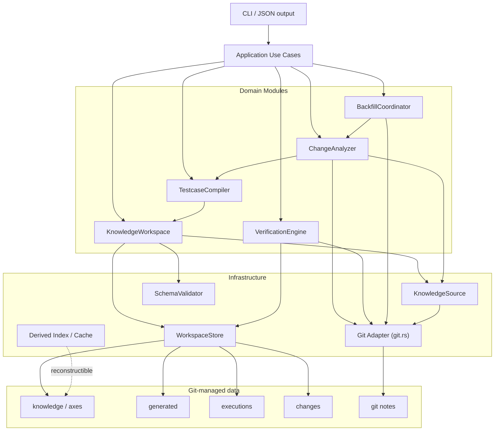

# markharness Architecture Design: Domain / Application / Infrastructure Layering

**Status**: Accepted (Phases 1–5 implemented. Detailed design for the direction decided in [decisions/0009](../decisions/0009-domain-application-infrastructure-layering.md))
**Related documents**: [decisions/0009](../decisions/0009-domain-application-infrastructure-layering.md), [decisions/0008](../decisions/0008-verification-plan-product-roadmap.md), `git-native-model-for-test-knowledge-management.md`
**Intended audience**: implementers of markharness (to be referenced when starting Phase 1)

**Positioning**: This document, building on markharness's existing documentation and current Rust implementation, organizes an architecture that supports future feature additions, maintainability, testability, and applicability to large repositories. It does not introduce a web server, a resident process, a canonical database, or microservices, preserving the current nature of the tool: a Git repository as the canonical persistence layer, YAML/JSON as the exchange format, and the CLI plus CI as the user-facing interface. Relative to the original proposal supplied by the user (dated 2026-08-18), this document reflects the two corrections decided in [decisions/0009](../decisions/0009-domain-application-infrastructure-layering.md): generalizing `ChangeAnalyzer` to `CommitRef`, and deferring introduction of the `GitRepository` trait.

---

## 1. Purpose

The core of the proposal is to keep the current Git-native single-CLI nature while organizing the following processing into a consistent pipeline.

```text
Test Knowledge
  -> deterministic TestCase generation
  -> ChangeEvent derivation between milestones
  -> identification of impacted TestCases
  -> reconciliation against execution evidence
  -> derivation of pending / stale status
```

## 2. Design Principles

### 2.1 Stay Git-native

- Keep `knowledge/`, `axes/`, `generated/`, `executions/`, `changes/` under Git.
- Identify a Feature's version by `feature.yml`'s `id` and the tree SHA of the whole Feature directory, not by path.
- Treat Git tags as canonical for milestones. Arbitrary commits such as a PR's base/head are also treated as a first-class version range starting in [decisions/0008](../decisions/0008-verification-plan-product-roadmap.md) Stage 2 (Section 4.3).
- Record backfill progress as Git notes on a dedicated ref.
- Treat the cache as a deletable, reconstructible derivative, never as a basis for correctness.

### 2.2 Design deep Modules

Each Module keeps the interface callers must learn small, and hides complex implementation behind it.

- Do not create many shallow, per-YAML-file Repositories.
- Do not leak the physical directory structure into the CLI or individual Use Cases.
- Use the Domain's interface as the test surface.
- Separate I/O, presentation, and exit codes from the Domain's judgment logic.

### 2.3 Prioritize correctness over performance

- Keep full generation as the canonical operation.
- Add incremental generation and indexes as optimizations.
- Make incremental results verifiable via periodic full generation.
- Treat determinism — the same input always producing the same byte sequence — as an invariant.

## 3. Recommended Architecture



Dependencies flow in one direction as a rule: CLI to Application, Application to Domain, and Domain to the minimum necessary Infrastructure seam.

## 4. Domain Modules

### 4.1 KnowledgeWorkspace

Reads `knowledge/` and `axes/` and provides a normalized Knowledge Snapshot.

```rust
impl KnowledgeWorkspace {
    fn load(root: &Path) -> Result<Self>;
    fn validate(&self) -> ValidationReport;
    fn snapshot(&self) -> &KnowledgeSnapshot;
    fn apply(&mut self, draft: KnowledgeDraft) -> Result<ApplyResult>;
}
```

The following processing is hidden internally.

- Reading and parsing YAML
- Assembling Requirement, Feature, Behavior, Condition, ExpectedResult
- Checking IDs and parent/child references
- Checking Axis and `forked_from` references
- JSON Schema validation
- Normalizing paths and IDs
- Detecting duplicate IDs
- Pre-write safety checks

Today, `src/generate.rs` and `src/validate.rs` each independently walk `knowledge/` via `fs::read_dir`, duplicating traversal logic. Introducing KnowledgeWorkspace lets generation, validation, and index building share the same Snapshot within one command, eliminating this duplication.

### 4.2 TestcaseCompiler

Deterministically generates TestCases and the traceability index from a Knowledge Snapshot.

```rust
fn compile(snapshot: &KnowledgeSnapshot) -> Result<GeneratedArtifacts>;
```

`GeneratedArtifacts` includes:

- the list of TestCases
- each TestCase's output relative path
- the contents of `traceability-index.json`
- warnings or diagnostics

The Compiler does not write files. The Application Use Case passes the result to the WorkspaceStore.

Invariants:

- Sort input paths and output in a stable order.
- Do not depend on Map iteration order.
- Do not include timestamps, absolute paths, or environment variables in generated artifacts.
- Convert one Condition into one TestCase.
- Aggregate ExpectedResults in a stable order.
- Always produce the same byte sequence from the same Snapshot.

`generate` and `verify` must always use the same Compiler.

### 4.3 ChangeAnalyzer

The core Module that compares Feature versions between two versions and derives ChangeEvents and impacted TestCases.

Per [decisions/0009](../decisions/0009-domain-application-infrastructure-layering.md) Decision 3, version references are expressed as `CommitRef` rather than a `MilestoneRef` fixed to milestone tags.

```rust
enum CommitRef {
    Milestone(MilestoneId),  // a tag name; resolved to a commit internally via git tag resolution
    Commit(CommitId),        // an arbitrary commit (e.g. a PR's base/head SHA)
}

impl ChangeAnalyzer {
    fn compute(
        &self,
        from: CommitRef,
        to: CommitRef,
        options: ChangeOptions,
    ) -> Result<ChangeSet>;
}
```

```rust
struct ChangeOptions {
    cache: CachePolicy,
    impact_source: ImpactSource,
}

enum ImpactSource {
    HistoricalTree,
    CurrentWorkingTree,
}
```

Processing pipeline:

1. Resolve the `CommitRef` to a commit (`Milestone` goes through tag resolution; `Commit` is used as-is).
2. Fetch each commit's Feature IDs and tree SHAs.
3. Match old and new versions keyed by Feature ID.
4. Determine added, removed, modified.
5. Derive impacted TestCases from `to`'s Knowledge.
6. Inspect merge commits and `true_divergences` within the interval as needed.
7. Return ChangeEvents in a stable order.

`changes compute` and `backfill run` use `CommitRef::Milestone` with the same ChangeAnalyzer. The PR Verification Plan feature added in [decisions/0008](../decisions/0008-verification-plan-product-roadmap.md) Stage 2 can reuse the same ChangeAnalyzer by passing `CommitRef::Commit`, without any interface redesign.

### 4.4 VerificationEngine

Derives re-verification status from ChangeEvents, TestCase correspondence, and execution evidence.

```rust
impl VerificationEngine {
    fn trace(&self, input: TraceInput) -> TraceReport;
    fn pending(&self, input: VerificationInput) -> PendingReport;
}
```

Status is expressed as a type, not a string.

```rust
enum VerificationStatus {
    Current,
    Pending,
    Stale,
    Unknown,
}
```

VerificationEngine does not read files or Git directly; it performs a pure judgment over already-loaded input. The Application layer collects ChangeEvent, Execution, and Feature version and passes them in. Today, `src/verify.rs`'s `trace`/`pending` functions call `fs::read_to_string` directly, so this separation does not yet exist.

`Unknown` is used when the basis for judgment is insufficient, such as an old-format execution record that lacks `verified_feature_tree_shas`.

### 4.5 BackfillCoordinator

Selects unprocessed milestone pairs, calls ChangeAnalyzer, and records progress.

```rust
fn run_once(&self, policy: BackfillPolicy) -> Result<BackfillSummary>;
```

Scope of responsibility:

- Enumerating and ordering milestones
- Fetching processed state from Git notes
- Selecting unprocessed pairs
- Calling ChangeAnalyzer (`CommitRef::Milestone`)
- Saving ChangeEvents
- Recording a completion note

Not run as a resident worker; kept as a run-once design that CI or a scheduler can invoke repeatedly.

## 5. Application Layer

Holds Use Cases corresponding to CLI subcommands.

```text
application/
  init_project.rs
  validate_knowledge.rs
  apply_knowledge.rs
  generate_testcases.rs
  verify_generated.rs
  compute_changes.rs
  record_execution.rs
  verify_pending.rs
  run_backfill.rs
```

The Application layer's responsibility is limited to:

- Converting input values into Domain types
- Calling Domain Modules
- Controlling the order of reads and writes
- Controlling consistency across multiple writes
- Returning a `CommandOutcome`

It does not handle exit codes, stdout, or stderr directly.

```rust
enum CommandOutcome {
    Generated(GenerateSummary),
    Validation(ValidationReport),
    Changes(ChangeSummary),
    Verification(PendingReport),
}
```

## 6. CLI and Presenter

The CLI is responsible only for:

- Argument parsing via Clap
- Selecting the Application Use Case
- Handing the `CommandOutcome` to the Presenter
- Exiting the process with the exit code the Presenter returns

Human-readable output and JSON output are generated from the same result type.

```rust
trait Presenter {
    fn present(&self, outcome: &CommandOutcome) -> PresentedResult;
}

struct PresentedResult {
    stdout: String,
    stderr: String,
    exit_code: i32,
}
```

This eliminates `println!`, `eprintln!`, and `std::process::exit` from the Domain and Application layers. Today, `src/cli.rs` (2248 lines) contains 32 `process::exit` calls and 92 `println!`/`eprintln!` calls, so this separation does not yet exist.

## 7. Infrastructure

### 7.1 Git Adapter

Because Git is essential to markharness's domain, it is not abstracted behind a generic `Repository<T>`. First, consolidate the direct git process calls currently scattered in `src/changes.rs` (five `Command::new("git")` call sites) into `git.rs`.

**Trait abstraction is not in scope for this round** ([decisions/0009](../decisions/0009-domain-application-infrastructure-layering.md) Decision 4). While there is only one implementation (the `git` process Adapter), keep it as a plain function group in `git.rs`:

```rust
// git.rs — sketch of the consolidated function group (not a trait)
fn resolve_commit_ref(root: &Path, git_ref: &CommitRef) -> Result<CommitId>;
fn feature_trees(root: &Path, commit: &CommitId) -> Result<Vec<FeatureTree>>;
fn milestones(root: &Path) -> Result<Vec<Milestone>>;
fn merges_between(root: &Path, from: &CommitId, to: &CommitId) -> Result<Vec<MergeInfo>>;
fn read_note(root: &Path, key: &NoteKey) -> Result<Option<String>>;
fn write_note(root: &Path, key: &NoteKey, value: &str) -> Result<()>;
```

Trait abstraction (e.g. a `GitRepository` trait) is decided again once a concrete need arises — a fake implementation needed for tests, or multiple Adapters (e.g. other VCS support) becoming a requirement. Testing continues to favor integration tests that create a small real Git repository in a temp area.

### 7.2 KnowledgeSource

For large-repository support, make the Knowledge source swappable via the following seam. Unlike 7.1, two concrete Adapters are needed from the start, so this one is trait-abstracted.

```rust
trait KnowledgeSource {
    fn list(&self, prefix: &RepoPath) -> Result<Vec<KnowledgeEntry>>;
    fn read(&self, path: &RepoPath) -> Result<Vec<u8>>;
}
```

Two Adapters are anticipated:

- `WorkingTreeKnowledgeSource`
- `GitTreeKnowledgeSource`

This lets both the current working tree and a past commit's Git tree feed the same Parser and Compiler. Today, `historical_testcases_by_feature` (`src/changes.rs`) runs `git worktree add` → `generate_testcases` → `git worktree remove` for every milestone; introducing `GitTreeKnowledgeSource` removes the need for this temporary worktree.

### 7.3 WorkspaceStore

Keep the existing `fs_safety`, and consolidate the following:

- Rejecting path traversal outside the repository
- Rejecting operations through symlinks and junctions
- Stable YAML/JSON serialization
- Atomic per-file replacement
- Safe deletion of managed directories

For `generate`, add transactionality across the whole directory.

```text
1. Generate all TestCases into a temp directory
2. Generate the traceability index
3. Confirm all output succeeded
4. Switch over generated/testcases
5. Switch over the traceability index
```

On mid-way failure, keep the existing generated artifacts.

### 7.4 Cache and Indexes

`.markharness-cache/` is not canonical data; it is a deletable, reconstructible derivative. This policy is already implemented in `src/id_cache.rs` today, and its cache key matches the following formula.

```text
hash(
  knowledge_tree_sha
  + canonicalization_rule_version
  + id_index_schema_version
  + tool_version
)
```

Under the same policy, the following indexes can be added in the future.

```text
.markharness-cache/
  feature-versions/           # existing (id_cache.rs)
  testcase-by-feature/        # new
  changeevent-by-feature/     # new
  execution-by-case/          # new
```

Even if SQLite is used, it is not made canonical; it is limited to reconstructible local index use.

## 8. Recommended Code Layout

```text
src/
  main.rs

  cli/
    mod.rs
    args.rs
    presenter.rs

  application/
    mod.rs
    commands/

  domain/
    knowledge/
      mod.rs
      model.rs
      validation.rs
    generation/
      mod.rs
      compiler.rs
      artifact.rs
    change/
      mod.rs
      analyzer.rs
      model.rs          # CommitRef, ChangeOptions, etc.
    verification/
      mod.rs
      engine.rs
      model.rs
    backfill/
      mod.rs
      coordinator.rs

  infrastructure/
    git/
      mod.rs             # consolidated git calls (not a trait)
    knowledge_source/
      mod.rs
      working_tree.rs
      git_tree.rs
    workspace/
      mod.rs
      yaml.rs
      atomic_write.rs
    schema/
      mod.rs
    cache/
      mod.rs

  safety/
    paths.rs
```

File splitting is not a goal in itself. Do not create an excessive number of files holding only small types or functions; split at the granularity where a Module's interface and responsibility become clear. Reorganize into this layout during Phase 4, as needed.

## 9. Differences from the Current Implementation

### 9.1 Already Achieved

The current implementation already satisfies the following.

- A modular monolith in a single Rust crate
- Feature-named Modules such as `generate`, `changes`, `verify`, `backfill`, `git`
- Shared generation logic between `generate` and `verify`
- Reuse of the same TestCase generation logic for past milestones
- Reuse of `compute_changes` from `backfill`
- Deterministic generation via sorting and deduplication
- Tests using a temporary real Git repository
- Path traversal, symlink, and junction protections via `fs_safety`
- Safe per-file replacement
- Content-addressable cache keys (`id_cache.rs`, Section 7.4)

This design is therefore not a full reimplementation, but a structural reorganization that preserves the current implementation's strengths.

### 9.2 Main Changes

| Aspect | Current | Proposed |
|---|---|---|
| Overall | Single crate | Single crate maintained |
| Module layout | Flat, feature-named `.rs` files | Domain / Application / Infrastructure |
| CLI | Handles parsing, execution, display, exit all at once | Limited to parsing and Presenter selection |
| Knowledge | Each feature walks as needed | Shares a normalized Snapshot |
| TestCase generation | A function that reads and generates given a path | A Compiler that takes a Snapshot |
| Change computation | A function taking a path and several bools, milestone-only | An Analyzer taking `CommitRef` and a config type (milestone and PR shared) |
| Verification | I/O and status judgment together | Data Loader separated from a pure Engine |
| Git | `git.rs` plus some direct calls | Git calls consolidated into `git.rs` (no trait) |
| Generated-artifact updates | Safe per file | Atomic across the whole directory too |

## 10. Scalability

### 10.1 Areas Improved by This Design Alone

| Type of scale | Degree of improvement | Reason |
|---|---:|---|
| Feature additions | Large | Use Case and Domain responsibilities are separated |
| Code volume | Large | Change locality increases |
| Team size | Large | Avoids change concentration in a giant `cli.rs` |
| Number of tests | Large | Domain judgment can be tested without I/O |
| Adding output formats | Medium–large | A Presenter can be added |
| Adding importers | Medium–large | Can connect to KnowledgeWorkspace's interface |
| Knowledge item count | Small–medium | Sharing a Snapshot reduces duplicate reads |
| Git history / milestone count | Small | The core algorithm is unchanged |
| Horizontal scale | None | The local CLI is preserved |

The main effect of this design is maintainability as code volume, feature count, and team size grow, more than raw execution speed.

### 10.2 Handling Larger Data Volumes

Performance improvements for large data volumes require, in addition to the architectural reorganization, the following.

#### Sharing the Knowledge Snapshot

```rust
let snapshot = workspace.load_snapshot()?;
validate(&snapshot);
compile(&snapshot);
build_traceability(&snapshot);
```

Prevents validation, generation, and index building from re-reading YAML within the same process.

#### Per-Feature Incremental Generation

```text
Knowledge tree SHA
  -> changed Feature IDs
  -> regenerate only those Features' TestCases
  -> update the overall Manifest
```

To guarantee correctness, full generation remains the canonical operation.

```text
generate                 full generation
generate --incremental   incremental generation
CI                       periodically verified via full generation
```

#### Direct Reads of Past Git Trees

`GitTreeKnowledgeSource` reads past Knowledge from a target commit's blobs/trees without creating a temporary worktree. This is the replacement target for `historical_testcases_by_feature`.

#### Verification Indexes

Speed up the following lookups with reconstructible indexes.

```text
Feature ID -> ChangeEvent
Feature ID -> TestCase
case_id    -> Execution milestones
case_id    -> verified tree SHA
```

#### Throttling Backfill

```text
--max-pairs 10
--time-budget 5m
--from-milestone <name>
```

Makes CI run time predictable. Parallelization is undertaken after designing conflict control for shared output files and Git notes.

### 10.3 Horizontal Scale

Horizontal scale via a server, shared DB, or job queue is not adopted at this time.

markharness's primary execution opportunities are local editing, PR-time CI, Change computation on tag push, and periodic backfill. Doing the following within a single process first is more consistent with the Git-native nature:

- Per-Feature processing
- Reconstructible indexes
- Worktree-free reads of past trees
- Throttled backfill

## 11. Test Strategy

### 11.1 Domain Tests

- TestcaseCompiler's determinism
- Axis inheritance, sorting, deduplication
- 1 Condition = 1 TestCase
- VerificationEngine's Current, Pending, Stale, Unknown judgments
- ChangeSet's added, removed, modified judgments
- ChangeAnalyzer runs the same judgment logic for both `CommitRef::Milestone` and `CommitRef::Commit`

### 11.2 Git Integration Tests

- A Feature directory can be tracked under the same ID after being moved.
- Changing only a Condition, without touching `feature.yml`, still changes the tree SHA.
- Change computation on the mainline holds up under squash/rebase.
- `true_divergences` can be detected when merge commits are preserved.
- Backfill using Git notes is idempotent.
- The same TestCase can be reproduced from a past commit.
- `ChangeAnalyzer` also works between two arbitrary non-tag commits (equivalent to a PR's base/head).

### 11.3 Workspace Integration Tests

- Running `generate` twice produces the same byte sequence.
- `verify` distinguishes additions, changes, and deletions.
- Path traversal is rejected.
- Symlinks and junctions are not followed.
- Existing generated artifacts are kept on mid-way failure.

### 11.4 CLI Contract Tests

- Human-readable output
- The JSON output schema
- The exit-code 0, 1, 2, 3 contract
- An E2E test reproducing the README's minimal tutorial

## 12. Staged Migration Plan

A summary of [decisions/0009](../decisions/0009-domain-application-infrastructure-layering.md) Decision 8. Detailed work units for each Phase are managed via `checklist-<task>.md` when that Phase starts.

### Phase 1: Small Interface Improvements

1. [Implemented] Replace `compute_changes`'s boolean parameters with `ChangeOptions`.
2. [Implemented] Consolidate direct Git calls in `changes.rs` into `git.rs` (no trait abstraction, Section 7.1).
3. [Implemented] Pin existing behavior and the CLI contract with characterization tests and `tests/fixtures/stage0/changes-m1-m2.golden.yml`.

Directory layout is unchanged at this stage.

### Phase 2: Separating CLI Responsibilities

1. [Implemented] Introduce `CommandOutcome`.
2. [Implemented] Move output and exit-code decisions for the three target commands to the Presenter.
3. [Implemented] Split the human-readable Presenter from the JSON Presenter.
4. [Implemented] Extract Application Use Cases from `generate`, `changes compute`, and `verify pending`.

### Phase 3: Atomicity of Generated-Artifact Updates

1. [Implemented] Generate TestCases and the traceability index entirely into a temp area.
2. [Implemented] Install them into `generated/` only after success using a backup-assisted directory switch.
3. [Implemented] Add a test confirming existing generated artifacts are kept on mid-way failure.

### Phase 4: Knowledge Snapshot and a Pure Domain

1. [Implemented] Introduce `KnowledgeSnapshot`.
2. [Implemented] Separate TestcaseCompiler from the filesystem.
3. [Implemented] Separate a pure `Current`/`Pending`/`Stale`/`Unknown` evaluator from Verification's loading logic.
4. [Implemented] Finalize `ChangeAnalyzer` on the `CommitRef` basis (Section 4.3).
5. [Implemented] Keep the physical layout for now because the responsibility seams are clear within the existing modules.

### Phase 5: Large-Repository Optimization

1. [Implemented] Introduce `KnowledgeSource` with working-tree and Git-tree adapters.
2. [Implemented] Replace temporary worktrees with direct blob loading through `GitTreeKnowledgeSource`.
3. [Implemented] Add JSON indexes for Feature, ChangeEvent, and Execution under `.markharness-cache/index/` as reconstructible derivatives.
4. [Implemented] Add `--max-pairs` and `--time-budget` to Backfill.
5. [Decided] Do not introduce incremental generation or parallelism yet. No measurement demonstrates a bottleneck, so full generation remains canonical. Measure after direct Git-tree loading and throughput limits are in use, and add either optimization only when evidence warrants it.

## 13. Designs Not Adopted

### Microservices

For local knowledge management inside a Git repository, the complexity of networking, authentication, distributed transactions, and operational infrastructure would be excessive. Not adopted.

### An RDB as Canonical Data

Would create a second source of truth alongside Git's history, review, and branch/tag workflow. Not adopted; SQLite and similar are limited to reconstructible index use.

### Trait-Abstracting Every Dependency

Abstracting a dependency with only one implementation adds interfaces and reduces maintainability. Only consolidate Git operations (7.1) for now, and trait-abstract only seams where multiple Adapters are actually needed, such as working tree vs. Git tree (KnowledgeSource, 7.2).

### Running on Incremental Generation Alone from the Start

Cache corruption, deletion detection, and inconsistencies from canonicalization-rule changes would be hard to detect. Not adopted; full generation remains canonical.

### Designing `ChangeAnalyzer` with a Fixed `MilestoneRef`

Conflicts with the direction [decisions/0008](../decisions/0008-verification-plan-product-roadmap.md) Stage 2 has already decided — treating PR base/head as a first-class version range — and would cause rework (a core interface redesign) when that stage starts. Not adopted; generalized to `CommitRef` instead (Section 4.3).

## 14. Conclusion

A modular monolith that keeps the current single Rust CLI and Git-native data model is the right fit for markharness.

The core Modules are the following five.

1. `KnowledgeWorkspace`
2. `TestcaseCompiler`
3. `ChangeAnalyzer` (`CommitRef`-based, handling both milestones and PR base/head)
4. `VerificationEngine`
5. `BackfillCoordinator`

The current implementation already realizes important parts of this design: deterministic generation, reuse of Change computation, real-Git tests, safe file operations, and a content-addressed cache key. The highest-priority improvement is not a full rebuild, but separating the responsibilities of the now-large CLI, typed interfaces, consolidating Git operations, and atomicity of generated-artifact updates.

The architectural reorganization mainly improves scale with respect to feature count, code volume, and team size. Performance improvements for data volume are achieved by progressively introducing KnowledgeSource, reconstructible indexes, per-Feature processing, and Backfill throughput limits on top of this interface. Designing `ChangeAnalyzer` on a `CommitRef` basis means the extension to [decisions/0008](../decisions/0008-verification-plan-product-roadmap.md) Stage 2's PR Verification Plan feature can also be built on this foundation without a backward-incompatible redesign.
