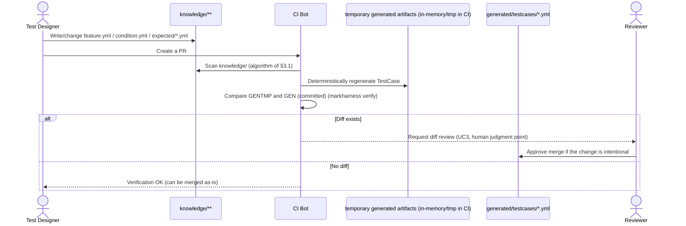

# How Automatic Test Case Generation Is Realized: Design Document

**Status**: Implemented(`src/generate.rs` / `src/traceability.rs`). This document was originally a design draft that examined how to realize UC2 in advance, but the implementation (`src/generate.rs`) settled on details that differ from the initial proposal in this document. This version has been comprehensively rewritten to match the implementation, and the diffs from the initial proposal are kept in the "Changes at Implementation Time" subsection at the end of each section.
**Related documents**: [git-native-model-for-test-knowledge-management.md](../git-native-model-for-test-knowledge-management.md) (hereafter "the paper"), [product-operation.md](../product-operation.md)

**Positioning**: Building on the paper and the "Product Operation Image" (`docs/product-operation.md`), this document describes the **concrete method of realization** for UC2, "Deterministically generate TestCase." Where a point is explicitly stated in the body of the paper, the corresponding section number is attached; where a point was supplemented for productization, it is marked "(productization proposal, not explicitly stated in the paper body)."

---

## 1. Positioning and Purpose

The paper calls the generation relationship `FEATURE`/`CONDITION` → `TESTCASE` a "structural generation graph" (static, version-independent), and separates it from the research's core contribution (RQ1, the version history DAG) (§3.2(A)). On the other hand, this generation graph itself is included in the tool configuration as a design target (§4.5, "Test case generation tool: generates `TestCase` from `Feature + Condition`, and CI verifies agreement between the regenerated result and the current files"), and in `docs/product-operation.md` it is incorporated into the operational flow as UC2 and UC3.

```
UC1 (describe knowledge) --include--> UC2 (deterministically generate TestCase) --include--> UC3 (review/merge generated artifacts)
```

However, the description of UC2 (`docs/product-operation.md` line 105) merely states "mechanically scan Feature+Condition pairs and regenerate `generated/testcases/*.yml`," and the **scanning method, naming convention, text assembly rules, and how determinism is guaranteed** are undefined. This document fills that gap.

**Confirmation of what is out of scope**: Paper §7 lists "**coverage evaluation** of automatic test case generation from structure" as future work, but this is about the **evaluation** of how much the generated `TestCase` set actually covers the intended test perspectives — a different axis from the "design of the deterministic generation **method** itself" that this document addresses. This document covers only the latter and does not go into coverage evaluation. Likewise, generation extension via LLM (Appendix A.1) is also out of scope.

---

## 2. Confirming the Input Data Model

The actual file structure in the implementation (`src/knowledge.rs`) is as follows (based on the convention created by `markharness init`; the extension is `.yml`).

```
knowledge/<requirement>/
├── requirement.yml                   # id, label, axis, description?
└── <feature>/
    ├── feature.yml                   # id, requirement, label, axis, description?, forked_from?
    └── <behavior>/                   # directory name is free; determined by presence of behavior.yml
        ├── behavior.yml              # id, feature, label, axis, description, preconditions ([ADR 0016](../decisions/0016-behavior-condition-precondition-step-result-model.md); formerly steps)
        └── <condition>/              # directory name is free; determined by presence of condition.yml
            ├── condition.yml         # id, behavior, label, description, steps, additional_preconditions (new in ADR 0016)
            └── expected/
                ├── 001.yml           # id, condition, description, results (new in ADR 0016), additional_steps?, implementation_note?
                └── 002.yml
```

Each YAML's `id` is a human-readable slug, not a Git blob SHA (used as the identifier itself, not as a display value per paper §3.1/§3.5). **Unlike the initial proposal (see §9 below), in the implementation, all of `Behavior`/`Condition`/`ExpectedResult` explicitly hold an ID reference field to their parent element (`feature`/`behavior`/`condition`)** (each struct definition in `knowledge.rs`). The generation algorithm itself only traverses the nested directory structure and does not use the values of these reference fields for branching in the generation logic (it only copies them into `TestCase.generated_from`); consistency checking of the values (whether the parent reference actually exists) is handled on the `markharness knowledge validate` side (`knowledge-apply-cli-spec.md`).

### Relationship to Paper §3.5's Principle That "id Is Path-Independent"

Paper §3.5 states that, in version history computation (the id resolution cache, §3.3), ids should be designed to be **path-independent**. This is a constraint for rename resistance — it means that when looking up "which path an id was at at a given commit" via the cache, the path string itself is not used as the key (the implementation follows this principle for `Feature`'s id, and `id_cache.rs` treats `feature.yml`'s `id:` field, not the directory name, as the canonical source; see the implementation notes in paper §3.3 for details).

By contrast, test case generation is **static processing that does not require version history** (§3.2(A)), and scans "the directory hierarchy on the current working tree" as input, once. That is,

- Identifier resolution for the version history DAG (§3.2(B)): path-independent (`id:` field + id resolution cache)
- Parent-child relationship resolution for test case generation (§3.2(A)): **may depend on the path hierarchy of the current tree**

This distinction holds, and the two do not contradict each other. This design therefore adopts a **directory-hierarchy-based** traversal (see §3).

---

## 3. Generation Algorithm (Directory-Hierarchy-Based, `src/generate.rs::generate_testcases`)

### 3.1 Traversal Procedure (Summary of the Implementation)

```
function generate_testcases(knowledge_root):
    testcases = []
    for requirement_dir in sorted_subdirs(knowledge_root):
        if !(requirement_dir / "requirement.yml").is_file(): continue
        requirement = parse(requirement_dir / "requirement.yml")

        for feature_dir in sorted_subdirs(requirement_dir):
            if !(feature_dir / "feature.yml").is_file(): continue
            feature = parse(feature_dir / "feature.yml")

            for behavior_dir in find_dirs_with_marker(feature_dir, "behavior.yml"):
                behavior = parse(behavior_dir / "behavior.yml")

                for condition_dir in find_dirs_with_marker(behavior_dir, "condition.yml"):
                    condition = parse(condition_dir / "condition.yml")

                    expected_paths = sorted(list_files(condition_dir / "expected"))
                    if expected_paths.is_empty(): continue      # not generated for Condition alone (§6)

                    expected_results = [parse(p) for p in expected_paths]

                    phases = []
                    for i, e in enumerate(expected_results):
                        additional_steps = e.additional_steps or []
                        steps = (condition.steps + additional_steps) if i == 0 else additional_steps
                        phases.append(Phase{steps: steps, results: e.results})

                    testcases.append(TestCase{
                        case_id: f"tc-{requirement.id}-{feature.id}-{behavior.id}-{condition.id}",
                        generated_from: {requirement.id, feature.id, behavior.id, condition.id,
                                          expected_results: [e.id for e in expected_results]},
                        preconditions: behavior.preconditions + condition.additional_preconditions,
                        phases: phases,
                        axis: union_sorted_dedup(requirement.axis, feature.axis, behavior.axis),  # §3.4
                    })

    return sorted(testcases, key=lambda tc: tc.case_id)
```

- `sorted_subdirs` sorts directory names as strings before traversal at each level, so it does not depend on the enumeration order of the filesystem.
- `find_dirs_with_marker(root, marker_file)` recursively searches under `root`, and as soon as it finds a directory that directly contains `marker_file` (`behavior.yml`/`condition.yml`), it stops searching that branch and adds it to the results. Therefore `behavior`/`condition` directories need not be immediate children of `feature`/`behavior` — any number of intermediate directories may be interposed (the intermediate directories themselves have no meaning; strict direct placement of Feature/Behavior/Condition is not required).
- If a Condition directory has no `expected/` subdirectory, or it is empty, **no `TestCase` is generated from that Condition** (§3.2; unlike the initial proposal, the unit is "one `TestCase` is produced only once a Condition and its ExpectedResults are all present").

### 3.2 TestCase Generation Unit and id Naming Convention

**Unlike the initial proposal (see §9), a `TestCase` is generated at the unit of "1 Condition = 1 TestCase," aggregating all `ExpectedResult`s that Condition has into a single `TestCase`** (it does not split into as many `TestCase`s as there are ExpectedResults). `case_id` is named as

```
tc-{requirement.id}-{feature.id}-{behavior.id}-{condition.id}
```

(the earlier implementation named it `tc-{condition.id}-001`, with a reserved 3-digit sequence number at the end; it was changed to concatenate all four of `requirement`/`feature`/`behavior`/`condition` because a `case_id` collision occurred whenever a `condition.id` was reused under a different Behavior. Since `knowledge/`'s own directory hierarchy already never allows the same `condition.id` to be duplicated, mirroring that hierarchy directly into `case_id` makes the collision structurally impossible without needing a separate check layer to detect it). The output location under `generated/testcases/` was changed for the same reason, from the flat `condition.id`-only filename (`generated/testcases/ground.yml`) to a full mirror of `knowledge/`'s own hierarchy: `generated/testcases/{requirement.id}/{feature.id}/{behavior.id}/{condition.id}.yml` (`TestCase::relative_path()`).

### 3.3 Text Assembly for preconditions / phases

The natural-language generation via "fixed template + embedding of short noun phrases from the knowledge side" (e.g. `title = "{summary} (#{seq})"`) that the initial proposal envisioned was not adopted; the implementation instead **transcribes the knowledge-side field values as-is**. This policy itself is unchanged after [ADR 0016](../decisions/0016-behavior-condition-precondition-step-result-model.md).

```
preconditions = behavior.preconditions + condition.additional_preconditions   # concatenated, no processing
phases        = [Phase{steps: (condition.steps + (e.additional_steps or [])) if i == 0 else (e.additional_steps or []),
                        results: e.results}
                  for i, e in enumerate(expected_results)]                     # expected_results is in file-name order
```

Reasons:

- Full natural-language generation (via LLM, etc.) remains out of scope for this research (Appendix A.1), but by also not doing string composition via a fixed template, the generation logic becomes the simplest pure function, depending only on the wording on the `knowledge/` side, which makes proving/implementing determinism (Chapter 4) easier.
- Crafting of template wording (phrasings such as "after ~, becomes ~") was pushed onto the responsibility of the Test Designer at description time, as a matter of how `condition.steps`/each element of `expected_result.results` is written.

**Evolution from [ADR 0015](../decisions/0015-behavior-step-model.md) to [ADR 0016](../decisions/0016-behavior-condition-precondition-step-result-model.md)**: ADR 0015 Phase 1 gave `behavior.yml` separate `description` (a human-facing one-sentence summary, not used for generation) and `steps: Vec<String>` (an ordered sequence of operations, one operation per element, transcribed as-is into `TestCase.steps`) fields, with every Condition under the same Behavior sharing that one `steps`. Using this model in practice surfaced a problem: it cannot express Conditions whose actual operations differ (e.g. "enter whitespace-only text" vs. "enter valid text"), which ADR 0016 replaced. ADR 0016 changed the meaning of `behavior.steps` (held internally as `Behavior.preconditions`) to "preconditions common to every Condition," with the actual operation steps now owned by the newly introduced `Condition.steps`. It also added `results: Vec<String>` (multiple observable results) and `additional_steps: Option<Vec<String>>` (extra operations needed before checking a result) to `ExpectedResult`, and replaced `TestCase`'s three flat fields `title`/`steps`/`expected` with `preconditions`/`phases: Vec<Phase>`. `phases` is an array of `Phase{steps, results}` built by walking `expected/*.yml` in file-name order, with only the first phase placing `condition.steps` at the front of `steps`.

### 3.4 Inheritance of axis

The `axis` field (§3.1, managed as a registry in `axes/*.yml`) of each of `REQUIREMENT`, `FEATURE`, and `BEHAVIOR` is **composed via union**, deduplicated, and sorted, to become the generated `TestCase.axis` (`generate.rs::union_axis`). This was changed from the initial proposal's "inherit only Feature's axis" to a composition across three levels. This makes it possible to reconstruct "the list of TestCases per perspective (Axis)" on the `generated/traceability-index.json` side (`src/traceability.rs`, the directory structure of §3.5), so that cross-cutting perspectives can be looked up from the TestCase side as well, not only from the Feature side (productization proposal, not explicitly stated in the paper body). `traceability-index.json` is an implemented format holding an array of `TraceabilityEntry{case_id, requirement, feature, behavior, condition, expected_results, axis}`; its contents were undefined at the time of the initial proposal.

---

## 4. Guaranteeing Determinism

Paper §4.5 places the premise of "CI verifies agreement between the regenerated result and the current files." For this verification to hold, it is necessary that **the same `generated/testcases/*.yml` (and `generated/traceability-index.json`) is always obtained from the same `knowledge/` content**. The implementation guarantees determinism through the following.

1. **Fixed traversal order**: `sorted_subdirs`, `find_dirs_with_marker`, and enumeration of files under `expected/` are all processed after string-sorting (ascending path order) (§3.1).
2. **Fixed id generation**: `case_id` is mechanically derived from `condition.id` (§3.2), using no random numbers, timestamps, or execution-environment-dependent values whatsoever.
3. **Fixed text generation**: as described in §3.3, only the knowledge-side field values are transcribed as-is; no template composition or external calls (e.g. LLM) are involved.
4. **Fixed output serialization order**: the return value of `generate_testcases()` is finally sorted by `case_id` before being returned (`testcases.sort_by` at the end of `generate.rs`). Before writing to `generated/testcases/`, the existing directory is entirely deleted and then regenerated (`Command::Generate` in `cli.rs`), so no files remain for deleted Features/Conditions either.

As a result, `generate_testcases()` is idempotent for the same working tree, and `markharness verify` (§1.6, `docs/cli-manual.md`) realizes the UC2/UC3 flow of "regenerate in CI → compare byte-for-byte with the existing `generated/testcases/*.yml` → OK if it matches, request diff review if it does not."

---

## 5. CI Verification Flow (Correspondence with UC2/UC3)

Matching the format of the sequence diagram in `docs/product-operation.md`, this is as follows.



This diagram concretizes the "CI->>GEN: Deterministically regenerate TestCase from Feature+Condition" step (lines 24-30) in the Chapter 1 sequence diagram of the existing `docs/product-operation.md`, using the algorithm of Chapters 3-4 of this document.

---

## 6. Edge Cases and Limitations

| Case | Handling |
|---|---|
| One Feature (Behavior) has multiple Conditions | As many `TestCase`s are generated as there are Conditions (since the combination is not the cartesian product of `Feature × Condition` but an enumeration of only the Conditions that actually exist, combinatorial explosion in practice rarely occurs). |
| One Condition has multiple ExpectedResults | **The `TestCase` remains a single one**; walking `expected/*.yml` in file-name order produces one `Phase{steps, results}` per file, aggregated into `TestCase.phases` (an array) ([ADR 0016](../decisions/0016-behavior-condition-precondition-step-result-model.md)). This is a change from the initial proposal in §3.2 (splitting into one `TestCase` per ExpectedResult). |
| A Condition exists but there is no ExpectedResult (`expected/` is empty or absent) | No `TestCase` is generated (`generate.rs` skips via an empty check). |
| There is a Feature/Behavior with no Condition | No `TestCase` is generated (since, in the ER diagram of §3.1, the origin of `generates` is both `FEATURE` and `CONDITION`). |
| A Feature that has `forked_from` | Does not affect the generation algorithm. `forked_from` is a manually written notation of conceptual derivation (§3.1) and is information independent of the structural generation graph (§3.2(A)), so the generation logic does not reference this field. |
| Handling of the Behavior level | **Unlike the initial proposal, the implementation treats the presence of `behavior.yml` as a required level on par with Condition** (explicitly searched for via `find_dirs_with_marker`, using `behavior.preconditions` (formerly `behavior.steps`) as part of `TestCase.preconditions` and `behavior.axis` as one of the sources composed into `TestCase.axis`; `behavior.description` is, from [ADR 0015](../decisions/0015-behavior-step-model.md) Phase 1 onward, a human-facing summary not used for generation). No `TestCase` is generated from a Condition that has no Behavior. |

### Reconfirming the Relationship with CTM (Classification Tree Method)

Paper §2.3 positions CTM as "sharing the idea of generating test cases from a classification tree, but out of scope for lifecycle management including Git management, version history, and execution-result tracking." This design follows the same stance, and makes clear that it is **not proposing a new test design technique**, but rather a process that mechanically and deterministically converts a design (Feature/Condition/ExpectedResult) that the Test Designer has already written in `knowledge/` into a `TestCase`. Coverage of test perspectives and the design of the classification axes themselves remain the responsibility of the Test Designer.

---

## 7. Separation from Future Work

The following are out of scope for this document and are left to Paper §7 / Appendix A.1.

- **Coverage evaluation** of the generated `TestCase` set (Paper §7).
- Automatic generation of natural-language procedure documents / context supply via LLM (Appendix A.1, entirely excluded from the scope of this research).
- Model extensions such as more advanced grouping using the Behavior level, or multi-tier management of Axis.

---

## 8. Verification (Consistency Check Against the Implementation's Test Fixtures)

Manually tracing the algorithm of §3.1 with the fixture used by `generate.rs`'s unit test `generates_single_testcase_aggregating_all_expected_files_under_one_condition` matches the implementation's output, as follows.

- `requirement.yml`: `id: req-todo`, `axis: [security]`
- `feature.yml` (under `req-todo/todo/`): `id: todo`, `axis: [ui, data]`
- `behavior.yml` (under `todo/todo-add-task/`): `id: todo-add-task`, `axis: [ui]`, `description: "User adds a task."`, `preconditions: ["Click the title field.", "Press the add button."]`
- `condition.yml` (under `todo-add-task/todo-add-task-empty-input/`): `id: todo-add-task-empty-input`, `description: "Title is empty."`, `steps: ["Do it."]`, `additional_preconditions: []`
- `expected/001.yml` (only one): `id: todo-add-task-empty-input-001`, `description: "Shows a validation error."`, `results: ["Shows a validation error."]`

→ Generated `TestCase` (`generated/testcases/todo-add-task-empty-input.yml`):
```yaml
case_id: tc-todo-add-task-empty-input-001
generated_from:
  requirement: req-todo
  feature: todo
  behavior: todo-add-task
  condition: todo-add-task-empty-input
  expected_results:
    - todo-add-task-empty-input-001
preconditions:
  - "Click the title field."
  - "Press the add button."
phases:
  - steps:
      - "Do it."
    results:
      - "Shows a validation error."
axis: [data, security, ui]   # composition of requirement[security] + feature[ui, data] + behavior[ui], deduplicated, sorted
```

## 9. Main Changes from the Initial Proposal (at Implementation Time)

The initial version of this document (the exploratory draft) examined, based on the sample data of `samples/repo/knowledge/player/**` at that time, a proposal in which `TestCase` would be split into as many pieces as there are ExpectedResults, with an id of the form `{feature_id}-{condition_id}-{sequence number}`. However, the implementation (`src/generate.rs`) settled on a different design in the following respects.

| Item | Initial proposal | Implementation |
|---|---|---|
| TestCase generation unit | 1 TestCase per ExpectedResult | **1 TestCase per Condition** (ExpectedResults are aggregated into the `phases` array) |
| Form of `case_id` | `{feature_id}-{condition_id}-{3-digit sequence number}` | `tc-{requirement.id}-{feature.id}-{behavior.id}-{condition.id}` (see §10; the earlier implementation was `tc-{condition.id}-001`, changed because of a collision defect when `condition.id` was reused across Behaviors) |
| Source of axis inheritance | Feature's `axis` only | Composition (union) of Requirement, Feature, and Behavior's `axis` |
| preconditions/phases text | Sentence composition via a fixed template | Knowledge-side field values transcribed as-is (no processing) |
| Behavior level | Not used in generation (mentioned only as room for future extension) | A required level explicitly searched for via `find_dirs_with_marker` and reflected in `preconditions`/`axis` |
| File extension | `.yaml` (notation matching the samples) | `.yml` (convention of `markharness init`) |

This change was made because, as described in §3.2, the simple correspondence of "1 Condition = 1 TestCase" is easier to prove/implement determinism for, and because a Condition itself already represents a granularity of "one verification perspective," making the need for further subdivision by ExpectedResult thin.

Note that the scheme where `case_id` is mechanically determined from `condition.id` alone (`tc-{condition.id}-001`) did avoid the problem the initial proposal had been concerned with — "duplication when `condition_id` partially includes `feature_id` as a prefix" — but it had a different defect: **`case_id` collided whenever the same `condition.id` was reused under a different Behavior.** This was actually hit in real-world use (AI-agent-driven knowledge generation), where the flat output location under `generated/testcases/` (using `condition.id` alone as the filename) caused generated files to be silently overwritten. See §10 for how this defect was addressed.

## 10. Structurally Eliminating `case_id` Collisions (a change driven by real-world usage feedback)

When the §9 implementation (`tc-{condition.id}-001` plus the flat `generated/testcases/{condition.id}.yml`) was actually used for an AI-agent-driven knowledge-generation task, reusing the same `condition.id` (e.g. `valid-title`) under two different Behaviors caused the later `generate` run's `TestCase` file to silently overwrite the earlier one with the same name, losing test cases. `knowledge apply`/`knowledge validate`'s uniqueness check is scoped to a single Behavior and does not detect this kind of global collision.

Rather than adding a new global-uniqueness check layer, the fix taken was to **change the design so the collision is structurally impossible**:

- The output location under `generated/testcases/` now fully mirrors `knowledge/`'s own 4-level hierarchy (`{requirement.id}/{feature.id}/{behavior.id}/{condition.id}.yml`, via `TestCase::relative_path()`). Because `knowledge/`'s own directory hierarchy never allows two directories with the same name to coexist at the same path, mirroring that hierarchy directly into the output location means a filename collision can now only happen when all four levels of the path are identical — i.e. when `knowledge/` itself already refers to the same object. It cannot happen otherwise.
- `case_id` was changed to `tc-{requirement.id}-{feature.id}-{behavior.id}-{condition.id}` for the same reason, which simultaneously eliminates the collision in the lookup key that `execution record` uses (fixing only the filename would have left `case_id` itself still ambiguous when reused across Behaviors, since it depended on `condition.id` alone).
- As a side effect, since `requirement.id`/`feature.id`/`behavior.id` now also become path components, the "must be a valid slug" check (`is_valid_slug`, guarding against path traversal) that was previously applied only to `condition.id` was extended to these three ids as well in `generate_testcases`.

This approach removes the need for a separate check layer that detects and warns/errors on collisions — the bug class itself is eliminated by design. Backward compatibility was not a concern (this is a breaking change). See `checklist-cli-usability-improvements.md` for details.
