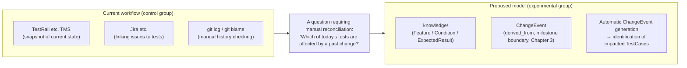
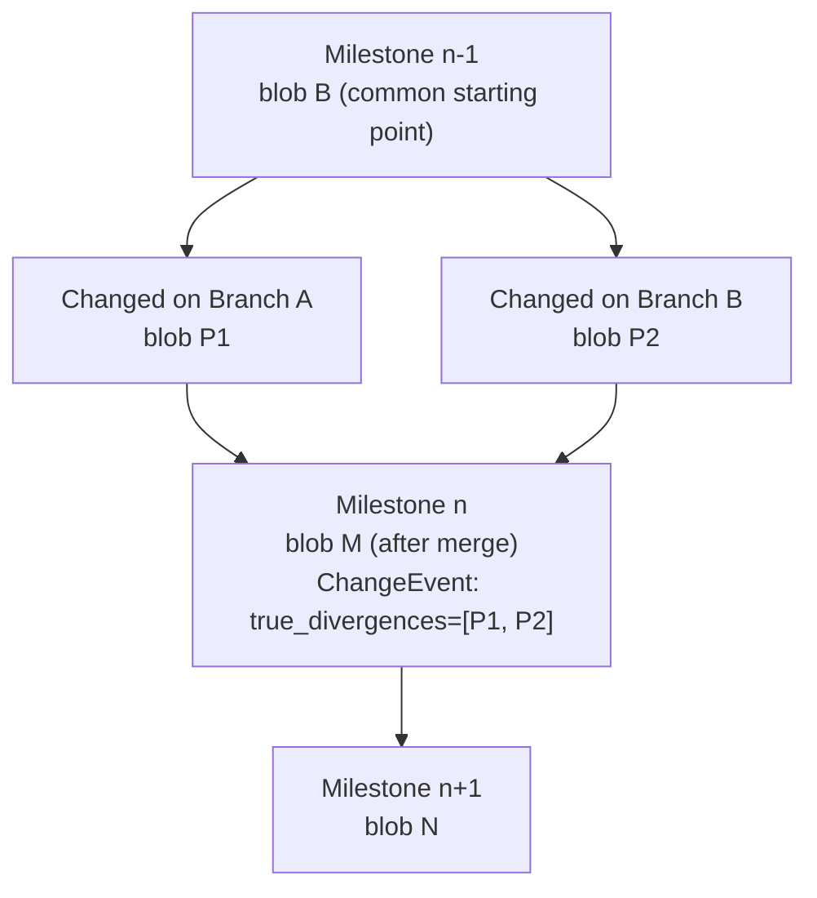
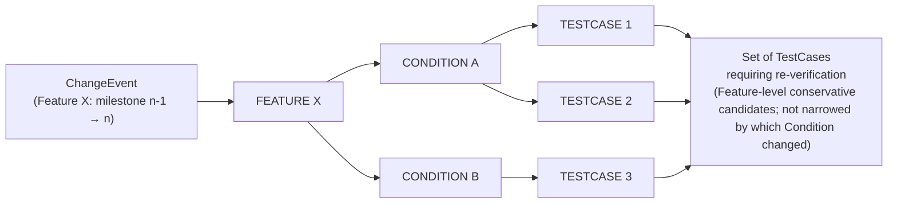
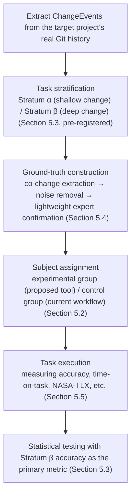

# A Git-Native Model for Test Knowledge Management: Integrated Edition

### A Version-Aware Knowledge Graph Model for Git-Native Test Knowledge Management

**Positioning**: This document integrates "Test Case Management Approach * Research Theme Deliberation Summary" (a record of the deliberation process and rejected proposals) with "A Git-Native Model for Test Knowledge Management * Practice-Oriented Paper Draft" (v1–v10) into a single document. The deliberation history is summarized in Appendix A; the main body (Chapters 1–8) records only the design and evaluation plan that is currently settled.

**Paper type**: A design proposal plus reference-implementation report (a tool / practice-oriented paper draft). The empirical evaluation via a human-subjects experiment shown in Chapter 5 (verification of RQ1) has not yet been carried out, and this is explicitly stated as Future Work (Chapters 7 and 8).
**Intended venues**: Practice-oriented tracks such as ESEM / ICSME / SANER, or domestically SES / JSSST. However, the venues above presuppose that the empirical evaluation has been completed; at the current, not-yet-executed stage, submission to a tool/architecture proposal track (e.g., a Tool Demo track), or submission after the experiment is completed, is the realistic option.

---

## 0. Summary of the Deliberation Process

1. **Initial proposal (Proposal A)**: An information model that integrates functional structure, test cases, execution results, and milestones. As a research theme, this overlaps with requirements-test-implementation traceability research and has weak novelty, but "tracking derivation relationships with the version axis as a first-class concept" remained as a candidate distinction from the TMSs investigated at the time (Appendix A; for the current limitation, see Section 2.9).
2. **Integration with the Git-hierarchy / graph-structure proposal**: Test knowledge (Requirement/Feature/Behavior/Condition/ExpectedResult) is managed as a tree structure plus cross-cutting viewpoints (Axis, graph structure), integrated into a model that treats test cases as derivatives of it (Chapters 2–3 of the deliberation summary).
3. **Full pivot to LLM utilization (rejected)**: A conversion to an "AI-only knowledge graph" was considered, but rejected because (a) concerns about query speed and usability are not resolved even if the target shifts from humans to an LLM, (b) it is a weak claim of novelty, and (c) the evaluation method would change fundamentally, lowering review resilience on its own (Appendix A.1).
4. **Partial pivot and staged design revisions**: Building on the human-facing model as a foundation, the LLM angle was carved out as future work, and the research theme was narrowed to "Proposal 1: structural representation" alone (Chapter 4 of the deliberation summary). After more than ten rounds of subsequent technical feedback, the following was settled:
   - The lineage key was changed from a manually assigned human integer to Git's content address (blob SHA) plus ancestor search (`git merge-base`) (Section 3.2).
   - Real-time queries during development and the ChangeEvent model of milestone-boundary version history (the research evaluation target) were clearly separated into distinct graphs (the structural generation graph vs. the ChangeEvent model), limiting the scope of the contribution (Section 3.2).
   - ID resolution was changed from a single committed file to a non-committed cache following the same design philosophy as Git's `commit-graph`, with the content-addressed cache key and invalidation conditions made explicit (Section 3.3).
   - The timing at which lineage is finalized was changed from per-commit to per-milestone-boundary, making it independent of branching strategy (merge/rebase/squash) (Section 3.4).
   - A backfill architecture — milestone-scoped, asynchronous, using Git notes, with deferred computation — was incorporated into the main body to enable migration of existing large-scale repositories (Chapter 4).
   - The experimental control group was changed from a self-built pseudo-TMS or an artificial single-tool comparison to the composite workflow actually used by the target organization (Section 5.2).
   - Tasks were stratified into "shallow changes within the latest release" and "deep changes across multiple generations that require manual reconciliation of multiple information sources in the existing workflow," with accuracy (especially in the deep-change stratum) adopted as the primary metric (Section 5.3).
   - The construction of ground-truth data was changed from memory-dependent interviews to mechanical reconstruction based on artifacts from the time (co-change, etc.), with the noise-removal criteria for that process made explicit (Section 5.4).

The main body follows below.

**Note (on implementation status)**: The main body describes the original design. The CLI implementation (`markharness`, this repository) is at the stage of validating the core ideas (tree-SHA-based lineage keys, TestCase derivation management, automatic milestone-boundary generation of ChangeEvents), and parts of the design have been simplified or changed during implementation. The main differences are noted in each relevant section and summarized in a table in §3.6. For a detailed cross-check, see the separate document [gap-analysis-mh-sample-test-case.md](./gap-analysis-mh-sample-test-case.md).

---

## 1. Introduction

### 1.1 Motivation

Specification changes occur frequently in software development, and each time one occurs, a judgment must be made as to "which test cases should be re-verified." Existing test management tools (TestRail, Zephyr Scale, Xray, qTest, etc.) provide static traceability (a snapshot of the current state) among requirements, features, and test cases, as well as milestone-management functionality. TestRail (Enterprise edition) provides a history-comparison/restore feature for individual test cases (Test case versioning), but this is a feature confined to the edit history of an individual test case; it does not provide a local/Git-native workflow that integrates Git's commit semantics, structured test knowledge, milestone-boundary ChangeEvents, and re-verification tracking across multiple Features (see References; the differentiation of this study is discussed in Section 1.3). A naive Git-based workflow (managing test cases in Markdown/YAML) also exists in practice, but it lacks systematic tracking of execution history and change impact.

**Figure 1: From the current workflow to the proposed model**



The target current workflow (a combination of TestRail/Jira/git search) does not retain derivation relationships spanning multiple Features and releases in a directly queryable form. Answering "which of today's tests are affected by a past change" therefore requires manual reconciliation of multiple information sources. This study investigates the hypothesis that a milestone-boundary ChangeEvent model built on Git's object model can support that reconciliation (Chapter 3). Its core mechanism combines path-independent ID resolution with directory-level tree-SHA comparison, allowing the same Feature id to be resolved after directory renames or relocation (Sections 1.3 and 3.3).

### 1.2 Research Question (RQ)

> RQ1: Does a test-knowledge model that explicitly records `derived_from` relationships as ChangeEvents at each milestone boundary improve accuracy and time-on-task — particularly for the task of **identifying change impact across multiple generations** — compared with the current workflow actually used by testers at the target organization (a combination of TMS, issue-tracking tools, git search, etc.)?

This study centers on RQ1 and narrows itself to a single research question. Related questions — automatic test-case generation from structure, improved reviewability through Git-granularity partitioning, and so on — are left as future work (Chapter 7). Application to LLM-based context supply and automatic procedure-document generation was, after deliberation, excluded entirely from the scope of this study (Appendix A).

**Current standing of RQ1**: RQ1 has been designed through Chapter 5 in terms of the evaluation plan (task stratification, ground-truth construction method, subject assignment), but the human-subjects experiment itself has not yet been conducted as of this draft. Accordingly, "whether it improves accuracy and time-on-task" should, at this point, be treated not as a **verified result but as a hypothesis backed by a design and an evaluation plan**. Statements in the text such as "improves" or "can identify," unless otherwise noted, refer to a design-level expectation (a property that follows logically from the model structure in Chapter 3), not to an empirically verified result from a human-subjects experiment. Empirical verification is Future Work, as stated in the Chapter 8 Conclusion.

### 1.3 Contributions

1. **Core design mechanism**: The design of a model (Chapter 3) that derives version history at milestone boundaries by combining four elements: (a) separating the mutable, human-facing ID from an immutable logical Identity (UID) on each Knowledge element; (b) using, as the unit of comparison for content versions, the tree SHA of the entire Feature directory rather than the blob SHA of `feature.yml` alone, so that changes to Condition/ExpectedResult alone are also detected; (c) a content-addressed, non-committed cache that composes the tree SHA together with the versions of the normalization rules, schema, and tooling; and (d) Git-tracked identity declarations confined to changes — such as renames — whose intent a snapshot alone cannot recover. UID carries logical identity across time, while the tree SHA carries the content version at a given point; content `ChangeEvent`s continue to be derived automatically from a two-snapshot diff. However, the merge-lineage audit remains a secondary feature that presupposes the retention of merge commits (Section 3.4, Table 2). This integrated model does not claim novelty for its individual elements; what it evaluates is the combination of logical Identity, content-addressed version, snapshot diffs, and version-bound execution evidence on Git.
2. **Implementation-design characteristic**: a configuration that decouples cross-cutting viewpoints (Axis) from the physical directory structure, expressing many-to-many relationships while preserving the tree structure (Section 3.5). This applies established modeling techniques and is not claimed as an independent research novelty.
3. A milestone-scoped, asynchronous backfill architecture (Chapter 4), designed to enable staged introduction into existing large-scale repositories. However, whether this design actually functions as intended on real large-scale repositories is, as of this draft, a hypothesis that has not been verified through real-data validation (a case study) (see Chapter 6, Threats to Validity, and Chapter 7, Future Work).
4. An evaluation design based on real data (Chapter 5), in which the actual current workflow of the target organization serves as the control group and ground-truth data is reconstructed from artifacts of the time.

**Differentiation of this study**: This is a local/Git-native workflow integrating Git commit semantics, structured test knowledge, milestone-boundary ChangeEvents, and re-verification tracking. Requirements/test traceability, event-based propagation, requirements-based selection and generation, trace-link evolution, and content-fingerprint freshness each have precedents. This study makes no "world-first" claim for an individual mechanism. It positions the integration of six properties—Feature-aggregate version identity, deterministic test derivation, snapshot differences, affected-TestCase derivation, version-bound execution evidence, and derived re-verification state—as a **design hypothesis to be evaluated** (Section 2.9).

### 1.4 Positioning as Research, OSS, and Product

- **Research**: Markharness is not presented as the world's first test-management method. It is a reference implementation for testing hypotheses about test knowledge derivation and version-aware verification. Its effectiveness remains empirically unverified.
- **OSS**: It is one TMS option with a Git-native / knowledge-first design philosophy. It is not positioned as a universally superior replacement for Doorstop, StrictDoc, tmt/fmf, GTM, or existing TMSs.
- **Product**: It does not pursue feature parity with TestRail or similar products. It focuses on developer-oriented test management requiring no dedicated server, external database process, or Git-external canonical persistence service. The Git repository is the sole persistence boundary: Knowledge files and the lightweight, Git-tracked identity event store are canonical repository data, while the Registry is a disposable, non-committed cache. Thus "no dedicated DB" does not mean that the design holds no persistent structured store; it means that clone/checkout contains every canonical input and no embedded database or separate persistence layer outside Git is authoritative. The identity event store is ADR 0013's design and is implemented as of this draft (Accepted, Section 3.6). A future GUI would center on release verification—ChangeEvents, affected TestCases, version-bound evidence, and pending/stale state—rather than reproduce a general-purpose TMS interface.

**Note**: The differential query that a developer can perform immediately on a working branch (a practical convenience feature described in Section 3.2 that uses the structural generation graph) does not use the ChangeEvent model of version history, and is therefore not included among this study's core contributions or the RQ1 evaluation target (for the deliberation history, see Appendix A).

---

## 2. Related Work

### 2.1 Requirements–Test Traceability Models

Existing research, including the Agile Traceability Information Model (Cleland-Huang et al., 2011), has established static traceability models spanning requirements, tests, and implementation. This study does not compete with these models; it is complementary in that it targets something these models do not address — "tracking derivation relationships across multiple generations along the version axis."

### 2.2 Test Management via Knowledge Graphs

Related knowledge-graph applications exist, such as knowledge-graph-based test data management (Software Test Data Management Based on Knowledge Graph) and ontology-based knowledge graphs in the systems-engineering domain. These primarily target data management and model management, and do not address "first-class modeling of version history" integrated with Git's version-control machinery.

### 2.3 Test Design Techniques Using Classification Trees

The Classification Tree Method (CTM) shares a conceptual affinity with this study's Feature+Condition→TestCase generation, in that both generate test cases from a classification tree. However, CTM is a test-design technique, and lifecycle management involving Git management, version history, and execution-result tracking falls outside its scope. This study differs in stance from CTM in that its primary focus is lifecycle management after design, not the test-design technique itself.

### 2.4 Event-Based Change Propagation Models

Event-Based Traceability (EBT), established by Cleland-Huang, Chang, and Christensen (2003), treats changes to evolving artifacts as events and propagates their impact to related, dependent artifacts via traceability links. The idea of "deriving impacted artifacts from a change event" is therefore not itself novel. Whereas EBT primarily propagates changes starting from observed editing operations on an artifact, this model's content `ChangeEvent`s are reconstructed after the fact and mechanically, from a tree-SHA diff between two snapshots at a milestone boundary (Sections 3.2–3.4); ordinary content edits require no intervening sequence of operations. Identity operations whose intent cannot be uniquely recovered from the snapshots alone — such as rename, retirement, and restoration — are, however, retained within the Git snapshot as rare identity declarations. This is not continuous observation of every editing operation, but a control-plane input that resolves logical Identity before a ChangeEvent is derived. Independence from the intermediate editing path is therefore preserved, but this does not amount to a claim that "no operation ever needs to be declared."

### 2.5 Requirements-Based Regression Test Selection

Chittimalli and Harrold (2008) presented a method for selecting regression tests using system requirements and their associated TestCases, rather than source code or a system model. The idea of "selecting impacted TestCases from a changed requirement" is itself already known in this research area. This model differs in that part of the requirement–TestCase association used as selection input is obtained structurally as a deterministic generation relationship from test knowledge (the `generates` relationship of Sections 3.1–3.2), rather than as a manually maintained association/coverage matrix, and in that it consistently models evidence freshness after selection as well (`verified_feature_tree_shas`, Section 3.7). Whereas conventional Requirements RTS addresses the stage of selecting "what should be re-run," this model further determines "whether valid re-verification evidence already exists at the current time."

### 2.6 Requirements-Based Test Generation and Model-Based Testing (RBTG/MBT)

A large body of research exists on automatically generating test cases from requirements or models. As shown by the comprehensive survey of 267 studies from 1994–2024 by Yang, Huang, Cui, Niu, and Towey (2025), "generating test cases from a combination of Feature/Condition" cannot itself be claimed as novel. The Feature+Condition→TestCase generation in this model (Section 3.1) is merely one method within this broad research area. The difference lies not in the generation algorithm itself, but in the lifecycle integration that positions the generated artifacts as derivatives originating from versioned knowledge on Git, and connects them to change-impact analysis (Sections 3.2–3.5) and evidence freshness (Section 3.7).

### 2.7 Trace Link Evolution Across Multiple Versions

The Trace Link Evolver (TLE) of Rahimi et al. (2018) presents a method for evolving bidirectional trace links between requirements and code across consecutive software versions. The problem of "maintaining traceability across multiple versions" is itself already addressed by this research. This model is distinguished not by trace-link repair or evolution itself, but by unifying, into a single model, (a) content-addressed version identity for Feature aggregates (tree SHA, Sections 3.1–3.3), (b) deterministic test derivation (the `generates` relationship of Section 3.1), (c) derivation of change impact via snapshot differencing (Sections 3.2–3.4), and (d) execution evidence bound to a version, and the re-verification state derived from it (Section 3.7).

### 2.8 Comparison with Existing Test Management Tools and Git-Native Workflows

Existing options can be organized into three categories from the viewpoint of storage format and version-control approach.

**(1) Commercial TMS / self-hosted TMS**: Major products such as TestRail, Zephyr Scale, Xray, and qTest offer milestone and traceability functionality. TestRail Enterprise provides comparison and restoration of individual test-case versions. The official materials reviewed did not reveal an integration of Git commit semantics, structured test knowledge, milestone-boundary ChangeEvents, and version-bound re-verification tracking across multiple Features. The other commercial products and Kiwi TCMS, TestLink, and Klaros Test Management have not been investigated at the same level of official-specification detail, so this paper records the relevant functionality as unconfirmed rather than absent.

**(2) Naive Git-based workflows**: A workflow of managing test cases directly in Markdown/YAML on Git also exists in practice (Section 1.1). The version key depends on the commit hash and is not systematized, and there is neither automatic derivation of version history nor change-impact analysis.

**(3) Structured-metadata-plus-Git-managed tools (Doorstop, StrictDoc, GTM, tmt/fmf)**: Doorstop stores linkable requirements and test cases as YAML and calculates SHA-256 fingerprints from item content. It records reviewed fingerprints and fingerprints on parent links, detecting later changes as unreviewed or suspect. Content-derived identity and trace-link freshness are therefore established mechanisms. Markharness differs more narrowly by aggregating a Feature directory as a Git tree SHA, binding generated-TestCase execution evidence to that Feature version, and deriving release-boundary re-execution state. StrictDoc already provides requirements–test-case–test-result traceability and JUnit XML integration. The relevant distinction is not test-result traceability itself, but whether a result records the target knowledge version and whether its validity is automatically re-evaluated after knowledge changes; this was not found in the public specifications reviewed. GTM provides Markdown-based test management and manual integer versions. tmt/fmf supports Git refs for remote plans, Stories with verified state, Results, `adjust`, and Policy, so it should not be described as having no version concept at all. A domain model binding Feature content versions to execution evidence and deriving re-verification state was not found in the reviewed public specifications. These observations do not prove feature non-existence and are limited as described in Section 2.9.

In practice, teams combine a TMS, issue tracking, and git search. Such combinations may permit investigation of past impact, but the target workflow does not make Feature versions, TestCases, and execution evidence directly queryable as one relation and therefore requires manual reconciliation. This study evaluates whether supporting that reconciliation in one model improves accuracy and time-on-task.

**Table 1: Comparison with existing options**

| Tool | Storage format | Version-key scheme | Automatic derivation of version history | Milestone-boundary change-impact analysis | Primary purpose |
|---|---|---|---|---|---|
| Commercial TMS (TestRail, etc.) | DB (non-Git) | TestRail's internal scheme is undisclosed (note 1) | TestRail supports individual-case comparison/restore; cross-cutting derivation history is unconfirmed in public specifications | Milestone-bound version-aware re-verification is unconfirmed | Test-case and execution management |
| Doorstop | YAML (Git-managed) | item SHA-256 fingerprint + VCS (note 3) | Detects unreviewed/suspect items and links from reviewed-fingerprint differences | Milestone-level TestCase selection not confirmed | Document tree, traceability validation, review freshness |
| StrictDoc | Text (Git-managed) | Git version/branch macro (note 3) | Git diff generation exists; version-bound result validity not confirmed | Not confirmed | Requirements/specification management and test-result traceability |
| GTM | Markdown (Git-managed) | Manual integer (v1/v2/v3, optional) (note 2) | None (relies on Git commit history + manual bidirectional links) | None | Readability / cross-referencing of test assets on Git |
| tmt/fmf | YAML (Git-managed, fmf inheritance) | Git ref can be specified | Metadata inheritance and `adjust`/Policy exist; temporal derivation history not confirmed | Re-verification from version-bound evidence not confirmed | Execution portability across multiple environments and CI/CD systems |
| Naive Git-based workflow | Markdown/YAML (Git-managed) | commit hash (not systematized) | None | None | — |
| This study (markharness) | Markdown/YAML (Git-managed) | tree SHA (content address) | Yes (automatically derives `ChangeEvent` at milestone boundaries) | Yes (`derived_from` + `ChangeEvent`) | First-class management of version history and change impact |

Note 1: TestRail's official support article "Test case versioning" and official blog describe the existence of version comparison/restore functionality, but do not describe the internal version-identification scheme (e.g., whether it is a sequence number or a timestamp); this is undisclosed (as investigated on 2026-08-13).
Note 2: GTM's manual-integer scheme is exactly the scheme this study rejected in Section 3.2, when it moved from human-manual integer management to Git's content-addressing scheme.
Note 3: Doorstop computes SHA-256 fingerprints from item content and links, and compares them with fingerprints stored in `reviewed` and parent links to determine change freshness. This is an important predecessor to content-derived identity/freshness. Markharness differs by using the Git tree SHA of an entire Feature directory and binding TestExecution to that version to derive pending/stale release-verification state. StrictDoc provides test-result traceability, but the reviewed public specification did not reveal this version binding and post-change validity re-evaluation (investigated 2026-08-18).

### 2.9 Positioning of the Novelty Claim and Scope of the Investigation

As the Related Work up to this point shows, strong prior research and existing tools exist for each individual component of this model. The following broad claims should therefore be avoided.

- That "requirements/test traceability under Git management" itself is new (Doorstop, StrictDoc, GTM, tmt/fmf, etc. exist).
- That "selecting impacted tests from a changed requirement" itself is new (Requirements RTS, Section 2.5).
- That "generating test cases from requirements/structure" itself is new (RBTG/MBT, Section 2.6).
- That "propagating impact from a change event" itself is new (EBT, Section 2.4).
- That "traceability across multiple versions" itself is unstudied (Trace Link Evolution, Section 2.7, and EBT).
- That "commercial TMSs have no version history" (TestRail's Enterprise edition has an individual-test-case version-history feature, Section 2.8).

The proposed differentiation to be evaluated is not an individual component, but the **integration** of the following properties.

```text
Logical Identity via immutable UID, and content-addressed version identity for a Feature aggregate (tree SHA, Sections 3.1–3.3)
  + Deterministic TestCase derivation (Section 3.1)
  + ChangeEvent derivation via milestone-snapshot differencing (Sections 3.2–3.4)
  + Derivation of impacted TestCases (Section 3.5)
  + Execution evidence bound to the verified Feature version (Section 3.7)
  + The re-verification state (pending/stale) derived from it (Section 3.7)
```

**Scope of the investigation**: The Related Work in Chapter 2, including this section, is based on existing related-work surveys and a targeted search of relatively closely related research and official tool documentation. It is not a formal systematic review conducted exhaustively under a pre-registered protocol with a defined search string, database list, inclusion/exclusion criteria, deduplication, quality assessment, and snowballing. Accordingly, statements in this chapter such as "could not be confirmed" or "not found within the scope of public materials" do not prove the non-existence of the feature in question; they merely indicate the current state of comparison against known prior research and tools. With this limitation in mind, this study's novelty is claimed only in the following, deliberately limited form.

> Within the scope of existing surveys and a targeted search of closely related research and tools, no approach was found that simultaneously provides all six properties above. This observation proves neither novelty nor feature non-existence. The integration is treated here as a design hypothesis about test knowledge derivation and version-aware verification to be evaluated.

---

## 3. Model Design

### 3.1 The Structure of Test Knowledge

The model is based on a tree structure (Requirement → Feature → Behavior → Condition → Expected Result), to which the following are added.

- `AXIS`: A cross-cutting viewpoint (e.g., Gameplay / Animation / AI / Network). Expresses a many-to-many intersection with `FEATURE` (the graph-structure part).
- `TESTCASE`: A derivative generated from `FEATURE` and `CONDITION` (not a primary management target).
- `TESTEXECUTION` / `MILESTONE`: Management of execution results and release units.
- `CHANGEEVENT`: The pathway by which a `FEATURE` change propagates to `TESTCASE` (the target of change-impact analysis).
- Self-referential relationships of `FEATURE` (split into two kinds):
  - `derived_from`: A relationship expressing how the same Feature changed between consecutive milestones (a conceptual name; it is not persisted as a self-referential edge on FEATURE). It is derived anew, at each milestone boundary, as a `from_tree_sha`/`to_tree_sha` comparison on `ChangeEvent` (Sections 3.2–3.4; the core of this model).
  - `forked_from`: A conceptual derivation between distinct Features (e.g., the design dependency whereby double-jump was designed on top of the specification of ground-jump). This is domain knowledge that does not appear in Git history and must be recorded manually. In the implementation, it is provided as an optional field in the front matter of `feature.yml` (Section 3.6).

**Implementation note**: The CLI implementation explicitly files `REQUIREMENT` as `requirement.yml`, and places Feature directly beneath it in a `knowledge/<requirement>/<feature>/...` hierarchy (see also the directory structure in Section 3.5). `feature.yml` references its parent via `requirement: <requirement_id>`. `requirement.yml` can also carry `source` (the origin of the requirement, optional) and `related_issues` (an array of references to an external issue tracker, optional) (a productization proposal not stated in the body of the paper). Both fields are reference information manually entered by a human; no logic that reads them for verification or generation has been implemented.

#### ER Diagram (Mermaid)

```mermaid
erDiagram
  REQUIREMENT ||--o{ FEATURE : decomposes
  FEATURE ||--o{ FEATURE : "derived_from (derived per-milestone from ChangeEvent tree-sha diff; not a persisted DAG edge)"
  FEATURE }o--o{ FEATURE : "forked_from (manual, cross-entity)"
  FEATURE ||--o{ BEHAVIOR : has
  BEHAVIOR ||--o{ CONDITION : has
  CONDITION ||--o{ EXPECTEDRESULT : has
  AXIS }o--o{ FEATURE : crosscuts
  FEATURE ||--o{ TESTCASE : generates
  CONDITION ||--o{ TESTCASE : generates
  TESTCASE ||--o{ TESTEXECUTION : executed_as
  MILESTONE ||--o{ TESTEXECUTION : contains
  CHANGEEVENT }o--|| FEATURE : affects
  CHANGEEVENT ||--o{ TESTCASE : impacts

  REQUIREMENT { string requirement_id PK }
  FEATURE { string feature_id PK
            string label }
  BEHAVIOR { string behavior_id PK }
  CONDITION { string condition_id PK }
  EXPECTEDRESULT { string result_id PK }
  AXIS { string axis_id PK }
  TESTCASE { string case_id PK }
  TESTEXECUTION { string execution_id PK
                  string result }
  MILESTONE { string milestone_id PK }
  CHANGEEVENT { string event_id PK }
```



`FEATURE` does not have a field (a `version` integer) that a human manually manages as a version number. UID represents the logical identity that persists across content changes, while the Git tree SHA represents that element's content version at a given point in time. The mutable `id` and `label` are for human-facing display and CLI resolution, and are not used as the canonical key for lineage. Requirement, Feature, Behavior, Condition, and ExpectedResult all carry an immutable UID, and parent-child references use UID as well, so the same element can still be tracked not only across a path change but also after the ID itself changes.

Only changes whose identity-related intent cannot be uniquely recovered from the two final snapshots alone — issuance, rename, retirement, restoration, release, and reissue — are Git-tracked as identity declarations. Ordinary content edits are never identity events. Each element's identity events form a causal graph: an ordinary event references a single predecessor event UID, and a conflict-resolution event references multiple predecessor event UIDs to join divergent heads. Order is determined by these predecessor references, not by timestamp or filename. The Registry is a non-committed cache reconstructible from identity events, and is never the canonical source.

Note that the `derived_from` self-referential edge in the ER diagram above is a conceptual model; the `FEATURE` entity itself is not implemented as a persistent graph structure holding version nodes and edges. In actuality, this relationship is derived anew at each milestone boundary by comparing the `from_tree_sha`/`to_tree_sha` of `ChangeEvent` (Section 3.2).

**Implementation note (change from blob SHA to tree SHA)**: The original design detected changes via the blob SHA of `feature.yml` alone, but this had a bug: when `feature.yml` itself was unchanged while only a Condition, Behavior, or ExpectedResult changed, the change would go undetected. The CLI implementation fixes this by comparing the **tree SHA of the Git tree object** covering the entire Feature directory (`feature.yml` plus the full set of behavior/condition/expected files beneath it) (`id_cache::resolve_feature_versions`, formerly `resolve_feature_blobs`). From here on, unless otherwise noted, "blob SHA" in this section refers to this "tree SHA of the Feature directory."

**Figure 2: Feature derivation relationships (derived_from and forked_from)**

```mermaid
flowchart LR
  F1["player-jump\n(milestone 1, tree A)"] -->|derived_from (automatic)| F2["player-jump\n(milestone 2, tree B)"]
  F2 -->|derived_from (automatic)| F3["player-jump\n(milestone 3, tree C)"]
  F3 -.->|forked_from (manually recorded)| F4["player-double-jump\n(conceptual derivation, new Feature)"]
```

While `derived_from`, in which the version of the same Feature advances, is automatically derived by CI at milestone boundaries (Sections 3.2–3.4), `forked_from`, as in `player-double-jump` branching off as a distinct Feature, is recorded manually, since it is domain knowledge that does not appear in Git history (Section 3.1). For how `derived_from` is actually derived in the implementation (including the point that it is not persisted as a self-referential edge of FEATURE), see the note immediately following the ER diagram above and Section 3.2.

### 3.2 Deriving Version History: Two Graphs and Their Division of Roles

This model contains two kinds of graph that serve different purposes, and distinguishing between them matters both for implementation and for evaluation.

**(A) The structural generation graph (static, version-independent)**: The `generates` relationship `FEATURE`/`CONDITION` → `TESTCASE`. This is a static structure expressing which test cases are generated from the current Feature/Condition, and it requires no version history. When a developer wants to know which TestCases are regenerated by a working-branch change, this graph plus a diff from a baseline is sufficient. **This is a practical convenience feature and is not included among the study's core contributions or the RQ1 evaluation target**. Its availability and practical effect in the target workflow require separate evaluation; it is separated here because it does not use the version-history ChangeEvent model.

**(B) The version-history ChangeEvent model (derived_from, finalized at milestone boundaries)**: The core model of this study, expressing how the same Feature changes across milestones as a `from_tree_sha`/`to_tree_sha` comparison. It is computed independently for each interval rather than stored as a persistent graph with version nodes and edges. The same integration was not found in the public specifications reviewed, but this does not assert non-existence. RQ1 is limited to evaluating this model.

Here, "the same Feature" is decided not by matching the human-facing ID but by matching the UID verified, from the identity declarations in both snapshots, to share the same root issuance event. An identity event does not itself represent the propagation of a content change; it is used only for identity resolution, prior to deriving a `ChangeEvent`.

The derivation of the version-history ChangeEvent model (B) proceeds as follows.

- **What the tree SHA provides**: A practically collision-resistant content identifier for a Git tree, including entry names, modes, and referenced objects in the Feature directory. In ordinary operation it distinguishes different Git trees and avoids the numbering conflicts of manually incremented integers. This does not mean hash collisions are mathematically impossible, and the SHA alone reveals no parent-child derivation relationship.
- **What ancestor search provides**: Determining the merge base (common ancestor) B from the parents P1 and P2 of a merge commit M requires traversing the commit graph via `git merge-base P1 P2`; it is not a matter of hash comparison alone (in practice this is efficient thanks to optimizations from Git's commit-graph file and generation numbers, but it is nonetheless an explicit graph-algorithm execution).
- For a target id, obtain tree(B), tree(P1), tree(P2), and tree(M), and classify as follows:
  - tree(P1) == tree(B) and tree(P2) != tree(B): a change on the P2 side only. Treated as linear history.
  - tree(P1) != tree(B) and tree(P2) != tree(B) and tree(P1) != tree(P2): a true divergence in which both branches changed independently. This relationship is treated as a `derived_from` with two parents (P1 and P2), and is recorded in the implementation in `ChangeEvent.true_divergences` (see the implementation status in Section 3.2).
  - tree(P1) == tree(P2): treated as a single-parent case.

This mechanism (detailed lineage reconstruction with ancestor search) is provided as a secondary feature for auditing purposes; the primary lineage used for research evaluation employs the milestone-boundary method described in the next section.

**Implementation status**: `markharness changes compute` (the primary lineage at milestone boundaries) is based fundamentally on directly comparing each Feature's tree SHA between two specified milestone tags (`from_milestone`/`to_milestone`), and this is a deliberate design choice (Section 3.4; the RQ1 evaluation target is a linear comparison at milestone boundaries). The ancestor search and two-parent-divergence determination via `git merge-base` described in this section is implemented independently, as a secondary auditing feature, in `markharness changes lineage --commit <merge-sha>` (`src/lineage.rs`). It compares the tree SHAs of the two parents (P1, P2) of a specified merge commit against the merge base (B) found via `git merge-base`, and outputs, per Feature, a classification of "linear," "true_divergence," or "single_parent."

**Integration (added 2026-08)**: `changes compute` traverses the entire `from_milestone..to_milestone` interval via `git rev-list --ancestry-path`, and for every two-parent merge commit present within that interval, internally invokes the `lineage` determination logic described above. If a given Feature is judged `true_divergence` at any merge within that interval, it is recorded, in the order in which it occurred within the interval (oldest first), into a newly added `true_divergences: Vec<TrueDivergence>` field on `ChangeEvent` (`TrueDivergence` carries, for auditing purposes, `merge_commit` and `parent_tree_shas: [tree(P1), tree(P2)]`). If the same Feature undergoes true divergence multiple times within the interval, one entry accumulates per merge, so none are dropped. This integration is an additive change; existing records in `changes/*.yaml` (which lack `true_divergences`) can still be read as-is thanks to `#[serde(default)]`. Originally this was a partial integration that only applied when the `to_milestone` tag pointed directly at a merge commit; it has since been generalized to detect merges occurring anywhere within the interval.

### 3.3 Identity Resolution: Git-Tracked Declarations and a Non-Committed Cache

The core design element in this section is the combination of path-independent ID resolution — something a simple path-based `git diff`/`git log --follow` cannot substitute for — with a content-addressed cache key (described below) that makes it feasible at practical speed. Because `id` is designed to be path-independent (Section 3.5), determining "at a given commit, at what path was the file with id X located" would naively require a full tree traversal, which does not scale on large repositories. On the other hand, keeping the id-to-path mapping as a single committed manifest file causes merge conflicts on that file every time multiple branches simultaneously add test knowledge, killing one of Git's strengths — concurrent development.

**Approach taken**: We adopt the same design philosophy Git itself uses to solve an analogous problem (speeding up ancestor search over the commit graph) via the `commit-graph` file (an auxiliary cache outside version control). ID-resolution results are **excluded from commits** and treated as a non-committed cache that each developer's local environment and each CI runner rebuilds independently as needed.

In UID mode, the canonical input is each Knowledge element's UID together with the narrow identity declarations under `.markharness/identity-events/`. Each element's issuance event is its root, and later events reference their causal order via `previous_identity_event_uid`. When the same UID occurs in both compared snapshots, the design verifies that the root issuance event and every shared event have identical canonical content, treating a different root or a rewritten shared event as an identity conflict. The 2-ref comparison — which never walks Git commit history — guarantees only the consistency of the selected snapshots and agreement on shared identity; a separate, full-history audit verifies that no event has been deleted or rewritten outside the selected snapshots.

**Composition of the cache key**

```
cache_key = hash(
  tree_sha(the Git tree object SHA under knowledge/),
  canonicalization_rule_version(the version of the normalization rules),
  id_index_schema_version(the version of the id-index format itself),
  tool_version(the version of the ID-resolution tool)
)
```

`tree_sha` uses the Git tree-object SHA of the `knowledge/` subtree, rather than the commit SHA, to avoid wasted recomputation triggered by changes to unrelated directories. Uncommitted changes in the working tree are virtually computed via `git hash-object` and included in the key.

**Invalidation conditions**

1. Change in `tree_sha`: a change in content under `knowledge/`.
2. Change in `canonicalization_rule_version`: a revision to the normalization rules themselves (which fields are considered semantically significant changes).
3. Change in `id_index_schema_version`: a change to the id-index format.
4. Change in `tool_version`: a change to the ID-resolution algorithm itself.
5. Explicit manual invalidation: a fail-safe via the `--no-cache` option or the `rebuild` command.
6. A TTL-based safety net: as a hedge against oversights in content-addressed key computation, a maximum retention period (e.g., 30 days) is set on the CI side's shared cache storage.

On load, the stored key is checked for an exact match against the current state; on any mismatch, it is silently recomputed. This avoids the risk of mistakenly trusting a stale or corrupted cache when the cache is shared across different CI runners.

**Implementation status**: The CLI implementation's `.markharness-cache/<ref>.json` implements the content-addressed cache key described in this section (a composite of `tree_sha(knowledge/)` + `canonicalization_rule_version` + `id_index_schema_version` + `tool_version`) (`CacheKey`/`compute_cache_key` in `src/id_cache.rs`). On load, it recomputes the current key and compares it against the stored key; on any mismatch, it silently recomputes and overwrites. `tree_sha` is obtained via `git rev-parse <ref>:knowledge`, and `tool_version` uses the crate version at build time (`CARGO_PKG_VERSION`). However, `canonicalization_rule_version` and `id_index_schema_version` are currently fixed at "1"; the normalization-rule revisions and format revisions that would actually bump these versions have not yet occurred. Virtually including uncommitted working-tree changes in the key via `git hash-object`, and the TTL safety net on the CI shared-storage side, are not implemented (the latter is, in any case, outside the responsibility of the CLI alone). The current implementation **uses the `id:` field of feature.yml as the canonical source** (id_cache.rs reads feature.yml via `git show`, rather than using the directory name), so it tolerates directory renames while `id:` remains unchanged and rejects duplicate ids. It does not track an `id:` value change. The former independent id-to-path-index and alias approaches are superseded alternatives; the adopted target design for closing this gap is ADR 0013's immutable-UID and identity-declaration model, which is implemented (Accepted, Section 3.6).

### 3.4 Finalizing Lineage at Milestone Boundaries

Lineage is finalized not per-commit but only at the time a milestone is finalized (e.g., a release tag). For each UID, the "tree as of the previous milestone" and the "tree as of the current milestone" are compared via identity resolution, and if they differ, a `derived_from` relationship is deemed to hold and a content `ChangeEvent` is generated (recorded in the implementation as `from_tree_sha`/`to_tree_sha`, Section 3.5). An identity event is not this diff result; it is only an input used to resolve the same UID before the comparison.

**Note the difference in dependence on branching strategy between the primary lineage (`changes compute`) and the merge audit (`changes lineage`)**: This ChangeEvent generation from the final tree diff (the primary lineage) merely compares the trees pointed to by two milestone tags, and does not depend at all on the shape of the commit graph between them (whether merge commits are kept, squashed away, or rewritten via rebase). By contrast, the lineage audit via `git merge-base` ancestor search described in Section 3.2 (`changes lineage`, `true_divergences`) presupposes that a two-parent merge commit actually exists within the milestone interval. Under squash merges or fast-forward merges, the divergence history of the original branch is lost from the commit graph, so `true_divergences` is not detected for that milestone interval (it remains an empty array). In other words, the claim of "independence from branching strategy" holds only for the primary lineage (ChangeEvent generation from the tree diff); the auditing `true_divergences` is a secondary feature that presupposes the retention of merge commits.

**Table 2: Behavior of `changes compute`/`changes lineage` under each branching strategy**

| Branching strategy | `changes compute` (primary lineage: from_tree_sha/to_tree_sha) | `changes lineage`/`true_divergences` (audit: recording true divergences) |
|---|---|---|
| Merge commit (retains two parents) | Detects the diff as usual | Merge commits within the interval can be analyzed via `git merge-base`, and true divergences, if any, can be recorded |
| Squash merge | Detects the diff as usual (because the tree of the squash commit itself is compared) | The two-parent relationship of the original branch is lost from the commit graph, and since no two-parent merge commit exists in the interval, it cannot be detected (not recorded) |
| Rebase (history rewritten) | Detects the diff as usual (because the post-rewrite tree is compared) | After rebase the history becomes linear and no two-parent merge commit exists, so it cannot be detected (not recorded) |
| Fast-forward merge | Detects the diff as usual | By definition no merge commit is created at all, so there is nothing to detect (not recorded) |

**Implementation status**: `markharness changes compute` itself takes `from_milestone`/`to_milestone` as explicit arguments and computes the tree-SHA diff between those two points; the command itself has no feature for automatically determining "the immediately preceding milestone." The practice of "automatically pairing with the immediately preceding milestone" is realized by the backfill worker described in Chapter 4 (`markharness backfill run`), which sorts `executions/<milestone>/` by tag timestamp and applies the logic to adjacent pairs — these are two separate layers.

**Figure 3: Version history via ChangeEvent (a diff log including branch divergence and merges)**



As per the case analysis in Section 3.2, if both branches independently changed the same id, the `ChangeEvent` for that interval records `true_divergences` with two parents (P1 and P2) (expressing that the `derived_from` relationship is a true divergence with two ancestors); if only one side changed, it is treated as a linear diff. This record is generated as a `ChangeEvent` per milestone interval, and is not held as a persistent graph with version nodes and edges (for extension to a persistent graph, see Chapter 7, Future Work). Because it is finalized only at milestone boundaries, it does not depend on the granularity of intermediate commits or on the merge strategy (Section 3.4).

### 3.5 Automatic Generation of ChangeEvent and the Directory Structure

`ChangeEvent` is automatically generated for any Feature for which a `derived_from` diff was detected at a milestone boundary. Only the change type (`change_type`: spec change, bug fix, etc.) is entered by a human, via a commit message or a PR template.

**Implementation status**: The CLI implementation's `ChangeEvent` struct has a `change_type: Option<ChangeType>` field (`event_id` / `feature_id` / `from_milestone` / `to_milestone` / `from_tree_sha` / `to_tree_sha` / `impacted_testcases` / `change_type` / `true_divergences` / `related_events`; the latter two are detailed at the end of this section and in Section 3.2). `ChangeType` is a fixed enum of `SpecChange` / `BugFix` / `Refactor` / `Other` (serialized in snake_case), and rather than being automatically extracted from a commit message or PR template, it is entered by a human running `markharness changes annotate <event_id> --type <spec-change|bug-fix|refactor|other>` after `markharness changes compute` has run, which rewrites `changes/*.yaml` (as intended by the design, this field is not filled in by computation). `annotate` searches for the event_id across all files under `changes/`, so the caller does not need to know in advance which milestone interval's file it belongs to.

**related_events (added 2026-08, productization proposal)**: `ChangeEvent` also has `related_events: Vec<String>` (an array of other `event_id`s, additive via `#[serde(default)]`). This is a field allowing a human to retroactively record that changes spanning multiple Features were actually part of the same logical change, appended via `markharness changes annotate <event_id> --related <other-event_id>...` (multiple values allowed). This is a design choice to preserve `ChangeEvent`'s atomicity of being per-Feature and automatically computed (§3.2); it does not change the automatic-computation logic itself in the way a composite ChangeEvent would.

**Granularity of candidate extraction**: `impacted_testcases` returns, as candidates, all TestCases corresponding to a Feature in which a change was detected — a conservative, Feature-level candidate extraction (`src/changes.rs`). There is no narrowing of the target based on which part of Condition/ExpectedResult actually changed, so TestCases that were not, in fact, affected by the change can still be included among the candidates (a factor lowering precision; Section 5.5 reports candidate count, precision, and recall together). This refinement is left as Chapter 7, Future Work.

**Two candidate-extraction modes (added 2026-08)**: Regarding from which point in time's `knowledge/` the `impacted_testcases` are generated, `markharness changes compute` has two modes. The default is `historical` mode, which generates TestCases from the Git tree pointed to by the `to_milestone` tag, so recomputing the same `from_milestone..to_milestone` interval at a later date always yields the same result (`historical_testcases_by_feature`). Specifying `--current-tree` reverts to the legacy behavior of generating from the current working tree's `knowledge/` (`impacted_testcases_by_feature`), where the result of recomputing the same interval can change for as long as the working tree keeps changing. The former corresponds to the use case of stably querying "what was actually affected during a given past interval," and the latter to the use case of querying "what tests should be re-checked right now." For details, see [change-event-verification-tracking-spec.md](./design/change-event-verification-tracking-spec.md).

**Figure 4: Propagation of change impact (Change propagation, Feature-level conservative candidate extraction)**



`ChangeEvent` identifies the set of affected `TESTCASE`s starting from a change to `FEATURE`, by traversing the structural generation graph (Section 3.2(A): `CONDITION` → `TESTCASE`). This identification process itself uses a static generation relationship and therefore requires no version history, but detecting "from what past point in time, and how, did `FEATURE` itself change" in the first place requires the ChangeEvent model (version history) of Sections 3.2–3.4; only the combination of the two makes "identifying change impact across multiple generations" (RQ1) possible.

The physical directory structure **expresses only the hierarchy (tree); cross-cutting viewpoints (Axis) are expressed via metadata plus a generated index**. Because a filesystem cannot naturally express many-to-many relationships, the graph structure is not forced into the same location as the tree structure.

```
repo/
├── knowledge/                  # Source of truth (tree structure)
│   └── player/                 # REQUIREMENT (requirement.yml, an explicit level added in the implementation)
│       ├── requirement.yml
│       └── jump/                # FEATURE (feature.yml references its parent via requirement: player)
│           ├── feature.yml
│           └── jump-behavior/
│               ├── behavior.yml
│               ├── ground/
│               │   ├── condition.yml
│               │   └── expected/001-lands-safely.yml
│               ├── air/
│               └── double-jump/
├── axes/                        # Definitions of cross-cutting viewpoints (registry)
│   ├── gameplay.yml
│   ├── animation.yml
│   ├── ai.yml
│   └── network.yml
├── generated/                   # Generated artifacts (committed; CI verifies regeneration matches)
│   └── testcases/ground-001.yml # 1 Condition = 1 file (implementation, UC2/UC3)
├── executions/                  # Execution results per milestone
│   └── 2026-08-release/
│       ├── milestone.yml
│       └── results.yml
├── changes/                     # ChangeEvent log (automatically generated at milestone boundaries)
│   └── 2026-08-release.yaml     # 1 milestone interval = 1 file, holding multiple ChangeEvents as an array (implementation)
└── schema/                      # Format definitions (JSON Schema; `markharness init` lays down a default set, implemented)

# Note: the ID-resolution cache is non-committed and .gitignore'd (Section 3.3). In the implementation it is
# located at .markharness-cache/ at the repository root (changed from an earlier proposal of generated/id-index.json).
```

**Implementation status**: The above is a revised version of the original design diagram (which left REQUIREMENT implicit and used one file per ChangeEvent, named by date + slug), and has been aligned with the structure that the actual `markharness init` creates and the format that each `markharness` command reads and writes. The key differences are as follows.

- `REQUIREMENT` is explicitly filed as `requirement.yml` directly under a directory, with `FEATURE` placed beneath it (Section 3.1).
- `changes/` is not "one file per event" but "one file per milestone interval, holding multiple `ChangeEvent`s as an array" (extension `.yaml`).
- `schema/` is initialized by `markharness init` with a default set of JSON Schema files (`requirement.schema.json` / `feature.schema.json` / `behavior.schema.json` / `condition.schema.json` / `expected_result.schema.json` / `axis.schema.json`) (existing files are not overwritten, so schemas can be customized per project). `markharness validate` performs structural validation of all YAML under `knowledge/` and `axes/` against these schemas, and additionally implements, as Rust-side cross-reference checks, cross-reference constraints that a JSON Schema alone cannot easily express (whether an `axis` tag is registered in `axes/*.yml`, and whether `forked_from` points to an actually existing Feature id) (Section 3.6).
- `expected_result.schema.json` can also carry `generated_by` (enum: `manual`/`llm`/`auto_combination`, optional) and `verified_by` (`{ human_review: boolean }`, optional) (a productization proposal not stated in the body of the paper). Both are optional, and omitting `generated_by` means "generation method unknown," not "manually created." Highly volatile metadata such as `model` name, `prompt_version`, or `confidence_score` is not adopted, as it is a poor fit with this schema family's premise that "everything under `knowledge/` is verified, settled knowledge."

Example front matter of `feature.yml` (aligned with the implementation):

```yaml
id: player-jump
requirement: player  # reference to the parent REQUIREMENT (added in the implementation)
label: Player Jump  # display-only. Not used in lineage computation
axis: [gameplay, animation]
forked_from: null # manually recorded only when a conceptual origin exists (e.g., other-feature)
```

Because inconsistent naming conventions for `axis` would break cross-cutting views, `markharness validate` prevents front matter from using a value not defined in `axes/*.yml`, via schema validation plus a cross-reference check (already implemented; see the end of this section). Whether to fix and codify the normalization rules (which fields are subject to hash computation) explicitly in the schema itself is left as a future verification topic.

### 3.6 Summary of Implementation Status

The following table summarizes what could be confirmed, in the CLI implementation (`markharness`), of the model described in Chapter 3. For a detailed cross-check, see the separate document [gap-analysis-mh-sample-test-case.md](./gap-analysis-mh-sample-test-case.md) (note, however, that this document reflects a state prior to the updates in this section).

| Category | Content |
|---|---|
| Implemented, matching the design | Using a Git object hash as the version-history key (though the unit is the Feature-directory tree, not a blob, Section 3.1); managing TestCase as a derivative separated from knowledge/; automatic milestone-boundary computation of ChangeEvent; non-committed, content-addressed caching of ID resolution with automatic invalidation (Section 3.3); unifying id on the `id:` field of feature.yml, with resilience to directory renames (Section 3.3); backfill progress management via `git notes` (Chapter 4); provision of the `forked_from` field itself; the `change_type` field and the after-the-fact annotation command (Section 3.5); the `related_events` field and `changes annotate --related` (productization proposal, Section 3.5); the `source`/`related_issues` fields of `requirement.yml` (productization proposal, Section 3.1); the `generated_by`/`verified_by` fields of `expected_result.schema.json` (productization proposal, Section 3.5); JSON Schema validation under `schema/` (including `execution_result.schema.json` for `executions/*/results.yml`) plus axis/forked_from cross-reference checks (Section 3.5); ancestor search and two-parent-divergence determination via `git merge-base` (as a secondary auditing command, Section 3.2); integration of `lineage` determination across every merge occurring anywhere within a milestone interval into `changes compute` (the `true_divergences` field, Section 3.2); automatic reconciliation of TestExecution against ChangeEvent and pending/stale determination of un-re-verified tests via `verify trace`/`verify pending` (Section 3.7); ADR 0013's immutable identity model (immutable UID issuance for all five Knowledge element kinds, the identity event log, migrating every element and completing the schema-version-2 public cutover via `identity migrate`, resolving branch divergence and lifting former-id reuse reservations via `identity resolve`/`release`, retiring and restoring a UID on Knowledge-element deletion via `identity retire`/`restore`, force-issuing a brand-new UID for copy/import/repository integration via `identity reissue` (refusing when the target id has not yet been released from any locally known UID of that kind, whether or not the Knowledge file itself currently carries a `uid:`), re-deriving a Knowledge file's id:/uid: from its event log on demand via `identity sync`, `feature rename-id` collapsing a rename into a single ChangeEvent by preserving the UID, cross-migration-boundary identity resolution for TestCase via `case_uid` and the migration manifest, and full commit-history event append-only-ness verification via `identity audit` (IdentityAuditor); CLI manual sections 1.25–1.33) |
| Simplified from the implemented design | The ID-resolution cache's `canonicalization_rule_version`/`id_index_schema_version` are currently fixed values, and actual revision operations have not been verified (Section 3.3). `verify trace`/`verify pending` are not applied retroactively to pre-existing execution records from before this feature was introduced (which lack `verified_feature_tree_shas`) (Section 3.7). ADR 0013's verification rule that normal commands reject a uid-less element introduced after the UID-mode cutover is implemented only in `markharness validate`; extending it to generation-side commands such as `knowledge apply`/`interactive add` is undecided (tracked as a follow-up in checklist-immutable-identity-model.md) |
| Not implemented | An importer from existing TMSs (TestRail/Xray, etc.) (UC8) |
| Additional elements not in the design | Explicit filing of `REQUIREMENT` as `requirement.yml` and the `knowledge/<requirement>/<feature>/...` hierarchy (Section 3.1) |

The items in the "Simplified from the design" row do not directly participate in the linear milestone-boundary comparison primarily targeted by RQ1. Divergence determination via `git merge-base` is implemented so that all merges within an interval are reflected into the primary lineage of `changes compute`. Detection accuracy on complex real repositories remains unevaluated and must be examined in the Chapter 5 case study. ADR 0013's immutable identity model is implemented, but its usefulness and productivity impact in real projects remains unverified, and continues to be listed under Future Work in Chapter 7.

### 3.7 Re-Verification Tracking Based on Change Detection

Section 3.5 and Figure 4 cover only as far as identifying the set of affected `TESTCASE`s from a `ChangeEvent`; the mechanism for automatically determining "whether it was actually re-executed afterward" was originally an undetermined area corresponding to Chapter 7 (Future Work). The CLI implementation has since implemented this as `markharness verify trace` / `markharness verify pending`; this section summarizes that design (for the detailed specification, see the separate document [change-event-verification-tracking-spec.md](./design/change-event-verification-tracking-spec.md)).

**The question being solved**: In the current implementation, humans had been manually eyeballing the reconciliation between `executions/<milestone>/results.yml` (`case_id` / `result` / `executor` / `executed_at`) and the `impacted_testcases` of `changes/<to_milestone>.yaml` (as noted in Section 3.5, the filename is keyed only on the interval's `to_milestone`). The following two questions are automated.

- **Q1 (retrospective)**: For a given TestExecution's result, which change to the Feature does it reflect the state of, at the time it was executed?
- **Q2 (forward)**: Among the TestCases listed in a ChangeEvent's `impacted_testcases`, which have not yet been re-executed?

**Data-model extension**: A `verified_feature_tree_shas` field is added to `TESTEXECUTION` (each record in `executions/<milestone>/results.yml`). This is a map that records, for each Feature from which the TestCase was generated, the **tree SHA of the entire Feature directory as of the milestone at execution time** (not the blob of `feature.yml` alone as described in Section 3.1, but the Git tree-object SHA of the entire directory, including the Behavior/Condition/ExpectedResult beneath it). The value is filled in mechanically from the `id_index` cache (Section 3.3) at the time execution results are registered; it is not a field manually entered by a human. `ChangeEvent` itself is deliberately not given a "re-verified" flag, since `ChangeEvent` is an immutable factual record of a diff at a milestone boundary (consistent with the design philosophy of Section 3.4), and "whether it has been re-verified" is derived information that can be computed on demand from two independent factual series: `ChangeEvent` and `TESTEXECUTION`.

**Determination algorithm**: For Q1, for each Feature id in the `verified_feature_tree_shas` of the target record, a `ChangeEvent` under `changes/` whose `to_tree_sha` matches is searched for, and its `event_id`, `from_milestone`, and `to_milestone` are returned as "the change this result reflects." For Q2, from the union of `impacted_testcases` across all `ChangeEvent`s in the target interval, any TestCase for which there exists at least one record in `results.yml` from `to_milestone` onward whose `verified_feature_tree_shas` matches is subtracted as "already re-verified," and the remainder is output as "not yet re-executed." Furthermore, when the target Feature has changed again after `to_milestone`, such that `to_tree_sha` itself has become stale, this is not uniformly reported as "not executed," but is split into two categories: **pending** (there is no execution record at all yet) and **stale** (there is no execution record, and the target has changed further, such that verifying against the old version is no longer meaningful). This distinction is so that testers do not lose track of which version they should be verifying against.

**Tool interface**: Two commands are provided: `markharness verify trace <case_id> --milestone <m>` (Q1) and `markharness verify pending [--from <m1> --to <m2>]` (Q2). Both are read-only, taking only the existing `verified_feature_tree_shas`, `changes/*.yaml`, and `.markharness-cache/` as input. For CI integration, a `--fail-on-pending` option is provided, which returns a non-zero exit code if even one `pending` item exists, allowing missed re-verification of change-impacted tests to be mechanically blocked at a release gate.

**Concrete example**: If `changes/test2.yaml` has a `ChangeEvent` for the `todo-edit` Feature with `from_tree_sha: null` / `to_tree_sha: 4f2c9a1e...`, and the corresponding record in `executions/test2/results.yml` has `verified_feature_tree_shas: {todo-edit: 4f2c9a1e...}`, then since the two `tree_sha` values match, `markharness verify pending --from test1 --to test2` does not treat that TestCase as pending, and judges it "already re-verified."

**Implementation status and caveats**: Pre-existing execution records from before this specification was introduced (those lacking `verified_feature_tree_shas`) are not applied retroactively, and are excluded from the determination (treated as "unknown"). This capability only holds because of the tree-SHA comparison over the entire Feature directory (`id_cache::resolve_feature_versions`, Section 3.1); an implementation that compares the blob SHA of `feature.yml` alone would not achieve this, since it would miss changes to Condition/ExpectedResult. Also, cases where the Feature itself is unchanged but only the Axis registry (`axes/*.yml`) changes are outside the scope of tracking (Future Work, Chapter 7). A JSON Schema for `executions/*/results.yml` (`execution_result.schema.json`) is implemented and is included in the validation targets of `markharness validate`.

---

## 4. Implementation: Migration Architecture for Existing Repositories

When introducing this model into an existing large-scale repository, the cost of "backfilling" — retroactively processing the entire history — can be a barrier to adoption. The following architecture addresses this. **This architecture itself is a design-level response; measured verification of, for example, actual initial-backfill time and storage volume on a real large-scale repository has not yet been performed** (Chapters 6 and 7). Statements below to the effect that "staged introduction into a large-scale repository is possible" should be understood as an expectation that follows logically from this design, not as an empirically verified result.

### 4.1 Reducing the Scope of Backfilling

Because the version-history ChangeEvent model is designed to be finalized only at milestone boundaries (Section 3.4), backfilling likewise only needs to target **commits tagged as past milestones**. Even across several years of monthly-to-quarterly releases, this amounts to only tens to a few hundred items — the scale shrinks to a manageable "tens of thousands of files × number of past releases," rather than "tens of thousands of files × entire history," which is the design-level expectation (as noted above, this has not yet been backed by measurement).

### 4.2 Asynchronous Background Processing

Backfilling is implemented not as a synchronous, batch process that halts development, but as a low-priority background job. The most recent milestones are processed first.

**Implementation status**: The CLI implementation's `markharness backfill run` satisfies the property of processing the most recent milestone first, with the ability to interrupt and resume (realized via Git notes, Section 4.3), but the command itself is a synchronous process that "processes one pass over unprocessed pairs and then exits when invoked once"; it is not a resident background daemon. The design intent of "not halting development" is meant to be realized by an operational pattern of repeatedly invoking this command from, e.g., a scheduled CI run.

### 4.3 Progress Management via Git Notes

For the commit corresponding to each milestone tag, progress information — "lineage computation for this milestone is complete" — is recorded as a `git notes` entry (a Git feature that attaches arbitrary metadata to a commit in a separate namespace, without rewriting normal commit history). This prevents the background job from duplicating work when interrupted and resumed. Because Git notes are outside the scope of ordinary branch merges, this progress record itself never causes a merge conflict.

### 4.4 Staged Delivery of Value via Deferred (On-Demand) Computation

When a query arrives for a milestone interval that has not yet been backfilled, it is computed on the spot and cached. This allows the tool to deliver partial value before backfilling is fully complete, enabling staged adoption: starting to use it from the most recent milestone, with older history filled in progressively as it is used.

### 4.5 Tooling Composition

- Schema definitions: JSON Schema fixes the YAML format under `knowledge/`. **Implemented** (`schema/*.schema.json`, with `markharness init` laying down a default set, and `markharness validate` performing validation; explicit codification of the normalization rules themselves in the schema is a future topic, Section 3.6).
- A practical convenience feature: a CLI command that diffs the current HEAD against a baseline and, by reference to the structural generation graph, displays the affected TestCases (does not use the version-history ChangeEvent model).
- ID-resolution cache: non-committed; the cache key and invalidation conditions are given in Section 3.3. **Implemented** (a content-addressed cache key with automatic invalidation on load, Section 3.3).
- Version-history computation tool (the core contribution): compares, between milestone tags, the tree SHA of each id via ID resolution, computing `derived_from`. **Implemented** (`markharness changes compute`).
- Backfill worker: asynchronous background processing based on the architecture in Sections 4.1–4.4. **Implemented** (`markharness backfill run`, though, as noted in Section 4.2, it is a single-invocation type).
- Detailed lineage tool (auditing, secondary feature): per-commit lineage reconstruction using `git merge-base`. **Implemented** (`markharness changes lineage --commit <merge-sha>`; the determination result, however, is not persisted into `changes/*.yaml`, Sections 3.2 and 3.6).
- Test-case generation tool: generates `TestCase` from `Feature + Condition`, with CI verifying that the regenerated result matches the current file. **Implemented** (`markharness generate` / `markharness verify`).
- Importer from existing tools: a converter from TestRail / Xray / TestLink export formats into this format. **Not implemented** (Section 3.6).

For implementation details, see this repository (`markharness`, Rust implementation). All CLI commands are documented in `docs/cli-manual.md`.

---

## 5. Empirical Evaluation Plan (Not Yet Conducted)

This chapter is the **plan** for a human-subjects experiment; as of this draft, the experiment has not been conducted. What follows is a design for "how it will be verified," not "the results of verification." For the current status, see Chapter 8, Conclusion.

### 5.1 Purpose

The following evaluation plan is designed for the purpose of verifying RQ1 — "Does a model with explicit version history improve accuracy and time-on-task, particularly for the task of identifying change impact across multiple generations, compared with the target organization's current composite workflow?"

**Figure 5: Overview of the evaluation flow**



The details of each stage are described below.

### 5.2 Control Group: Integration into the Current Workflow

A self-built pseudo-TMS, or an artificial split between real TestRail and bare Git usage, does not reflect the reality that practitioners use multiple tools together. Through a prior survey, we confirm with testers at the target organization (a partner project) what they actually use when investigating change impact, and adopt the combination of tools they actually use daily (e.g., TestRail + Jira issue search + `git log`/`git blame`) as the control group. The researchers do not arbitrarily set conditions such as "TestRail only" or "Git only." The experimental group uses the proposed tool for this model. Consolidating the control group into a single condition allows statistical power to be concentrated on a single primary comparison.

### 5.3 Task Stratification (Pre-Registered)

A comparison of "a familiar, real-world workflow" versus "a proposed tool immediately after introduction" is strongly confounded by proficiency effects on task speed. Rather than ignore this confound, tasks are evaluated across two strata, and **this stratification is pre-registered before the experiment begins**.

- **Stratum α (shallow change)**: A change within the latest release, expected to require reconciliation of relatively few information sources in the control workflow. We state in advance that the control group may have a speed advantage.
- **Stratum β (deep change)**: A derivation from several generations back, or a change spanning multiple releases. The target control workflow does not retain inter-version derivation relationships in a directly queryable form, so manual reconciliation cost and omissions are expected to increase. The experiment tests whether this expectation appears in accuracy and time-on-task; it does not assume that the required information is fundamentally absent.

The **primary metric** is accuracy (precision and recall) in Stratum β. Speed is treated as a secondary metric, and the presence of a proficiency confound is stated explicitly when interpreting it.

### 5.4 Method for Constructing Ground-Truth Data: Removing Co-Change Noise

Relying solely on interviews with the people who were parties to the existing workflow, drawing on human memory, to construct Stratum β ground truth is nearly self-contradictory (if a change is genuinely complex enough that the existing workflow cannot handle it, human memory of it may likewise be inaccurate). Ground-truth construction prioritizes mechanical reconstruction based on artifacts from the time.

**First priority (artifact-based)**: For the actual commit/PR in which the target specification change was made, we mechanically extract the co-change signal (test files changed in the same commit/PR), CI test-execution logs, and test-case-ID linkage records in the issue-management system.

**Co-change noise-removal criteria**: The co-change signal cannot be trusted unconditionally, so the following noise removal is performed.

1. **Unrelated simultaneous changes (bundled commits)**: If the number of changed lines or changed files in a commit/PR is abnormally large — e.g., exceeding three times the median for the target project — it is excluded from candidacy or sent for individual review. If the commit message or PR description states multiple intents, it is likewise sent for review.
2. **Mechanical changes (simultaneous changes without semantic meaning)**: Excluded if the diff consists only of whitespace/newlines, matches a known auto-generation pattern (e.g., a snapshot update), or if dozens to hundreds of files were changed simultaneously in the same commit (a sign of a bulk rename or bulk reformat).
3. **Semantic irrelevance**: Experts judge semantic relevance from model-independent artifacts such as requirements, PR descriptions, test purpose, and implementation diffs; Markharness's own generation relationship is not used to accept or reject ground-truth candidates. Agreement with `FEATURE`/`CONDITION` → `TESTCASE` is reported only as a validity analysis after ground truth has been fixed. Extremely frequent tests are presented to experts as low-specificity auxiliary information rather than automatically excluded by the proposed model.

**Open-world construction process**: (1) Build an initial candidate set from the artifacts above. (2) At least two independent experts judge candidates individually and may add affected TestCases from outside the initial set using requirements, implementation diffs, and the complete contemporaneous TestCase inventory. (3) A separate expert or adjudication panel decides the union of the initial and expert-proposed sets, and inter-rater agreement is reported. This allows recovery of affected tests omitted from co-change, CI logs, and issue links because they were not updated or executed at the time. Impacts that left no artifacts and cannot be reconstructed by experts remain unobservable, and this limitation is reported.

**Second priority (when artifacts are unavailable)**: Even where reliance on interviews is unavoidable, judgment is made individually by multiple independent experts rather than a single person, and agreement is reported. Stratum β tasks are, as far as possible, preferentially selected from changes for which ground truth can be reconstructed on an artifact basis; where the proportion of interview-based ground truth is high, a caveat is attached to the interpretation of the results.

### 5.5 Tasks, Metrics, and Sample Size

Subjects are presented with actual past changes from the target project and asked to identify the affected TestCases. The primary metric is precision and recall in Stratum β; time and subjective workload (e.g., NASA-TLX) are secondary metrics. Sample size is not fixed by an unsupported head-count range. It will be determined through a preregistered power analysis using pilot estimates of effect size and variance, the primary test, power, significance level, and expected attrition. Experience, project familiarity, and proficiency with current-workflow tools are recorded as covariates. The experimental condition also reports the `impacted_testcases` candidate count alongside precision and recall.

### 5.6 Anticipated Threats to Validity

- **Internal validity**: Counterbalancing of task-prompt design; a preliminary practice session for both groups.
- **Construct validity**: The definition of "deep change" is fixed in advance. The breakdown of artifact-based candidates, expert-added candidates, and interview-based evidence is reported, together with the inability to reconstruct all unobserved impacts. Because co-change thresholds depend on project scale and culture, they are fixed after the pilot and preregistered; they are not adjusted post hoc.
- **External validity**: The limits of generalizability where the study remains a single-organization, single-domain case study. Because the control group's "current workflow" differs by organization, the composition of the control group could change in a replication at another organization.

---

## 6. Threats to Validity (Overall)

- The possibility that the implementation (tool) of the proposed model influences the results of the human-subjects experiment (to avoid conflating tool usability with the effectiveness of the model itself, the UI is simplified and instructions are standardized).
- The possibility that making the ID-resolution cache non-committed incurs a recomputation cost every time the CI environment changes (dependent on the build cache's persistence strategy).
- The performance of the backfill architecture (Chapter 4) has not yet been verified on a real large-scale repository (a case study). A newly constructed dataset may not surface migration cost, risking an underestimate of the real cost of adoption.

---

## 7. Future Work

- Verification of the developer-experience and productivity effect of the practical convenience feature (real-time queries based on the structural generation graph, Section 3.2(A)).
- Measured performance of the backfill architecture (Chapter 4) applied to a real large-scale repository.
- Verifying and adjusting the ID-resolution cache's key design (Section 3.3) and the co-change noise-removal criteria (Section 5.4) through implementation and data collection is itself left as a future empirical task (`canonicalization_rule_version`/`id_index_schema_version` are currently fixed values, and no verification through an actual revision workflow has yet occurred).
- ADR 0013's schema-version-2 identity model — immutable UIDs for all persistent Knowledge elements, limited identity declarations, UID-based TestCase/Execution/ChangeEvent continuity, legacy migration, and crash recovery — is implemented (Section 3.6, CLI manual sections 1.25–1.33) and the ADR has moved to Accepted. The former independent id-to-path-index and alias approaches are superseded alternatives, not parallel Future Work. What remains is evaluating its usefulness and productivity impact once applied to real projects, and validating repository-integration behavior in practice (explicit reissue when different repositories carry the same UID, decisions/0013 "Rules for copy, import, and repository integration").
- Implementing an importer from existing TMSs (TestRail/Xray, etc.) (an item Section 3.6 characterized as not implemented).
- Refinement of candidate extraction based on Condition/ExpectedResult diffs. The current implementation performs conservative, Feature-level candidate extraction (Section 3.5) and does not narrow down to which Condition/ExpectedResult within a Feature actually changed. Measuring the resulting drop in precision is to be confirmed via the evaluation plan in Chapter 5.
- Potential application to LLM-based context supply and automatic generation/update of Markdown procedure documents (for the deliberation history and reasons for rejection, see Appendix A; outside the evaluation scope of this study).
- Evaluating the coverage of automatic test-case generation from structure, and verifying improved reviewability from Git-granularity partitioning (Proposals 2 and 3 of Chapter 4 of the deliberation summary).
- Verifying generalizability through replication in other domains and other organizations.
- An extension that explicitly persists and makes queryable the `derived_from` relationship as a persistent version-history graph (a Version DAG) with version nodes and edges. This remains a distinct concept from ADR 0013's identity-lifecycle causal graph (`identity-events/`, now implemented): the latter resolves which logical entity is being compared, while `derived_from` remains a content-version relationship derived anew per milestone interval from `ChangeEvent` tree-SHA comparisons, and is not persisted as a graph (Section 3.2).
- A future CI gate that reads `generated_by`/`verified_by` (Section 3.5) (e.g., `markharness verify` warning when an `ExpectedResult` exists with `generated_by: llm` and no `verified_by` set) is not implemented. Currently only discrete factual information is recorded; logic that consumes it is out of scope for this study.

---

## 8. Conclusion

This study designed a model combining a Git-tracked immutable logical Identity (UID), Git content addressing (tree SHA) as the content version, a non-committed identity-resolution cache, and commit-graph ancestor search (`git merge-base`) to derive test-knowledge version history (`derived_from`) at milestone boundaries (Chapter 3). Ordinary content changes are derived after the fact from two snapshots; identity declarations are retained only for identity operations whose intent a snapshot alone cannot recover. Existing research and tools already provide related mechanisms such as immutable identifiers, event-based traceability, content fingerprints, trace-link freshness, and test-result traceability (Sections 2.4–2.8). Rather than claim novelty for these individual elements, this study presents a design hypothesis integrating logical Identity, Feature-aggregate versions, test derivation, change impact via snapshot diffs, version-bound execution evidence, and re-verification state on Git.

This design has been reference-implemented as `markharness` (Rust implementation, this repository), and we confirmed that its core functionality operates: automatic computation of milestone-boundary version history via `changes compute` (including integration of `lineage` determination across every merge occurring anywhere within an interval, Section 3.2, "Integration (added 2026-08)"); `git merge-base`-based divergence auditing via `changes lineage`; and automatic reconciliation against execution results via `verify trace`/`verify pending` (Section 3.7). As summarized in Section 3.6, there are places deliberately simplified from the design (e.g., the ID-resolution cache's version-revision workflow remains unverified), and places left unimplemented (an importer from existing TMSs).

The immutable UID, identity events, and UID-based tracking of TestCases, Executions, and ChangeEvents started out as ADR 0013's Proposed design, but are now implemented in the reference implementation as of this draft (Section 3.6), and ADR 0013 has moved to Accepted. Thanks to the schema-version-2 public cutover performed by `markharness identity migrate`, the same Feature can now be tracked across an `id:` change in `feature.yml` via its UID. The UID model's implementation quality is therefore confirmed by operation; its usefulness in real projects remains to be verified.

**The current nature of this study**: This draft is a **design proposal and reference-implementation report** aimed at verifying RQ1 ("Does a model with explicit version history improve accuracy and time-on-task, in the task of identifying change impact across multiple generations, compared with an existing composite workflow?"), and the empirical evaluation via the human-subjects experiment planned in Chapter 5 has not, as of this draft, been conducted. Accordingly, this draft does not assert an affirmative conclusion for RQ1. The design-level expectation holds that the model structure described in Chapter 3 (making version history first-class) can provide testers with information the existing workflow lacks (derivation relationships from past generations), but whether this translates into an actual improvement in accuracy and time-on-task can only be judged after conducting the human-subjects experiment per the evaluation plan in Chapter 5.

**Empirical verification as Future Work**: Verification of RQ1 via a human-subjects experiment is the direct sequel to this study (Chapter 7). Chapter 5 defines the skeleton of a preregistration. After the pilot, effect size and variance, the primary test, sample size, and co-change thresholds will be finalized with the power analysis and registered before the experiment begins. The experiment will then be conducted and reported under that plan. Empirical verification of the ID-resolution cache revision workflow and measured backfill performance on a large repository also remain independent implementation tasks.

---

## Appendix A: Deliberation-History Log (Outside the Scope of the Paper, a Record of Decisions)

### A.1 The Proposal to Pivot to LLM Utilization (Rejected)

A full pivot from a "human-facing tool" to an "AI-only knowledge-graph model that has an LLM understand specification changes and automatically generate/update manual test procedure documents" was considered, and rejected for the following reasons.

1. Concerns about query speed and usability essentially remain even if the user shifts from a tester to an LLM (only the target moves).
2. "LLM × knowledge graph × testing" is already a domain with abundant prior research, and framing it as merely "AI-only" is a weak claim of novelty on its own. The differentiating point is `derived_from` (version history) and `ChangeEvent`'s impact propagation, which are included in the model without presupposing an LLM.
3. Adding LLM-generation-accuracy evaluation to the main evaluation would make it unrealistic to secure a statistically reliable sample size alongside the human-subjects experiment; even downgrading it to a pilot-level treatment would only create the weakness of "why is this needed in the paper at all," so it was removed entirely from the body of the paper.

Note that GTMS (AI-agent-driven test-case generation, intent verification, and script promotion), offered in the same domain (testmanagement.com), is close to the "LLM-only knowledge graph" direction rejected in this section. Because it appears prominently in search results under the shared keyword "Git Test Management," it is noted here in case reviewers recall it as a related product.

### A.2 The Protected-Region (Override) Approach for Markdown Procedure Documents, and Its Limits

An operational approach using protected regions was considered for the case where a tester directly edits an LLM-generated procedure document, but while this can prevent accidental text overwrites, it cannot prevent semantic staleness when preconditions change significantly. This is an inherent limit of text merging and cannot be solved in principle; it was dropped from the core design once the LLM angle became Future Work.

### A.3 Reinventing a Custom Hash and Custom Index (Fixed)

A design was considered in which a custom `content_hash` would be computed and recorded in an independent index file as the identifier for the lineage key, but this was a reinvention of a content-addressing scheme (blob SHA) that Git already has. The design was revised to use Git's hashing mechanism directly (Section 3.2). Likewise, the design of holding the id-resolution mapping as a single committed file was revised, since it invites merge conflicts during concurrent development, into a non-committed cache following the same design philosophy as Git's `commit-graph` (Section 3.3).

### A.4 List of Actions as a Research Program

1. Fixing scope: Proposal 1 (structural representation, task-based RQ1) as the sole central theme. Proposals 2 and 3 are future work (Chapter 7).
2. Additional survey of related work: consult primary literature on CTM, Model-Based Testing, and LLM+knowledge-graph test generation/traceability research (for future work) and make the differentiation explicit.
3. Advance design of the format specification: fix and version JSON Schema.
4. Implement hash computation and normalization rules: fix the target fields and normalization method up front.
5. Implement schema validation: verify the consistency of `axis` tags and `forked_from` reference targets in CI.
6. Design an importer from existing tools: prepare converters from TestRail / Xray / TestLink export formats.
7. Select case-study targets: decide, among games, web, and business systems, which to evaluate with real data (or simulated data).
8. Design the human-subjects experiment: build an experimental design that can secure an N sufficient for statistical testing, for the Stratum β evaluation.
9. Implement the ID-resolution cache and lineage-computation tool: implement per the specification in Sections 3.2–3.3.
10. Implement the backfill worker: implement per the architecture in Chapter 4.
11. Implement the co-change noise-removal script: implement per the removal criteria in Section 5.4.

### A.5 Implications for Title and Framing

An abstract framing such as "AI-Native Test as Code" tends to create a gap between reviewer expectations and the actual contribution. A title that makes the differentiating points (version tracking, change-impact propagation) explicit — such as the title at the top of this document — produces a smaller expectation gap in review.

---

## References

- Cleland-Huang, J. et al. (2011). Agile Traceability Information Model.
- Cleland-Huang, J., Chang, C. K., Christensen, M. (2003). Event-Based Traceability for Managing Evolutionary Change. *IEEE Transactions on Software Engineering*, 29(9), 796–810. https://doi.org/10.1109/TSE.2003.1232285
- Chittimalli, P. K., Harrold, M. J. (2008). Regression Test Selection on System Requirements. *ISEC 2008*, pp. 87–96. https://doi.org/10.1145/1342211.1342229
- Rahimi, M., Cleland-Huang, J. et al. (2018). Evolving Software Trace Links Between Requirements and Source Code. *Empirical Software Engineering*, 23, 2198–2231. https://doi.org/10.1007/s10664-017-9561-x
- Yang, Z., Huang, R., Cui, C., Niu, N., Towey, D. (2025). Requirements-Based Test Generation: A Comprehensive Survey. https://arxiv.org/abs/2505.02015
- Doorstop official documentation. Overview. https://doorstop.readthedocs.io/en/latest/
- Doorstop official documentation. Item fingerprints and reviewed links. https://doorstop.readthedocs.io/en/v2.0/reference/item/
- Doorstop official documentation. Validating requirements and suspect links. https://doorstop.readthedocs.io/en/stable/cli/validation.html
- StrictDoc official documentation: Traceability and test report integration. https://strictdoc.readthedocs.io/en/stable/stable/docs/strictdoc_01_user_guide-TRACE.html
- Software Test Data Management Based on Knowledge Graph. https://www.informatica.si/index.php/informatica/article/download/6416/3168
- Model management to support systems engineering workflows using ontology-based knowledge graphs. https://arxiv.org/html/2512.09596v1
- UOOR: Seamless and Traceable Requirements. https://arxiv.org/pdf/2502.18617
- Trust-Aware Multi-Agent Traceability. https://arxiv.org/pdf/2606.17203
- TestRail. Test case versioning (the Enterprise-edition individual-test-case history-comparison/restore feature, official support article). https://support.testrail.com/hc/en-us/articles/7768433966996-Test-case-versioning
- https://qtrl.ai/blog/testrail-vs-zephyr
- https://qaskills.sh/blog/test-management-tools-comparison-2026
- https://qaskills.sh/blog/best-test-management-tools-beyond-testrail-2026
- https://getautonoma.com/blog/opensource-alternative-testrail
- https://getautonoma.com/blog/testrail-vs-xray
- https://qtrl.ai/blog/testlink-vs-testrail
- https://www.practitest.com/testrail-alternatives/
- https://www.practitest.com/resource-center/blog/beyond-hierarchical-structures/
- The Git Test Management (GTM) System. https://www.testmanagement.com/the-gtm-system/
- GTMS: Git Test Management System. https://www.testmanagement.com/
- teemtee/tmt. https://github.com/teemtee/tmt
- tmt documentation. https://tmt.readthedocs.io/en/stable/
- tmt Core specification. https://tmt.readthedocs.io/en/stable/spec/core.html
- tmt Tests specification. https://tmt.readthedocs.io/en/stable/spec/tests.html
- tmt Metadata Specification. https://tmt.readthedocs.io/en/stable/spec.html
- tmt Plans specification: Import Plans and Git refs. https://tmt.readthedocs.io/en/latest/spec/plans.html

---

## Changelog

**Operating rule**: This section is appended to whenever a substantive change (addition, correction, or removal of content) is made to this document, from 2026-08-11 onward. Editorial edits with no substantive effect on content — such as re-pointing reference links or unifying file names — are not appended here. History before 2026-08-11 can be traced through this file's commit history via `git log --follow`; only a brief summary is given below.

- **2026-08-23 (13)**: Fixed two remaining spots in Section 1.4 and Section 3.3 that still claimed "the identity event store / ADR 0013's immutable-UID model is Proposed and not yet implemented" — these were missed by the Section 3.6/3.7/8 correction on 2026-08-22. ADR 0013 has already moved to Accepted and is implemented (Section 3.6); only these two mentions were left stale. No functional code change — documentation only (this document, ja/en).
- **2026-08-23 (12)**: Addressed a Standards/Spec-format review finding ("the shared directory delete-and-recreate risk has no reconsideration trigger" / "the cross-platform accepted risk doesn't satisfy the record requirements"). The cross-platform accepted-risk record added in an earlier round (`.markharness/` deleted and recreated as an ordinary directory, causing a split-brain — design doc §6.4) was missing an explicit reconsideration trigger, unlike the Windows-specific record added right after it. Added the same four reconsideration triggers to design doc §6.4 (ja/en), per `docs/review-policy.md`'s accepted-risk record requirements: (1) a safe, low-cost way to pin an ancestor directory's identity becomes available; (2) this variant is found reachable at lower privilege; (3) the threat model changes to include an untrusted workspace writer; (4) a real incident attributable to this variant occurs in production use. No functional code change — documentation only (design doc, ja/en). 571 tests green (count unchanged), clippy clean, `cargo fmt --check` clean, `cargo check --target x86_64-unknown-linux-gnu --all-targets` clean.
- **2026-08-23 (11)**: Addressed a stop-hook Codex review finding ("Windows accepted-risk record overstates the post-open mitigation"). The "existing mitigations" bullet of the Windows-specific accepted-risk record added in the previous round claimed that post-open checks (`is_dir()`/`is_symlink()`/`FILE_ATTRIBUTE_REPARSE_POINT`/`GetFileType`) "detect and reject a result that followed a symlink, junction, or non-disk handle" — which is incorrect for the ancestor-substitution variant this record specifically covers. If the swapped-in ancestor points into a directory the attacker controls, the attacker can simply place an ordinary, genuine regular file at the final path there, and the resulting open sails through every post-open check, since it genuinely is a disk file — just the wrong one. Those checks are effective against a different, unrelated case (the final path component itself being non-regular), not against this variant. Corrected the corresponding text in design doc §6.4 (ja/en) to state plainly that the post-open checks are not an effective mitigation for this variant, and that the only mitigation that actually applies is narrowing the check-to-open window. No functional code change — documentation only (design doc, ja/en). 571 tests green (count unchanged), clippy clean, `cargo fmt --check` clean, `cargo check --target x86_64-unknown-linux-gnu --all-targets` clean.
- **2026-08-23 (10)**: Addressed a formal review finding grounded in `docs/review-policy.md` (a policy document the Codex review gate itself introduced) — "the accepted-risk record doesn't cover the Windows-specific race or reconsideration conditions" and "the accepted-risk record lacks a reconsideration trigger". Design doc §6.4's existing accepted-risk record was written assuming the Unix-only `openat`-based resolution and documented only the "ancestor deleted and recreated" variant, missing the broader fact that on Windows — which lacks an `openat` equivalent and still uses the stat-then-open sequence — the *symlink-substitution* variant itself, already closed on Unix, remains open too. The record's format also didn't explicitly satisfy the six elements the review policy requires for an accepted risk (condition and impact, required capability and reachability, existing mitigations, rejected mitigation and its cost/risk, reason for acceptance, and an explicit reconsideration trigger). Added a new, explicitly structured Windows-specific accepted-risk paragraph to design doc §6.4 (ja/en) covering all six elements, naming three reconsideration triggers: a safe relative-path resolution mechanism becoming available on Windows without substantial FFI/dependencies, this variant being found reachable at lower privilege, or a real production incident. Added a cross-reference to this record from `src/fs_safety.rs`'s doc comment. No functional code change — documentation only (doc comment and design doc, ja/en). 571 tests green (count unchanged), clippy clean, `cargo fmt --check` clean, `cargo check --target x86_64-unknown-linux-gnu --all-targets` clean.
- **2026-08-23 (9)**: Addressed a fourteenth stop-hook Codex review finding ("the Windows side still doesn't guarantee it's a regular file"). Found that the `FILE_ATTRIBUTE_REPARSE_POINT` check added in the previous round is still purely attribute-based, and attribute-based checks are powerless against Windows' legacy DOS device names (`NUL`, `CON`, `AUX`, `PRN`, `COM1`-`COM9`, `LPT1`-`LPT9`): for a short, non-verbatim (`\\?\`) path, `CreateFile` intercepts these by name before the call ever reaches the filesystem, regardless of the directory prefix in front of them, so the resulting handle has no NTFS attributes to inspect at all. The only way to positively catch this is to classify the handle itself via the Win32 `GetFileType` API, so added an `is_disk_file` helper that rejects anything not classified `FILE_TYPE_DISK`. Since `kernel32.dll` is always linked into every Windows Rust binary, this needed no new crate dependency — just a minimal, local `unsafe extern "system"` declaration for this one function. Added a regression test, `open_lock_file_no_follow_rejects_a_path_that_is_a_reserved_device_name`, that passes a short tempdir-based path ending in `NUL` and confirms it's rejected; confirmed it actually passes on this development machine. 571 tests green (570 → 571), clippy clean, `cargo fmt --check` clean, `cargo check --target x86_64-unknown-linux-gnu --all-targets` clean.
- **2026-08-23 (8)**: Addressed a thirteenth, Standards/Spec-format review finding ("`open_lock_file_no_follow`'s doc comment claims it verifies the result is a regular file, but the implementation only rejects a directory and a symlink — on Unix a FIFO/socket/device can still slip through, and on Windows a non-symlink reparse point can still slip through"). Changed the Unix check from `file_type.is_dir() || file_type.is_symlink()` to `!file_type.is_file()`, rejecting anything that isn't a plain regular file in one comprehensive check (no new dependency). On Windows, `FileType::is_symlink()` only recognizes specific reparse tags (symlink, mount point), so a reparse point of another kind (e.g. a cloud-file placeholder) could still pass; added a check of the raw `FILE_ATTRIBUTE_REPARSE_POINT` bit via `std::os::windows::fs::MetadataExt::file_attributes()` (standard library, no new dependency), rejecting any reparse point regardless of its tag. Added a Unix-only regression test that plants a FIFO at the lock path and confirms it's rejected, and a Windows regression test that plants a file symlink (gracefully skipped if creation fails, as with this codebase's other privilege-gated symlink tests) and confirms the new reparse-point-attribute check rejects it. 570 tests green (569 → 570, the count observed on this Windows development machine), clippy clean, `cargo fmt --check` clean, `cargo check --target x86_64-unknown-linux-gnu --all-targets` clean.
- **2026-08-23 (7)**: Addressed a twelfth stop-hook Codex review finding ("`IdentityLock`'s doc comment still makes the overbroad claim that every acquire resolves to the same file"). The previous round fixed `fs_safety::open_lock_file_no_follow`'s doc comment, but the same overclaim (missing the qualification that this is an invariant this codebase's own code upholds, not a guarantee against an adversarial concurrent writer) remained in `IdentityLock`'s own doc comment in `src/identity/lock.rs`. The identical phrasing had also been independently copied into design doc §6.4 (ja/en); fixed there too, making explicit that this invariant is a guarantee about this module's own behavior, not one that holds against every possible concurrent writer. No functional code change — documentation only, across three locations (`lock.rs` and the design doc in both languages). 569 tests green (count unchanged), clippy clean, `cargo fmt --check` clean, `cargo check --target x86_64-unknown-linux-gnu --all-targets` clean.
- **2026-08-23 (6)**: Addressed an eleventh stop-hook Codex review finding ("Unix `openat` traversal still permits split-brain locking"). On close analysis, the previous round's Unix `open_lock_file_no_follow` doc comment had overclaimed: `O_NOFOLLOW` + `openat` fully closes the *symlink-substitution* variant of the ancestor race, but not a distinct variant where an ancestor (`.markharness/`) is *deleted and recreated as an ordinary, non-symlink directory* — `O_NOFOLLOW` only refuses to traverse a symlink, saying nothing about a plain directory of the same name appearing later. If that swap happens between two different processes' calls (rather than mid-way through one call), each call stays internally self-consistent, but the two processes can end up holding locks on two different underlying files that share a path — a split-brain. Fully closing this variant would require OS-level enforcement against deleting `.markharness/`, something no path-based application API can provide — a limitation shared by essentially every name-based locking scheme, including POSIX `flock` itself. An attacker capable of exploiting this variant already has more direct means of causing equivalent or worse damage (overwriting `.markharness/identity-events/*.yml` outright), so given that asymmetry, this residual risk was accepted rather than pursued further. Corrected the overclaiming doc comment to clearly distinguish the closed variant (symlink substitution) from the accepted one (delete-and-recreate), and recorded this decision, with its reasoning, in design doc §6.4 (ja/en). No functional code change — documentation only. 569 tests green (count unchanged), clippy clean, `cargo fmt --check` clean.
- **2026-08-23 (5)**: Addressed a tenth stop-hook Codex review finding ("lock-file symlink protection remains TOCTOU-vulnerable" — the earlier `open_lock_file_no_follow` addition wasn't sufficient on its own). Found that a stat-then-open sequence (check every ancestor with `ensure_no_symlink_ancestor`, then atomically open only the final component with `O_NOFOLLOW`/`FILE_FLAG_OPEN_REPARSE_POINT`) still leaves an in-principle window: an *ancestor* directory itself can be swapped between the check and the actual open, since only the final component gets atomic protection. Rewrote the Unix implementation to use `libc`'s `openat`/`mkdirat`, resolving each path component relative to the previous one's already-open file descriptor rather than by re-resolving a name from the top — once a directory is open, its descriptor keeps referring to that exact directory regardless of what happens to its name afterward, closing the window completely. Windows has no safely accessible `openat` equivalent in Win32 (the NT native API's `NtCreateFile` supports it via `OBJECT_ATTRIBUTES.RootDirectory`, but reaching it needs FFI into `ntdll.dll`, judged too large an added dependency), so it keeps the stat-then-open approach — the ancestor window there is real, narrow, and now honestly documented rather than assumed closed. Added a Unix-only regression test that races real OS threads continuously swapping an ancestor for a symlink against repeated `open_lock_file_no_follow` calls, verifying nothing is ever created through it. Since this development machine is Windows, the Unix implementation could only be type-checked via `cargo check --target x86_64-unknown-linux-gnu --all-targets`, not run. Documented in design doc §6.4 (ja/en). 569 tests green (568 → 569), clippy clean, `cargo fmt --check` clean, `cargo check --target x86_64-unknown-linux-gnu --all-targets` clean.
- **2026-08-23 (4)**: Addressed a ninth, Standards/Spec-format review. (1) **Critical**: `IdentityLock::acquire` opened `.identity.lock` via a plain `OpenOptions::open`, so a symlink/junction placed at that path would be transparently followed for locking and writing. Added `fs_safety::open_lock_file_no_follow` (Unix `O_NOFOLLOW`, adding the `libc` crate as a Unix-only dependency, MIT OR Apache-2.0; Windows `FILE_FLAG_OPEN_REPARSE_POINT`), rejecting a non-regular-file result (directory or symlink) after opening. Also stopped swallowing failures from the diagnostic PID write. (2) **Medium**: `run_startup_recovery` treated any `IdentityLock::acquire` failure as `OperationInProgress` regardless of kind, misreporting genuine failures (permission denied, etc.) as mere lock contention; fixed to only treat `io::ErrorKind::WouldBlock` that way. (3) **Critical**: closed the handoff gap between `run_startup_recovery` releasing its lock and the caller separately reacquiring one — a window in which a different process's crash (post-commit, pre-roll-forward) could go unnoticed by the recovery scan that already finished. `StartupRecovery::Recovered(outcomes)` became `Ready { outcomes, lock }`, handing the lock straight to the caller; all eight identity operations dropped their second `acquire` call in favor of reusing that lock. Added a `Drop` impl to `IdentityLock` so error paths still unlock. Added a regression test proving the handoff leaves no gap, plus a `retire`×`reissue` cross-operation-kind test (on unrelated entities, run concurrently, verified not to corrupt each other). Documented in design doc §6.4 (ja/en). 568 tests green (561 → 568), clippy clean, `cargo fmt --check` clean, `cargo check --target x86_64-unknown-linux-gnu --all-targets` clean (type-checks the Unix branch; this development machine is Windows, so it can't actually run it).
- **2026-08-23 (3)**: Addressed an eighth stop-hook Codex review finding ("even the deletion after re-verification still leaves a TOCTOU race and may delete a live lock"). Even with the previous fix (re-reading immediately before removal and only proceeding on an exact content match), an in-principle window still remained between that re-check and the removal call itself, and no portable, path-based std primitive can fully close it. Rather than keep narrowing an inherently unclosable window, replaced the underlying "is this lock merely a leftover from a dead process, judged by reading its PID" design entirely with the OS's own advisory file lock (`std::fs::File::try_lock`, stabilized in Rust 1.89). Since the OS releases that lock automatically when a process exits for any reason, including a crash, there is no staleness question left to answer at all. The lock file itself is no longer deleted (only locked/unlocked, since delete-then-recreate would let a concurrent opener resolve to a different file and lose true exclusivity) and was added to the project's `.gitignore` entries as a result. Documented this design change in design doc §6.4 (ja/en). 561 tests green (563 → 561, net of removing 5 tests specific to the old PID-based design and adding 3 for the new one), clippy clean, `cargo fmt --check` clean.
- **2026-08-23 (2)**: Addressed a seventh stop-hook Codex review finding ("stale-lock clearing still has a TOCTOU race"). `clear_if_stale` decided a lock was stale from one read, then removed it later — with the (on some platforms comparatively slow, since it can shell out to an external process) liveness check itself sitting inside that window — so a different process could, in the meantime, have cleared that exact stale lock and gone on to acquire a brand-new, genuinely live one at the same path; removing whatever was there unconditionally risked deleting a live lock out from under a running operation. Without a portable atomic delete-if-unchanged primitive in std, full atomicity isn't achievable, but re-reading the path immediately before removing and only proceeding if it's byte-for-byte unchanged from the original read shrinks the window from "one read plus a possibly-slow liveness check" down to "two back-to-back reads plus a remove." Added a real-OS-thread regression test. Building it with a fixed 300-iteration count first made a single run take roughly 225 seconds (impractically slow, dominated by the racing thread's repeated `pid_is_alive` subprocess spawns), so switched to a 750ms wall-clock budget instead, cutting it down to roughly 1.2-1.9 seconds. 563 tests green (562 → 563), clippy clean, `cargo fmt --check` clean.
- **2026-08-23**: Addressed a sixth Standards/Spec-format review finding ("`run_startup_recovery` performs staging-discard/roll-forward after clearing a stale lock without reacquiring it, so concurrent recovery across processes — or against an ordinary operation — could update Knowledge projections in parallel"). `recover_incomplete_operations`'s own doc comment states the contract as running "after acquiring the lock," but `run_startup_recovery`, the function actually responsible for honoring that, never acquired one. Fixed by having it acquire `lock::IdentityLock` itself right after clearing any stale lock, holding it for the whole recovery scan. While stabilizing a real-OS-thread regression test for this, also found and fixed a secondary, Windows-specific bug: the delete-then-immediate-recreate pattern at the same lock path can transiently surface `PermissionDenied` on NTFS (a pending-delete race, unlike POSIX unlink's atomicity), which was letting `finish()`'s cleanup fail and leaving staging behind for a second thread to roll forward again. Added a shared retry helper in `src/fs_safety.rs` and applied it to `create_new_no_follow`/`remove_file_no_follow`/`remove_dir_all_no_follow`. 562 tests green (561 → 562), clippy clean, `cargo fmt --check` clean.
- **2026-08-22 (9)**: Addressed a fifth stop-hook Codex review finding ("the added concurrency regression test wrongly treats correct serial execution as a failure, and could be flaky in CI"). `restore_and_release_never_diverge_under_concurrent_calls`'s check on the `release` outcome only allowed lock-contention errors, but the two operations are asymmetric: `restore`'s precondition (`Retired`) doesn't depend on whether `release` ran, while `release`'s precondition does depend on `restore` — if `restore` happens to run to full completion before `release` even starts (a legitimate serial interleaving, not a bug), `release` correctly returns `ReleaseError::NotRetired` rather than a lock-contention error. The test didn't allow that variant, so it could spuriously fail whenever a CI environment's scheduler happened to serialize the two calls that way. Fixed by allowing `Err(ReleaseError::NotRetired)`. Verified stable across 30 consecutive runs. 561 tests green (count unchanged, assertion-only fix), clippy clean, `cargo fmt --check` clean.
- **2026-08-22 (8)**: Addressed a fourth stop-hook Codex review finding ("a TOCTOU race between heterogeneous operations remains"). Same-operation races (retire×retire, etc.) were already fixed, but `rename_id`, `resolve_divergence`, `release_id`, and `sync_entity` still read events and validated status *before* acquiring the lock, leaving a race between these and other operations (e.g. `release_id` and `restore_entity` running concurrently against the same retired entity). Restructured all four to run the whole read-validate-commit sequence inside the lock-held window, matching `retire_entity` et al. (`migrate_entities` was already structured this way via `migrate_all`, so it needed no change.) Added a regression test running `restore_entity` and `release_id` concurrently via real OS threads against the same entity; given `IdentityLock`'s fail-fast (non-queuing) design (design doc §6), the losing call is allowed to end in a clean `OperationInProgress`/`Io` refusal, but the event log must never show divergence. 561 tests green (560 → 561), clippy clean, `cargo fmt --check` clean.
- **2026-08-22 (7)**: Addressed a Standards/Spec-format code review. (1) `retire_entity` and `restore_entity` read events, replayed them, and validated status *before* acquiring `IdentityLock`, opening the same TOCTOU race reissue had: two concurrent `retire` (or `restore`) calls could both read the same current head and each commit a `Retired` (or `Restored`) event against it, producing branch divergence rather than the second call being refused. Restructured both, matching `reissue_entity`, so the whole read-through-commit sequence runs inside the lock-held window. Added real-OS-thread regression tests. (2) Consolidated the duplicated event-commit sequence across `commit_rename`/`commit_resolution`/`commit_release`/`commit_retire`/`commit_restore`/`commit_reissue` into a shared `commit_single_event` helper. (3) Annotated (without rewriting) the 2026-08-22 (4) changelog entry, whose "only scan when uid-less" description was superseded by (6). 560 tests green (558 → 560), clippy clean, `cargo fmt --check` clean.
- **2026-08-22 (6)**: Addressed a third stop-hook Codex review finding ("`reissue` still bypasses reservations when the Knowledge file contains a UID"). Cause: the reservation check branched on whether the file had a `uid:` — checking only that one UID's own event log when it had one, and only falling back to the repository-wide scan (`find_unreleased_reservation_holder`) when it didn't. A file carrying a foreign `uid:` copied in from elsewhere (no local event log of its own) trivially "passed" the own-uid check (empty log → not reserved), silently skipping the scan entirely — so a reservation genuinely held by some *other*, locally known UID for the same id slipped through undetected. Fixed by removing the branch on `source_uid`'s presence: `reissue_entity` now always runs the repository-wide scan, and maps the offending holder to `ReissueError::SourceIdNotReleased` when it equals `source_uid` or `ReissueError::IdReservedByAnotherUid` otherwise. Added a regression test covering a file with a foreign uid while a different local UID still holds the reservation. 557 → 558 tests green, clippy clean, `cargo fmt --check` clean.
- **2026-08-22 (5)**: Addressed a second stop-hook Codex review finding ("the new reservation check does not correctly handle event ordering or concurrency"). (1) The reservation check was an unordered scan for "does a `Released` event naming this id exist anywhere in the log," so a UID going through `retire` → `release` → `restore` (ADR 0013's one sanctioned exception to needing a fresh `release` on reclaim) → `retire` again would be wrongly judged "already released" based only on the earlier, now-stale `Released` event. Fixed by adding `causal_order` to `engine.rs` (returning events in causal order) and replacing the check with `is_id_reserved_by`, which walks that order while tracking `current_id` and recomputing the target id's reservation state as it goes; `Restored` is treated as implicitly reclaiming whatever `current_id` is at that point, since it emits no fresh claim event of its own. (2) The reservation check ran before `lock::IdentityLock::acquire`, opening a TOCTOU window: two concurrent `reissue` calls for the same unreserved id could both observe "not reserved," then acquire the lock in turn and each commit, leaving two UIDs claiming the same id. Fixed by restructuring `reissue_entity` so the entire check-through-commit sequence runs inside the lock-held window. Added a real-OS-thread regression test for the concurrent-commit race. 554 → 557 tests green, clippy clean, `cargo fmt --check` clean.
- **2026-08-22 (4)**: Addressed a finding from the Codex adversarial review. `identity reissue`'s reservation check only inspected the Knowledge file's own current `uid:` field, so a file recreated with no `uid:` at all could bypass a still-reserved (retired but not `release`d) claim held by some other UID. Fixed by adding `find_unreleased_reservation_holder`, which falls back to scanning every locally known UID of the kind under `.markharness/identity-events/<kind>/` when the file has no `uid:`, refusing via the new `ReissueError::IdReservedByAnotherUid` if an unreleased claim is found. Replaced the existing test that had wrongly expected unconditional success in this case with one confirming the refusal, plus a new test confirming success once the reservation is released. Added a real-binary-captured transcript to CLI manual section 1.33 (ja/en). 554 tests green (553 → 554), clippy clean, `cargo fmt --check` clean. This entry's "only scan when the file has no `uid:`" condition was further corrected in 2026-08-22 (6) below to scan unconditionally — that later entry, not this one, matches the current implementation.
- **2026-08-22 (3)**: Addressed review findings. (1) `identity reissue` allowed reassigning an id to a new UID once the old UID was merely retired; corrected it to require the id be explicitly released first, per the ADR's own text ("once an ID has been issued to a UID, it cannot be assigned to another UID unless an explicit `release` event lifts that reservation") — `ReissueError::SourceIdNotReleased`. (2) Added the pre-commit (intent staged, never committed) crash-recovery boundary test for retire/restore/reissue, alongside the existing post-commit/pre-roll-forward one, and corrected design doc §6.3 and the corresponding ADR Accepted-condition bullet (ja/en) to accurately describe the state-construction verification methodology actually used, rather than the original real-OS-process-kill wording no test in this codebase implements. (3) `identity sync` ignored an entity's status and could resurrect a retired entity's Knowledge presence without a `Restored` event; fixed by refusing anything other than `Active` (`SyncError::NotActive`). (4) Corrected this file's and the CLI manual's section-number references from "1.25–1.32" to "1.25–1.33" to match where `identity sync`'s insertion actually left `reissue`.
- **2026-08-22 (2)**: While re-checking ADR 0013's Accepted-transition conditions, discovered that `identity retire`/`restore`/`reissue` (the remaining three mutations the design doc's shared Identity Module Interface requires) were still missing and implemented them after Accepted transition; reflected that addition in Section 3.6 and the relevant Chapter 7 Future Work item, and updated the CLI manual section reference from "1.25–1.29" to "1.25–1.32" (now including the new `identity sync`).
- **2026-08-22**: Reflected the completion of ADR 0013's immutable identity model (design doc §13 Phase 1–5) and its move to Accepted (see checklist-immutable-identity-model.md). Merged the Section 3.6 "Proposed design, not implemented" row into "Implemented, matching the design," documenting `identity migrate`/`resolve`/`release`/`audit`, `feature rename-id`, and the schema-version-2 public cutover as implemented. Added a note to "Simplified from the implemented design" that the UID-mode verification rule is implemented only in `markharness validate`, not yet extended to generation-side commands. Updated the two ADR-0013-related Chapter 7 Future Work items (implementing/evaluating the schema-version-2 identity model; the Version DAG vs. identity-lifecycle causal graph contrast) to reflect completed implementation. Corrected Chapter 8's "ADR 0013 is Proposed and unimplemented" claim to match reality (implemented, Accepted).
- **2026-08-20 (3)**: Defined Git as the sole persistence boundary: Knowledge and identity events are canonical repository data, the Registry is a disposable cache, and no Git-external embedded database or persistence service is authoritative. Updated Section 3.6 to separate current implementation constraints from ADR 0013's Proposed design, replaced the obsolete independent id-to-path-index Future Work with implementation and evaluation of ADR 0013, and distinguished the identity-lifecycle causal graph from a possible future persistent `derived_from` Version DAG.
- **2026-08-20 (2)**: Revised the Section 1.4 product positioning. Narrowed "no dedicated DB" to mean "no external DB process," and stated explicitly that the design incorporates a lightweight, Git-tracked identity event store (ADR 0013, Proposed, not yet implemented as of this draft).
- **2026-08-20**: Reflected ADR 0013's separation of mutable ID from immutable UID. Revised the model into a two-layer design that separates UID as logical Identity from tree SHA as content version: ordinary content `ChangeEvent`s are still derived from a two-snapshot diff, while only identity declarations — such as renames — whose intent a snapshot alone cannot recover are Git-tracked. No novelty is claimed for the IdentityEvent concept itself; the design hypothesis centers on integrating logical Identity, content-addressed version, snapshot diffs, and version-bound execution evidence.
- **2026-08-18 (3)**: Addressed the second review. Changed uninvestigated commercial-TMS cells from "none" to "unconfirmed" and qualified remaining non-existence claims. Changed Section 5.4 to an open-world review that permits experts to add TestCases from outside the artifact-derived candidate set. Clarified that Chapter 5 is a preregistration skeleton to be finalized after the pilot and power analysis. Corrected claims that tree SHAs are mathematically collision-free and that accuracy on complex repositories is already assured. The earlier Doorstop assessment in the changelog was superseded by this revision and 2026-08-18 (2).
- **2026-08-18 (2)**: Addressed review findings by recognizing Doorstop's SHA-256 item fingerprints, reviewed fingerprints, and suspect links as prior content-derived identity/freshness mechanisms, and revised Table 1 and Sections 2.8–2.9 accordingly. Qualified comparisons with StrictDoc test-result traceability and tmt Git refs/Stories/Results. Replaced claims of fundamental unanswerability and a structural gap with the testable hypothesis that the target workflow requires manual reconciliation of multiple sources. Added Section 1.4 positioning Markharness as research, OSS, and product. Removed use of the proposed model itself to filter ground truth in Section 5.4, replaced the fixed sample-size range with preregistered power analysis in Section 5.5, and synchronized the Conclusion and references.
- **2026-08-18**: Expanded Related Work in response to `markharness_評価・Related_Work・新規性評価_研究ノート.md` and documented the combination-level distinction observed in the targeted search at that time. The Doorstop fingerprint/freshness assessment and novelty wording were subsequently corrected and qualified by the 2026-08-18 (2) and (3) revisions.
- **2026-08-13 (3)**: Addressed the correction instructions (items judged useful) in `テスト知識管理のGit-nativeモデル_評価レビュー_有用性判定と修正指示.md`. (1) Decomposed the claim of "independence from branching strategy" into the primary lineage from the final tree diff (`changes compute`, independent of branching strategy) and the merge lineage audit (`changes lineage`/`true_divergences`, which presupposes retention of merge commits), adding explanation and a per-strategy behavior table (Table 2) to §1.3 and §3.4. (2) Implemented a JSON Schema for `executions/*/results.yml` (`schema/execution_result.schema.json`) and added it to the validation targets of `markharness validate` (`src/schema.rs`, `src/validate.rs`); existing execution records lacking `verified_feature_tree_shas` pass schema validation as an optional field, consistent with the default "unknown" treatment policy (change-event-verification-tracking-spec.md §6). (3) Documented, in user-facing documents (README.md, cli-manual.md), the constraint that version history breaks when a Feature `id:` is changed, and recorded the decision not to implement a migration procedure/alias mechanism in [docs/decisions/0004-feature-id-change-migration.md](./decisions/0004-feature-id-change-migration.md). (4) Added explicit notes, at the start of Chapter 4, in §4.1, and in §1.3 Contribution 3, that the real-world effectiveness of the backfill architecture on a large-scale repository is an unverified hypothesis (with references added to Chapters 6 and 7). Updated the §3.6 implementation-status summary table to match (2) and (3) above.
- **2026-08-13 (2)**: Addressed a comment that Table 1's TestRail row, "version-key scheme: internal sequence number," lacked a citation and was filling in an undisclosed internal implementation by guesswork. Re-checked TestRail's official support article "Test case versioning" and official blog; while they describe the existence of version comparison/restore functionality, they do not mention the internal version-identification scheme, so this was corrected to "undisclosed," with the citation made explicit in a footnote (as investigated on 2026-08-13).
- **2026-08-13**: Addressed feedback from an external evaluation review regarding related-work coverage (the omission of GTM and tmt/fmf). Restructured §2.4 from a single-paragraph two-way contrast into a three-way structure of commercial TMS, naive Git-based workflow, and structured-metadata-plus-Git-managed tools (GTM, tmt/fmf), and added a comparison table (Table 1). Noted in a footnote that GTM's manual-integer version scheme is exactly the scheme rejected in Section 3.2. Added a mention of GTMS (a similar product in the same domain) to Appendix A.1. Added six primary references related to GTM, GTMS, and tmt. §1.3, §2.1–2.3, and Chapter 5 were outside the scope of the comment and were not changed (for the rationale, see [docs/decisions/0003-related-work-gtm-tmt.md](./decisions/0003-related-work-gtm-tmt.md)).
- **2026-08-12 (4)**: Addressing item 11 of the external-evaluation-review improvement prompts — the concern that, once the Version DAG claim was narrowed to the ChangeEvent model under item 1 (policy A), the design could "look like a mere git diff/log wrapper" — the three elements present in the implementation (`src/id_cache.rs`) were made explicit: (a) path-independent ID resolution (using the `id:` field of `feature.yml` as canonical source), (b) directory-level tree-SHA comparison, and (c) a content-addressed ID-resolution cache, and the contrast with path-based `git diff`/`git log --follow` was added to §1.3 (core contribution), §1.1, §3.1, and §3.3. The phrasing adopted "core design mechanism" / "algorithmic core" rather than "theoretical core" (since this is a combination of known techniques, without a formal proof or complexity analysis). For the rationale behind the wording choice, see the addendum in [docs/decisions/0001-version-dag-to-changeevent-model.md](./decisions/0001-version-dag-to-changeevent-model.md).
- **2026-08-12 (3)**: Addressing item 4 of the external-evaluation-review improvement prompts, the `impacted_testcases` computation of `markharness changes compute` was split into a `historical` mode (default), which generates from the Git tree at the `to_milestone` tag, and a `--current-tree` mode (the legacy behavior, opt-in), which generates from the current working tree. Implemented `historical_testcases_by_feature` (`src/changes.rs`, via a temporary `git worktree`) using TDD, and changed `markharness backfill run` to the same default. Added the distinction between the two modes to §3.5 and to §2.4 of [change-event-verification-tracking-spec.md](./design/change-event-verification-tracking-spec.md). For the rationale behind defaulting to historical, see [docs/decisions/0002-changes-compute-historical-default.md](./decisions/0002-changes-compute-historical-default.md).
- **2026-08-12 (2)**: Wording corrections based on items 2 and 3 of the external-evaluation-review improvement prompts (no decision record, since these are straightforward corrections not involving a judgment call). Item 2: In light of the existence of TestRail's (Enterprise-edition) individual-test-case history feature (Test case versioning; the official support article was added to the references), softened unqualified assertions about existing TMSs in §1.1, the Figure 1 discussion, and §2.4 into feature-scoped statements, and added a "Differentiation of this study" paragraph to §1.3. Item 3: Documented in §3.5 that `impacted_testcases_by_feature` (`src/changes.rs`) is a conservative, Feature-level candidate extraction that does not narrow down to the Condition/ExpectedResult level, redrew Figure 4 so that all TestCases under a Feature become candidates, added a refinement item to §7 Future Work, and added the candidate-count reporting to §5.5.
- **2026-08-12**: Based on the external evaluation review (improvement-prompt item 1, policy A), unified the terminology from "Version DAG"/"derived_from DAG" — claims of a persistent graph with version nodes and edges — into "milestone-boundary ChangeEvent model," to match the implementation (`from_tree_sha`/`to_tree_sha` comparison, `ChangeEvent.true_divergences`). Retained `derived_from` as a conceptual name while making explicit, immediately after the ER diagram, in §3.2(B), and in the Figure 3 discussion, that it is not persisted as a self-referential edge of FEATURE. Redrew Figure 3 from "Version DAG" to "Version history via ChangeEvent (a diff log)." Extension to a persistent version-history graph was not rejected but added to §7 Future Work as a future topic. Affected §0, §1.1–1.3, §3.1–3.5, §4.1, §4.5, §7, and §8. For the rationale, see [docs/decisions/0001-version-dag-to-changeevent-model.md](./decisions/0001-version-dag-to-changeevent-model.md).
- **2026-08-11 (2)**: Corrected discrepancies found in review. Fixed two remaining statements in §8 Conclusion — "`lineage`'s determination results are not automatically reflected into the primary lineage" and "...integrating `changes lineage` into the primary lineage remains as an implementation task" — which still referred to a constraint already resolved in §3.2's "Integration (added 2026-08)" but had not been updated to match. Added `true_divergences`/`related_events` to the enumeration of ChangeEvent fields in §3.5. Corrected the erroneous naming example `changes/<from>-<to>.yaml` in §3.7 to the actual implemented `changes/<to_milestone>.yaml` (aligning it with the naming convention in §3.5; a pre-existing error unrelated to this round of changes).
- **2026-08-11**: Reflected improvement-prompt item 2 (generalizing the lineage integration of `changes compute` to every merge within a milestone interval, renaming the field to `true_divergences`), item 3 (hands-on verification of branch-divergence/merge scenarios, related to §8), item 7 (adding `ChangeEvent.related_events`), item 8 (adding `Requirement.source`/`related_issues`), and item 9 (adding `ExpectedResult.generated_by`/`verified_by`). Updated §3.2, §3.5, §3.6, §6, and §7.
- **2026-08-10**: Addressed the fact that RQ1 remains unverified (revised the paper's positioning to "a design proposal plus reference-implementation report," and fleshed out Chapter 8 Conclusion accordingly); reflected the new §3.7 for `verify trace`/`verify pending`; reflected the partial integration of `changes lineage` (only when `to_milestone` directly points at a merge commit); formalized the filename from `統合版V2.md` to `統合版.md` (no content change); reflected the implementation of five previously unimplemented items (path-independent id, content-addressed cache key, `change_type`, schema validation, merge-base lineage auditing).
- **2026-08-09**: Revised the paper to match the state of the markharness implementation at the time.
- **2026-08-07 and earlier**: Initial draft (integration of the deliberation history and drafts v1–v10).
- https://medium.com/@nikhilmartinez/gitlab-test-case-management-5-tools-compared-e0cb6ae9a416
