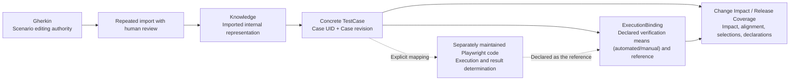
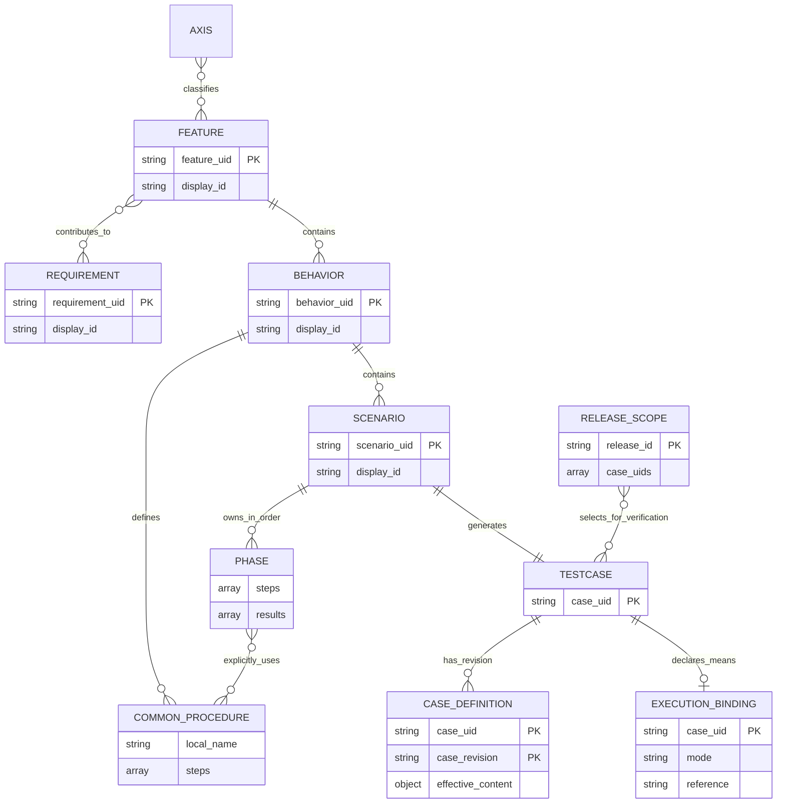
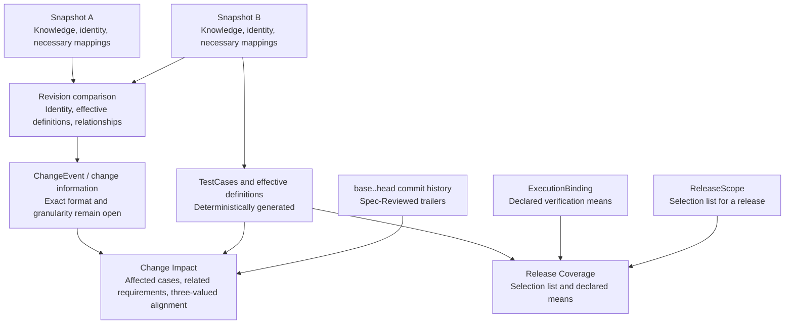

# A Git-Native Model for Test Knowledge Management

### A Version-Aware Model for Git-Native Test Knowledge Management

**Positioning**: This paper presents the design and evaluation plan that starts from [ADR 0017](./decisions/0017-scenario-case-revision-and-execution-evidence.md) and was revised by [ADR 0019](./decisions/0019-alignment-check-commit-trailer.md)-[ADR 0026](./decisions/0026-module-inventory-and-plan-removal.md). All body text, diagrams, and examples describe that adopted model. Knowledge, deterministic generation, identity, and revision comparison are implemented, as are alignment checking, declaration of verification means, and release selection. Import tests, performance measurements, and human-subject evaluation remain incomplete, so this is not a report of demonstrated effectiveness. Chapters 4 and 7 identify open decisions. Discussion of the previous model is limited to the short history in Appendix A.

## 1. Introduction

### 1.1 Motivation and scope

When test definitions change, executors need to determine what changed, whether the requirement and the case were confirmed to still agree after that change, and what the target release selected for verification and by which means each selection is verified. Combining display names, storage locations, and procedure content in one identifier or revision can fragment history after renames or confuse one definition with another.

This model derives concrete cases from test knowledge and separates identity, verification-content revision, and the declaration of verification means. markharness manages test cases, detects changes across revisions, checks alignment between requirements and cases, and holds declarations of verification means and release selections. It does not store execution results (pass/fail/skip), target builds, or execution environments ([ADR 0020](./decisions/0020-execution-status-lightweight-model.md)). Execution code is authored and maintained separately; external tools or human executors perform tests and determine final results.

**Figure 1: Intended ongoing workflow**



The dotted line does not mean code generation. Mapping code to a case does not prove that the code correctly implements its content. An `ExecutionBinding` is a declaration of verification means, neither a record that the case ran nor evidence that it passed.

### 1.2 Research question

> RQ1: Does a test-knowledge model with explicit revisions and change relationships improve accuracy and completion time for identifying change impact, especially across multiple generations, compared with the target organization's actual composite workflow?

RQ1 remains an unverified hypothesis. Differences in case definitions are not the same as semantic impact from requirement or implementation changes. Evaluation asks whether information from the model assists human judgment, without assuming complete automatic detection of the latter.

### 1.3 Design contribution and boundaries

The combination to be evaluated comprises:

1. Separating mutable display IDs from immutable UIDs, making case identity independent of placement and the set of observations.
2. Deterministically generating effective TestCases from structured Scenarios and explicitly referenced common procedures.
3. Separating Git OIDs for stored content from Case revisions for verification content.
4. Connecting changes between fixed snapshots to alignment confirmations recorded in commit history.
5. Retaining external authoring and execution tools while fixing inputs needed for internal historical judgments in Git.

The paper does not claim that individual elements or their combination are unprecedented. Systematic comparison, implementation correctness checks, and evaluation of practical effectiveness for the new model remain outstanding.

### 1.4 Meaning of Git-native

Git stores internal data needed for historical comparison and alignment checking, without requiring a dedicated server or an authoritative database outside Git. Identity declarations, imported Knowledge, necessary mappings, fixed effective definitions, declarations of verification means, release selection lists, and the `base..head` commit history support this reproducibility. Caches and search indexes are derived and must be reconstructible after deletion.

Gherkin and execution code may reside in other repositories. Internal historical judgments must not depend on current external-service values. This does not guarantee that cloning alone reproduces the complete original report or Playwright environment. Implementation design will specify audit data and external references.

## 2. Related Work and Positioning

### 2.1 Content fingerprints and relationship tracking

Doorstop compares item fingerprints with reviewed fingerprints and uses reviewed target fingerprints to detect linked-item changes. Content-derived revisions and detection of changes in linked artifacts are therefore not positioned as inventions unique to this model. The evaluation target here is the relationship between expanded case definitions and alignment confirmations against requirement changes. [Doorstop Item Reference](https://doorstop.readthedocs.io/en/v2.0/reference/item/)

### 2.2 Requirement documents and test knowledge

StrictDoc handles requirement documents, requirement relationships, and custom fields. These differ from storage ownership. A markharness Requirement–Feature relationship means contribution to realization; StrictDoc requirement relationships cannot necessarily be imported with that same meaning. The preservation scope beyond requirement text remains open. [StrictDoc User Guide](https://strictdoc.readthedocs.io/en/stable/stable/docs/strictdoc_01_user_guide.html)

### 2.3 Integration with executable specifications

Gherkin includes Scenario steps, Background, Rule, Scenario Outline / Examples, tables, and multiline arguments. A markharness Scenario represents one concrete case, so not every Gherkin construct maps one-to-one. Import requires meaning-preserving conversion rules and human review. [Gherkin Reference](https://cucumber.io/docs/gherkin/reference/)

### 2.4 Limits of comparison

This chapter records relationships checked against those primary sources, not an exhaustive tool comparison or systematic review. It does not claim that existing TMSs lack versioning or traceability. Evaluation must investigate the tools actually used by the target organization and report results against that workflow. Comparison tables for the previous model are not evidence of superiority for this model.

## 3. Model Design

### 3.1 Knowledge structure and ER diagram

A Requirement states a required outcome; a Feature groups functionality. Store Features independently and associate them equally with multiple Requirements through `requirement_uids`. The Feature owns the relationship; reverse lists are derived. Requirement axes are not automatically inherited by Features.

A Behavior groups related Scenarios and common procedures. A Scenario owns ordered Phases. A Phase is a value containing operations and expected observations, without an independent UID or lifecycle. This decision also does not justify registering common procedures in an independent identity registry.

**Figure 2: Conceptual ER diagram of the adopted model**



This diagram expresses conceptual relationships, not storage tables, final field types, or mandatory fields. Phases are addressed by their position in a Scenario array; `local_name` illustrates a Behavior-local reference name. Only procedures in the owning Behavior may be referenced. Relationship lines cannot represent call count or order; the Phase steps array retains both.

CASE_DEFINITION is a fixed definition identified by Case UID and Case revision together, not a new logical TESTCASE identity. EXECUTION_BINDING declares a verification means rather than recording an execution, and has nowhere to put a result, a timestamp, a target build, or an environment ([ADR 0020](./decisions/0020-execution-status-lightweight-model.md), [ADR 0025](./decisions/0025-v2-forward-compatible-evolution.md)). RELEASE_SCOPE holds only the selection, with no selection date, chooser, approval state, or result ([ADR 0024](./decisions/0024-release-scope-selection-list.md)). Validation such as empty Phases remains open. Section 3.5 shows ChangeEvent and snapshot relationships without inventing their undecided storage schemas in this ER diagram.

### 3.2 Common procedures and deterministic generation

Scenarios explicitly use common procedures at the required positions. Behavior procedures are not automatically prepended. Common procedures cannot call other common procedures. Generation resolves references, expands operations, and preserves array order.

The following illustrates meaning, not an executable example of the current schema.

```yaml
# Definitions inside a Behavior
procedures:
  login:
    steps:
      - Enter credentials
      - Press the login button

# Definitions inside a Scenario
phases:
  - steps:
      - use: login
    results:
      - The account page is displayed
  - steps:
      - action: Log out
      - use: login
    results:
      - The account page is displayed again
```

A common-procedure change affects referencing cases whose effective content changes. Missing or ambiguous references must not be treated as successful generation with omitted operations. The design does not add a generic mechanism for externally managed procedures.

### 3.3 Logical identity and revision

1 Scenario = 1 TestCase is the definitive contract. Case UID is deterministically derived from Scenario UID with distinct typing, not randomly issued on each generation. Distinguish display IDs, FeatureUid, ScenarioUid, CaseUid, and revision references; never substitute display IDs as keys for declarations of verification means or release selections.

| Operation | Identity |
|---|---|
| Rename, move, revise operations or observations | Preserve Scenario / Case UID |
| Copy as a distinct test | New UID |
| Extract part into another Scenario | Preserve original; new identity for extracted Scenario |
| Retire original and split into several | New identities for all replacements |
| Retire several and merge into one | New identity for replacement |

Editors or explicit external mappings identify continuity; do not infer it from textual similarity. Record split/merge derivation without transferring declarations, selections, or alignment confirmations to new cases. The derivation record format remains open.

Retain the identity declaration, determinism, and recovery safety of [ADR 0013](./decisions/0013-immutable-identity-model.md). Identity operations are limited to issuance, rename, and resolution. Retirement, restoration, id reservation, and reissue were removed by [ADR 0021](./decisions/0021-identity-retire-simplification.md) - retirement is expressed by deletion from Knowledge plus Git history, never held as identity state.

### 3.4 Stored-content and verification-content revisions

Git OIDs audit stored content; Case revisions identify effective verification content.

| Changed input | Case revision |
|---|---|
| Preconditions, setup, operations, observations, test data | Changes when effective content changes |
| Adding, removing, reordering Phases | Changes when effective content or order changes |
| Explicitly referenced common procedure | Changes for cases with different expanded content |
| Name, description, implementation note, provenance | Unchanged |
| Classification tags, requirement relationships | Unchanged; handled as relationship changes |
| Ownership move | Changes when effective content changes |
| Target build, execution environment | Not held by markharness ([ADR 0020](./decisions/0020-execution-status-lightweight-model.md)) |

Require identical effective definitions and revisions from the same snapshot and generation/canonicalization rules. Exact canonicalization, hashing, and rule identification remain open. Unsupported rule comparisons must not silently compare equal. Hash equality does not prove semantic equivalence of natural-language statements.

Execution requirements belong in preconditions, operations, or observations, not only descriptions. Persist definitions used for execution in Git as immutable records per Case UID + Case revision, shared across executions. Keep non-revision display data and source-snapshot audit information separate; do not overwrite a definition under the same key.

### 3.5 Snapshot comparison, ChangeEvents, and Change Impact

Comparison between fixed snapshots, selected through milestone tags or other references, underpins revision-aware tracking. Fix the Knowledge, identity declarations, and external mappings required by comparison in the selected snapshots. Alignment checking takes the `base..head` commit history as input and must not change with current external-service values or cache availability. When that history cannot be read (a shallow clone, for example), fail with a diagnostic rather than reading missing history as "confirmed".

**Figure 3: Authorities and derived information**



ChangeEvents represent changes; Change Impact reports impact and alignment across a base/head range; Release Coverage lists selections and declared means for one release. VerificationPlan and evidence-applicability judgment were removed by [ADR 0020](./decisions/0020-execution-status-lightweight-model.md) and [ADR 0026](./decisions/0026-module-inventory-and-plan-removal.md). CanonicalSnapshot is the intermediate representation of the external-report ingestion path (`import`) and does not become a second procedure-editing authority. Arrows express logical inputs, not decided APIs or automatic candidate-selection algorithms.

Effective-input changes must reach case revision detection. However, case revision differences alone cannot detect semantic impact when requirements change but procedures have not yet been updated. Separate reconsideration candidates caused by requirement/relationship changes from cases whose definitions actually changed. Specify connections between Feature changes and case differences, relationship-based selection, and cross-generation queries before implementation.

Recording every intermediate edit as an event or introducing a persistent Version DAG has not been decided. Keep comparison of two snapshots distinct from commit-history analysis for branch/merge audits.

### 3.6 Declared verification means, and why results are not stored

markharness does not store execution results (pass/fail/skip), target builds, or execution environments ([ADR 0020](./decisions/0020-execution-status-lightweight-model.md)). What it holds per TestCase is an `ExecutionBinding`: a Case UID, a verification `mode` (automated / manual), and an optional reference such as a path to test code or a URL for a manual procedure. Per release, a `ReleaseScope` holds only what that release chose to verify ([ADR 0024](./decisions/0024-release-scope-selection-list.md)).

| Record | What it may be read to mean | What it must never be read to mean |
|---|---|---|
| An `ExecutionBinding` exists | The means of verifying that case is declared | It ran; it passed |
| No `ExecutionBinding` exists | No means is declared yet | It failed; it is out of scope |
| A Case UID is in a `ReleaseScope` | The release chose it for verification | It ran; it passed |

Declarations and facts are separate types because keeping them in one record lets a merely declared state be read as verified. Neither record carries a timestamp, so a question about a past point in time is addressed by Git ref (`--at`).

External systems own execution, retries, aggregation, and final results. markharness has no Run/Attempt model, no flaky-test adjudication, and no evidence-applicability judgment (matching case revision, target build, and environment). When facts about execution are actually needed, they are added as a separate type rather than by reinterpreting `ExecutionBinding` ([ADR 0025](./decisions/0025-v2-forward-compatible-evolution.md)).

### 3.7 Storage units and reconstruction

An `ExecutionBinding` is one file per Case UID and a `ReleaseScope` one file per release, both under Git. The file name and the identifier inside the file (`case_uid` / `release_id`) must agree; a record where they disagree is rejected rather than read. Because a `release_id` becomes a single path component, a value that could cross a directory boundary is rejected before anything is written. External-report ingestion (`import`) retains references to original reports and prevents duplicate imports.

Reconstruct search indexes and caches from authoritative data. Stored effective definitions are immutable records, distinct from regenerating current displays.

### 3.8 Settled Design and Open Contracts

Settled decisions include separating ownership from relationships, Scenario ownership of Phases, explicit common-procedure references, case identity, revision input fields, the separation of declarations from facts, the three-valued alignment check and the range over which a confirmation holds, release-selection responsibilities, and the split from external authoring/execution. Chapter 3 diagrams express these conceptual decisions.

Canonicalization and type details, empty-array validation, the exact ChangeEvent format and granularity, cross-generation query rules, and import update rules remain open. Do not treat every implementable specification as complete before resolving them.

## 4. Implementation Plan

### 4.1 Status and implementation slices

Slices 1-4 below are implemented ([ADR 0026](./decisions/0026-module-inventory-and-plan-removal.md)). Historical implementation reports for the previous model still do not establish this model's correctness. Track design and implementation under [Issue #40](https://github.com/markharness/markharness/issues/40) in these slices:

1. Specify typed references, input validation, revisions, and authorities. The Feature reference fix in [Issue #41](https://github.com/markharness/markharness/issues/41) follows the shared contract without waiting for the entire redesign.
2. Align Knowledge, common procedures, Scenarios, and generation.
3. Implement Case revision, change detection, immutable effective definitions, and derived models.
4. Implement declared verification means (`ExecutionBinding`), release selection lists (`ReleaseScope`), and commit-trailer alignment checking. Execution records are not stored and evidence applicability is not judged.
5. Implement and verify ongoing imports using actual external inputs (not yet done).

### 4.2 Ongoing Gherkin / Playwright imports

For Gherkin-derived cases, Gherkin is the editing authority; do not edit imported procedures independently. Knowledge is authoritative for native cases. Maintain one authoritative external-Scenario-to-internal-UID mapping, using external information where available and otherwise a Git-managed explicit mapping. Do not infer continuity solely from names, paths, or line numbers.

Playwright code is separately maintained. On the markharness side, an `ExecutionBinding`'s `reference` declares which code corresponds to a case; results are not imported at all. A declaration must never be read as "executed" or "passed", and whether the referenced code actually verifies that case is outside what markharness can check.

Expanding Scenario Outline rows into concrete Scenarios is a possible approach, not an adopted conversion rule. Decide row identity during reimport, deletion, split/merge, Data Tables / Doc Strings, Rule / Background scope, and tags using concrete examples. Parsing input is distinct from converting it without semantic loss. Report unrepresentable information to the human rather than silently dropping it.

### 4.3 Format changes and historical data

Earlier schemas and data are treated as never having existed ([ADR 0026](./decisions/0026-module-inventory-and-plan-removal.md) §7). Do not add old-format readers, compatibility layers, migration/conversion, or diagnostics that name old data; validate input against the new schema. Each record kind's `schema_version` is fixed at `1` and is never bumped: it is not a compatibility mechanism for reading the past but a forward contract that keeps a future record kind from being mistaken for this one ([ADR 0025](./decisions/0025-v2-forward-compatible-evolution.md)). Case revision tracks content and is a separate concept.

Recomputing changes from historical snapshots in a supported format is not legacy conversion. Arbitrary existing-repository support and large-scale backfill performance are not guaranteed. Reconsider computation scope, cache keys, and resumption against the new contract.

### 4.4 Verification examples

Implementation must cover successful and failing paths for:

- UID continuity across rename, move, and repeated import; rejection of ambiguous external mappings.
- Revision changes for operations, observations, order, and common procedures; unchanged revisions for description-only edits.
- New identities after split/merge without inheriting declarations, selections, or alignment confirmations.
- Never reporting the presence of an `ExecutionBinding` / `ReleaseScope` as a result, and rejecting corrupted records and records whose file name and identifier disagree.
- The range over which an alignment confirmation holds: never mistaking a mention in the body for a trailer, invalidating a confirmation once either side of the pair changes in a later commit, and never reading missing history as "confirmed".
- Duplicate imports, concurrent recording, interruption, preservation, and recovery.
- Fixed-input recomputation, cache equivalence, and a query about a past ref never changing with today's working tree.

## 5. Empirical Evaluation Plan (Not Yet Conducted)

### 5.1 Comparator and tasks

Use the organization's actual composite workflow as the control and a tool implementing the new model as the experimental condition. Do not choose a convenient single-tool control. Distinguish identification of definition changes from semantic impact identification in the tasks.

Stratify tasks into shallow changes within the latest release and deep changes across multiple generations. Use deep-stratum accuracy (precision/recall) as the primary outcome and completion time and subjective workload as secondary outcomes. Treat unfamiliarity with the new tool as a confounder; record practice, experience, and project familiarity.

### 5.2 Ground truth

Construct candidates from requirement changes, PRs, execution code, CI records, and contemporaneous case lists. Co-change is supporting evidence; bulk regeneration alone is not ground truth. Examine semantic relevance for whitespace edits, bulk renames, and similar candidates.

Independent experts judge candidates and may add affected cases outside the initial set. Do not define correctness through markharness generation relationships or Case revision equality. Report inter-rater agreement, indeterminate cases, and limits from impacts absent from preserved artifacts.

### 5.3 Conditions and measures

Fix the model, candidate-selection rules, input formats, and tasks before experimentation. After a pilot, plan sample size from effect size, variance, power, significance, and attrition; preregister analysis. Record candidate counts, Scenarios per Feature, common-procedure reach, import delay, and unresolved mappings to support interpretation.

Verify the three-valued alignment check and missed-selection detection through functional tests. Evaluate RQ1's human decision-support effects separately from storage, generation-time, and search-time measurements. This paper reports no measurements.

## 6. Threats to Validity

- **Construct validity**: Definition differences are not complete semantic impact. Requirement changes without procedure updates and external-code mismatches may escape detection.
- **Internal validity**: UI, learning time, explicit mapping, and the added effort of declaring verification means, recording release selections, and writing alignment trailers may affect results.
- **Input trust**: markharness cannot verify that an `ExecutionBinding`'s reference really verifies that case, nor that a `Spec-Reviewed` trailer reflects a real semantic review. Neither declarations nor confirmations guarantee semantic correctness of test implementations.
- **External validity**: Do not generalize results from one organization, Gherkin convention, or runner.
- **Canonicalization and storage**: Investigate exclusion of meaningful changes, omitted dependencies, and growth of fixed definitions.
- **Scope of implementation**: That a feature is implemented is not proof of concurrent-write correctness, crash recovery, practical performance, or RQ1's effect.

## 7. Future Work

- Resolve ADR 0017's remaining open decisions and complete functional verification.
- Connect ChangeEvents to case revision differences and requirement-relationship changes, and verify cross-generation queries.
- Verify ongoing Gherkin imports using real rename, deletion, and Examples changes.
- Decide preservation of StrictDoc requirement relationships and custom fields.
- Verify Case revision canonicalization, storage units, deduplication, correction/recovery, and cache reconstruction.
- Evaluate RQ1 against actual composite workflows and measure large-data performance and operational effort.
- Design an Execution Fact as a type separate from `ExecutionBinding`, once facts about execution are actually needed.

An execution engine, Playwright code generation, independent retry adjudication, and lossless bidirectional synchronization of all external formats are outside the adopted design.

## 8. Conclusion

This paper proposes using Scenario as the concrete-case unit and separating immutable Case UID, effective-content Case revision, definitions fixed in Git, and declarations of verification means kept apart from facts about execution. Gherkin and Playwright remain responsible for authoring and execution respectively; markharness manages cases, detects changes, checks alignment between requirements and cases, and lists release selections and declared means.

ADR 0017 and ADR 0019-0026 record the adopted design. The core features are implemented but evaluation is incomplete, so improved accuracy/time, complete import compatibility, and performance superiority cannot be concluded. Resolve the remaining open contracts and carry out Chapter 4's functional verification and Chapter 5's evaluation plan next.

## Appendix A: Decision History

The previous model used five levels below Requirements, separate Condition / ExpectedResult entities, case identity derived from contributing UID sets, and Feature-tree-SHA-centered revision matching. ADR 0017 replaces these to clarify continuity across revisions, verification-content versions, and external authoring/execution responsibilities. See [ADR 0013](./decisions/0013-immutable-identity-model.md), [0014](./decisions/0014-knowledge-schema-version-persistence.md), [0015](./decisions/0015-behavior-step-model.md), [0016](./decisions/0016-behavior-condition-precondition-step-result-model.md), and Git history for earlier decisions and implementation reports.

Evidence storage, VerificationPlan, and evidence-applicability judgment, as placed by ADR 0017, were removed by [ADR 0020](./decisions/0020-execution-status-lightweight-model.md), [ADR 0024](./decisions/0024-release-scope-selection-list.md), and [ADR 0026](./decisions/0026-module-inventory-and-plan-removal.md). Storing execution results is the responsibility of external tools; what markharness keeps is declarations of verification means, release selections, and alignment confirmations between requirements and cases. Identity retirement, restoration, id reservation, and reissue were likewise removed by [ADR 0021](./decisions/0021-identity-retire-simplification.md).

The previously rejected custom hash duplicating Git's identification of stored content serves a different purpose from Case revision. Do not cite previous implementation test successes or measurements as validation of this model.

## References

- [ADR 0017: Adopted design and open decisions](./decisions/0017-scenario-case-revision-and-execution-evidence.md)
- [ADR 0019: Alignment check and the commit trailer](./decisions/0019-alignment-check-commit-trailer.md)
- [ADR 0020: Lightweight execution-status model](./decisions/0020-execution-status-lightweight-model.md)
- [ADR 0024: Release scope as a selection list](./decisions/0024-release-scope-selection-list.md)
- [ADR 0026: Module inventory and the no-backward-compatibility rule](./decisions/0026-module-inventory-and-plan-removal.md)
- [Issue #40: Design discussion](https://github.com/markharness/markharness/issues/40)
- [Doorstop: Item Reference](https://doorstop.readthedocs.io/en/v2.0/reference/item/)
- [StrictDoc: User Guide](https://strictdoc.readthedocs.io/en/stable/stable/docs/strictdoc_01_user_guide.html)
- [Cucumber: Gherkin Reference](https://cucumber.io/docs/gherkin/reference/)

## Changelog

- 2026-09-12: Aligned with the implementation of ADR 0019-0026. Evidence storage, VerificationPlan, and evidence-applicability judgment were removed from the text and replaced by `ExecutionBinding` (declared verification means), `ReleaseScope` (release selection list), and alignment checking through the `Spec-Reviewed` trailer. Figure 1, the ER diagram (Figure 2), the derived-information diagram (Figure 3), the identity retirement/restoration text, the storage units, the implementation status, and the no-backward-compatibility rule were updated accordingly.
