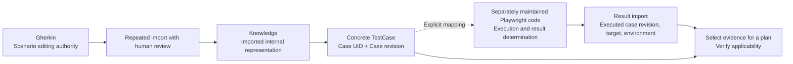
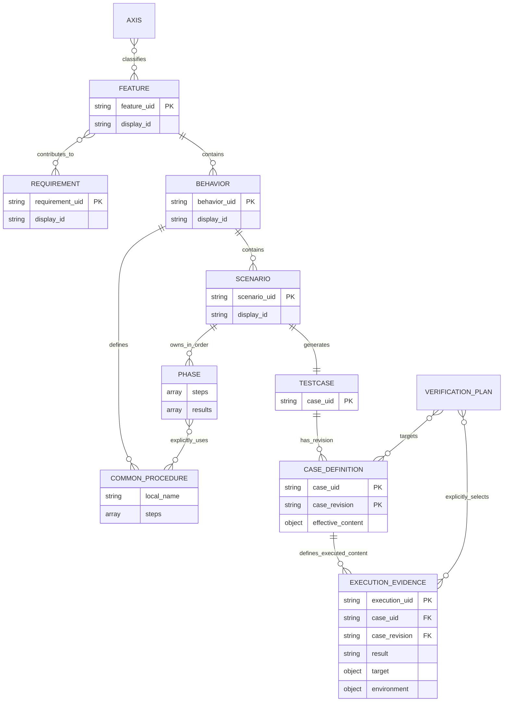
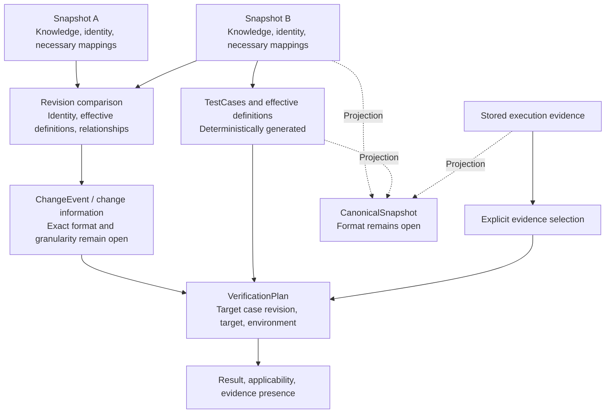

# A Git-Native Model for Test Knowledge Management

### A Version-Aware Model for Git-Native Test Knowledge Management

**Positioning**: This paper presents the design and evaluation plan based on [ADR 0017](./decisions/0017-scenario-case-revision-and-execution-evidence.md). All body text, diagrams, and examples describe that adopted model. The design is agreed, but implementation, import tests, performance measurements, and human-subject evaluation of the new model are incomplete. This is not a report of demonstrated effectiveness. Chapters 4 and 7 identify open decisions. Discussion of the previous model is limited to the short history in Appendix A.

## 1. Introduction

### 1.1 Motivation and scope

When test definitions change, executors need to determine what changed, which definition an existing result refers to, and whether evidence applies to the target release. Combining display names, storage locations, procedure content, and tested builds in one identifier or revision can fragment history after renames or misassociate results with different definitions and targets.

This model derives concrete cases from test knowledge and separates identity, verification-content revision, execution target, and evidence applicability. markharness manages test cases, detects changes across revisions, and associates execution evidence. Execution code is authored and maintained separately; external tools or human executors perform tests and determine final results.

**Figure 1: Intended ongoing workflow**



The dotted line does not mean code generation. Mapping code to a case does not prove that the code correctly implements its content.

### 1.2 Research question

> RQ1: Does a test-knowledge model with explicit revisions and change relationships improve accuracy and completion time for identifying change impact, especially across multiple generations, compared with the target organization's actual composite workflow?

RQ1 remains an unverified hypothesis. Differences in case definitions are not the same as semantic impact from requirement or implementation changes. Evaluation asks whether information from the model assists human judgment, without assuming complete automatic detection of the latter.

### 1.3 Design contribution and boundaries

The combination to be evaluated comprises:

1. Separating mutable display IDs from immutable UIDs, making case identity independent of placement and the set of observations.
2. Deterministically generating effective TestCases from structured Scenarios and explicitly referenced common procedures.
3. Separating Git OIDs for stored content from Case revisions for verification content.
4. Connecting changes between fixed snapshots to evidence carrying case revision, target, and environment.
5. Retaining external authoring and execution tools while fixing inputs needed for internal historical judgments in Git.

The paper does not claim that individual elements or their combination are unprecedented. Systematic comparison, implementation correctness checks, and evaluation of practical effectiveness for the new model remain outstanding.

### 1.4 Meaning of Git-native

Git stores internal data needed for historical comparison and evidence applicability judgments, without requiring a dedicated server or an authoritative database outside Git. Identity declarations, imported Knowledge, necessary mappings, fixed effective definitions, and selected execution records support this reproducibility. Caches and search indexes are derived and must be reconstructible after deletion.

Gherkin and execution code may reside in other repositories. Internal historical judgments must not depend on current external-service values. This does not guarantee that cloning alone reproduces the complete original report or Playwright environment. Implementation design will specify audit data and external references.

## 2. Related Work and Positioning

### 2.1 Content fingerprints and relationship tracking

Doorstop compares item fingerprints with reviewed fingerprints and uses reviewed target fingerprints to detect linked-item changes. Content-derived revisions and detection of changes in linked artifacts are therefore not positioned as inventions unique to this model. The evaluation target here is the relationship between expanded case definitions and the executed case revision, target, and environment. [Doorstop Item Reference](https://doorstop.readthedocs.io/en/v2.0/reference/item/)

### 2.2 Requirement documents and test knowledge

StrictDoc handles requirement documents, requirement relationships, and custom fields. These differ from storage ownership. A markharness Requirement–Feature relationship means contribution to realization; StrictDoc requirement relationships cannot necessarily be imported with that same meaning. The preservation scope beyond requirement text remains open. [StrictDoc User Guide](https://strictdoc.readthedocs.io/en/stable/stable/docs/strictdoc_01_user_guide.html)

### 2.3 Integration with executable specifications

Gherkin includes Scenario steps, Background, Rule, Scenario Outline / Examples, tables, and multiline arguments. A markharness Scenario represents one concrete case, so not every Gherkin construct maps one-to-one. Import requires meaning-preserving conversion rules and human review. [Gherkin Reference](https://cucumber.io/docs/gherkin/reference/)

### 2.4 Limits of comparison

This chapter records relationships checked against those primary sources, not an exhaustive tool comparison or systematic review. It does not claim that existing TMSs lack versioning or traceability. Evaluation must investigate the tools actually used by the target organization and report results against that workflow. Comparison tables for the previous model are not evidence of superiority for this model.

## 3. Model Design

### 3.1 Knowledge structure and ER diagram

A Requirement states a required outcome; a Feature groups functionality. Store Features independently and associate them equally with multiple Requirements through `requirement_uids`. The Feature owns the relationship; reverse lists are derived. Requirement axes are not automatically inherited by Features.

A Behavior groups related Scenarios and common procedures. A Scenario owns ordered Phases. A Phase is a value containing operations and expected observations, without an independent UID or lifecycle. This decision also does not justify registering common procedures in an independent identity registry.

**Figure 2: Conceptual ER diagram of the adopted model**



This diagram expresses conceptual relationships, not storage tables, final field types, or mandatory fields. Phases are addressed by their position in a Scenario array; `local_name` illustrates a Behavior-local reference name. Only procedures in the owning Behavior may be referenced. Relationship lines cannot represent call count or order; the Phase steps array retains both.

CASE_DEFINITION is a fixed definition identified by Case UID and Case revision together, not a new logical TESTCASE identity. Target/environment formats, plan-specific mandatory fields, and validation such as empty Phases remain open. Section 3.5 shows ChangeEvent, snapshot, and CanonicalSnapshot relationships without inventing their undecided storage schemas in this ER diagram.

### 3.2 Common procedures and deterministic generation

Scenarios explicitly use common procedures at the required positions. Behavior procedures are not automatically prepended. Common procedures cannot call other common procedures. Generation resolves references, expands operations, and preserves array order.

The following illustrates meaning, not an executable example of the current schema.

```yaml
# Definitions inside a Behavior
procedures:
  login:
    steps:
      - Enter credentials
      - Press the login button

# Definitions inside a Scenario
phases:
  - steps:
      - use: login
    results:
      - The account page is displayed
  - steps:
      - action: Log out
      - use: login
    results:
      - The account page is displayed again
```

A common-procedure change affects referencing cases whose effective content changes. Missing or ambiguous references must not be treated as successful generation with omitted operations. The design does not add a generic mechanism for externally managed procedures.

### 3.3 Logical identity and revision

1 Scenario = 1 TestCase is the definitive contract. Case UID is deterministically derived from Scenario UID with distinct typing, not randomly issued on each generation. Distinguish display IDs, FeatureUid, ScenarioUid, CaseUid, ExecutionUid, and revision references; never substitute display IDs for evidence matching keys.

| Operation | Identity |
|---|---|
| Rename, move, revise operations or observations | Preserve Scenario / Case UID |
| Copy as a distinct test | New UID |
| Extract part into another Scenario | Preserve original; new identity for extracted Scenario |
| Retire original and split into several | New identities for all replacements |
| Retire several and merge into one | New identity for replacement |

Editors or explicit external mappings identify continuity; do not infer it from textual similarity. Record split/merge derivation without transferring passing evidence to new cases. The derivation record format remains open.

Retain the identity declaration, determinism, and recovery safety of [ADR 0013](./decisions/0013-immutable-identity-model.md). Implementation design will specify issuance, retirement, restoration, and other operations for the new entity structure.

### 3.4 Stored-content and verification-content revisions

Git OIDs audit stored content; Case revisions identify effective verification content.

| Changed input | Case revision |
|---|---|
| Preconditions, setup, operations, observations, test data | Changes when effective content changes |
| Adding, removing, reordering Phases | Changes when effective content or order changes |
| Explicitly referenced common procedure | Changes for cases with different expanded content |
| Name, description, implementation note, provenance | Unchanged |
| Classification tags, requirement relationships | Unchanged; handled as plan or relationship changes |
| Ownership move | Changes when effective content changes |
| Target build, execution environment | Matched in evidence separately from case revision |

Require identical effective definitions and revisions from the same snapshot and generation/canonicalization rules. Exact canonicalization, hashing, and rule identification remain open. Unsupported rule comparisons must not silently compare equal. Hash equality does not prove semantic equivalence of natural-language statements.

Execution requirements belong in preconditions, operations, or observations, not only descriptions. Persist definitions used for execution in Git as immutable records per Case UID + Case revision, shared across executions. Keep non-revision display data and source-snapshot audit information separate; do not overwrite a definition under the same key.

### 3.5 Snapshot comparison, ChangeEvents, and plans

Comparison between fixed snapshots, selected through milestone tags or other references, underpins revision-aware tracking. Fix the Knowledge, identity declarations, and external mappings required by comparison in the selected snapshots. Evidence judgments use selected records and must not change with current external-service values or cache availability.

**Figure 3: Authorities and derived information**



ChangeEvents represent changes; VerificationPlans specify targets and selected evidence. CanonicalSnapshot projects internal knowledge, generated artifacts, and evidence for integration without becoming a second procedure-editing authority. Arrows express logical inputs, not decided APIs or automatic candidate-selection algorithms.

Effective-input changes must reach case revision detection. However, case revision differences alone cannot detect semantic impact when requirements change but procedures have not yet been updated. Separate reconsideration candidates caused by requirement/relationship changes from cases whose definitions actually changed. Specify connections between Feature changes and case differences, relationship-based selection, and cross-generation queries before implementation.

Recording every intermediate edit as an event or introducing a persistent Version DAG has not been decided. Keep comparison of two snapshots distinct from commit-history analysis for branch/merge audits.

### 3.6 Execution results and evidence applicability

Separate execution result (pass/fail/skip), applicability, and evidence presence. A plan explicitly selects execution records; evidence applies only when Case UID, Case revision, target build, and required environment match.

| Record and target plan | Meaning |
|---|---|
| Selected pass matches every condition | Usable as passing evidence for the target case |
| Selected fail matches every condition | Retained as failure for the target case |
| Pass refers to a different case revision or build | Retain the historical pass, but do not use it to establish this plan's pass |
| Unknown target/environment, unresolved reference, corrupted record | Cannot establish a pass |
| Skip or no record | Not a pass |

The table describes individual-case applicability. Final plan aggregation, status names, and exit codes remain open. Distinguish executed from passed; do not replace historical failures with stale. Do not overwrite or prioritize independent results solely by timestamp. Specify correction and conflict operations during implementation design.

External systems own execution, retries, aggregation, and final results. markharness does not add Run/Attempt or flaky-test adjudication and does not independently turn success after retry into failure. Manual records follow the same reference and applicability rules.

### 3.7 Storage units and reconstruction

Execution records are logically independent per case. Split external reports into individual records, retain references to original reports, and prevent duplicate imports. Physical records per file, duplicate keys, atomic imports, and preservation after corruption remain open.

Reconstruct search indexes and caches from authoritative data. Stored effective definitions are immutable evidence, distinct from regenerating current displays. Since the directory layout is undecided, this paper does not present existing CLI storage paths as contracts for the new model.

### 3.8 Settled Design and Open Contracts

Settled decisions include separating ownership from relationships, Scenario ownership of Phases, explicit common-procedure references, case identity, revision input fields, evidence responsibilities, and the split from external authoring/execution. Chapter 3 diagrams express these conceptual decisions.

Canonicalization and type details, empty-array validation, exact ChangeEvent / plan / CanonicalSnapshot formats, target/environment representations, storage/correction/conflict handling, and import update rules remain open. Do not treat every implementable specification as complete before resolving them.

## 4. Implementation Plan

### 4.1 Status and implementation slices

The new model described here is unimplemented. Existing CLI test results and historical implementation reports do not establish its correctness. Track design and implementation under [Issue #40](https://github.com/markharness/markharness/issues/40) in these slices:

1. Specify typed references, input validation, revisions, and authorities. The Feature reference fix in [Issue #41](https://github.com/markharness/markharness/issues/41) follows the shared contract without waiting for the entire redesign.
2. Align Knowledge, common procedures, Scenarios, and generation.
3. Implement Case revision, change detection, immutable effective definitions, and derived models.
4. Align execution records and explicit evidence selection in plans.
5. Implement and verify ongoing imports using actual external inputs.

### 4.2 Ongoing Gherkin / Playwright imports

For Gherkin-derived cases, Gherkin is the editing authority; do not edit imported procedures independently. Knowledge is authoritative for native cases. Maintain one authoritative external-Scenario-to-internal-UID mapping, using external information where available and otherwise a Git-managed explicit mapping. Do not infer continuity solely from names, paths, or line numbers.

Playwright code is separately maintained; the execution side identifies its Case UID / Case revision. Filling in the latest revision during result import could associate evidence with an unexecuted definition, so it is prohibited. Unresolved or ambiguous results are not validated evidence.

Expanding Scenario Outline rows into concrete Scenarios is a possible approach, not an adopted conversion rule. Decide row identity during reimport, deletion, split/merge, Data Tables / Doc Strings, Rule / Background scope, and tags using concrete examples. Parsing input is distinct from converting it without semantic loss. Report unrepresentable information to the human rather than silently dropping it.

### 4.3 Format changes and historical data

During the prototype, replace the model without incrementing format versions. Do not add old-format readers, compatibility layers, migration/conversion, or dedicated legacy detection; validate input against the new schema. Case revision tracks content and is a separate concept.

Recomputing changes from historical snapshots in a supported format is not legacy conversion. Arbitrary existing-repository support and large-scale backfill performance are not guaranteed. Reconsider computation scope, cache keys, and resumption against the new contract.

### 4.4 Verification examples

Implementation must cover successful and failing paths for:

- UID continuity across rename, move, and repeated import; rejection of ambiguous external mappings.
- Revision changes for operations, observations, order, and common procedures; unchanged revisions for description-only edits.
- New identities after split/merge without inheriting passing evidence.
- Old revisions, different builds, unknown environments, skip, missing data, and corruption never establishing a pass.
- Duplicate imports, concurrent recording, interruption, preservation, and recovery.
- Fixed-input recomputation, cache equivalence, and never substituting the current revision for the executed revision.

## 5. Empirical Evaluation Plan (Not Yet Conducted)

### 5.1 Comparator and tasks

Use the organization's actual composite workflow as the control and a tool implementing the new model as the experimental condition. Do not choose a convenient single-tool control. Distinguish identification of definition changes from semantic impact identification in the tasks.

Stratify tasks into shallow changes within the latest release and deep changes across multiple generations. Use deep-stratum accuracy (precision/recall) as the primary outcome and completion time and subjective workload as secondary outcomes. Treat unfamiliarity with the new tool as a confounder; record practice, experience, and project familiarity.

### 5.2 Ground truth

Construct candidates from requirement changes, PRs, execution code, CI records, and contemporaneous case lists. Co-change is supporting evidence; bulk regeneration alone is not ground truth. Examine semantic relevance for whitespace edits, bulk renames, and similar candidates.

Independent experts judge candidates and may add affected cases outside the initial set. Do not define correctness through markharness generation relationships or Case revision equality. Report inter-rater agreement, indeterminate cases, and limits from impacts absent from preserved artifacts.

### 5.3 Conditions and measures

Fix the model, candidate-selection rules, input formats, and tasks before experimentation. After a pilot, plan sample size from effect size, variance, power, significance, and attrition; preregister analysis. Record candidate counts, Scenarios per Feature, common-procedure reach, import delay, and unresolved mappings to support interpretation.

Verify case-revision/target/environment matching through functional tests. Evaluate RQ1's human decision-support effects separately from storage, generation-time, and search-time measurements. This paper reports no measurements.

## 6. Threats to Validity

- **Construct validity**: Definition differences are not complete semantic impact. Requirement changes without procedure updates and external-code mismatches may escape detection.
- **Internal validity**: UI, learning time, explicit mapping, and evidence-selection effort may affect results.
- **Input trust**: Matching alone cannot prove a false case-revision or target declaration from the execution side. Import does not guarantee semantic correctness of test implementations.
- **External validity**: Do not generalize results from one organization, Gherkin convention, or runner.
- **Canonicalization and storage**: Investigate exclusion of meaningful changes, omitted dependencies, growth of fixed definitions, and loss of external reports.
- **Unimplemented design**: Conceptual consistency is not proof of concurrent-write correctness, crash recovery, or practical performance.

## 7. Future Work

- Resolve ADR 0017's open decisions and complete implementation and functional verification.
- Connect ChangeEvents to case revision differences and requirement-relationship changes, and verify cross-generation queries.
- Verify ongoing Gherkin imports and external results using real rename, deletion, and Examples changes.
- Decide preservation of StrictDoc requirement relationships and custom fields.
- Verify Case revision canonicalization, storage units, deduplication, correction/recovery, and cache reconstruction.
- Evaluate RQ1 against actual composite workflows and measure large-data performance and operational effort.
- Establish release-time format versioning after schema stabilization.

An execution engine, Playwright code generation, independent retry adjudication, and lossless bidirectional synchronization of all external formats are outside the adopted design.

## 8. Conclusion

This paper proposes using Scenario as the concrete-case unit and separating immutable Case UID, effective-content Case revision, definitions fixed in Git, and execution evidence bound to target and environment. Gherkin and Playwright remain responsible for authoring and execution respectively; markharness manages cases, detects changes, and verifies evidence applicability.

ADR 0017 records the adopted design. Implementation and evaluation are incomplete, so improved accuracy/time, complete import compatibility, and performance superiority cannot be concluded. Resolve open contracts and carry out Chapter 4's functional verification and Chapter 5's evaluation plan next.

## Appendix A: Decision History

The previous model used five levels below Requirements, separate Condition / ExpectedResult entities, case identity derived from contributing UID sets, and Feature-tree-SHA-centered revision matching. ADR 0017 replaces these to clarify continuity across revisions, verification-content versions, and external authoring/execution responsibilities. See [ADR 0013](./decisions/0013-immutable-identity-model.md), [0014](./decisions/0014-knowledge-schema-version-persistence.md), [0015](./decisions/0015-behavior-step-model.md), [0016](./decisions/0016-behavior-condition-precondition-step-result-model.md), and Git history for earlier decisions and implementation reports.

The previously rejected custom hash duplicating Git's identification of stored content serves a different purpose from Case revision. Do not cite previous implementation test successes or measurements as validation of this model.

## References

- [ADR 0017: Adopted design and open decisions](./decisions/0017-scenario-case-revision-and-execution-evidence.md)
- [Issue #40: Design discussion](https://github.com/markharness/markharness/issues/40)
- [Doorstop: Item Reference](https://doorstop.readthedocs.io/en/v2.0/reference/item/)
- [StrictDoc: User Guide](https://strictdoc.readthedocs.io/en/stable/stable/docs/strictdoc_01_user_guide.html)
- [Cucumber: Gherkin Reference](https://cucumber.io/docs/gherkin/reference/)
