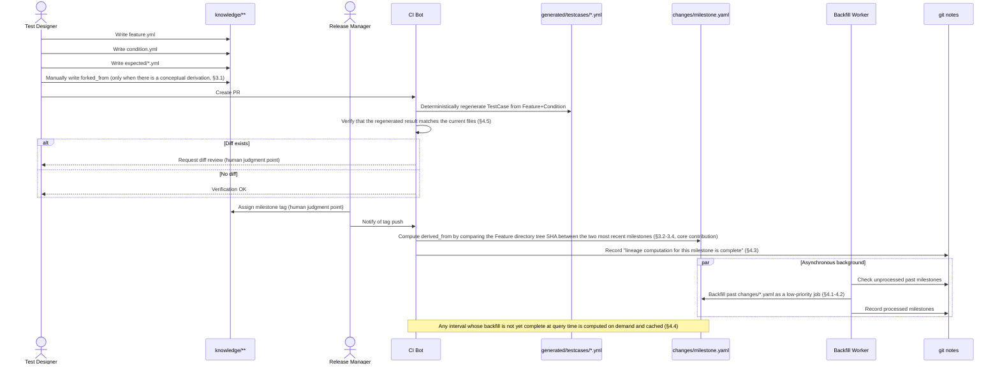
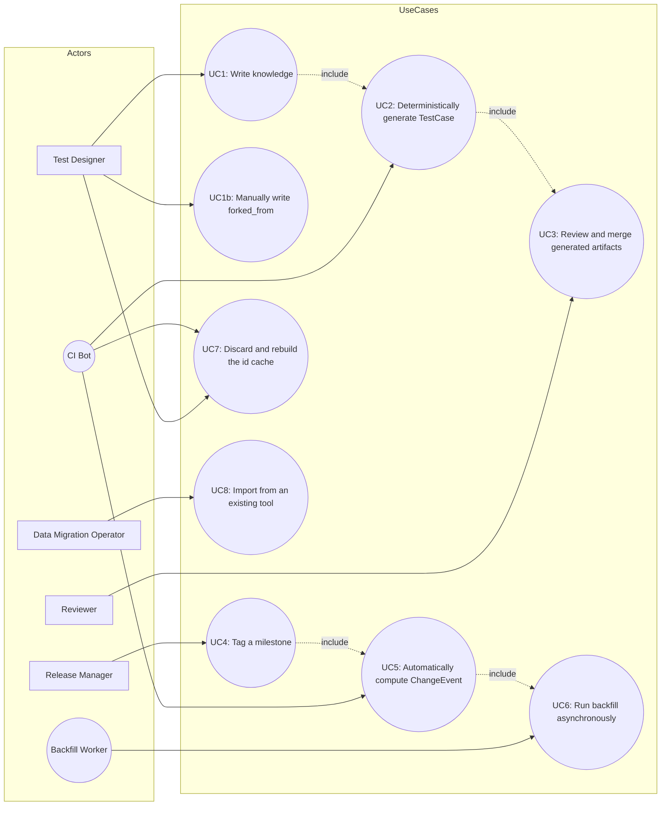

# Product Operation Overview: File Creation Order and Use Cases

**Status**: Draft (a translation of the paper's design into a product operation overview. Some parts, such as the 3 commands under UC5, are already implemented in the CLI)
**Related documents**: [A Git-Native Model for Test Knowledge Management: Integrated Edition](./git-native-model-for-test-knowledge-management.md) (the paper this document translates), [cli-manual.md](./cli-manual.md) (implementation details of the commands corresponding to each UC)

**Positioning**: This document translates the design of the paper "A Git-Native Model for Test Knowledge Management: Integrated Edition" (`git-native-model-for-test-knowledge-management.md`) into the operational picture of actually running it as a product. Where a point is explicitly stated in the body of the paper, the corresponding section and line number are noted; where a point was supplemented for productization, it is explicitly marked "(productization proposal, not stated in the paper body)".

---

## 1. File creation order (sequence diagram)

**Key points of the creation order**

1. `knowledge/**/feature.yml` → `condition.yml` → `expected/*.yml` (manually written by the Test Designer)
2. `generated/testcases/*.yml` (deterministically generated by CI, and verified to match the existing files)
3. Milestone tag (assigned by the Release Manager as a human judgment)
4. `changes/<milestone>.yaml` (CI automatically computes `derived_from`)
5. Progress recorded in `git notes` → delayed backfilling of past milestones (asynchronous, automatic)

## 2. Use case diagram

Since mermaid has no UML use case diagram, actors are represented as nodes and use cases as rounded nodes (a visual substitute).

## 3. Use case descriptions

| #    | Use case                                    | Actor                    | Trigger                                             | Precondition                                | Main flow                                                                                                                                                        | Postcondition                                                     | Human involvement                                                                                          |
| ---- | -------------------------------------------- | ------------------------- | ---------------------------------------------------- | -------------------------------------------- | -------------------------------------------------------------------------------------------------------------------------------------------------------------- | -------------------------------------------------------------------- | ------------------------------------------------------------------------------------------------------------ |
| UC1  | Write knowledge                              | Test Designer              | Addition of a new feature/new condition               | None                                          | Create and commit `feature.yml`/`condition.yml`/`expected/*.yml`                                                                                                 | `knowledge/` is updated                                              | **Manually written** (§3.1, line 108)                                                                        |
| UC1b | Manually write forked_from                   | Test Designer              | A conceptual derivation from another Feature occurs    | The source Feature exists                     | Write the source id into the `forked_from` field                                                                                                                 | Domain knowledge that does not appear in Git history is made explicit | **Mandatory manual entry** (cannot be automatically derived from Git history, line 153)                      |
| UC2  | Deterministically generate TestCase          | CI Bot                     | PR creation/push                                       | `feature.yml`/`condition.yml` exist            | Mechanically scan the Feature+Condition pairs and regenerate `generated/testcases/*.yml`                                                                          | The generated artifacts come to match the latest knowledge            | Automatic (no human intervention). However, the diff-verification result against existing files is presented to a human (§4.5, line 316) |
| UC3  | Review and merge generated artifacts         | Reviewer                   | UC2 complete, diff detected                            | CI has detected a diff                        | Review the diff content, judge whether it is an intended change, and merge                                                                                       | `generated/testcases/*.yml` is finalized and integrated into main     | **Human judgment point**: the final gate that prevents unintended changes from slipping in                   |
| UC4  | Tag a milestone                              | Release Manager            | Release decision                                       | The main branch is stable                     | Run `git tag <milestone>`                                                                                                                                          | The milestone boundary is finalized                                   | **Human judgment point**: the release-timing decision itself (Figure 3)                                      |
| UC5  | Automatically compute ChangeEvent            | CI Bot                     | Tag push                                               | A tag for the immediately preceding milestone exists | Between the two milestones, compare the Feature directory tree SHA for each id resolved via the id resolution, compute `derived_from`, and write it to `changes/<milestone>.yaml` | The version history (ChangeEvent) is generated                        | Automatic (core contribution, §3.2-3.4). `change_type` is not written; a human fills it in afterward, as described in Supplement 6 below |
| UC6  | Run backfill asynchronously                  | Backfill Worker            | UC5 complete, or a query against an unprocessed interval | An unprocessed interval exists in `git notes` | Compute the past lineage starting with priority given to the most recent milestone, recording to `git notes` upon completion of each                              | `changes/*.yaml` for past milestones is filled in incrementally       | Automatic. However, the operator can configure processing-priority adjustments (productization proposal, not stated in the paper body) |
| UC7  | Discard and rebuild the id cache             | Test Designer / CI Bot     | Suspected cache inconsistency                          | An id-resolution cache exists                 | Run the `--no-cache` option or the `rebuild` command                                                                                                              | The cache is rebuilt                                                  | **Explicit manual discard** (fail-safe, line 199)                                                             |
| UC8  | Import from an existing tool                 | Data Migration Operator    | Migration of existing TestRail/Xray/TestLink assets    | An export file has been prepared              | Run the importer to convert to this format (the `knowledge/` structure)                                                                                            | Existing assets are reflected under `knowledge/`                      | **Manual trigger** (the migration work itself is carried out by a human, §4.5)                               |

## 4. Supplement: items out of the paper's scope

- UC2 (automatic TestCase generation) is designed as a tool component in §4.5 of the paper, but as stated on line 63 of the body, its implementation and coverage evaluation are future work, and it is not a subject of this study's empirical experiment (Chapter 5).
- Application to automatic procedure-document generation and context supply via LLMs was fully excluded from scope as a result of the examination in Appendix A. UC1 through UC8 are all either deterministic mechanical processing or explicit human operations, and do not include LLM-based non-deterministic generation.

## 5. Supplement: implementation of "where execution results are recorded" for UC4 (not stated in the paper body, productization proposal)

The main flow of UC4 (running `git tag <milestone>`) itself remains unchanged as a human judgment point, but two commands have been implemented to assist the subsequent mechanical work of "recording execution results into `executions/`" (`docs/cli-manual.md` §1.13/1.14).

- `markharness milestone init <tag>`: creates `executions/<tag>/milestone.yml` corresponding to an existing `git tag`. It only verifies the tag's existence and does not perform the tagging decision itself.
- `markharness execution record <case_id> --milestone <name> --result <pass|fail|skip> --executor <name>`: appends a TestCase execution result to `executions/<milestone>/results.yml` through a common interface, whether triggered from CI or from QA.

## 6. Supplement: the 3 commands accompanying UC5 "Automatically compute ChangeEvent" (productization proposal, not stated in the paper body)

The main flow of UC5 (`markharness changes compute`) itself is unchanged, but three commands have been implemented to assist the parts that §3.2 and §3.5 of the paper position as "entered by a human afterward" or "an auxiliary function for auditing" (`docs/cli-manual.md` §1.15-1.17).

- `markharness changes annotate <event_id> --type <spec-change|bug-fix|refactor|other>`: lets a human set, after the fact, the `change_type` (§3.5) that `changes compute` generates as a blank field. Because it searches across `changes/` by `event_id`, there is no need to know in advance which milestone-interval file the target belongs to.
- `markharness changes lineage --commit <merge-commit-sha>`: an audit-only command that compares the two parents of the specified merge commit against the merge base obtained via `git merge-base`, and determines for each Feature id whether it is linear/a true divergence/equivalent to a single parent (§3.2). It does not write to the main lineage (`changes/*.yaml`) produced by `changes compute`.
- `markharness validate`: structurally validates `knowledge/`/`axes/` against `schema/*.schema.json` (the default set placed by `markharness init`), and additionally checks whether axis tags are registered and whether the reference targets of `forked_from` exist (the implementation of §3.5's "use schema validation to prevent front matter from using values not defined in axes/*.yml").
