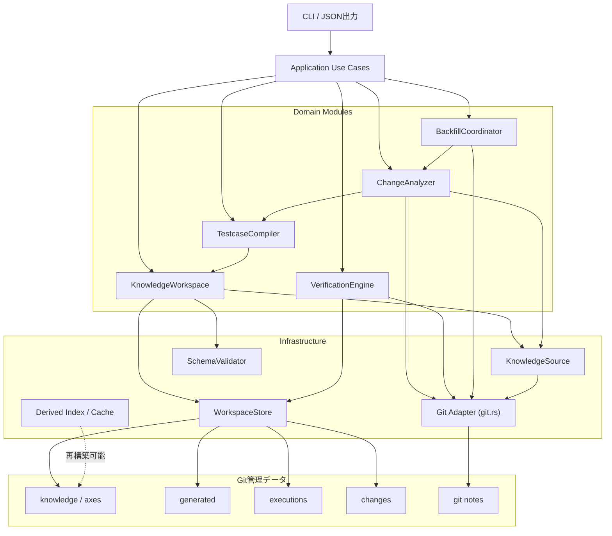

# markharness アーキテクチャ設計:Domain / Application / Infrastructureレイヤー分離

**ステータス**:Accepted(Phase 1〜2実装済み、Phase 3〜5未着手。[decisions/0009](../decisions/0009-domain-application-infrastructure-layering.md)で決定した方向性の詳細設計)
**関連文書**:[decisions/0009](../decisions/0009-domain-application-infrastructure-layering.md)、[decisions/0008](../decisions/0008-verification-plan-product-roadmap.md)、`テスト知識管理のGit-nativeモデル_統合版.md`
**想定読者**:markharnessの実装者(Phase 1着手時に参照する)

**位置づけ**:本書は、markharnessの既存ドキュメントと現在のRust実装を前提として、今後の機能追加・保守性・テスト容易性・大規模リポジトリへの適用を支えるアーキテクチャを整理したものである。Webサーバー・常駐プロセス・正準データベース・マイクロサービスは導入せず、Gitリポジトリを正準な永続化基盤、YAML/JSONを交換形式、CLIおよびCIを利用者向けInterfaceとする現行の性質を維持する。ユーザーから提供された初版提案(2026-08-18)に対し、[decisions/0009](../decisions/0009-domain-application-infrastructure-layering.md)で決定した2点の修正(`ChangeAnalyzer`の`CommitRef`一般化、`GitRepository` trait導入の先送り)を反映している。

---

## 1. 目的

提案の中心は、現在のGit-nativeな単一CLIという性質を維持しながら、以下の処理を一貫したパイプラインとして構成することである。

```text
Test Knowledge
  -> TestCaseの決定的生成
  -> マイルストーン間のChangeEvent導出
  -> 影響TestCaseの特定
  -> 実行証拠との照合
  -> pending / stale状態の導出
```

## 2. 設計原則

### 2.1 Git-nativeを維持する

- `knowledge/`、`axes/`、`generated/`、`executions/`、`changes/`をGit管理する。
- Featureの版は、パスではなく`feature.yml`の`id`とFeatureディレクトリ全体のtree SHAで識別する。
- マイルストーンはGit tagを正準とする。PRのbase/headのような任意commitも[decisions/0008](../decisions/0008-verification-plan-product-roadmap.md) Stage 2以降で第一級のversion rangeとして扱う(4.3節)。
- バックフィルの進捗は専用refのGit notesに記録する。
- キャッシュは削除・再構築可能な派生物とし、正しさの根拠にはしない。

### 2.2 深いModuleを設計する

各Moduleは、呼び出し側が学ぶInterfaceを小さくし、その内部に複雑な実装を隠す。

- YAMLファイル単位の浅いRepositoryを多数作らない。
- 物理ディレクトリ構造をCLIや各Use Caseへ漏らさない。
- DomainのInterfaceをテスト面として使用する。
- I/O、表示、終了コードをDomainの判定ロジックから分離する。

### 2.3 正確性を性能より優先する

- 全生成を正準動作として維持する。
- 増分生成や索引は最適化として追加する。
- 増分結果は、定期的な全生成によって検証可能にする。
- 同じ入力から同じバイト列を生成する決定性を不変条件とする。

## 3. 推奨アーキテクチャ



依存方向は原則として、CLIからApplication、ApplicationからDomain、Domainから必要最小限のInfrastructure上のseamへ向ける。

## 4. Domain Modules

### 4.1 KnowledgeWorkspace

`knowledge/`と`axes/`を読み込み、正規化されたKnowledge Snapshotを提供するModuleである。

```rust
impl KnowledgeWorkspace {
    fn load(root: &Path) -> Result<Self>;
    fn validate(&self) -> ValidationReport;
    fn snapshot(&self) -> &KnowledgeSnapshot;
    fn apply(&mut self, draft: KnowledgeDraft) -> Result<ApplyResult>;
}
```

内部へ隠す処理は以下とする。

- YAMLの読み込みと解析
- Requirement、Feature、Behavior、Condition、ExpectedResultの組み立て
- IDと親子参照の検査
- Axisおよび`forked_from`の参照検査
- JSON Schema検証
- パスとIDの正規化
- 重複IDの検出
- 書き込み前の安全性検査

現状は`src/generate.rs`と`src/validate.rs`がそれぞれ独自に`knowledge/`を`fs::read_dir`で走査しており、走査ロジックが重複している。KnowledgeWorkspaceの導入により、生成、検証、索引作成が同一コマンド内で同じSnapshotを共有できるようにし、この重複を解消する。

### 4.2 TestcaseCompiler

Knowledge SnapshotからTestCaseおよびトレーサビリティ索引を決定的に生成するModuleである。

```rust
fn compile(snapshot: &KnowledgeSnapshot) -> Result<GeneratedArtifacts>;
```

`GeneratedArtifacts`には以下を含める。

- TestCase一覧
- 各TestCaseの出力相対パス
- `traceability-index.json`の内容
- 警告または診断情報

Compilerはファイルへ書き込まない。Application Use Caseが結果をWorkspaceStoreへ渡す。

不変条件は以下とする。

- 入力パスと出力を安定した順序でソートする。
- Mapの反復順序に依存しない。
- 時刻、絶対パス、環境変数を生成物へ含めない。
- 1 Conditionを1 TestCaseへ変換する。
- ExpectedResultを安定した順序で集約する。
- 同じSnapshotから常に同一のバイト列を生成する。

`generate`と`verify`は必ず同じCompilerを使用する。

### 4.3 ChangeAnalyzer

2つのversion間でFeatureの版を比較し、ChangeEventと影響TestCaseを導出する中核Moduleである。

版参照は、milestoneタグに固定した`MilestoneRef`ではなく、[decisions/0009](../decisions/0009-domain-application-infrastructure-layering.md)決定3に基づき`CommitRef`で表現する。

```rust
enum CommitRef {
    Milestone(MilestoneId),  // タグ名。内部でgit tagをcommitへ解決する
    Commit(CommitId),        // 任意のcommit(PRのbase/head SHA等)
}

impl ChangeAnalyzer {
    fn compute(
        &self,
        from: CommitRef,
        to: CommitRef,
        options: ChangeOptions,
    ) -> Result<ChangeSet>;
}
```

```rust
struct ChangeOptions {
    cache: CachePolicy,
    impact_source: ImpactSource,
}

enum ImpactSource {
    HistoricalTree,
    CurrentWorkingTree,
}
```

処理パイプラインは以下とする。

1. `CommitRef`をcommitへ解決する(`Milestone`はtag解決を経由、`Commit`はそのまま)。
2. 各commitのFeature IDとtree SHAを取得する。
3. Feature IDをキーに旧版と新版を照合する。
4. added、removed、modifiedを判定する。
5. `to`側Knowledgeから影響TestCaseを導出する。
6. 必要に応じて区間内のmerge commitと`true_divergences`を調べる。
7. 安定した順序でChangeEventを返す。

`changes compute`と`backfill run`は`CommitRef::Milestone`を使って同じChangeAnalyzerを使用する。[decisions/0008](../decisions/0008-verification-plan-product-roadmap.md) Stage 2で追加するPR Verification Plan機能は、`CommitRef::Commit`を渡すだけで同じChangeAnalyzerを再利用でき、Interfaceの再設計を要しない。

### 4.4 VerificationEngine

ChangeEvent、TestCaseとの対応、および実行証拠から再検証状態を導出するModuleである。

```rust
impl VerificationEngine {
    fn trace(&self, input: TraceInput) -> TraceReport;
    fn pending(&self, input: VerificationInput) -> PendingReport;
}
```

状態は文字列ではなく型として表現する。

```rust
enum VerificationStatus {
    Current,
    Pending,
    Stale,
    Unknown,
}
```

VerificationEngineはファイルやGitを直接読まず、読み込み済み入力に対する純粋な判定を行う。Application層がChangeEvent、Execution、Feature versionを収集して渡す。現状の`src/verify.rs`は`trace`/`pending`関数が`fs::read_to_string`を直接呼んでおり、この分離ができていない。

`Unknown`は、`verified_feature_tree_shas`を持たない旧形式の実行記録など、判定根拠が不足する場合に使用する。

### 4.5 BackfillCoordinator

未処理のマイルストーンペアを選択し、ChangeAnalyzerを呼び出して進捗を記録するModuleである。

```rust
fn run_once(&self, policy: BackfillPolicy) -> Result<BackfillSummary>;
```

担当範囲は以下とする。

- マイルストーンの列挙と順序付け
- Git notesから処理済み状態を取得
- 未処理ペアの選択
- ChangeAnalyzerの呼び出し(`CommitRef::Milestone`)
- ChangeEventの保存
- 完了noteの記録

常駐ワーカーにはせず、CIやスケジューラーから繰り返し実行できる一回実行型を維持する。

## 5. Application層

CLIサブコマンドに対応するUse Caseを置く。

```text
application/
  init_project.rs
  validate_knowledge.rs
  apply_knowledge.rs
  generate_testcases.rs
  verify_generated.rs
  compute_changes.rs
  record_execution.rs
  verify_pending.rs
  run_backfill.rs
```

Application層の責務は以下に限定する。

- 入力値からDomain型への変換
- Domain Moduleの呼び出し
- 読み込みと書き込みの実行順序制御
- 複数書き込みの一貫性制御
- `CommandOutcome`の返却

終了コード、標準出力、標準エラー出力を直接扱わない。

```rust
enum CommandOutcome {
    Generated(GenerateSummary),
    Validation(ValidationReport),
    Changes(ChangeSummary),
    Verification(PendingReport),
}
```

## 6. CLIとPresenter

CLIは以下だけを担当する。

- Clapによる引数解析
- Application Use Caseの選択
- `CommandOutcome`のPresenterへの引き渡し
- Presenterが返した終了コードでプロセスを終了

人間向け表示とJSON出力は同じ結果型から生成する。

```rust
trait Presenter {
    fn present(&self, outcome: &CommandOutcome) -> PresentedResult;
}

struct PresentedResult {
    stdout: String,
    stderr: String,
    exit_code: i32,
}
```

これにより、Domain層およびApplication層から`println!`、`eprintln!`、`std::process::exit`を排除する。現状の`src/cli.rs`(2248行)は`process::exit`を32箇所、`println!`/`eprintln!`を92箇所含んでおり、この分離ができていない。

## 7. Infrastructure

### 7.1 Git Adapter

Gitはmarkharnessのドメインに不可欠であるため、汎用的な`Repository<T>`には抽象化しない。まず、現在`src/changes.rs`に分散している直接的なGitプロセス呼び出し(`Command::new("git")`が5箇所)を`git.rs`へ集約する。

**trait化は今回のスコープに含めない**([decisions/0009](../decisions/0009-domain-application-infrastructure-layering.md)決定4)。実装が単一(`git`プロセスAdapter)である間は、以下のような関数群として`git.rs`に置く。

```rust
// git.rs — 集約後の関数群のイメージ(trait化はしない)
fn resolve_commit_ref(root: &Path, git_ref: &CommitRef) -> Result<CommitId>;
fn feature_trees(root: &Path, commit: &CommitId) -> Result<Vec<FeatureTree>>;
fn milestones(root: &Path) -> Result<Vec<Milestone>>;
fn merges_between(root: &Path, from: &CommitId, to: &CommitId) -> Result<Vec<MergeInfo>>;
fn read_note(root: &Path, key: &NoteKey) -> Result<Option<String>>;
fn write_note(root: &Path, key: &NoteKey, value: &str) -> Result<()>;
```

trait化(例:`GitRepository` trait)は、テスト用のfake実装が具体的に必要になった、または複数Adapter(他VCSサポート等)が要件化した、といった明確な必要性が生じた段階で改めて判断する。テストでは、小さな実Gitリポジトリを一時領域に作成する統合テストを引き続き優先する。

### 7.2 KnowledgeSource

大規模リポジトリ対応として、Knowledgeの供給元を次のseamで切り替えられるようにする。ここは最初から2つの具体的なAdapterが必要なため、7.1とは異なりtrait化する。

```rust
trait KnowledgeSource {
    fn list(&self, prefix: &RepoPath) -> Result<Vec<KnowledgeEntry>>;
    fn read(&self, path: &RepoPath) -> Result<Vec<u8>>;
}
```

Adapterは次の2つを想定する。

- `WorkingTreeKnowledgeSource`
- `GitTreeKnowledgeSource`

これにより、現在のworking treeと過去commitのGit treeを同じParserおよびCompilerへ渡せる。現状の`historical_testcases_by_feature`(`src/changes.rs`)はマイルストーンごとに`git worktree add`→`generate_testcases`→`git worktree remove`を実行しており、`GitTreeKnowledgeSource`の導入によってこの一時worktree作成が不要になる。

### 7.3 WorkspaceStore

既存の`fs_safety`を維持し、以下を共通化する。

- リポジトリ外へのpath traversal拒否
- symlinkおよびjunction越しの操作拒否
- 安定したYAML/JSONシリアライズ
- ファイル単位の原子的置換
- 管理対象ディレクトリの安全な削除

`generate`については、ディレクトリ全体のトランザクション性を追加する。

```text
1. 一時ディレクトリへ全TestCaseを生成
2. traceability indexを生成
3. 全出力が成功したことを確認
4. generated/testcasesを切り替える
5. traceability indexを切り替える
```

途中失敗時には既存の生成物を保持する。

### 7.4 キャッシュと索引

`.markharness-cache/`は正準データではなく、削除・再構築可能な派生物とする。この方針は現状の`src/id_cache.rs`で既に実装済みであり、そのキャッシュキーは以下の式と一致する。

```text
hash(
  knowledge_tree_sha
  + canonicalization_rule_version
  + id_index_schema_version
  + tool_version
)
```

将来的に、同じ方針で以下の索引を追加できる。

```text
.markharness-cache/
  feature-versions/           # 既存(id_cache.rs)
  testcase-by-feature/        # 新規
  changeevent-by-feature/     # 新規
  execution-by-case/          # 新規
```

SQLiteを使用する場合も正準DBにはせず、再構築可能なローカル索引に限定する。

## 8. 推奨コード構成

```text
src/
  main.rs

  cli/
    mod.rs
    args.rs
    presenter.rs

  application/
    mod.rs
    commands/

  domain/
    knowledge/
      mod.rs
      model.rs
      validation.rs
    generation/
      mod.rs
      compiler.rs
      artifact.rs
    change/
      mod.rs
      analyzer.rs
      model.rs          # CommitRef、ChangeOptions等
    verification/
      mod.rs
      engine.rs
      model.rs
    backfill/
      mod.rs
      coordinator.rs

  infrastructure/
    git/
      mod.rs             # 集約後のgit呼び出し(trait化しない)
    knowledge_source/
      mod.rs
      working_tree.rs
      git_tree.rs
    workspace/
      mod.rs
      yaml.rs
      atomic_write.rs
    schema/
      mod.rs
    cache/
      mod.rs

  safety/
    paths.rs
```

ファイル分割自体を目的にしない。小さな型や関数だけのファイルを過剰に作らず、ModuleのInterfaceと責務が明確になる単位で分割する。Phase4の段階で、必要に応じてこの構成へ再編する。

## 9. 現在の実装との相違

### 9.1 すでに実現されている点

現在の実装は以下をすでに満たしている。

- Rust単一crateのモジュラーモノリス
- `generate`、`changes`、`verify`、`backfill`、`git`などの機能別Module
- `generate`と`verify`による生成ロジックの共有
- 過去マイルストーンでも同じTestCase生成ロジックを再利用
- `backfill`から`compute_changes`を再利用
- ソートと重複除去による決定的生成
- 一時的な実Gitリポジトリを使用したテスト
- `fs_safety`によるpath traversal、symlink、junction対策
- ファイル単位の安全な置換
- キャッシュキーの内容アドレス化(`id_cache.rs`、7.4節)

したがって、本設計は全面的な再実装ではなく、現在の長所を維持した構造整理である。

### 9.2 主な変更点

| 観点 | 現在 | 提案 |
|---|---|---|
| 全体 | 単一crate | 単一crateを維持 |
| Module配置 | 機能別のフラットな`.rs` | Domain / Application / Infrastructure |
| CLI | 解析、実行、表示、終了を一括担当 | 解析とPresenter選択に限定 |
| Knowledge | 各機能が必要に応じて走査 | 正規化済みSnapshotを共有 |
| TestCase生成 | パスを受けて読込と生成を同時実行 | Snapshotを受けるCompiler |
| Change計算 | パスと複数boolを受ける関数、milestoneタグ専用 | `CommitRef`と設定型を受けるAnalyzer(milestone/PR共通) |
| Verification | I/Oと状態判定を同時実行 | Data Loaderと純粋なEngineを分離 |
| Git | `git.rs`と一部直接呼び出し | Git呼び出しを`git.rs`へ集約(trait化はしない) |
| 生成物更新 | ファイル単位で安全 | ディレクトリ全体でも原子的 |

## 10. スケーラビリティ

### 10.1 本設計だけで改善する領域

| スケールの種類 | 改善度 | 理由 |
|---|---:|---|
| 機能追加 | 大 | Use CaseとDomainの責務が分離される |
| コード量 | 大 | 変更の局所性が高くなる |
| 開発人数 | 大 | 巨大な`cli.rs`への変更集中を避けられる |
| テスト数 | 大 | I/OなしでDomain判定をテストできる |
| 出力形式追加 | 中〜大 | Presenterを追加できる |
| Importer追加 | 中〜大 | KnowledgeWorkspaceのInterfaceへ接続できる |
| Knowledge件数 | 小〜中 | Snapshotを共有した場合に重複読込を削減できる |
| Git履歴・milestone数 | 小 | 中核アルゴリズムは同じ |
| 水平スケール | なし | ローカルCLIを維持するため |

本設計の主な効果は、実行速度よりも、コード量、機能数、開発人数が増えた場合の保守性である。

### 10.2 データ量への対応

大規模データに対する性能改善には、アーキテクチャ整理に加えて以下を実装する。

#### Knowledge Snapshotの共有

```rust
let snapshot = workspace.load_snapshot()?;
validate(&snapshot);
compile(&snapshot);
build_traceability(&snapshot);
```

同一プロセス内で検証、生成、索引作成がYAMLを繰り返し読み込まないようにする。

#### Feature単位の増分生成

```text
Knowledge tree SHA
  -> 変更Feature ID
  -> 該当FeatureのTestCaseだけ再生成
  -> 全体Manifestを更新
```

正確性を担保するため、全生成を正準動作として維持する。

```text
generate                 全生成
generate --incremental   増分生成
CI                       定期的に全生成で検証
```

#### 過去Git treeの直接読込

`GitTreeKnowledgeSource`により、一時worktreeを作らずに対象commitのblob/treeから過去Knowledgeを読み込む。`historical_testcases_by_feature`の置き換え対象。

#### Verification用索引

以下の検索を再構築可能な索引で高速化する。

```text
Feature ID -> ChangeEvent
Feature ID -> TestCase
case_id    -> Execution milestones
case_id    -> verified tree SHA
```

#### Backfillの処理量制御

```text
--max-pairs 10
--time-budget 5m
--from-milestone <name>
```

CIの実行時間を予測可能にする。並列化は、同一出力ファイルとGit notesへの競合制御を設計した後に行う。

### 10.3 水平スケール

現時点では、サーバー、共有DB、ジョブキューによる水平スケールは採用しない。

markharnessの主要な実行機会はローカル編集、PR時CI、tag push時のChange計算、定期backfillである。まず単一プロセス内で以下を実施する方がGit-nativeな性質と整合する。

- Feature単位の処理
- 再構築可能な索引
- worktree不要の過去tree読込
- backfillの処理量制限

## 11. テスト戦略

### 11.1 Domainテスト

- TestcaseCompilerの決定性
- Axisの継承、ソート、重複除去
- 1 Condition = 1 TestCase
- VerificationEngineのCurrent、Pending、Stale、Unknown判定
- ChangeSetのadded、removed、modified判定
- `CommitRef::Milestone`と`CommitRef::Commit`の両方でChangeAnalyzerが同一の判定ロジックを通ること

### 11.2 Git統合テスト

- Featureディレクトリを移動しても同じIDとして追跡できる。
- `feature.yml`を変えずConditionだけ変更してもtree SHAが変わる。
- squash/rebaseでも主系譜のChange計算が成立する。
- merge commit保持時に`true_divergences`を検出できる。
- Git notesを利用したbackfillが冪等である。
- 過去commitから同じTestCaseを再現できる。
- タグではない任意commit同士(PRのbase/head相当)でも`ChangeAnalyzer`が動作する。

### 11.3 Workspace統合テスト

- `generate`を2回実行して同一バイト列になる。
- `verify`が追加、変更、削除を区別する。
- path traversalを拒否する。
- symlinkおよびjunctionを追跡しない。
- 生成途中の失敗時に既存生成物を保持する。

### 11.4 CLI契約テスト

- 人間向け出力
- JSON出力のスキーマ
- 終了コード0、1、2、3の契約
- READMEの最小チュートリアルを再現するE2Eテスト

## 12. 段階的な移行計画

[decisions/0009](../decisions/0009-domain-application-infrastructure-layering.md)決定8の要約。詳細な作業単位は各Phase着手時に`checklist-<task>.md`で管理する。

### Phase 1: 小さなInterface改善

1. [実装済み] `compute_changes`のbool引数を`ChangeOptions`へ置換する。
2. [実装済み] `changes.rs`内の直接Git呼び出しを`git.rs`へ集約する(trait化はしない、7.1節)。
3. [実装済み] 既存の動作とCLI契約をCharacterization Testと`tests/fixtures/stage0/changes-m1-m2.golden.yml`で固定する。

この段階ではディレクトリ構成を変更しない。

### Phase 2: CLIの責務分離

1. [実装済み] `CommandOutcome`を導入する。
2. [実装済み] 対象3コマンドの終了コード決定と出力をPresenterへ移す。
3. [実装済み] 人間向けPresenterとJSON Presenterを分ける。
4. [実装済み] `generate`、`changes compute`、`verify pending`からApplication Use Caseを抽出する。

### Phase 3: 生成物更新の原子性

1. TestCaseとtraceability indexを一時領域へ全生成する。
2. 成功後に`generated/`へ反映する。
3. 途中失敗時に既存生成物が保持されるテストを追加する。

### Phase 4: Knowledge Snapshotと純粋Domain

1. `KnowledgeSnapshot`を導入する。
2. TestcaseCompilerをファイルシステムから分離する。
3. VerificationのData LoaderとEngineを分離する。
4. `ChangeAnalyzer`を`CommitRef`ベースで確定させる(4.3節)。
5. 必要に応じてDomain/Application/Infrastructureへディレクトリを再編する(8章)。

### Phase 5: 大規模リポジトリ最適化

1. `KnowledgeSource`を導入する。
2. `GitTreeKnowledgeSource`で一時worktreeを置き換える。
3. Feature、ChangeEvent、Executionの再構築可能な索引を追加する。
4. Backfillに処理量制限を追加する。
5. 計測結果に基づき増分生成または限定的な並列処理を導入する。

## 13. 採用しない設計

### マイクロサービス

Gitリポジトリ内のローカルな知識管理という性質に対し、ネットワーク、認証、分散トランザクション、運用基盤の複雑さが過大になるため採用しない。

### 正準データとしてのRDB

Gitの履歴、レビュー、branch/tag運用と二重の正準データが生じるため採用しない。SQLite等は再構築可能な索引用途に限定する。

### 全依存のtrait化

一つしか実装がない依存まで抽象化するとInterfaceが増え、保守性を下げる。Git操作(7.1)は集約のみ先行させ、working treeとGit treeのように実際に複数Adapterが必要なseam(KnowledgeSource、7.2)だけを抽象化する。

### 初期段階からの増分生成のみの運用

キャッシュ破損、削除検出、正規化ルール変更による不整合を発見しにくいため採用しない。全生成を正準として残す。

### `ChangeAnalyzer`を`MilestoneRef`固定で設計する

[decisions/0008](../decisions/0008-verification-plan-product-roadmap.md) Stage 2が既に決定している「PR base/headを第一級のversion rangeとして扱う」という方向と衝突し、着手時に中核Interfaceの再設計という手戻りが生じるため採用しない。`CommitRef`へ一般化する(4.3節)。

## 14. 結論

markharnessには、現在のRust単一CLIとGit-nativeなデータモデルを維持したモジュラーモノリスが適している。

中核となるModuleは以下の5つである。

1. `KnowledgeWorkspace`
2. `TestcaseCompiler`
3. `ChangeAnalyzer`(`CommitRef`ベース、milestoneとPR base/headの両方を扱う)
4. `VerificationEngine`
5. `BackfillCoordinator`

現在の実装は、決定的生成、Change計算の再利用、実Gitテスト、ファイル操作の安全性、内容アドレス化されたキャッシュキーなど、本設計の重要部分をすでに実現している。最優先の改善は全面的な再構築ではなく、巨大化したCLIの責務分離、型付きInterface、Git操作の集約、生成物更新の原子性である。

アーキテクチャ整理によって主に改善されるのは、機能数、コード量、開発人数に対するスケールである。データ量への性能改善は、そのInterfaceを土台としてKnowledgeSource、再構築可能な索引、Feature単位の処理、Backfillの処理量制限を段階的に導入することで実現する。`ChangeAnalyzer`を`CommitRef`ベースで設計することにより、[decisions/0008](../decisions/0008-verification-plan-product-roadmap.md) Stage 2のPR Verification Plan機能への拡張も、この土台の上で後方非互換な再設計なしに行える。
