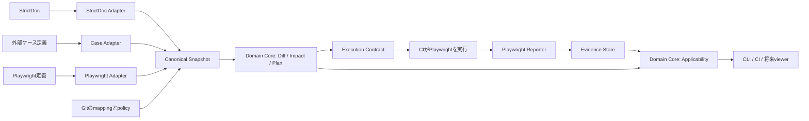

# markharness v2 設計書

作成日：2026-09-11
状態：設計提案。製品方針は参照会話の合意に基づく。以下の型、スキーマ、コマンド、MVP仕様はv2への提案であり、実装済み仕様ではない。

## 1. 結論と製品の命題

**markharnessの命題は、バージョン軸のテストケース変更検出とテストケース・トレーサビリティである。**

標準構成を `StrictDoc → markharness → Playwright` とする。markharnessは、外部の要件とテスト資産を版付きで結び、何が変わり、何を再検証する必要があり、どの証跡がその検証を満たすかを説明する。

Verification Plan、Execution Contract、Evidence Applicabilityは、この命題を成立させるための機能である。要件編集、ケースCRUD、実行管理などを独立した製品領域として拡張しない。外部TMS/SaaSのケースを取り込む場合も、編集の正本は外部に置く。

実装方針は、**同じ製品・リポジトリでDomain Coreを新規設計し、既存の有用な実装を選択的に移植する**。全面破棄でも、旧モデルへの継ぎ足しでもない。

### 1.1 成果として答える問い

1. baseからheadの間で、どのケースの検証内容・実装・関連要件が変わったか。
2. どの要件版が、どのケース版・実行可能テストで検証されるか。
3. 変更の影響で、どの検証が必要か。なぜ必要か。
4. 既存のpass証跡は、今回の対象・環境・検証文脈に適用できるか。
5. 未検証なのか、ケースがないのか、対応付けが不明なのか。

「十分なテスト」の判定範囲は、入力されたグラフと明示されたpolicyに限定する。グラフにない依存や要件を自動的に理解したとは扱わない。

## 2. 根拠と現行実装の読み方

一次資料は添付 `repomix-output-markharness-markharness.md` と参照会話「要件管理とテスト実行ツールの比較」。添付のSHA-256は `44d2a9321fd6803bc9815c8d60166c906f00323da59a6a804d7926661ff2e58a`。元リポジトリのcommitは資料から確定していないため、本書の「現行」は添付時点を指す。実リポジトリのビルドやテストは本設計作成では実行していない。

| 根拠ID | 添付内のファイル／箇所 | 確認事項 |
|---|---|---|
| R1 | `docs/ja/decisions/0008-verification-plan-product-roadmap.md` §1–6 | PR Plan中心、CRUDを主UIにしない、モジュラーモノリス、再利用方針 |
| R2 | `docs/ja/decisions/0009-domain-application-infrastructure-layering.md` | 層分離とGit履歴読み出しの設計経緯 |
| R3 | `docs/ja/decisions/0017-scenario-case-revision-and-execution-evidence.md` §3–7 | UIDとrevision、証跡と適用可能性の分離、実行の非目標、プロトタイプ前提 |
| R4 | `docs/ja/design/verification-plan-canonical-model-design.md` §7 | canonical evidenceとnative executionの別契約。canonical証跡をPlan候補から除外する経路の記述 |
| R5 | `src/canonical.rs`、`src/cli.rs::ImportSourceArg` | ArtifactKindはFeature/Scenario/TestCase。import選択肢はNative/Junit |
| R6 | `src/execution.rs`、`src/case_definition.rs`、`src/plan.rs` | ケース定義の固定、型付き版参照、証跡適用とPlanの実装 |
| R7 | `src/git.rs`、`src/knowledge_source.rs`、`src/fs_safety.rs` | Git tree/blob読出し、作業ツリーとの入力差し替え、安全なファイル操作 |
| R8 | `tests/canonical_import.rs`、`tests/execution_cli.rs`、`tests/plan_cli.rs`、`tests/plan_domain.rs`、`tests/fixtures/stage2/verification-plan.golden.json` | 移植時の回帰検証に利用できるテスト資産 |

R3の文書ステータスは「設計合意済み、未実装」だが、R6には関連実装がある。文書のステータスだけで完了範囲を断定しない。また、R7のGit tree読出しを全面再利用できる一方、R5のnative importerには一時worktreeを作る実装がある。全経路が統一済みとは扱わない。

本書はR1の旧import優先順位と外部連携の位置付けを更新する。従来のケース定義・決定的生成・依存関係・変更伝播は中核として維持する。R3の固定階層／1 Scenario = 1 Caseは全入力への一律制約から、明示的に選択する階層プロファイルの制約へ変更する。R3の版と証跡に関する原則は継承する。

## 3. 設計原則

| ID | 原則 | 設計への帰結 |
|---|---|---|
| P1 | 外部の正本を尊重する | 編集・CRUDを複製せず、source locatorと固定snapshotを保持する |
| P2 | 同一性と版を分ける | UIDを名前、パス、内容ハッシュから無条件に作らない |
| P3 | 版の種類を混同しない | 要件版、ケース版、実装版、製品版、環境、source commitを別に持つ |
| P4 | 判定は再現可能にする | 同一snapshot・policyから同一Planを作る。現在時刻や外部の最新状態を暗黙参照しない |
| P5 | passと適用可能性を分ける | staleなpassを今回の合格にしない。過去のfailも消さない |
| P6 | 不明を可視化する | UID欠落、未解決参照、不完全exportを無視して合格を出さない |
| P7 | Coreは外部形式を知らない | StrictDoc/Playwright固有フィールドと変換規則はAdapter内に置く |
| P8 | 関連にも版と由来がある | 追加・削除・付替えを検出し、実行対象になった根拠を返す |
| P9 | 小さいInterfaceに判定を集約する | CLI・CI・将来viewerは同じApplication結果を使う |
| P10 | 拡張は命題から評価する | ツール追加のための汎用plugin基盤や独自業務管理を先行しない |
| P11 | 外部形式は柔軟に、内部構造と作成規則は固定する | ノード型・関係・必須性・多重度を構造プロファイルで検証し、AIに構造選択を委ねない |

## 4. 責務境界と正本

| 領域 | 正本／担当 | markharnessが保持するもの |
|---|---|---|
| 要件の本文、構造、要件間関係 | StrictDoc | 固定した要件snapshot、元ID、版、出典 |
| テストケースの意図・手順・期待結果 | 外部TMS/SaaS、またはGit内のテスト定義 | 読取projectionとCase revision。編集用の独自ケースDBは持たない |
| 実行可能テスト、fixture、assertion | Playwrightテストリポジトリ | 明示ID、実装版、ケースへのbinding |
| 実行、並列化、retry、flaky判定 | PlaywrightとCI | 外部が確定した結果とその出典 |
| 製品build、デプロイ、実行環境 | CI/CD・実行基盤 | build digest、環境識別、観測情報 |
| 外部間のmapping、検証policy | Gitで管理するmarkharness設定 | 版付き関係、identity alias、policy |
| 差分、影響、Plan、証跡適用 | markharness Core | 決定的な判定と説明 |

MVPではStrictDocを要件の標準連携先、Playwrightを実行の標準連携先とし、その間にNativeの構造化ケース定義・生成を提供する。外部ケースを直接取り込む構成では、Playwright側の明示的なケースID・検証意図metadata・テストコードもケースの入力元にできる。自然言語のケース手順を別途必須にしない。検証意図metadataがない場合はコード由来の保守的なケース版を使用し、「意図の変更だけを精密に検出できる」とは表示しない。

外部TMSを追加した場合は、TMSのケースを同じTestCase Artifactへ変換する。TMS IDとPlaywright IDを自動で同一視せず、明示bindingで接続する。

## 5. アーキテクチャ



これはデータフローである。コード依存は `Presentation → Application → Domain`、`Adapters → Applicationのport / Domainの値型` とする。DomainからInfrastructureへ依存させない。R1/R2にある旧依存方向の表記をそのまま踏襲しない。

Rustのモジュラーモノリスを継続し、Playwright連携部分のみTypeScript packageを置く。最初は同一crate内のmodule分離でよい。

```text
src/
  domain/         # case_compiler, axis, dependencies, alignment, identity, snapshot, diff, graph, plan, applicability
  application/    # snapshot取得、計画生成、証跡取込、判定
  ports/          # SourceReader, ObjectStore
  adapters/       # native_test_spec, strictdoc, git, filesystem, canonical_bundle
  presentation/   # cli, json, text
packages/playwright/  # inventory、binding検証、reporter
schema/v2/        # snapshot, plan, manifest, evidence, selection
tests/fixtures/   # immutable入力と期待結果
```

| Module | Interface案 | 隠蔽する複雑さ |
|---|---|---|
| SnapshotBuilder | `build(source_bundles, mapping, profiles)` | ID解決、正規化、参照検証、完全性検査 |
| ChangeAnalyzer | `diff(base, head)` | 内容・実装・関係・identity変更の区別 |
| VerificationPlanner | `plan(base, head, target_set, policy)` | グラフ探索、選択理由、coverage gap、context固定 |
| EvidenceEvaluator | `evaluate(plan, evidence_set, selection)` | 適用可能性、採用証跡、競合、ゲート集約 |

上記Domain関数はI/O、時刻取得、process起動を行わない。Adapterが完全な値を渡し、結果または型付きdiagnosticを受け取る。SourceReaderはStrictDoc入力とcanonical fixture入力で検証し、架空の多数のSaaS向けinterfaceを作らない。

## 6. Domain Model

用語集は同梱の[markharness-v2-glossary.md](markharness-v2-glossary.md)を参照する。

### 6.1 中核型

以下は意味を示す型定義案であり、そのままコンパイルできるコードではない。

```text
Artifact {
  id: ArtifactId,
  source_id: SourceId,
  external_key: ExternalKey,
  kind: Requirement | TestCase | ExecutableTest | SourceArtifact
        | Feature | Behavior | Scenario,
  display: DisplayMetadata
}

ArtifactVersion {
  artifact_id: ArtifactId,
  revision: Revision,
  canonicalization_profile: ProfileId,
  effective_content_ref: ContentDigest,
  provenance: { source_revision, source_locator, raw_digest, adapter_version }
}

Relation {
  id: RelationId,
  kind: verifies | implements | depends_on | derived_from | contains | defines | contributes_to,
  from: ArtifactId,
  to: ArtifactId,
  origin: Imported | Declared | Derived { rule_id, rule_version },
  authority: SourceId,
  revision: RelationRevision
}

CanonicalSnapshot {
  schema_version, snapshot_id,
  source_locks, normalization_profiles, structure_profile_ref, authoring_rules_ref,
  artifacts, versions, relations,
  completeness, diagnostics
}
```

内部モデルは自由なグラフではない。許可するノード型・関係・端点型・必須項目・多重度を、プロジェクトで選択した構造プロファイルに固定する。Feature・Behavior・Scenarioの有無をAIが対象ごとに選んではならない。Snapshot内のArtifactは原則一つの選択版を持ち、Relationの両端はそのsnapshot内で解決する。実行契約へ出す際は両端の版まで固定する。

### 6.1.1 構造プロファイル

**外部形式は柔軟に受け入れる。内部モデルと作成規則は固定する。AIにドメイン構造を選ばせない。**

構造プロファイルはノード型と関係の制約であり、内容のハッシュ方法を指定する正規化profile、実行条件を指定する環境profileとは別物である。プロジェクトのGit設定でID・版・digestを固定し、Snapshotへ参照を保存する。MVPでは実装に同梱する定義から選択し、任意の型や関係を追加するplugin機構は作らない。

| プロファイル | 構造 | 用途 |
|---|---|---|
| `minimal-trace-v1` | Requirement ← verifies — TestCase ← implements — ExecutableTest | 外部ケースを直接取り込むMVP構成。階層を持たない入力を受け入れる |
| `hierarchical-test-v1` | Feature → Behavior → Scenario → TestCase、および明示的な要件・実装との関連 | Nativeの標準構成。従来のケース定義・生成をMVPで維持する |

minimalではFeature・Behavior・Scenarioをcanonicalノードとして保存しない。外部の階層は出典metadataとして保持し、分類検索に利用する。hierarchicalでは次の制約を固定する。

- Feature `contains` Behavior、Behavior `contains` Scenario。各Behavior・Scenarioの親はちょうど一つ。循環と階層の飛越しは禁止する。
- Scenario `defines` TestCaseは1対1。各TestCaseにScenarioを必須とし、AIが省略できない。
- Feature `contributes_to` Requirementは多対多。RequirementをFeatureの保存上の親にはしない。
- TestCase `verifies` RequirementとExecutableTest `implements` TestCaseは明示する。階層への所属だけから検証関係を推定しない。
- 外部側に必須階層がなければ、明示mappingで補うか入力を拒否する。架空のFeature/BehaviorをAIやAdapterが自動補完しない。

各profileの検証scope内では、ケースに一つ以上のverifies、自動実行対象ケースに一つ以上のimplementsを要求する。手動実行対象にはimplementsを要求せず、実行方式を明示する。未接続データはgap付きdraftとして保持できるが、準拠した完成snapshot／ゲート合格とは扱わない。未知の型・関係、不正な端点型や多重度は構造エラーとして拒否する。

プロファイル変更は通常のケース変更と区別する。base/headのprofileが異なる場合は`not_comparable`とし、明示mappingをレビューして同じprofileで再取り込みする。旧snapshotや証跡は書き換えない。構造profileのdigestをsnapshot、policy digest、context計算へ含め、契約変更を黙って証跡へ適用しない。

### 6.1.2 AIによる作成の規則

AIによる編集は外部ツール側の作業であり、markharnessのCRUD機能にはしない。その入力を安定させる作成規則をGitで固定し、`authoring_rules_ref = { id, version, digest }`として記録する。AIへは入力元schema、選択済み構造profile、用語、粒度基準、正常例・反例、既存ID一覧を渡す。

階層profileの語義は、Feature＝利用者に提供する能力、Behavior＝特定条件下で観測可能な振る舞い、Scenario＝前提・操作・期待結果が具体化された一つの検証例とする。Scenarioは独立した期待結果の成否を説明できる単位で分割する。前提・操作・期待結果が異なる場合は別Scenarioとし、データ値が異なる場合の粒度は未決定。「1 Scenario＝1具体TestCase」と「variant展開前の論理ケースとして1対1」の優位性を別途比較する。後者を採用済みとは扱わない。決定までは単一の具体データを持つScenarioの範囲で設計・検証し、複数variantのidentity/schema契約を確定しない。

既存内容の改訂ではIDと所属を原則維持し、毎回の全体再生成を避ける。移動・複製・分割・統合は意図を明示し、6.2節のidentity規則を適用する。AIが別の構造を選ぶ、新しい関係名を発明する、見栄えのために再分類することを禁止する。

スキーマ制約は構造上の揺らぎを抑えるが、意味の粒度の同一性は保証しない。作成例と分割基準に照らしてdiffをレビューする。作成規則の変更は監査情報として記録し、それだけでCase revisionを変えず、実効内容・構造・関係の変更を各版へ反映する。

### 6.1.3 従来のケース定義・生成を維持する

Step・Phase・共通手順・Axis・Featureによるケース作成、検索、変更伝播をv2の中核として維持する。Native入力を任意に選べることと、その機能の提供を後回しにすることは別である。Native readerはAdapter、共通手順展開・ケース版計算・依存関係構築は純粋なDomainのCaseCompilerに置く。これはPlaywrightコード生成や実行エンジンではない。

以下はv2の意味を表す型案。既存YAMLと完全互換なスキーマではなく、移植時に既存fixtureと対応を確認する。

```text
NativeFeature { uid, requirement_refs[], behavior_refs[], axis_refs[], semantic_content }
NativeBehavior { uid, feature_uid, procedures: Map<ProcedureKey, Procedure>, axis_refs[] }
NativeScenario { uid, behavior_uid, preconditions[], phases: Phase[], test_data, axis_refs[] }
Phase { steps: Step[], results: ExpectedResult[] }
Step = Action { text } | UseProcedure { key }
Procedure { steps: Action[] }
AxisDefinition { axis_id, revision, label, description }
AxisAssignment { artifact_id, axis_id, revision }
CompiledCase {
  case_uid, scenario_uid, case_revision,
  effective_preconditions[], effective_phases[], test_data,
  dependencies[], source_map[]
}
```

Phaseの順序とPhase内のStep順序は配列で固定する。Step・PhaseはScenario内部の値であり、独立Artifactや恒久UIDを要求しない。差分は位置と内容の比較で示し、並べ替えなど対応が曖昧な場合は追加・削除として表示する。共通手順は所属Behavior内からのみ明示参照し、入れ子呼出し・循環・未解決参照を拒否する。参照位置に操作を展開し、先頭への自動挿入はしない。

Case UIDはScenario UIDから型を区別して決定的に導出する。Case revisionには前提条件、展開後の操作・期待結果・順序・データを含める。定義には依存した共通手順の固定版と、生成後の位置から元Scenario/Procedure位置へ戻れるsource mapを保持する。未参照の共通手順変更ではCase revisionを変えず、参照先の実効内容変更では全該当ケースを更新する。

Axisは独立した版付きレジストリと付与情報として保存する。許容Axisと付与規則を固定し、未定義Axisを拒否する。分類のみの変更はCase revisionを変えず、分類差分・検索結果の変化を記録する。親のAxisを暗黙継承しない。AxisをPlan選択に使う場合は、レジストリ・付与・選択規則のdigestをpolicyへ含め、base/head両方の集合から影響を確認する。実行条件や事前条件をAxisだけに埋め込まない。

Featureの意味に関わる内容が変わった場合、配下のBehavior/Scenarioから全関連ケースを変更影響候補にする。Case revisionが不変でも対象から除外しない。Feature→Requirementの関連と所属は検証済みの証明ではなく、影響探索の根拠として保持する。

### 6.2 同一性

- `SourceId`はツール名だけでなく、組織・プロジェクト・リポジトリなどを区別する安定したnamespace。別組織の`TC-1`を混ぜない。
- 安定した外部キーがある場合、`ArtifactId = namespace + kind + stable external key` の衝突しないエンコードで決定する。display nameやlocatorは含めない。
- 外部キーが変更可能な場合、Gitのidentity mappingで旧キーと新キーを同じArtifactへ明示的に関連付ける。本文類似による自動renameはしない。
- stable keyがないケースは、入力元に明示IDを付与するかmappingで明示IDを与えるまで未解決。列番号、配列順、テストタイトルで暗黙生成しない。
- 複製・分割・統合は新IDと`derived_from`関係で表す。由来は合格証跡の継承ではない。
- 削除されたIDの再利用を許可しない。全量snapshotと履歴で検出する。

### 6.3 版の区別

| 版 | 意味 | 変更例 |
|---|---|---|
| Requirement revision | 要件の検証に関わる内容 | statement、受け入れ条件 |
| Case revision | 検証内容 | 操作、前提、期待結果、入力データ |
| Implementation revision | テスト実装と依存物 | assertion、helper、fixture、設定、lockfile |
| Source revision | 入力を取得した時点 | Git commit、TMS exportの固定ID |
| Target revision | 検証する製品 | build digest、解決済みcommit |
| Relation revision | 対応付けの内容 | 検証対象要件の変更 |
| Context revision | 適用判断に必要な要件・Featureの意味版・関係集合 | 要件／機能改訂、binding付替え |

Revisionは型とprofile付きdigestで表す。`case:v1:sha256:...` と `impl:v1:sha256:...` を相互変換しない。Git commitが同じでもbuild条件が違えば同じTargetとは限らない。

### 6.4 正規化・ハッシュ規則

MVP profileを `mh-canonical-v1` とする。JSONのobject keyはUnicodeコードポイント順、setはID順、順序に意味のある配列は原順序。UTF-8・BOMなし、改行はLFとし、固定したserializerで空白なしの表現を生成する。数値は整数または文字列に制限し、浮動小数点の表現差を避ける。欠落とnullを同一視しない。文字列のtrim、空白圧縮、Unicode正規化を暗黙に行わない。digestは型名・profile・正規化payloadに対するSHA-256とする。

Case revisionには外部で確定した実効内容を使う。TMSが共有手順を参照する場合は展開済み内容または固定された依存版を必要とし、取得できなければ不完全とする。表示metadataだけの変更は版を維持する。ケースの意味に関わる情報を表示metadataへ入れない。

Playwrightコード由来profileでは、意図の厳密な抽出を行わず、指定テスト群と依存bundleのdigestをCase revisionへ保守的に含める。コメント変更でも変更扱いになることを明示する。独立したケース定義profileなら、同じ変更はImplementation revisionだけを変える。

profile変更時は旧profileとの比較を`not_comparable`として表示し、同じ規則でbase/headを再生成する。旧証跡を新profileへ書き換えない。ハッシュ一致は自然言語の意味の同等性を証明しない。

### 6.5 関係と検証文脈

MVPの標準プロファイルの関係方向は固定する。各関係の許容端点型はschemaで列挙し、depends_on/derived_fromにも任意の端点組合せを許可しない。

```text
TestCase --verifies--> Requirement
ExecutableTest --implements--> TestCase
Artifact --depends_on--> Artifact
Artifact --derived_from--> Artifact
```

影響探索は、変更された要件から`verifies`を逆向きにたどり、ケースから`implements`を逆向きにたどる。`depends_on`は依存先の変更を依存元へ伝播する。`derived_from`は来歴表示のみで合格や影響を自動継承しない。任意のrelation名を同じ意味で探索しない。

`Context revision`は、対象ケースについて影響policyが採用する要件・FeatureのID/意味版と、採用された関係のID/版をソートして計算する。ケース本文が同じでも、関連要件が改訂された場合にはcontextが変わる。新contextでの再実行をMVPの既定とする。要件とケースの意味の整合性は人間のレビューに依存し、再実行だけで自動証明しない。

階層profileのcontainsは所属、definesはScenarioとケースの対応、contributes_toは実現への寄与を表す。これらをverifiesの代わりにしない。階層profile導入時は、defines元の実効内容変更をケースへ伝播する規則もprofileに固定する。contains変更だけでは合格・検証範囲を推定せず、関係差分として表示する。

標準検索として、要件→ケース、ケース→要件、ケース→実装の双方向検索、版指定の検索、base/headの関係差分を必須にする。階層・分類は絞り込みとパンくず表示に利用する。すべての検索結果にsnapshot/profile参照と根拠経路を付け、間接関係には導出規則を表示する。最小profileでも階層profileでも、この標準検索の意味は同じとする。

### 6.6 VerificationTargetとEvidence

```text
VerificationTarget {
  case_ref: { artifact_id, case_revision },
  execution: Automated { implementation_ref: { artifact_id, implementation_revision } }
           | Manual,
  context_revision,
  target: { namespace, immutable_revision },
  environment: { profile_id, required_dimensions },
  variant_key
}

Evidence {
  evidence_id,
  manifest_id, entry_id,
  observed_target: VerificationTarget,
  result: pass | fail | skip | error | cancelled,
  provenance: { producer, producer_version, external_execution_ref,
                source_report_digest, observed_at },
  definition_ref, attachment_refs,
  integrity_state
}
```

`variant_key`はパラメータケースを区別するための暫定案であり、Scenario粒度の議論後に確定する。配列順で採番しない原則だけを維持し、以下の型・例にあるvariantは契約確定の根拠にしない。環境matrixは別VerificationTargetとして展開し、ChromiumのpassだけでFirefoxを満たさない。複数実装で一つのケースを検証する場合、MVPは指定された全実装が必須。代替実装のany-ofルールは後段とする。

Evidenceは観測事実であり不変。Planへの採用は別の`EvidenceSelection { plan_id, entry_id -> evidence_id, selection_revision, actor, rationale }`で記録する。外部実行IDは来歴のためのopaque参照で、CoreにRun/Attempt/retry状態機械を導入しない。

### 6.6.1 手動テスト

VerificationTargetのexecutionはAutomatedまたはManualの判別共用体とする。Manualにはimplementation_refを持たせず、架空のテストコードIDや実装版を作らない。Case UID/revision、固定定義、context、対象製品、要求環境は両方式で必要とする。Planで方式を固定し、手動結果で自動実行義務を代替しない。両方を要求するケースは別entryとして評価する。

手動Evidenceは共通フィールドに加え、executor（実行者）、executed_at、observation（確認結果・根拠）、manual_record_refを必須とする。元の手動記録のdigestをsource_report_digestへ保存する。記録者は実際に使用したケース版と実測した対象・環境を指定し、取込時に現在値で埋めない。結果の最終判断は実行者が行い、markharnessは記録の整合性と適用条件を判定する。

手動記録も同じ不変保存、重複取込、EvidenceSelection、旧版・未知・破損の判定を適用する。実装版不在はManualでのみ正常で、Automatedでの欠落はエラー。対応確認は要件・Featureとケースについて実施し、存在しない自動実装への追従義務は作らない。

### 6.7 変更に対する対応確認

Evidence Applicabilityとは別に、要件・Feature・ケース・テスト実装の変更に対する整合確認をモデル化する。ファイルの双方が更新されたことや再実行のpassだけでは、対応が確認されたとは判定しない。この版付き確認記録はv2で明示化する追加設計であり、旧実装が同じ仕組みを既に持つとは主張しない。

```text
AlignmentObligation {
  id, trigger_change_ref,
  from_ref: ArtifactVersionRef, to_ref: ArtifactVersionRef,
  relation_revision, rule_digest, reason
}
AlignmentDecision {
  id, obligation_id,
  from_ref, to_ref, relation_revision, rule_digest,
  outcome: aligned_after_update | no_change_required | change_required,
  actor, rationale, review_reference
}
```

変更起点と確認先は次のとおり。未更新は直ちに不具合ではなく、対応未確認として表示する。

| 起点 | 必要な確認 |
|---|---|
| 要件／Featureの意味変更 | 関連ケースが更新されたか、変更不要と確認されたか |
| ケースの実効内容変更 | 関連要件・Featureとの整合、および自動実行に指定された各テスト実装の追従。手動対象に架空の実装追従を要求しない |
| 共通手順変更 | 実効内容が変わるケースへの伝播と、それらの実装の追従 |
| テスト実装変更 | 対応ケースとの整合。実装依存の保守的hash変更も理由付きで確認 |
| 関係の削除・付替え | 旧接続の検証欠落と新接続の対応。削除を探索から消さない |

Decisionは対象版の組合せ・関係版・規則に固定する。いずれかが変われば旧Decisionは新しい義務を満たさない。aligned_after_updateには実際の新しい相手版を必要とし、変更していない場合は理由付きno_change_requiredを使う。change_requiredは未解決のまま。相反するDecisionは自動的に日時で選ばず、明示した採用Decision IDとその履歴を保持する。

DecisionはGit上のレビュー記録または外部レビュー参照で提供し、独自の担当者割当・承認workflowは作らない。意味の整合性は人間が判断する。新規bindingにも最初の対応確認を要求する。

Planにalignment_obligationsを追加し、PlanEvaluationに採用Decision IDとalignment_statusを追加する。必須の対応確認が未完了ならゲートはblockedとし、実行passと別に表示する。no_change_requiredは再実行免除ではなく、証跡には引き続き第10章の条件を適用する。

## 7. Adapter設計

### 7.1 共通契約

Adapterは、固定した入力bundleと構造profile・明示mappingから、決定的な変換でcanonical値、source lock、diagnosticを返す。AIに内部構造の選択・必須階層の補完を委ねない。Coreから外部APIを呼ばない。importに失敗した入力を空snapshotに変換しない。

source lockには元資料のdigest、source revision、Adapter版、正規化profile、取得scope、全量／部分の区別を保存する。取得日時は監査metadataであり内容版やPlan IDの計算から外す。部分exportの欠落を削除と誤認しない。MVPは同じscopeの完全なbase/headを要求する。

### 7.2 StrictDoc Adapter

公式にはJSON exportがあり、UIDは任意、include文書の出力には規則がある。これを踏まえ、MVPは**固定したStrictDoc版の公式JSON exportを入力**とし、独自SDoc parserを作らない。[StrictDoc User Guide §8.4 / UID](https://strictdoc.readthedocs.io/en/stable/stable/docs/strictdoc_01_user_guide-TRACE.html)

1. CIがbase/headの各ソースから、同じ固定StrictDoc版でexportする。
2. AdapterがRequirementを抽出し、UIDをMVPの必須external keyとして検証する。改名は明示aliasを要求する。
3. statementと検証に関わるcustom fieldを設定profileで抽出する。未分類fieldは黙って捨てずdiagnosticを返す。
4. 要件間関係は意味を明示mappingできるものだけ変換する。一般の親子関係を自動的に`depends_on`としない。
5. includeによる重複ノードは同じID・内容なら統合し、内容不一致ならエラー。対象文書一覧と件数を出力scopeに照合する。

元SDocのlocatorとraw digestは監査に残す。JSONフィールドの固定schema、対応StrictDoc版、custom grammarの対応範囲はM0の実fixtureで確定し、未対応版は拒否する。

### 7.3 Case Adapter

標準構成ではNativeの構造化定義をCaseCompilerで生成して使う。Nativeを使わない構成ではPlaywright側のケース情報も受け入れる。外部TMS連携は後段の別Adapterとし、ケースID・実効内容・外部版・固定出典を返せば同じCoreを使える契約にする。

SaaSの「現在の一覧」を過去snapshotとして扱わない。過去版取得ができないSaaSでは、取り込んだ全量exportを不変保存した時点から比較を開始する。双方向同期・ケース作成・割当・承認workflowを導入しない。

### 7.4 Playwright Adapter

役割をinventory/bindingとreporterに分ける。Playwrightはcustom annotationとcustom reporterを提供するため、明示ケースIDを結び付ける入口に利用する。[Annotations](https://playwright.dev/docs/test-annotations)、[Reporter API](https://playwright.dev/docs/api/class-reporter)

- inventoryはケースID、実行可能テストID、variant、project、locator、実装bundle digestを返す。
- titleやファイル行番号は表示・選択用locatorであり、永続IDにしない。ID欠落・重複・一意に解決できないbindingはブロックする。
- MVPの実装bundleは設定されたテストroot全体、helper、fixture、Playwright設定、依存lockfileを保守的に含める。静的importの完全解析は行わない。外部データはdigestを固定し、未固定の動的依存は未解決とする。
- reporterはmanifestの期待値と、実行時inventory・実装bundle・製品build・環境の観測値を照合する。manifestのrevisionを読み取ってそのまま証跡に転記するだけでは検証にならない。
- Playwrightが確定した最終結果を、版付き変換規則でEvidenceへ変換する。retry順の独自判定やflaky再分類は行わない。想定失敗を成功とするなどのrunner semanticsはraw outcomeと併記し、未知の結果はerrorとする。
- reporter例外だけに成否判定を依存させず、完全なreport bundleと完了情報の存在を取込時に検査する。公式APIはreporter内の例外が吸収される旨を記載しているためである。[Reporter errors](https://playwright.dev/docs/api/class-reporter)

実行対象の絞り込みはCI側のselection helperがmanifestをPlaywrightの選択方法へ変換する。MVPは保守的なファイル単位の実行や全件実行を許容し、manifest対象の証跡だけを採用する。独自schedulerは作らない。

## 8. Snapshot DiffとVerification Plan

### 8.1 差分の分類

`added / removed / content_changed / implementation_changed / relation_changed / metadata_only / identity_unresolved / not_comparable`を分ける。同じArtifactが複数分類を持ってよい。

base/headは入口で不変参照へ解決し、実行中に再解決しない。PRではCIが選んだbaseとheadを渡す。merge-base計算は明示オプションとし、比較点が変わる場合は出力に残す。未commitのpreviewは可能でも、MVPのゲート証跡には使わない。

### 8.2 計画生成手順

1. source scope、profile、参照完全性を検証する。
2. Artifact版・実装版・Relation版を比較する。
3. Featureの意味変更、共通手順の実効変更、Axisによる選択集合変更と対応確認義務を計算する。**baseとhead両方の関係**を使って影響候補を収集する。削除された関係の影響をheadだけで取り逃がさない。
4. 変更ケース、変更実装、変更要件に結び付くケースを選択する。
5. `depends_on`を訪問済み集合付きで探索する。循環は探索を停止させずdiagnostic化し、階層制約違反ならブロックする。
6. headに存在する対象をVerificationTargetへ展開し、理由の経路を保存する。
7. 要件→ケース未接続、自動実行ケース→実装未接続、削除による検証欠落をCoverage gapとして出力する。
8. ID順で整列し、入力lock・policy・target・内容を含むdigestからPlan IDを作る。

削除されたケースを実行対象にしない。継続する要件の検証を失った場合はgapにする。削除された要件はobsolete traceとして残し、外部ケースを自動削除しない。

### 8.3 PR scopeとRelease scope

PR Planは変更影響範囲の判定であり、製品全体の検証済み宣言ではない。Release Planは指定要件集合から全VerificationTargetを列挙する。両者は同じモデルで`scope.mode = impact | full`を区別する。

対応のない製品コード変更は`unmapped_change`。MVPでは、設定された製品コードscope内の未対応変更を検出したら全登録ケースを選択する。ただしそれでも網羅性を証明できないためgapを残し、mappingまたは版付きscope除外理由のレビューが必要となる。未知を空Planの合格に変換しない。

### 8.4 Planの出力契約

```text
VerificationPlan {
  schema_version, plan_id,
  base_snapshot_id, head_snapshot_id,
  scope, source_locks, policy_digest,
  changes[],
  entries[]: { entry_id, verification_target, reasons[], trace_paths[] },
  coverage_gaps[], alignment_obligations[], obsolete_traces[], diagnostics[]
}
```

Planは必要な検証を固定する不変document。証跡追加で書き換えない。`PlanEvaluation`を別出力にし、`plan_id / selection_revision / evidence_set_digest / entry assessments / gate`を持たせる。これにより同じPlanの判定履歴を再現できる。

missing testは「未接続の要件・ケース・実装」を意味するrule-based gapとして扱う。新しいケース本文やPlaywrightコードの自動生成はしない。

## 9. Execution Contract

### 9.1 Manifest

Execution ManifestはPlanから外部runnerへ渡す契約の具体物。各entryにはCase revision、実行方式、Context revision、対象製品、要求環境、固定定義参照を含める。Implementation revisionとrunner_bindingはAutomatedのみ必須とし、Manualは固定定義を実行者へ渡す。混在PlanでもPlaywrightへ送るのはAutomated entryだけとする。

以下は構造例。digestの短縮表記は説明用であり、実際は完全なdigestを使用する。

```json
{
  "schema_version": "mh.execution-manifest.v2",
  "manifest_id": "sha256:MANIFEST",
  "plan_id": "sha256:PLAN",
  "policy_digest": "sha256:POLICY",
  "entries": [{
    "entry_id": "sha256:ENTRY",
    "case_ref": {"artifact_id": "cases:auth:TC-1", "revision": "case:v1:sha256:CASE"},
    "execution": {"mode": "automated", "implementation_ref": {"artifact_id": "pw:auth:login", "revision": "impl:v1:sha256:IMPL"}},
    "context_revision": "context:v1:sha256:CONTEXT",
    "target": {"namespace": "auth-service", "immutable_revision": "sha256:BUILD"},
    "environment": {"profile_id": "e2e-v1", "required_dimensions": {"browser": "chromium", "os": "linux", "dataset": "sha256:DATA"}},
    "variant_key": "valid-user",
    "definition_ref": "sha256:DEFINITION",
    "runner_binding": {"adapter": "playwright", "project": "chromium", "test_key": "login:valid-user"}
  }]
}
```

`entry_id`はPlan内の対象を識別する。`manifest_id`は自身のID欄と生成時刻を除いたmanifest内容のdigest。selectorが同じでもrevisionが異なれば同じ契約ではない。

### 9.2 外部実行と返却

1. CIがmanifestと固定されたソース・buildを配置する。
2. selection helperがinventoryとのbindingを検証し、実行対象を準備する。
3. CIがPlaywrightを起動する。markharness Coreは起動しない。
4. reporterが実測値とrunnerの結果を返す。
5. CIがreport bundleを保存し、markharnessが取込・適用判定を行う。

返却bundleにはmanifest ID、producer/version、対象entry一覧、各Evidence、外部実行参照、raw report digest、完了／中断情報を含める。manifest対象の欠落はmissing、範囲外結果は参考記録。一致しない結果を別entryへ推測割当しない。異なるmanifestの結果をshardとして混ぜない。

MVPは単一外部実行の完成reportを扱う。shardingはPlaywright/CIで結合したreportを受け取る方式から始める。Coreにshard orchestrationやattempt集約を追加しない。

### 9.3 取込の原子性・冪等性

Schema、参照、digestを検証してからbundleを原子的に公開する。中断した取込は採用候補にしない。同じEvidence ID・同じ内容の再取込はno-op、同じID・異なる内容はconflict。部分reportを診断用に保存しても、それをcomplete bundleと表示しない。

manifest自体は実行の証明ではない。build・環境の観測値は実行時の識別情報を必要とする。自動実行ではCI/CD情報、手動実行では実行者が確認した識別情報を記録する。自動実行は信頼するCI producer、手動実行はpolicyで許可された実行者・記録経路からの証跡を対象とする。手動の観測情報は実行者の申告であることを保持し、CIの観測と混同しない。digestは改ざん検出に使えるが、producerの真正性を単独では証明しない。

## 10. Evidence Applicabilityとゲート

### 10.1 適用条件

`applies(evidence, verification_target, policy)`は純粋関数とする。MVPでは次がすべて必要。

- Case UID、Case revision、正規化profileが一致する。
- 実行方式が一致する。Automatedでは実行可能テストID・Implementation revisionが一致する。Manualでは実行者・実施日時・観測根拠が揃い、implementation_refが存在しない。variant照合の詳細は粒度決定まで保留する。
- Context revisionが一致する。
- 製品namespaceと不変Target revisionが一致する。
- 要求環境dimensionがすべて観測済みで一致する。未知はwildcardではない。
- 定義参照と証跡の整合性が検証済みで、producerがpolicy上許可されている。

MVPは、異なるbuild・context・profile間の同等性推論をしない。同じVerificationTargetなら別Planの証跡も候補にできるが、新Planで明示採用し、元manifestを保持する。

### 10.2 状態を三つに分ける

| 軸 | 値 | 意味 |
|---|---|---|
| 証跡の有無 | present / missing | 記録があるか |
| 実行結果 | pass / fail / skip / error / cancelled | 外部runnerが何を報告したか |
| 適用可能性 | applicable / inapplicable / unknown / invalid | 今回の要求へ使えるか |

inapplicableの理由は `case_revision_mismatch / implementation_mismatch / context_mismatch / target_mismatch / environment_mismatch`などの配列で返す。unknownは不足情報、invalidは不正schema・digest不一致・壊れた参照。UIの`stale`は版不一致の表示語であり、元の実行結果を上書きしない。

### 10.3 証跡の採用と競合

Plan entryごとに採用Evidence IDを明示する。CIは今回返却された完成bundleから一意な対応をSelectionとして作成できる。一意でない場合は未解決とする。

日時が新しいpass、都合のよいpassを自動選択しない。独立したpass/failが複数ありSelectionがない場合は`unresolved`。明示Selectionがあれば採用結果で評価し、除外された矛盾証跡と選択理由を表示する。retry結果の統合は外部runnerが完了させてから取り込む。

### 10.4 Entry評価と集約

| 条件 | Entry評価 | 合格を満たすか |
|---|---|---|
| 採用証跡がapplicableかつpass | passed | はい |
| 採用証跡がapplicableかつfail/error | failed | いいえ |
| applicableなskip/cancelled | pending | いいえ |
| 候補なし | missing | いいえ |
| 版不一致の候補のみ | stale | いいえ |
| 不足情報、破損、採用競合 | unresolved | いいえ |

ゲートは、入力不正・blocking gap・未完了の対応確認・unresolvedがあれば`blocked`、それ以外でfailedがあれば`failed`、未充足があれば`pending`、全必須entryがpassedなら`passed`。空Planは完全な入力・gapなし・対象外理由の成立を確認して`not_required`とする。各件数と個別理由は優先状態に隠さず保持する。

`not_required`はそのPR scopeで追加検証が不要という意味であり、release全体の合格ではない。MVPには期限付きwaiverや例外承認workflowを導入しない。

## 11. CLI / API案

以下は未実装のv2コマンド案。CLIが一次Interface、versioned JSONが機械向け公開契約となる。

```text
markharness snapshot import --source strictdoc --input req-base.json --lock base.lock.json --out base.snapshot.json
markharness snapshot import --source strictdoc --input req-head.json --lock head.lock.json --out head.snapshot.json
markharness snapshot compose --inputs head.inputs.json --mapping mapping.json --out head.canonical.json
markharness generate --source native --ref HEAD --out generated.bundle.json
markharness alignment inspect --plan plan.json --format json
markharness alignment evaluate --plan plan.json --decisions decisions.json --format json
markharness diff --base base.canonical.json --head head.canonical.json --format json
markharness plan --base base.canonical.json --head head.canonical.json --target target.json --policy policy.json --out plan.json
markharness manifest export --plan plan.json --out manifest.json
markharness evidence import --manifest manifest.json --input report.bundle.json
markharness evidence import --manifest manual-manifest.json --input manual-record.bundle.json
markharness evidence select --plan plan.json --bundle report.bundle.json --out selection.json
markharness verify --plan plan.json --selection selection.json --format json
markharness trace --snapshot head.canonical.json --artifact cases:auth:TC-1 --format json
markharness explain --plan plan.json --entry ENTRY_ID
```

`head.inputs.json`はStrictDoc snapshotとPlaywright inventoryなどの固定入力一覧。baseも同じcompose手順で構成する。source importだけではグラフ全体が完成したとはしない。

終了コード案：`0`は操作成功、`1`はverifyのfailed/pending、`2`は入力・契約エラーまたはblocked、`3`はI/O・外部取得失敗。verifyはpassed/not_requiredのみ`0`。plan生成自体の成功とゲートの合格は分け、CIには必ずverifyを実行させる。

stdoutは指定形式の結果だけ、diagnosticの補足はstderr。JSONのschema IDやv2表記は現時点では提案の識別であり、安定版の互換性契約ではない。プロトタイプ中の形式変更は第15.1節に従い、旧形式readerや自動変換を提供しない。正式化時に形式版・互換性・移行規則を決める。内容版やprofileの識別は引き続き必要である。

Application Interface案：

```text
build_snapshot(request) -> SnapshotResult
create_plan(request) -> VerificationPlan
ingest_evidence(request) -> IngestionReceipt
evaluate_plan(request) -> PlanEvaluation
query_trace(request) -> TraceResult
```

将来のread-only HTTPは `GET /v2/plans/{id}`、`GET /v2/evaluations/{id}`、`GET /v2/artifacts/{id}/trace?snapshot=...` 程度から始める。MVPでHTTPサーバーや書込REST CRUDは作らない。

## 12. 保存と再現性

Native構成では `.markharness/knowledge/` にFeature/Behavior/Scenario、`.markharness/axes/` にAxis定義を置く既存配置を維持できる。StrictDoc入力は要件の正本として別配置に置き、要件を二重編集しない。`.markharness/generated/` は現在の生成ケースとtrace indexを置く再生成可能領域、objectsは証跡が参照する不変定義・依存版の保存領域とする。`.markharness/alignment/` に版付き対応確認記録と採用参照を保存する。case definition、axis、alignmentのschemaとNative fixtureを追加する。

```text
.markharness/
  config.toml
  mapping.json
  policy.json
  objects/sha256/...   # snapshot、固定ケース定義、manifest、証跡metadata
  selections/...      # 証跡採用の履歴
  cache/...           # 再構築可能な索引。正本ではない
```

mapping・policy・source lock・固定定義・証跡metadataをGitで版管理する。スクリーンショットや動画はCI artifact/object storageに置き、digestとlocatorを参照する。CIで作成した監査bundleは保存・取得経路を明示し、markharnessが勝手にcommit/pushする運用にしない。

SnapshotとPlanは再計算できる派生物だが、外部exportが再取得不能な場合は元bundleの保存が再現性の前提。Evidenceは実行事実なので再計算できない。cache削除とEvidence削除を同一視しない。

現在の業務日付やネットワークなしでも、保存済み入力から同じPlanと評価を再現できる。大きな添付を削除しても結果metadataを残すが、必須証跡が失われた場合はintegrity不足を表示する。

性能は全量計算を正準実装とし、ID indexと逆向き隣接listで探索する。キャッシュkeyはsnapshot/profile/policy digestを含める。増分計算は全量結果との一致を確認してから導入する。

## 13. 非目標

- StrictDoc要件編集UI、独自要件承認workflow。
- テストケースCRUD、独自手順editor、担当者割当、テスト実行サイクル管理。
- Playwrightコード生成、ブラウザ操作、独自runner、scheduler、retry/flaky判定。
- 外部TMSへの双方向同期、外部ツールのケースや結果の自動更新。
- 独自の製品build・デプロイ・テスト環境管理。
- AIによる自動テスト設計、意味の同等性の自動保証。
- MVPのdashboard、SaaS、RBAC/SSO、共有DB、横断ポートフォリオ管理。
- 汎用グラフDB、任意query言語、任意plugin実行基盤。

第三者がeditorやTMSを実装することは妨げない。versioned snapshot/manifest/evidence契約を利用できればよく、そのCRUDやworkflowをCoreへ移さない。

## 14. 既存実装からの再利用・置換・廃止

| 現行資産 | 判断 | v2での扱い／理由 |
|---|---|---|
| `src/git.rs` | 選択的再利用 | 不変ref、tree/blob読出し、引数検証。業務上のFeature前提を除く [R7] |
| `src/knowledge_source.rs` | 部品再利用 | Git/working treeの入力差替えを利用。KnowledgeSnapshot型は置換 [R7] |
| `src/fs_safety.rs` | 再利用候補 | 原子的操作・symlink対策を維持し移植先でも検証 [R7] |
| schema検証、CLI表示 | 部分再利用 | v2 schemaへ更新。旧fieldの意味を引きずらない [R5/R6] |
| 実Git fixture、golden | 積極再利用 | 新しい期待意味を明示し、同一性と再現性を回帰検証 [R8] |
| Case UID/revision、固定CaseDefinition | 原則継承・型を再設計 | 外部ケースにも使える定義参照へ変更 [R3/R6] |
| Evidence applicability、Plan | ルールを移植 | 純粋Domainへ集約し、実装版・contextを追加 [R6] |
| canonical/native evidenceの別経路 | 統合・置換 | 取込元によらず一つの型付きEvidence契約へ [R4] |
| 固定Requirement/Feature/Behavior/Scenario階層 | 全入力への一律強制を廃止 | Nativeでは階層profileを標準として維持し、外部直接入力には最小profileも提供する |
| deterministic TestCase generation | 中核として維持 | Native readerはAdapter、共通手順展開・版計算・依存追跡はDomainのCaseCompilerへ移植 |
| identity event/lock/回復サブシステム | 別途議論・未決定 | ADR 0013に対するv2の保証と受け入れ条件を別途決める。縮小や代替方式は承認済みとせず、決定まで既存機構を削除しない |
| milestone/backfill | 主UXから廃止 | 任意base/headへ統一。履歴batchは後段の外部呼出し |
| Git上の構造化Knowledge定義・検証 | 維持 | Step/Phase/共通手順/Axisを保持。既存CLIは意味と安全性を検証して移植し、専用編集UIは作らない |
| dashboard/server | MVPから除外 | 需要があれば同じPlanEvaluationを表示するviewerとして再利用 |

「再利用候補」は無修正コピーの保証ではない。元の型への依存、I/O、副作用、Windowsでの動作をInterface経由で検証する。旧ドメインの偶然の挙動をgoldenとして固定しない。

## 15. 移行戦略

### 15.1 基本方針

R3は外部利用者のいないプロトタイプを前提として互換layerを不要としている。ただし、それは添付時点の記述である。実装開始時に公開利用者・保持必須証跡の有無を確認する。確認前に旧データを破棄しない。

1. 現行commit、入力fixture、証跡、既知の期待結果を固定して保管する。
2. 同じリポジトリの開発branchで新Coreとfixtureを作る。短期間のみ旧Coreと並置する。
3. Git・fs_safetyなどを小さいInterface単位で移植する。
4. Native定義の作成・改訂→生成→検索・差分・変更伝播の経路と、StrictDoc→Nativeケース→Plan→Playwright→Evidence→評価の縦断経路を完成させる。
5. 新旧で維持すべき意味を比較する。意図的差分は理由付きで記録する。
6. 第15.4節の機能維持条件をすべて確認してからCLIをv2へ切り替え、置換が完了した旧Core・旧schema・不要コマンドを削除する。並置を恒久化しない。

現在はプロトタイプであり、論文§4.3の「旧形式の移行・自動変換を作らない」を基本方針とする。正式なバージョンになるまでは、旧形式reader、互換layer、二重書込、自動migration engine、旧データの自動書換えを作らない。この合意は、本書の従前の「必要に応じた明示変換」を製品機能として読む解釈に優先する。

同じ方針をsnapshot、ケース定義、Evidence、mapping、profile、policy等、他の機能で形式の版を管理する場合にも適用する。形式が変わったら新schemaで検証し、不適合な旧入力を拒否する。必要なデータは人が新定義として準備し直すか、対応する外部正本から再importする。通常の外部Adapterによる取り込みと、markharness旧形式のmigrationは区別する。

この方針はCase revision、Source revision、Target revisionなどの内容・対象の版管理を廃止する意味ではない。profile識別や比較不能の検出も維持する。既存証跡を新版へ自動的に付け替えず、不変記録を保管する。正式化後の互換性や自動変換の提供は、その時点で別途決め、現時点では約束しない。

### 15.2 旧証跡

旧証跡は保管するが、欠けたimplementation/context/target/environmentを現在値で埋めない。十分な出典がなければhistorical referenceとして扱い、v2の合格には再実行が必要。UID対応が完全でも、そのことだけでは証跡の適用可能性を保証しない。

### 15.3 切替と復旧

切替条件は第17章のMVP受け入れ条件と第15.4節の機能維持条件をすべて満たし、新規入力がv2のみで処理可能なこと。外部ツールとの連携成功だけでは切替可能としない。問題が出た場合は旧tagと旧データの保管コピーから旧環境を復旧する。v2データを旧Coreへ読み込ませない。現行リポジトリの履歴書換えは不要。

### 15.4 データの意味と有用な機能を維持する必須条件

**v2は、従来の構造化テストケースモデルを維持し、その上に外部要件・テスト実装・実行証跡との版付き契約を追加する。** テストケースの作成・改訂・決定的生成・検索・変更伝播を失う移行は認めない。これは市場で唯一の機能であることを理由とする判断ではなく、markharnessの検証内容の理解と変更追跡を成立させるための要件である。

ファイル配置、serialization、内部型、module分割は改善できる。旧形式との恒久互換性は要求しないが、互換layerを作らないことを機能やデータの意味を削除する理由にしてはならない。既存データの自動変換は行わず、人が準備した新定義または対応外部入力から再生成して意味を比較する。既存機能の意味の維持を検証できない項目があれば切替を止める。

| ID | 維持する能力 | 切替前に必要な証拠 |
|---|---|---|
| MC01 | Native定義の作成・改訂 | 新規ケースの作成と既存ケースの更新をv2のGit/CLI経路で実行できる。専用編集UIや外部TMSへの移行を必須にしない |
| MC02 | Feature・Behavior・Scenarioの構造 | UID、所属、要件への明示関連、階層profileの制約を移行前後で対応付ける |
| MC03 | Step・Phase・共通手順の意味 | 操作、前提、期待結果、データ、順序、参照・展開位置の意味が維持されることをfixtureで比較する |
| MC04 | Axisによる横断検索 | Axis定義・付与が保持され、同じ条件の検索集合が一致する。意図した分類変更は別の差分として説明する |
| MC05 | 安定した同一性と決定的生成 | 同じ論理ケースのID対応を保持し、同じv2入力から同じCase UID/revision・実効内容を生成する。表示変更や移動で別ケースを作らない |
| MC06 | 依存関係に沿った変更伝播 | 共通手順の参照ケース、Feature配下の関連ケースを取り逃がさず、未参照手順の変更を誤って実効ケース変更としない |
| MC07 | 版指定の検索・差分・追跡 | base/headのケース・所属・要件関係・実装関係を比較し、変更箇所と影響経路を説明できる |
| MC08 | 過去の検証内容の保持 | 過去の証跡から当時の固定ケース定義に到達できる。旧版を現在値で上書きせず、未移行証跡の適用制限を表示する |

MC01–MC08は最低条件であり、既存機能を棚卸しした結果の追加項目も対象にする。移行記録には、旧機能／入力fixture、v2での対応先、期待する意味、検証結果、意図的差分の理由、未解決事項を残す。AC31–AC40の回帰検証と対応付け、ケース作成・生成・検索・変更伝播の失敗または未検証項目が一つでも残れば切替不可とする。

正規化profileやID表現を変更する場合、旧版と新版のdigest文字列の一致は要求しない。ID対応と実効内容の意味を確認し、版の比較不能を明示する。旧証跡がv2で適用可能かどうかは第15.2節・第10章で別途判定する。

外部TMSやPlaywrightの直接入力はNativeに追加する経路である。構造化されたStepや共通手順依存が取得できない場合は、能力不足をdiagnosticと入力能力情報に記録する。選択済みprofileがその情報を要求する場合は拒否し、コード由来の保守的比較を選ぶ場合は追跡粒度を表示する。Nativeと同じ精度があると扱わず、外部入力の制約に合わせてNativeのモデルを縮退させない。

## 16. MVPロードマップ

| 段階 | 作るもの | 完了条件 |
|---|---|---|
| M0 契約固定 | 用語、schema、構造profile・作成規則、正規化profile、StrictDoc/Playwright対応版、実fixture | snapshot/manifest/evidenceの正常・異常fixtureが揃い、IDと版の規則を説明できる |
| M1 差分とtrace | Native CaseCompiler、Step/Phase/共通手順/Axis、両構造profile、StrictDoc import、Playwright inventory、base/head diff | ケース・要件・実装・関連の差分とその経路を再現可能に表示 |
| M2 Plan | Feature・手順依存の伝播、双方向の対応確認、context、gap、PR/full scope | 要件変更・関連削除・未対応コード変更を見逃さず理由を返す |
| M3 外部実行契約 | manifest、binding helper、reporter、Evidence取込 | CIがPlaywrightを実行し、完全な版参照付き結果が往復する |
| M4 判定と切替 | 手動・自動のApplicability、Selection、CLI gate、旧Core置換 | stale passで合格せず、同じ保存入力から同じ評価を再現。MC01–MC08と既存機能の棚卸し項目をすべて検証 |

**MVPはM4までを含む。** Importだけ、Planだけ、reporterだけのリリースを本命題の完成とはしない。初期優先順位でmanifestを後回しにせず、往復するExecution Contractを必須とする。

MVPの範囲は単一プロジェクト、同scopeの全量snapshot、StrictDocとPlaywright、Native生成とhierarchical-test-v1、外部直接入力のminimal-trace-v1、版付き作成規則、固定環境profile、明示binding、決定的rule、CLI/JSON。両profileとNative生成・依存伝播・対応確認をMVP受け入れ範囲に含める。実装期間はコードとfixtureの見積り後に決め、ここでは根拠のない工数を置かない。

Gherkinの継続取り込みは延期する。v2はStrictDoc・PlaywrightとNative生成を優先し、Gherkin importerをMVP完了条件に含めない。再着手時に、編集正本・繰り返し取込・ID維持・削除・Background/Rule/Examplesの意味保存を論文§4.2に照らして設計する。廃止ではなく、実装時期は未定とする。

MVP後は、実需要がある外部TMSの読取Adapter、追加runner、read-only viewer、CI provider向けcheck表示、性能改善の順に必要性を評価する。TMS CRUDと実行engineは後段ロードマップにも置かない。

## 17. 受け入れ条件と検証方法

すべて実fixtureまたはApplication Interfaceを通したテストで検証する。表の条件はv2実装時の合格基準であり、本設計作成時点のテスト実施結果ではない。

| ID | シナリオ | 期待結果 |
|---|---|---|
| AC01 | 同一入力を順序・OS・取得時刻を変えて処理 | 同じcanonical内容、revision、Plan ID |
| AC02 | 明示IDを維持して表示名・locatorだけ変更 | Artifact ID維持。独立ケース定義profileではCase revision維持 |
| AC03 | 操作・前提・期待結果・データを変更 | ID維持、Case revision変更、再検証対象 |
| AC04 | helper/fixture/lockfileを変更 | Implementation revision変更。コード由来profileではCase revisionも保守的に変更 |
| AC05 | ケースは同じで関連要件本文を変更 | Requirement/context変更、影響Planに入り、旧contextのpassは不適用 |
| AC06 | 関係削除・要件付替え | base側の経路も検査。必要なgapとcontext変更を出力 |
| AC07 | 要件→ケース、ケース→実装の接続がない | gapを明示。空Planのpassedにならない |
| AC08 | UID欠落・重複・別sourceの同名ID | 欠落・同source重複は拒否。別sourceは混同しない |
| AC09 | ケース複製・分割・統合 | 明示新IDと来歴。旧passを自動継承しない |
| AC10 | passだがケース版・実装版・build・環境のいずれか不一致 | 各理由を返し、ゲート非合格。元passを保持 |
| AC11 | build・環境・定義参照が未知または破損 | unknown/invalid。合格に使わない |
| AC12 | 全必須entryにapplicableな採用pass | passed。traceで採用Evidenceと元reportまで到達可能 |
| AC13 | skip、cancelled、report欠落、途中中断 | 未充足またはblocked。黙って対象を減らさない |
| AC14 | 独立したpass/failが競合 | Selectionなしはunresolved。日時で選ばず、明示採用後も両結果を保持 |
| AC15 | 同一bundle再取込／同一IDの異内容 | 前者はno-op、後者はconflict。既存Evidence不変 |
| AC16 | manifest後にテスト実装を変更 | runtime照合で検出し、期待revisionをコピーしてpassにしない |
| AC17 | Chromium/Firefoxの環境matrix | 各必須環境を別entry評価。パラメータvariantのidentityと受け入れ条件は別途議論 |
| AC18 | 不完全export、未知profile、参照不正 | ブロックし、削除差分として処理しない |
| AC19 | 関係の循環、diamond型の複数経路 | 有限時間で終了、対象重複なし、説明経路を保持 |
| AC20 | cache削除後、ネットワークなしで再評価 | 保存bundleから同じPlanと評価を再構成 |
| AC21 | 要件・テストに影響しない既知metadata変更 | 理由付きnot_required。製品全体のpassedとは表示しない |
| AC22 | 未対応の製品コード変更 | 保守的選択とunmapped_change。無条件の合格を出さない |
| AC23 | PR impact scopeのpass | PRの検証範囲を明示し、full release合格へ読み替えない |
| AC24 | 新規環境で標準構成の縦断fixtureを実行 | StrictDoc→Plan→manifest→外部Playwright→Evidence→gateが成立 |
| AC25 | Coreの依存を検査 | StrictDoc/Playwright SDK、process、filesystem、ネットワークに依存しない |
| AC26 | AI入力に未知の型・関係・不正端点を含める | 構造エラーとして拒否。推測で修正しない |
| AC27 | 同じ外部bundle・mapping・profileを繰り返し取り込む | 同じ内部構造とID。取り込みごとに階層を選び直さない |
| AC28 | base/headの構造profileが異なる | not_comparable。同じprofileで新入力を準備し直すまで通常の差分・合格へ進めず、自動変換しない |
| AC29 | 既存ケースをAIが改訂する | 既存IDを維持し、実効内容変更だけをCase revisionへ反映。勝手な移動・再採番を検出可能 |
| AC30 | 最小profileで要件・ケース・実装を検索 | 双方向・版指定・関連差分の標準検索が成立し、根拠経路を返す |

MVPのhierarchical-test-v1受け入れ条件：必須親欠落、複数親、階層飛越し、contains循環、Scenario/Caseの1対1違反を拒否する。複数要件への関連を保持し、Feature所属のみからverifiesを生成しない。最小profileと同じ標準検索契約を満たし、粒度基準の正常例・反例をfixture化する。

回帰テストはR8の実Git fixtureを活用する。正規化は順序入替え・metadata不変・実効入力変化などの性質を検査する。外部Adapterは実export/reportをgolden化し、Coreだけのmock成功で連携完了とはしない。

### 17.1 従来機能を維持する追加受け入れ条件

| ID | シナリオ | 期待結果 |
|---|---|---|
| AC31 | Step・Phaseの操作、期待結果、順序を変更 | ケースID維持、実効内容の版変更と元定義位置付き差分 |
| AC32 | 共通手順を変更／未参照手順だけを変更 | 前者は参照ケース全件、後者は対象外。全量生成と依存追跡結果が一致 |
| AC33 | 共通手順の削除、未知参照、入れ子 | エラーとして拒否し、不完全ケースを生成しない |
| AC34 | Axis定義・付与変更 | 分類差分と検索反映。Case revision不変。選択policyに影響する場合はPlan再計算 |
| AC35 | Featureのみ意味変更、ケースは不変 | 配下ケースを影響対象に含め、更新または変更不要の対応確認を要求 |
| AC36 | ケースのみ変更、要件・実装は不変 | 両方向の対応確認が未完了。再実行passだけでゲートを通さない |
| AC37 | 実装のみ変更、または相手側も変更 | 対応確認を要求。双方の変更だけでは自動的に整合済みとしない |
| AC38 | 版・関係・規則の変更後に旧Decisionを再利用 | 旧Decisionでは義務を充足しない。理由付き新Decisionを必要とする |
| AC39 | 同じNative入力から再生成 | 同じCase UID/revision、展開内容、依存集合。旧固定ケース版を上書きしない |
| AC40 | Native経路の切替回帰 | 既存Step/Phase/手順/Axis/Featureのfixtureと新旧の期待意味を比較し、機能欠落なし |

切替前に既存機能の一覧と対応fixtureを記録し、各項目を維持・意図的変更・非目標へ対応付ける。有用性を評価せず旧コードという理由だけで削除しない。既存のケース生成・変更伝播に関する失敗はv2切替のブロッカーとする。

### 17.2 手動テストとプロトタイプ運用の受け入れ条件

| ID | シナリオ | 期待結果 |
|---|---|---|
| AC41 | コードを持たないManualケース | implementation_refなしでPlan化できる。要件・ケースの対応確認と適用可能な採用passが揃えば合格 |
| AC42 | 手動証跡の版・対象・環境不一致／実行者・日時・根拠欠落 | 合格に使わず、現在値で補完しない |
| AC43 | Manual結果をAutomated entryへ採用／自動実装版が欠落 | 実行方式不一致または契約エラー。手動による暗黙代替を拒否 |
| AC44 | 手動記録の再取込、異内容の同一ID | 同内容はno-op、異内容はconflict。不変保存と明示Selectionを維持 |
| AC45 | プロトタイプで旧形式を入力 | 新schemaに適合しなければ拒否。各保存形式で旧reader・自動変換・証跡の自動付替えを行わない |

## 18. 実装開始時に固定する事項

### 18.1 別途議論する未決定事項

- **Scenarioの粒度**：「1 Scenario＝1具体TestCase」と「variant展開前の論理ケースとして1対1」を、変更検知の粒度、ID安定性、証跡照合、データ行の追加・削除・並べ替え、作成負担で比較して決定する。どちらかを本書の暫定型だけで採用済みとしない。
- **identityの保証と受け入れ条件**：ADR 0013の退役・復元・分岐競合・並行操作・中断回復について、v2で維持する保証と検証を別途決定する。本更新では代替仕様を確定しない。

両項目は未解決であり、対応する設計・MVP受け入れ条件を確定するまではv2への切替完了を宣言しない。独立した手動テスト・Adapter・形式検証の設計は進められる。

### 18.2 その他の実装契約

| 項目 | 本書の既定 | 固定方法 |
|---|---|---|
| StrictDoc対応版・JSON field | 公式export、UID必須profile | M0で実exportとcustom grammar fixtureを検証 |
| Playwright対応版・結果変換 | 外部確定結果、独自retry判定なし | 成功・失敗・想定失敗・skip・flaky・中断reportで変換表を固定 |
| ケースの入力元 | Native生成を維持、Playwright由来・TMSも選択可能 | 利用者がprofileを設定。profileをsnapshotへ固定 |
| 構造とAI作成規則 | Nativeはhierarchical-test-v1、外部直接入力はminimal-trace-v1 | プロジェクトで選択し、ID/版/digestをsnapshotへ固定。AIの構造選択は禁止 |
| 実装依存scope | テストroot等を保守的に全量hash | 依存漏れfixtureを用意。精密化は後段 |
| 対象製品識別 | namespace付き不変build ID | CI/CDが実測または検証済み配置情報を提供 |
| 環境dimension | browser、OS、dataset等を明示 | プロジェクトの環境profileで必須集合を固定 |
| 性能目標 | 未測定 | 実データ件数とCI許容時間をM0で記録し、M4で測定 |

これらの固定は実装契約のためであり、CRUDや実行機能をmarkharnessへ持ち込む理由にはしない。

## 19. 参照資料

- 添付リポジトリ資料：第2章のR1–R8。ファイル名は添付内の元リポジトリ相対パス。
- [参照会話：要件管理とテスト実行ツールの比較](chatgpt-conversation://6aa314b2-8eb0-83e9-afd7-7bd63b853a6f)
- [StrictDoc User Guide](https://strictdoc.readthedocs.io/en/stable/stable/docs/strictdoc_01_user_guide-TRACE.html) — JSON export、UID、includeの確認。
- [Playwright Annotations](https://playwright.dev/docs/test-annotations) — binding入口の確認。
- [Playwright Reporter API](https://playwright.dev/docs/api/class-reporter) — report連携と例外挙動の確認。

外部公式資料の確認日は2026-09-11。公式資料は連携口の存在を裏付けるもので、本書独自のcanonical schemaやCLI案の実装済みを意味しない。
