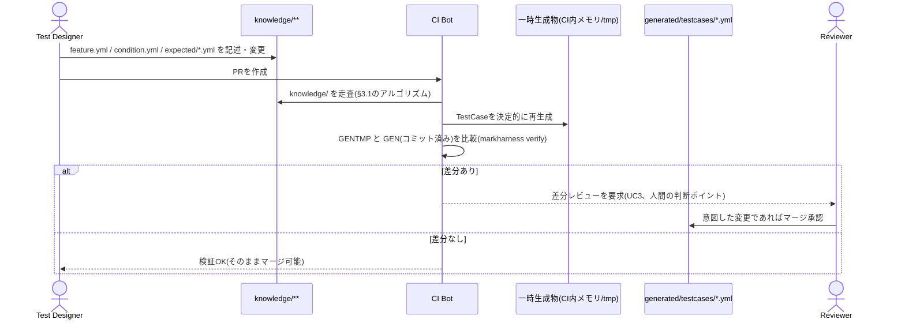

# テストケース自動生成の実現方法：設計ドキュメント

**Status**: Implemented(`src/generate.rs` / `src/traceability.rs`)。本資料は元々UC2の実現方法を事前検討した設計ドラフトだったが、実装(`src/generate.rs`)は細部で本資料の初期案と異なる形に落ち着いた。本版は実装に合わせて全面的に書き直したものであり、初期案からの差分は各節末の「実装時の変更」に残す。
**関連ドキュメント**: [テスト知識管理のGit-nativeモデル_統合版.md](../テスト知識管理のGit-nativeモデル_統合版.md)(以下「論文」)、[product-operation.md](../product-operation.md)

**位置づけ**：本資料は論文および「プロダクト運用イメージ」(`docs/product-operation.md`)を踏まえ、UC2「TestCaseを決定的生成する」の**具体的な実現方法**を記述したものです。論文本文に明記されている箇所には該当節番号を付し、製品化にあたって補った箇所は「(製品化提案、論文本文には明記なし)」と明記します。

---

## 1. 位置づけ・目的

論文は`FEATURE`/`CONDITION`→`TESTCASE`の生成関係を「構造的な生成グラフ」(静的、版に依存しない)と呼び、研究の核心的貢献(RQ1、版履歴DAG)とは切り分けています(§3.2(A))。一方で、この生成グラフ自体はツール構成として設計対象に含まれており(§4.5「テストケース生成ツール：`Feature + Condition`から`TestCase`を生成し、再生成結果と現在のファイルの一致をCIで検証」)、`docs/product-operation.md`ではUC2・UC3として運用フロー上に組み込まれています。

```
UC1(知識を記述する) --include--> UC2(TestCaseを決定的生成する) --include--> UC3(生成物をレビュー・マージする)
```

しかし、UC2の記述(`docs/product-operation.md` 105行目)は「Feature+Conditionの組を機械的に走査し`generated/testcases/*.yml`を再生成」とあるのみで、**走査方法・命名規則・テキスト組み立て規則・決定性の担保方法**は未定義です。本資料はこの空白を埋めます。

**スコープ外であることの確認**：論文§7は「構造からのテストケース自動生成の**網羅率評価**」を将来課題としていますが、これは生成された`TestCase`集合が実際のテスト観点をどれだけ網羅できているかという**評価**の話であり、本資料が扱う「決定的に生成する**方式**そのものの設計」とは別軸です。本資料は後者のみを対象とし、網羅率評価には立ち入りません。同様に、LLMによる生成拡張(付録A.1)もスコープ外です。

---

## 2. 入力データモデルの確認

実装(`src/knowledge.rs`)における実際のファイル構成は以下の通りです(`markharness init`が作る規約に基づく、拡張子は`.yml`)。

```
knowledge/<requirement>/
├── requirement.yml                   # id, label, axis, description?
└── <feature>/
    ├── feature.yml                   # id, requirement, label, axis, description?, forked_from?
    └── <behavior>/                   # ディレクトリ名は自由。behavior.ymlの有無で判定
        ├── behavior.yml              # id, feature, label, axis, description, preconditions([ADR 0016](../decisions/0016-behavior-condition-precondition-step-result-model.md)。旧steps)
        └── <condition>/              # ディレクトリ名は自由。condition.ymlの有無で判定
            ├── condition.yml         # id, behavior, label, description, steps, additional_preconditions(ADR 0016で新設)
            └── expected/
                ├── 001.yml           # id, condition, description, results(ADR 0016で新設), additional_steps?, implementation_note?
                └── 002.yml
```

各YAMLの`id`はGitのblob SHAではなく人間可読なslugです(論文§3.1・§3.5でいう表示用ではなく識別子そのものとして使用)。**当初案(以下§9参照)とは異なり、実装では`Behavior`/`Condition`/`ExpectedResult`のいずれも親要素へのID参照フィールド(`feature`/`behavior`/`condition`)を明示的に持つ**(`knowledge.rs`の各構造体定義)。生成アルゴリズム自体はディレクトリの入れ子構造だけを辿り、これら参照フィールドの値を生成ロジックの分岐には使わない(`TestCase.generated_from`へコピーするのみ)が、値の整合性チェック(親参照が実在するか)は`markharness knowledge validate`側(`knowledge-apply-cli-spec.md`)が担う。

### 論文§3.5「idはパスに依存しない」原則との関係

論文§3.5は、版履歴計算(id解決キャッシュ、§3.3)におけるidが**パスに依存しない**設計であるべきことを述べています。これはリネーム耐性のための制約であり、「あるコミット時点でidがどのパスにあったか」をキャッシュで引く際にパス文字列そのものをキーにしないという話です(実装は`Feature`のidについてこの原則に従っており、`id_cache.rs`はディレクトリ名ではなく`feature.yml`の`id:`フィールドを正準ソースとする。詳細は論文§3.3の実装注記を参照)。

これに対し、テストケース生成は**版履歴を必要としない静的処理**(§3.2(A))であり、「現在のワーキングツリー上のディレクトリ階層」を入力として一度きり走査します。つまり、

- 版履歴DAG(§3.2(B))の識別子解決：パス非依存(`id:`フィールド + id解決キャッシュ)
- テストケース生成(§3.2(A))の親子関係解決：**現在のツリーのパス階層に依存してよい**

という区別が成り立ち、両者は矛盾しません。したがって、本設計では**ディレクトリ階層ベース**の走査を採用します(§3参照)。

---

## 3. 生成アルゴリズム(ディレクトリ階層ベース、`src/generate.rs::generate_testcases`)

### 3.1 走査手順(実装の要約)

```
function generate_testcases(knowledge_root):
    testcases = []
    for requirement_dir in sorted_subdirs(knowledge_root):
        if !(requirement_dir / "requirement.yml").is_file(): continue
        requirement = parse(requirement_dir / "requirement.yml")

        for feature_dir in sorted_subdirs(requirement_dir):
            if !(feature_dir / "feature.yml").is_file(): continue
            feature = parse(feature_dir / "feature.yml")

            for behavior_dir in find_dirs_with_marker(feature_dir, "behavior.yml"):
                behavior = parse(behavior_dir / "behavior.yml")

                for condition_dir in find_dirs_with_marker(behavior_dir, "condition.yml"):
                    condition = parse(condition_dir / "condition.yml")

                    expected_paths = sorted(list_files(condition_dir / "expected"))
                    if expected_paths.is_empty(): continue      # Conditionのみでは生成されない(§6)

                    expected_results = [parse(p) for p in expected_paths]

                    phases = []
                    for i, e in enumerate(expected_results):
                        additional_steps = e.additional_steps or []
                        steps = (condition.steps + additional_steps) if i == 0 else additional_steps
                        phases.append(Phase{steps: steps, results: e.results})

                    testcases.append(TestCase{
                        case_id: f"tc-{requirement.id}-{feature.id}-{behavior.id}-{condition.id}",
                        generated_from: {requirement.id, feature.id, behavior.id, condition.id,
                                          expected_results: [e.id for e in expected_results]},
                        preconditions: behavior.preconditions + condition.additional_preconditions,
                        phases: phases,
                        axis: union_sorted_dedup(requirement.axis, feature.axis, behavior.axis),  # 3.4節
                    })

    return sorted(testcases, key=lambda tc: tc.case_id)
```

- `sorted_subdirs`は各階層でディレクトリ名を文字列ソートしてから走査するため、ファイルシステムの列挙順に依存しない。
- `find_dirs_with_marker(root, marker_file)`は`root`配下を再帰的に探索し、`marker_file`(`behavior.yml`/`condition.yml`)を直接含むディレクトリを見つけ次第、そのブランチの探索を打ち切って結果に加える。したがって`behavior`/`condition`ディレクトリは`feature`/`behavior`の直下である必要はなく、中間ディレクトリを何段挟んでもよい(中間ディレクトリ自体に意味は無い、Feature/Behavior/Conditionの厳密な直下配置を要求しない)。
- Conditionディレクトリに`expected/`が存在しない、または空の場合は**そのConditionからは`TestCase`を生成しない**(3.2節、当初案とは異なり「Condition+ExpectedResultが揃って初めて1件」という単位)。

### 3.2 TestCase生成単位とid命名規則

**当初案(§9参照)とは異なり、`TestCase`は「1 Condition = 1 TestCase」の単位で生成され、そのConditionが持つ全ての`ExpectedResult`を1つの`TestCase`に集約する**(ExpectedResultの数だけ`TestCase`を分割しない)。`case_id`は

```
tc-{requirement.id}-{feature.id}-{behavior.id}-{condition.id}
```

で命名する(旧版は`tc-{condition.id}-001`という、末尾に予約の連番3桁を付ける命名だったが、`condition.id`だけを別のBehavior配下で再利用すると`case_id`が衝突する欠陥があったため、`requirement`/`feature`/`behavior`/`condition`の4つのidをすべて連結する形に変更した。`knowledge/`のディレクトリ階層自体が同じ`condition.id`の重複を許さない構造になっているため、その階層をそのまま`case_id`に反映させれば、衝突を検出する別レイヤーの検査を持たなくても衝突が構造的に起こり得なくなる)。`generated/testcases/`配下の出力先も同様に、`case_id`と同じ理由で`condition.id`単体のフラットなファイル名(`generated/testcases/ground.yml`)から、`knowledge/`と同じ階層をそのままミラーした`generated/testcases/{requirement.id}/{feature.id}/{behavior.id}/{condition.id}.yml`(`TestCase::relative_path()`)に変更した。

### 3.3 preconditions / phases のテキスト組み立て

当初案が想定していた「固定テンプレート＋knowledge側の短い名詞句の埋め込み」による自然文生成(`title = "{要約} (#{seq})"`等)は採用せず、実装は**knowledge側のフィールド値をそのまま転記する**方式にした。この方針自体は[ADR 0016](../decisions/0016-behavior-condition-precondition-step-result-model.md)後も変わっていない。

```
preconditions = behavior.preconditions + condition.additional_preconditions   # 連結、加工なし
phases        = [Phase{steps: (condition.steps + (e.additional_steps or [])) if i == 0 else (e.additional_steps or []),
                        results: e.results}
                  for i, e in enumerate(expected_results)]                     # expected_resultsはファイル名順
```

理由：

- 完全な自然文生成(LLM等)は本研究のスコープ外(付録A.1)であることに変わりはないが、固定テンプレートによる文字列合成すら行わないことで、生成ロジックが`knowledge/`側の文言だけに依存する最も単純な純粋関数になり、決定性(4章)の証明・実装が容易になる。
- テンプレート文言の作り込み(「〜の後、〜となる」等の言い回し)は`condition.steps`/`expected_result.results`の各要素側の書き方の問題として、Test Designerの記述時の責務に寄せた。

**[ADR 0015](../decisions/0015-behavior-step-model.md)→[ADR 0016](../decisions/0016-behavior-condition-precondition-step-result-model.md)への変遷**: ADR 0015 Phase 1は、`behavior.yml`に`description`(人間向けの1文要約、生成には使わない)と`steps: Vec<String>`(順序付きの操作手順、1要素=1操作、`TestCase.steps`へそのまま転記)を別フィールドとして持たせ、同一Behavior配下の全Conditionがこの`steps`を共有するモデルを採った。実運用でこのモデルを使うと、条件ごとに操作内容が異なる(例:「空白のみのテキストを入力する」と「有効なテキストを入力する」)ケースを表現できない問題が判明し、ADR 0016でこれを置き換えた。ADR 0016では、`behavior.steps`(内部的には`Behavior.preconditions`)の意味を「全Conditionに共通する前提」に変更し、実際の操作手順は新設の`Condition.steps`が担う。あわせて`ExpectedResult`に`results: Vec<String>`(観測可能な複数の結果)と`additional_steps: Option<Vec<String>>`(その結果を確認する前に必要な追加操作)を新設し、`TestCase`の`title`/`steps`/`expected`という3つのフラットフィールドを`preconditions`/`phases: Vec<Phase>`に置き換えた。`phases`は`expected/*.yml`をファイル名順に走査した`Phase{steps, results}`の配列で、先頭のphaseだけ`condition.steps`を`steps`の先頭に置く。

### 3.4 axisの継承

`REQUIREMENT`・`FEATURE`・`BEHAVIOR`それぞれの`axis`フィールド(§3.1、`axes/*.yml`でレジストリ管理)を**合成(union)**し、重複除去のうえソートしたものを生成された`TestCase.axis`とする(`generate.rs::union_axis`)。当初案の「Featureのaxisのみ継承」から、3階層分の合成に変更した。これにより`generated/traceability-index.json`(`src/traceability.rs`、§3.5のディレクトリ構造)側で「観点(Axis)ごとのTestCase一覧」を再構築でき、横断的観点をFeature側だけでなくTestCase側からも引けるようにする(製品化提案、論文本文には明記なし)。`traceability-index.json`は`TraceabilityEntry{case_id, requirement, feature, behavior, condition, expected_results, axis}`の配列を持つ実装済みの形式であり、当初案の時点では中身が未定義だった。

---

## 4. 決定性の担保

論文§4.5は「再生成結果と現在のファイルの一致をCIで検証」する前提を置いています。この検証が成立するためには、**同一の`knowledge/`内容から常に同一の`generated/testcases/*.yml`(および`generated/traceability-index.json`)が得られる**ことが必要です。実装では以下によって決定性を担保しています。

1. **走査順の固定**：`sorted_subdirs`・`find_dirs_with_marker`・`expected/`配下のファイル列挙のいずれも、文字列ソート(パス昇順)してから処理する(3.1節)。
2. **id生成の固定**：`case_id`は`condition.id`から機械的に導出し(3.2節)、乱数・タイムスタンプ・実行環境依存の値を一切使わない。
3. **テキスト生成の固定**：3.3節の通り`knowledge/`側のフィールド値をそのまま転記するのみで、テンプレート合成・外部呼び出し(LLM等)を含まない。
4. **出力のシリアライズ順固定**：`generate_testcases()`の戻り値は`case_id`で最終ソートしてから返す(`generate.rs`末尾の`testcases.sort_by`)。`generated/testcases/`書き込み前に既存ディレクトリを丸ごと削除してから再生成する(`cli.rs`の`Command::Generate`)ため、削除済みFeature/Conditionのファイルが残留することもない。

これにより、`generate_testcases()`は同じワーキングツリーに対して冪等であり、`markharness verify`(1.6節、`docs/cli-manual.md`)が「CIで再生成 → 既存の`generated/testcases/*.yml`とバイト単位で比較 → 一致すればOK、不一致なら差分をレビュー要求」というUC2/UC3のフローを実現します。

---

## 5. CI検証フロー(UC2/UC3との対応)

`docs/product-operation.md`のシーケンス図のフォーマットに合わせると、以下のようになります。



この図は既存の`docs/product-operation.md`の1章シーケンス図における「CI->>GEN: Feature+Conditionから TestCase を決定的に再生成」のステップ(24〜30行目)を、本資料3〜4章のアルゴリズムで具体化したものです。

---

## 6. エッジケース・限界

| ケース | 扱い |
|---|---|
| 1つのFeature(Behavior)に複数のConditionがある | Condition数だけ`TestCase`が生成される(組み合わせは`Feature × Condition`の直積ではなく、実在するConditionのみを列挙するため、実務上の組み合わせ爆発は起きにくい)。 |
| 1つのConditionに複数のExpectedResultがある | **`TestCase`は1件のまま**、`TestCase.phases`(配列)に、`expected/*.yml`をファイル名順に走査した`Phase{steps, results}`が集約される([ADR 0016](../decisions/0016-behavior-condition-precondition-step-result-model.md))。§3.2の当初案(ExpectedResultごとに`TestCase`を分割)からの変更点。 |
| ConditionはあるがExpectedResultが無い(`expected/`が空、または存在しない) | `TestCase`は生成されない(`generate.rs`が空チェックでスキップする)。 |
| Conditionを持たないFeature/Behaviorがある | `TestCase`は生成されない(§3.1のER図で`generates`の起点は`FEATURE`と`CONDITION`の両方であるため)。 |
| `forked_from`を持つFeature | 生成アルゴリズムには影響しない。`forked_from`は概念的派生を示す手動記述(§3.1)であり、構造的生成グラフ(§3.2(A))とは独立した情報のため、生成ロジックはこのフィールドを参照しない。 |
| Behavior階層の扱い | **当初案とは異なり、実装は`behavior.yml`の存在をConditionと同格の必須階層として扱う**(`find_dirs_with_marker`で明示的に探索し、`behavior.preconditions`(旧`behavior.steps`)を`TestCase.preconditions`の一部に、`behavior.axis`を`TestCase.axis`の合成元に使う。`behavior.description`は[ADR 0015](../decisions/0015-behavior-step-model.md) Phase 1以降、生成には使わない人間向け要約)。Behaviorを持たないConditionから`TestCase`は生成されない。 |

### CTM(Classification Tree Method)との関係の再確認

論文§2.3は、CTMを「分類木からのテストケース生成という点で発想を共有するが、Git管理・バージョン履歴・実行結果追跡を含むライフサイクル管理は範囲外」と位置づけています。本設計もこの立場を踏襲し、**新しいテスト設計技法を提案するものではなく**、Test Designerが既に`knowledge/`に記述した設計(Feature/Condition/ExpectedResult)を機械的・決定的に`TestCase`へ変換する処理であることを明確にします。テスト観点の網羅性・分類軸の設計自体はTest Designerの責務のままです。

---

## 7. 将来課題との切り分け

以下は本資料のスコープ外であり、論文§7・付録A.1に委ねます。

- 生成された`TestCase`集合の**網羅率評価**(論文§7)。
- LLMによる自然文の手順書自動生成・文脈供給(付録A.1、本研究のスコープから完全除外)。
- Behavior階層を使ったより高度なグルーピング・Axisの多段管理などのモデル拡張。

---

## 8. 検証(実装のテストフィクスチャとの整合確認)

`generate.rs`の単体テスト`generates_single_testcase_aggregating_all_expected_files_under_one_condition`が使うフィクスチャで3.1節のアルゴリズムを手動でトレースすると、以下の通り実装の出力と一致します。

- `requirement.yml`: `id: req-todo`, `axis: [security]`
- `feature.yml`(`req-todo/todo/`配下): `id: todo`, `axis: [ui, data]`
- `behavior.yml`(`todo/todo-add-task/`配下): `id: todo-add-task`, `axis: [ui]`, `description: "User adds a task."`, `preconditions: ["Click the title field.", "Press the add button."]`
- `condition.yml`(`todo-add-task/todo-add-task-empty-input/`配下): `id: todo-add-task-empty-input`, `description: "Title is empty."`, `steps: ["Do it."]`, `additional_preconditions: []`
- `expected/001.yml`(1件のみ): `id: todo-add-task-empty-input-001`, `description: "Shows a validation error."`, `results: ["Shows a validation error."]`

→ 生成される`TestCase`(`generated/testcases/todo-add-task-empty-input.yml`):
```yaml
case_id: tc-todo-add-task-empty-input-001
generated_from:
  requirement: req-todo
  feature: todo
  behavior: todo-add-task
  condition: todo-add-task-empty-input
  expected_results:
    - todo-add-task-empty-input-001
preconditions:
  - "Click the title field."
  - "Press the add button."
phases:
  - steps:
      - "Do it."
    results:
      - "Shows a validation error."
axis: [data, security, ui]   # requirement[security] + feature[ui, data] + behavior[ui] の合成・重複除去・ソート
```

## 9. 当初案からの主な変更点(実装時)

本資料の初版(検討ドラフト)は`samples/repo/knowledge/player/**`という当時のサンプルデータをもとに、`TestCase`をExpectedResultの数だけ分割し`{feature_id}-{condition_id}-{連番}`というidを振る案を検討していたが、実装(`src/generate.rs`)は以下の点で異なる設計に決着した。

| 項目 | 初版の案 | 実装 |
|---|---|---|
| TestCaseの生成単位 | ExpectedResult 1件につき1 TestCase | **Condition 1件につき1 TestCase**(ExpectedResultは`expected`配列に集約) |
| `case_id`の形式 | `{feature_id}-{condition_id}-{連番3桁}` | `tc-{requirement.id}-{feature.id}-{behavior.id}-{condition.id}`(§10参照。旧実装は`tc-{condition.id}-001`だったが、`condition.id`がBehaviorをまたいで衝突する欠陥のため変更した) |
| axisの継承元 | Featureの`axis`のみ | Requirement・Feature・Behaviorの`axis`を合成(union) |
| preconditions/phasesのテキスト | 固定テンプレートによる文合成 | knowledge側のフィールド値をそのまま転記(加工なし) |
| Behavior階層 | 生成に使わない(将来拡張の余地として言及のみ) | `find_dirs_with_marker`で明示的に探索し、`steps`/`axis`に反映する必須階層 |
| ファイル拡張子 | `.yaml`(サンプルに合わせた表記) | `.yml`(`markharness init`の規約) |

この変更は、3.2節で述べた通り「1 Condition = 1 TestCase」という単純な対応関係の方が決定性の証明・実装が容易であり、かつCondition自体が既に「1つの検証観点」を表す粒度であるため、ExpectedResultで細分化する必要が薄いと判断されたことによる。

なお、`case_id`が`condition.id`のみから機械的に決まる方式(`tc-{condition.id}-001`)は、当初案が課題としていた「`condition_id`が`feature_id`のprefixを部分的に含む場合の重複」問題は回避できていたが、**別のBehavior配下で同じ`condition.id`が再利用された場合に`case_id`が衝突する**という欠陥があった。これは実運用(AIエージェントによる知識生成)で実際に踏まれ、`generated/testcases/`のフラットな出力先(`condition.id`のみをファイル名に使う)により生成ファイルが無言で上書きされる事故につながった。この欠陥への対処は§10を参照。

## 10. `case_id`衝突の構造的解消(実運用フィードバックによる変更)

§9の実装(`tc-{condition.id}-001` + フラットな`generated/testcases/{condition.id}.yml`)を実際にAIエージェントによる知識生成タスクで使わせたところ、異なるBehavior配下で同じ`condition.id`(例: `valid-title`)を再利用した際に、後から`generate`した`TestCase`のファイルが先に生成した同名ファイルを無言で上書きし、テストケースが消失する事故が発生した。`knowledge apply`/`knowledge validate`の一意性チェックはBehaviorスコープに閉じており、この種のグローバルな衝突は検出しない。

これに対して、「グローバル重複チェックを新設する」のではなく、**衝突が構造的に起こり得ない設計に変更する**方針を採った。

- `generated/testcases/`の出力先を、`knowledge/`と同じ4階層(`{requirement.id}/{feature.id}/{behavior.id}/{condition.id}.yml`)でフルミラーする(`TestCase::relative_path()`)。`knowledge/`のディレクトリ階層自体が同一パスへの重複配置を許さない(同じディレクトリに同じ名前の子ディレクトリを2つ作ることはファイルシステム上できない)ため、これをそのまま出力先に反映すれば、ファイル名の衝突はこの4階層の名前が完全に一致する場合(=つまりそもそも`knowledge/`側で同一の対象を指している場合)に限られ、構造的に起こり得なくなる。
- `case_id`も同様の理由で`tc-{requirement.id}-{feature.id}-{behavior.id}-{condition.id}`に変更し、`execution record`が使う`case_id`ルックアップキー自体の衝突も同時に解消する(ファイル名だけ直しても、`case_id`が`condition.id`のみに依存したままでは実行結果記録時の曖昧さが残るため)。
- 副作用として、`requirement.id`/`feature.id`/`behavior.id`もパスの一部になるため、`condition.id`だけに課していた「有効なslugであること」の検証(`is_valid_slug`によるパストラバーサル対策)を、この3つのidにも同様に課すよう`generate_testcases`を拡張した。

この方針により、「衝突を検出して警告/エラーにする」という別レイヤーの検査ロジックを持つ必要がなくなり、バグのクラス自体を設計から排除できた。後方互換性は考慮していない(破壊的変更)。詳細は`checklist-cli-usability-improvements.md`を参照。
