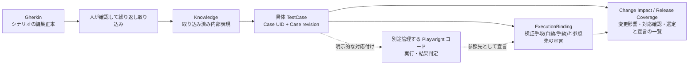
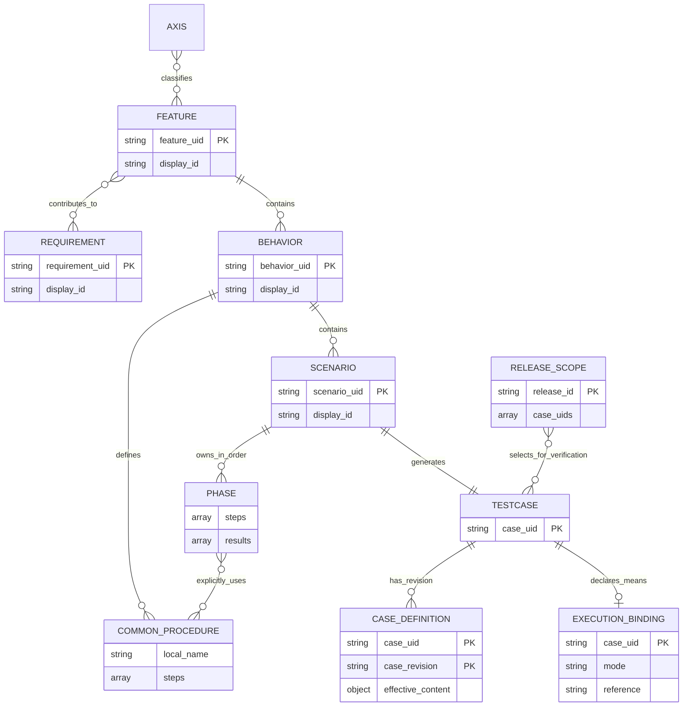
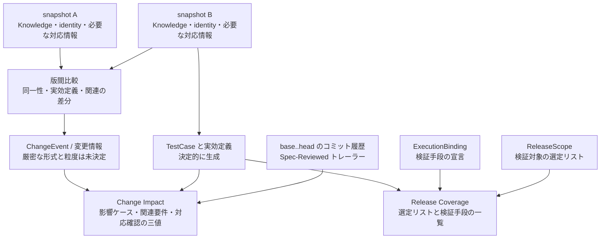

# テスト知識管理のGit-nativeモデル

### A Version-Aware Model for Git-Native Test Knowledge Management

**位置づけ**：本稿は [ADR 0017](./decisions/0017-scenario-case-revision-and-execution-evidence.md) を出発点とし、[ADR 0019](./decisions/0019-alignment-check-commit-trailer.md)〜[ADR 0026](./decisions/0026-module-inventory-and-plan-removal.md) で改訂した設計提案と評価計画である。本文・図・例はすべてこの採用モデルを記述する。Knowledge・決定的生成・identity・版間比較に加え、対応確認、検証手段の宣言、リリース選定は実装済みである。一方でインポート試験・性能測定・被験者実験は未完了であり、有効性を実証した論文ではない。未決定事項は第4章と第7章に示す。旧モデルの説明は付録Aの変更経緯に限定する。

## 1. Introduction

### 1.1 動機と対象

テスト定義を変更したとき、実行者は「何が変わったか」「その変更に対して要件とケースの対応が確認されたか」「対象リリースで何を検証対象に選び、それぞれをどの手段で検証するのか」を判断する必要がある。表示名、保存場所、手順の内容を一つの識別子や版にまとめると、名称変更による履歴の分断や、異なる定義の取り違えにつながる。

本モデルはテスト知識から具体的なケースを生成し、その同一性、検証内容の版、検証手段の宣言を分離する。markharness の責務はテストケースの管理、版を軸にした変更検知、要件とケースの対応確認、検証手段の宣言とリリース選定の保持である。実行結果（pass/fail/skip）、対象ビルド、実行環境は保存しない（[ADR 0020](./decisions/0020-execution-status-lightweight-model.md)）。実行コードは別途作成・管理し、実行と最終結果の判定は外部ツールまたは手動実行の担当者に委ねる。

**図1：想定する継続運用**



点線はコード生成を意味しない。ケースとの対応付けは、実行コードがその内容を正しく実装していることの証明ではない。`ExecutionBinding` は検証手段の宣言であり、実行した事実でも合格の証跡でもない。

### 1.2 研究課題

> RQ1：明示的な版と変更関係を持つテスト知識モデルは、対象組織の実際の複合運用と比較して、特に複数世代にわたる変更影響の識別タスクの正答率・所要時間を改善するか。

RQ1 は未検証の仮説である。ケース定義の差分と、要件・実装の変更による意味上の影響は同じではない。後者の完全な自動検出を前提にせず、モデルから得られる情報が人の判断を支援するかを評価する。

### 1.3 設計上の貢献と範囲

本稿は以下の組合せを検証対象とする。

1. 可変な表示 ID と不変 UID を分離し、ケースの同一性を配置や確認項目の集合から独立させる。
2. 構造化した Scenario と明示参照する共通手順から、実効 TestCase を決定的に生成する。
3. 保存内容を表す Git OID と、検証内容を表す Case revision を分離する。
4. 固定した snapshot 間の変更情報と、コミット履歴に記録した要件・ケースの対応確認を結び付ける。
5. 外部の編集・実行ツールを維持しながら、内部の履歴判定に必要な入力を Git に固定する。

個々の要素やその組合せが世界初であるとは主張しない。新モデルを対象とする体系的な比較調査、実装上の正確性検証、実務上の有効性評価は残っている。

### 1.4 Git-native の意味

履歴比較と対応確認に必要な内部データを Git で保存し、専用サーバーや Git 外の正準データベースを必須にしない。identity の宣言、取り込み済み Knowledge、必要な対応情報、固定された実効定義、検証手段の宣言、リリース選定リスト、および `base..head` のコミット履歴は、この再現可能性を支える入力である。キャッシュと検索インデックスは派生物であり、削除後に再構築できなければならない。

Gherkin や実行コードが別リポジトリにあることは許容する。ただし、内部の過去判定は外部サービスの現在値に依存させない。元の外部レポート全文や Playwright の実行環境まで clone だけで再現できるという保証ではない。保存する監査情報と外部参照の詳細は実装設計で定める。

## 2. Related Work と位置づけ

### 2.1 内容の fingerprint と関連の追跡

Doorstop は item の fingerprint と reviewed fingerprint を比較し、リンク先についてもレビュー時の fingerprint を使って変更を検出する。したがって、内容に由来する版や関連先の変更検出自体を本モデル固有の発明とは位置づけない。本モデルでは、共通手順を展開したケース定義と、要件変更に対する対応確認との関係を評価対象にする。[Doorstop Item Reference](https://doorstop.readthedocs.io/en/v2.0/reference/item/)

### 2.2 要件文書とテスト知識

StrictDoc は要件文書、要件間の関係、独自フィールドを扱う。これらは単なる保存上の所属とは異なる。markharness での Requirement と Feature の関連は「実現に寄与する」であり、StrictDoc の要件間関係をそのまま同じ意味で取り込めるとは限らない。要件本文以外の保持範囲は未決定である。[StrictDoc User Guide](https://strictdoc.readthedocs.io/en/stable/stable/docs/strictdoc_01_user_guide.html)

### 2.3 実行可能な仕様との連携

Gherkin は Scenario のステップ列に加え、Background、Rule、Scenario Outline / Examples、表・複数行引数を持つ。markharness の Scenario は一つの具体ケースを表すため、Gherkin のあらゆる構文と一対一には対応しない。インポートは意味を保つ変換規則と人の確認を必要とする。[Gherkin Reference](https://cucumber.io/docs/gherkin/reference/)

### 2.4 比較の限界

本章は上記の一次資料で確認した関係を記したもので、既存ツール全体の機能比較や systematic review ではない。既存 TMS に版管理やトレーサビリティがないとは主張しない。評価時には対象組織が実際に使うツール構成を調査し、その運用との比較として結果を報告する。旧モデルについての比較表を、新モデルの優位性の証拠として転用しない。

## 3. Model Design

### 3.1 知識の構造と ER 図

Requirement は要求される成果、Feature は機能のまとまりである。Feature は Requirement と独立して保存し、`requirement_uids` で複数要件へ対等に関連付ける。関係は Feature 側を正本とし、逆方向の一覧は派生させる。Requirement の axis は Feature に自動継承しない。

Behavior は関連する Scenario と共通手順をまとめる。Scenario は順序付き Phase を所有する。Phase は操作と期待結果を持つ値であり、独立した UID やライフサイクルを持たない。共通手順も、この決定だけを根拠に独立した identity 台帳へ登録しない。

**図2：採用モデルの概念 ER 図**



この図は概念上の関連を示し、保存テーブル・最終的なフィールド型・必須項目を確定するものではない。Phase は Scenario 内の配列位置で扱い、`local_name` は Behavior 内の参照名の例である。共通手順は所属する Behavior のものだけを参照できる。ER 図の関連線だけでは使用回数や順序を表せないため、それらは Phase の steps 配列が保持する。

CASE_DEFINITION は Case UID と Case revision の組で識別される固定定義であり、TESTCASE の新しい論理 identity ではない。EXECUTION_BINDING は検証手段の宣言であって実行の事実ではなく、合否・日時・対象ビルド・実行環境の置き場を持たない（[ADR 0020](./decisions/0020-execution-status-lightweight-model.md)・[ADR 0025](./decisions/0025-v2-forward-compatible-evolution.md)）。RELEASE_SCOPE は選定リストだけを持ち、選定日時・担当者・承認状態・合否を持たない（[ADR 0024](./decisions/0024-release-scope-selection-list.md)）。空 Phase 等の検証規則は未決定である。ChangeEvent と snapshot の関係は第3.5節で示し、未決定の保存形式を ER 図に捏造しない。

### 3.2 共通手順と決定的な生成

Scenario は共通手順を必要な位置で明示的に使う。Behavior の手順を先頭へ自動追加しない。共通手順から別の共通手順を呼ぶ入れ子は認めない。生成時に参照を解決して操作列へ展開し、配列順を維持する。

以下は意味を示す記述例であり、実行可能な現行スキーマの例ではない。

```yaml
# Behavior 内の定義
procedures:
  login:
    steps:
      - 認証情報を入力する
      - ログインボタンを押す

# Scenario 内の定義
phases:
  - steps:
      - use: login
    results:
      - マイページが表示される
  - steps:
      - action: ログアウトする
      - use: login
    results:
      - 再びマイページが表示される
```

共通手順の変更は、それを参照して実効内容が変わるケースへ反映する。参照欠落や曖昧な解決を、手順を省略した正常な生成として扱わない。外部手順管理のための汎用参照機構は今回の設計に追加しない。

### 3.3 論理的同一性と改訂

1 Scenario = 1 TestCase を正式な契約とする。Case UID は Scenario UID から型を区別して決定的に導出し、生成のたびに乱数で発行しない。表示 ID、FeatureUid、ScenarioUid、CaseUid、版参照は区別し、表示 ID を検証手段の宣言やリリース選定の代替キーにしない。

| 操作 | 同一性 |
|---|---|
| 名称変更、移動、操作や期待結果の改訂 | Scenario / Case UID を維持 |
| 別テストとして複製 | 新規 UID |
| 一部を別 Scenario へ切り出す | 元は維持、切り出し先は新規 |
| 元を廃止して複数へ分割 | 分割先はすべて新規 |
| 複数を廃止して一つに統合 | 統合先は新規 |

編集者または明示的な外部対応情報が継続性を指定する。本文の類似から推測しない。分割・統合の由来は記録するが、新しいケースへ過去の宣言・選定・対応確認を引き継がない。由来の記録形式は未決定である。

[ADR 0013](./decisions/0013-immutable-identity-model.md) の identity 宣言、決定性、回復に関する安全性は維持する。identity の操作は発行・改名・解決に限る。退役・復元・ID 予約・再発行は [ADR 0021](./decisions/0021-identity-retire-simplification.md) で廃止した — 廃止は Knowledge からの削除と Git 履歴で表し、identity の状態としては保持しない。

### 3.4 保存内容の版と検証内容の版

Git OID は保存内容の監査、Case revision は実効的な検証内容の識別に使う。

| 変更対象 | Case revision |
|---|---|
| 事前条件、準備操作、操作、期待結果、テストデータ | 実効内容が変われば変更 |
| Phase の追加・削除・並べ替え | 実効内容または順序が変われば変更 |
| 明示参照した共通手順 | 展開後の内容が変わるケースで変更 |
| 名前、説明、実装メモ、出典 | 変更しない |
| 分類タグ、要件との関連 | 変更しない。関連の変更として扱う |
| 所属移動 | 実効内容が変われば変更 |
| 対象ビルド、実行環境 | markharness は保持しない（[ADR 0020](./decisions/0020-execution-status-lightweight-model.md)） |

同じ snapshot と同じ生成・正規化規則から同じ実効定義と revision を得ることを要求する。正規化の厳密な規則、ハッシュ方式、規則の識別方法は未決定である。比較不能な規則を暗黙に同一と扱わない。自然言語の意味の同一性をハッシュ一致が証明するとは主張しない。

実行者が守る条件は説明だけでなく事前条件・操作・期待結果へ記述する。実行に使用する実効定義は Case UID + Case revision ごとに Git 内へ不変の記録として保存する。同じ定義は複数の実行で共有できる。revision 対象外の表示情報や出典 snapshot の監査情報は別に扱い、同じキーの定義を上書きしない。

### 3.5 snapshot 比較、ChangeEvent、Change Impact

マイルストーンタグ等で指定する固定 snapshot 間の比較を、版を軸にした追跡の基礎にする。比較時に必要な Knowledge、identity 宣言、外部対応情報を対象 snapshot に固定する。対応確認も `base..head` のコミット履歴を入力とし、外部サービスの現在値やキャッシュの有無によって過去の結果を変えない。履歴を取得できない場合（shallow clone 等）は診断付きで失敗させ、履歴不足を「確認済み」として扱わない。

**図3：派生情報と正本の関係**



ChangeEvent は変更情報、Change Impact は base/head 区間の影響と対応確認、Release Coverage はリリース単位の選定と検証手段の一覧を担う。VerificationPlan と証跡の適用可能性判定は [ADR 0020](./decisions/0020-execution-status-lightweight-model.md)・[ADR 0026](./decisions/0026-module-inventory-and-plan-removal.md) で廃止した。CanonicalSnapshot は外部レポート取込（`import`）の中間表現であり、手順の第二の編集正本にはしない。図の矢印は論理的な入力関係であり、未決定の API や自動候補選択アルゴリズムを確定するものではない。

実効入力の変更はケース版の変更検知へ届く必要がある。一方、Case revision の差分だけでは「要件は変わったが手順をまだ直していない」状態の意味上の影響を検出できない。要件・関連変更による再検討候補と、実際に定義が変わったケースを混同しない。Feature 単位の変更とケース差分の接続、関連変更時の候補抽出、複数世代を通じた照会の具体規則は実装前に定める。

中間の全編集操作を変更イベントとして保存することや、永続 Version DAG を新設することは決定していない。分岐・マージ監査についても、2 snapshot の比較と commit 履歴の解析を区別する。

### 3.6 検証手段の宣言と実行結果の非保持

markharness は実行結果（pass/fail/skip）、対象ビルド、実行環境を保存しない（[ADR 0020](./decisions/0020-execution-status-lightweight-model.md)）。TestCase について保持するのは `ExecutionBinding` — Case UID、検証手段 `mode`（automated / manual）、任意の参照先（テストコードのパスや手順書の URL）だけである。リリース単位では `ReleaseScope` が「そのリリースで何を検証対象に選んだか」だけを保持する（[ADR 0024](./decisions/0024-release-scope-selection-list.md)）。

| 記録 | 読んでよい意味 | 読んではならない意味 |
|---|---|---|
| `ExecutionBinding` がある | そのケースを何で検証するかが宣言されている | 実行した、合格した |
| `ExecutionBinding` が無い | 検証手段が未宣言である | 失敗した、対象外である |
| `ReleaseScope` に Case UID がある | そのリリースで検証対象に選んだ | 実行した、合格した |

宣言と事実を別の型に分ける理由は、同じ記録に同居させると「宣言しただけの状態」が「検証済み」として読まれるためである。どちらの記録も日時を持たないため、過去時点の問い合わせは Git ref（`--at`）で指定する。

実行・リトライ・集約・最終結果の決定は外部側が担当する。markharness は Run/Attempt モデルや flaky 判定を持たず、証跡の適用可能性判定（ケース版・対象ビルド・環境の突合）も行わない。実行の事実が必要になった時点で、`ExecutionBinding` を読み替えるのではなく別の型として追加する（[ADR 0025](./decisions/0025-v2-forward-compatible-evolution.md)）。

### 3.7 保存単位と再構築

`ExecutionBinding` は Case UID ごとに1ファイル、`ReleaseScope` はリリースごとに1ファイルとして Git 管理下に置く。ファイル名と内容中の識別子（`case_uid` / `release_id`）は一致していなければならず、一致しない記録は読まずに拒否する。`release_id` は単一のパス構成要素になるため、パスを横断しうる値は書き込み前に拒否する。外部レポートの取込（`import`）では元レポートへの参照を残し、重複取り込みを防ぐ。

検索インデックスやキャッシュは正本から再構築する。保存する実効定義は不変の記録であり、再生成対象の最新表示と区別する。

### 3.8 設計の到達点と未確定の契約

確定しているのは、所属と関連の分離、Scenario と Phase の所有、明示的な共通手順参照、ケース同一性、revision の対象項目、宣言と事実の分離、対応確認の三値とその有効範囲、リリース選定の責務、外部編集・実行との分担である。第3章の図はこれらを表す概念図である。

未確定のものは、正規化と型の詳細、空配列等の検証、ChangeEvent の厳密な形式と粒度、複数世代を通じた照会の規則、インポートの更新規則である。これらを埋めずに実装可能な全仕様が完成したとは扱わない。

## 4. Implementation Plan

### 4.1 実装状況と分割

本稿の新モデルのうち、下記1〜4は実装済みである（[ADR 0026](./decisions/0026-module-inventory-and-plan-removal.md)）。旧モデルに対する過去の実装報告を本モデルの動作保証として用いない点は変わらない。[Issue #40](https://github.com/markharness/markharness/issues/40) で追跡する設計・実装を次の単位に分ける。

1. 型付き参照、入力検証、版と正本の契約を具体化する。[Issue #41](https://github.com/markharness/markharness/issues/41) の Feature 参照修正は、この共通契約に沿って全再設計の完了待ちにせず進める。
2. Knowledge、共通手順、Scenario、生成を統一する。
3. Case revision、変更検知、不変の実効定義、派生モデルを実装する。
4. 検証手段の宣言（`ExecutionBinding`）、リリース選定リスト（`ReleaseScope`）、コミットトレーラーによる対応確認を実装する。実行記録の保存と証跡の適用可能性判定は行わない。
5. 実際の外部入力を用いて継続インポートを実装・検証する（未実施）。

### 4.2 Gherkin / Playwright の継続インポート

Gherkin 由来のケースは Gherkin を編集の正本とし、内部手順を二重編集しない。直接作成するケースでは Knowledge が正本である。外部 Scenario と内部 UID の対応を一か所で維持し、外部側の情報があれば利用し、なければ Git 管理の明示的な対応表で補う。名前・パス・行番号だけで継続性を推測しない。

Playwright コードは別途管理する。markharness 側は `ExecutionBinding` の `reference` でケースと実行コードの対応を宣言するだけで、実行結果は取り込まない。宣言の存在を「実行済み」「合格済み」と読み替えない。参照先が実際にそのケースを検証しているかは markharness の検証範囲外である。

Scenario Outline の行を具体 Scenario に展開する案は考えられるが、採用済みの規則ではない。再取り込み時の行の識別、削除、分割・統合、Data Tables / Doc Strings、Rule / Background の範囲、タグの対応を、具体例とともに決定する。入力を解析できることと、意味を保って変換できることは区別する。表現できない情報は黙って落とさず人へ報告する。

### 4.3 形式変更と過去データ

過去のスキーマ・データは最初から存在しなかったものとして扱う（[ADR 0026](./decisions/0026-module-inventory-and-plan-removal.md)§7）。旧形式 reader、互換レイヤー、移行・自動変換、旧データを名指しする診断は作らず、新スキーマで入力を検証する。記録種別ごとの `schema_version` は `1` に固定し、今後も引き上げない。これは過去を読むための互換機構ではなく、将来別種の記録を追加したときに種類を取り違えないための前方向の契約である（[ADR 0025](./decisions/0025-v2-forward-compatible-evolution.md)）。Case revision はこれとは別の内容追跡の概念である。

対応する形式の過去 snapshot から変更情報を再計算することは、旧形式の変換ではない。ただし任意の既存リポジトリへの適用や、大規模バックフィルの性能は保証しない。再計算範囲・キャッシュキー・再開方法は新契約に合わせて検討する。

### 4.4 検証例

実装では以下を正常系だけでなく失敗系も含めて確認する。

- rename・移動・繰り返し取り込みでの UID 維持と、曖昧な外部対応の拒否。
- 操作・期待結果・順序・共通手順変更による revision 更新、説明だけの変更による revision 維持。
- 分割・統合時の新規 identity と、宣言・選定・対応確認を引き継がないこと。
- `ExecutionBinding` / `ReleaseScope` の有無を合否として出力しないこと、およびファイル名と識別子が一致しない記録・破損した記録を拒否すること。
- 対応確認の有効範囲：本文中の言及をトレーラーと誤認しないこと、組の一方が後続コミットで変更されたら確認を無効化すること、履歴を取得できないときに「確認済み」としないこと。
- 重複取り込み・並行記録・中断後の保全と回復。
- 固定入力からの再計算、キャッシュ有無の同値性、過去 ref への問い合わせが現在の作業ツリーで変わらないこと。

## 5. Empirical Evaluation Plan（未実施）

### 5.1 比較対象とタスク

対象組織の実際の複合運用を対照群とし、新モデルを実装したツールを実験群とする。研究者が都合のよい単一ツールだけを対照にしない。ケース定義の変更識別と、意味上の影響識別をタスク上で区別する。

タスクを直近1リリースの浅い変更と、複数世代にまたがる深い変更に層別化する。深い変更層の正答率（適合率・再現率）を主指標、所要時間と主観的負荷を補助指標とする。新ツールへの習熟不足を交絡として扱い、事前練習・経験・対象プロジェクトへの熟知度を記録する。

### 5.2 正解データ

要件変更・PR・実行コード・CI 記録・当時のケース一覧から候補を構成する。同時変更は補助信号であり、生成物が一括更新された事実だけを正解にしない。空白変更や一括 rename 等の候補は個別の意味的関連性を確認する。

独立した複数の専門家が候補を判定し、候補外からも影響ケースを追加できるようにする。markharness の生成関係や Case revision の一致を正解の定義に使わない。評価者間一致度、判断不能な事例、成果物に残らない影響の限界を報告する。

### 5.3 実施条件と指標

実験前にモデル、候補抽出規則、入力形式、評価タスクを固定する。パイロット後に効果量・分散・検出力・有意水準・脱落率から人数を計画し、分析方法を事前登録する。候補数、Feature 当たりの Scenario 数、共通手順の参照範囲、外部取り込みの遅延や未解決件数も解釈のために記録する。

対応確認の三値判定と選定漏れ検出の精度は機能検証で確認する。RQ1 の人の判断支援効果と、保存容量・生成時間・検索時間の性能測定は別に評価する。本稿に実測値はない。

## 6. Threats to Validity

- **構成概念**：定義の差分は意味上の影響全体ではない。手順を更新していない要件変更や、外部コードとの不一致を見落とす可能性がある。
- **内的妥当性**：UI、学習時間、明示的な対応付け・検証手段の宣言・リリース選定・対応確認トレーラーの追加作業が結果へ影響する。
- **入力の信頼性**：`ExecutionBinding` の参照先が実際にそのケースを検証しているか、`Spec-Reviewed` が意味の整合を本当に確認した結果かを markharness は検証できない。宣言も確認もテスト実装の意味的正しさを保証しない。
- **外的妥当性**：単一組織・特定 Gherkin 記述規約・特定ランナーでの結果を一般化しない。
- **正規化と保存**：意味のある差分の除外、入力依存の欠落、固定定義の増加を検証課題とする。
- **実装の範囲**：機能が実装されていることは、並行書き込みやクラッシュ時の正確性・実務上の性能・RQ1 の効果の証明ではない。

## 7. Future Work

- ADR 0017 の残る未決定項目を具体化し、機能検証を完了する。
- ChangeEvent とケース版差分・要件関連変更の接続を定め、複数世代の照会を検証する。
- Gherkin の継続取り込みを、rename・削除・Examples の変更を含む実データで検証する。
- StrictDoc の要件間関係・独自項目について保持する範囲を決定する。
- Case revision の正規化、保存単位、重複排除、訂正・回復、キャッシュ再構築を検証する。
- 実務の複合運用を対照に RQ1 を評価し、大規模データの性能と運用負担を測定する。
- 実行の事実が必要になった時点で、`ExecutionBinding` とは別の型として Execution Fact を設計する。

自動実行エンジン、Playwright コード生成、リトライの独自判定、全外部形式の無損失な双方向同期は、今回の採用設計の対象外である。

## 8. Conclusion

本稿は、Scenario を具体ケースの単位とし、不変の Case UID、実効内容に由来する Case revision、Git に固定した定義、および実行の事実から切り離した検証手段の宣言を分離するモデルを提案した。Gherkin と Playwright をそれぞれ編集・実行の担当として維持し、markharness はケース管理と変更検知、要件とケースの対応確認、リリース選定と検証手段の一覧を担当する。

採用した設計は ADR 0017 と ADR 0019〜0026 に記録されている。中核機能は実装済みだが評価は未完了であり、正答率・所要時間の改善、完全なインポート適合性、性能上の優位性は結論できない。残る未決定の契約を具体化し、第4章の機能検証と第5章の評価計画を実施することが次の課題である。

## 付録A：変更経緯

旧モデルは Requirement 配下の五階層、Condition / ExpectedResult の分離、構成 UID 集合によるケース同一性、Feature tree SHA 中心の版照合を用いていた。ADR 0017 は、改訂時の同一性と検証内容の版、外部編集・実行との分担を明確にするため、これらを置き換えた。詳細な経緯と旧実装の記録は [ADR 0013](./decisions/0013-immutable-identity-model.md)、[0014](./decisions/0014-knowledge-schema-version-persistence.md)、[0015](./decisions/0015-behavior-step-model.md)、[0016](./decisions/0016-behavior-condition-precondition-step-result-model.md) と Git 履歴を参照する。

ADR 0017 が置いた実行証跡の保存、VerificationPlan、証跡の適用可能性判定は、[ADR 0020](./decisions/0020-execution-status-lightweight-model.md)・[ADR 0024](./decisions/0024-release-scope-selection-list.md)・[ADR 0026](./decisions/0026-module-inventory-and-plan-removal.md) で廃止した。実行結果の保存は外部ツールの責務であり、markharness が持つのは検証手段の宣言とリリース選定、および要件とケースの対応確認だけになった。identity の退役・復元・ID 予約・再発行も [ADR 0021](./decisions/0021-identity-retire-simplification.md) で廃止した。

以前退けた「保存内容を Git と重複して識別する独自ハッシュ」と、検証内容を識別する Case revision は目的が異なる。旧実装のテスト成功・測定値は新モデルの検証結果として引用しない。

## 参考資料

- [ADR 0017：採用設計と未決定事項](./decisions/0017-scenario-case-revision-and-execution-evidence.md)
- [ADR 0019：対応確認とコミットトレーラー](./decisions/0019-alignment-check-commit-trailer.md)
- [ADR 0020：実行状態の軽量モデル](./decisions/0020-execution-status-lightweight-model.md)
- [ADR 0024：リリース選定リスト](./decisions/0024-release-scope-selection-list.md)
- [ADR 0026：モジュール棚卸しと後方互換を考えない方針](./decisions/0026-module-inventory-and-plan-removal.md)
- [Issue #40：設計検討](https://github.com/markharness/markharness/issues/40)
- [Doorstop：Item Reference](https://doorstop.readthedocs.io/en/v2.0/reference/item/)
- [StrictDoc：User Guide](https://strictdoc.readthedocs.io/en/stable/stable/docs/strictdoc_01_user_guide.html)
- [Cucumber：Gherkin Reference](https://cucumber.io/docs/gherkin/reference/)

## 変更履歴(Changelog)

- 2026-09-12：ADR 0019〜0026 の実装に合わせ、実行証跡の保存・VerificationPlan・証跡の適用可能性判定を記述から除去し、`ExecutionBinding`(検証手段の宣言)、`ReleaseScope`(リリース選定リスト)、`Spec-Reviewed` トレーラーによる対応確認へ置き換えた。あわせて図1・ER図(図2)・派生情報の図(図3)、identity の退役/復元の記述、保存単位、実装状況、後方互換を考えない方針を更新した。
