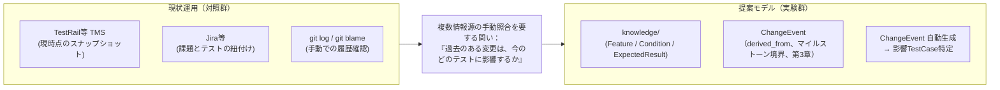
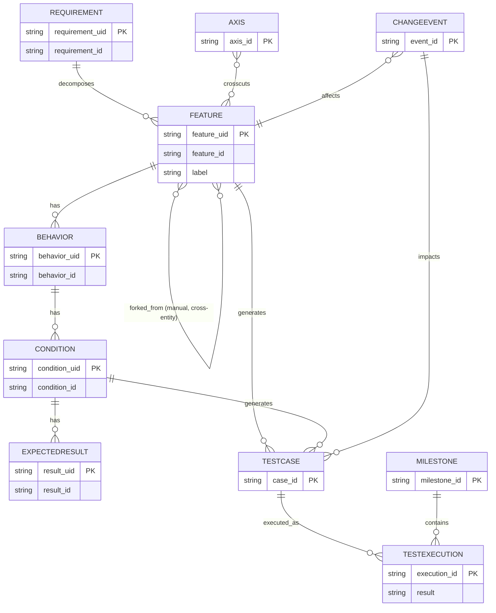
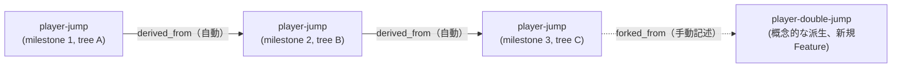
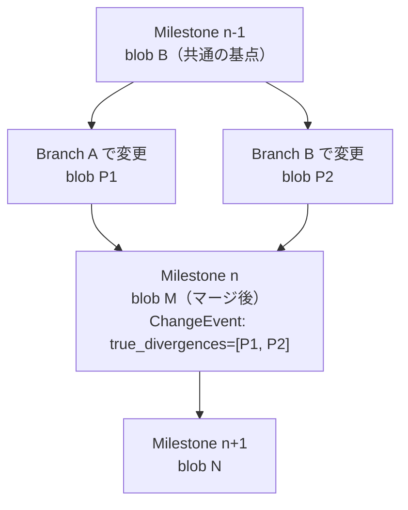
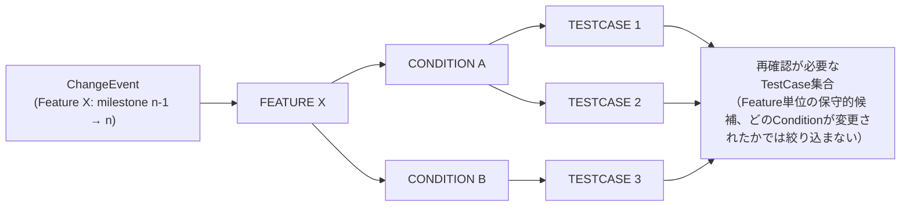
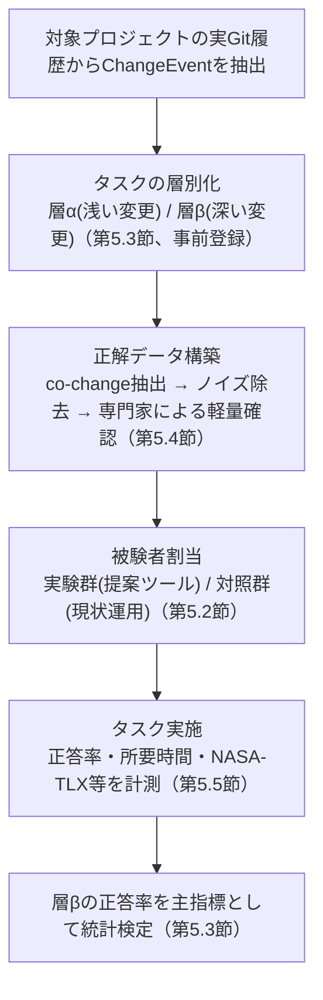

# テスト知識管理のGit-nativeモデル：統合版

### A Version-Aware Knowledge Graph Model for Git-Native Test Knowledge Management

**位置づけ**：本資料は「テストケース管理手法*研究テーマ検討まとめ」(検討経緯・不採用案の記録)と「テスト知識管理のGit-nativeモデル*実践論文ドラフト」(v1〜v10)を1本に統合したもの。検討経緯は付録Aにまとめ、本編(第1〜8章)は現時点で確定している設計・評価計画のみを記載する。

**論文種別**：設計提案＋リファレンス実装のレポート(ツール・実践論文ドラフト)。第5章に示す被験者実験による実証的評価(RQ1の検証)は未実施であり、Future Work(第7章・第8章)として明記する。
**想定投稿先**：ESEM / ICSME / SANER 等の実践寄りトラック、または国内ではSES / JSSST。ただし上記は実証的評価の完了を前提とする投稿先であり、現状の未実施の段階ではツール・アーキテクチャ提案トラック(Tool Demo等)への投稿、または実験完了後の投稿が現実的な選択肢になる。

---

## 0. 経緯サマリー

1. **初期案(A案)**：機能構造・テストケース・実行結果・マイルストーンを統合する情報モデル。研究テーマとしては要件⇔テスト⇔実装のトレーサビリティ研究(Cleland-Huang, 2011等)と重なり新規性が弱いが、「バージョン軸を第一級概念とする派生関係の追跡」は、調査対象の既存TMSとの差分候補として残った(付録A・検討まとめ第1章。現時点の限定は第2.10節)。
2. **Git階層・グラフ構造案との統合**：テスト知識(Requirement/Feature/Behavior/Condition/ExpectedResult)を木構造+横断的観点(Axis、グラフ構造)で管理し、テストケースをその派生物として扱うモデルに統合(検討まとめ第2〜3章)。
3. **LLM活用への全面ピボット案(不採用)**：「AI専用知識グラフ」への転換を検討したが、(a)クエリ速度・使いやすさの懸念は対象がLLMになっても解消されない、(b)新規性の主張として弱い、(c)評価方法が根本的に変わり単独では査読耐性が下がる、との理由で不採用(付録A.1)。
4. **部分ピボットと段階的な設計修正**：人間向けモデルを土台に、LLM角度は将来課題として切り出した上で、研究テーマを「案1：構造表現」単独に絞り込み(検討まとめ第4章)、以降10回以上の技術的指摘を受けて以下を確定させた。
   - 系譜キーを人間の手動整数からGitのコンテンツアドレス(blob SHA)＋祖先探索(`git merge-base`)に変更(第3.2節)。
   - 開発中のリアルタイム照会と、研究評価対象であるマイルストーン境界のChangeEventモデル(版履歴)を、別のグラフ(構造的生成グラフ vs ChangeEventモデル)として明確に分離(第3.2節、貢献の範囲を限定)。
   - id解決をコミット対象の単一ファイルからGitの`commit-graph`と同じ設計思想の非コミットキャッシュに変更し、内容アドレス方式のキャッシュキーと破棄条件を明記(第3.3節)。
   - 系譜確定のタイミングをコミット単位からマイルストーン境界単位に変更し、ブランチ戦略(merge/rebase/squash)非依存にした(第3.4節)。
   - 既存の大規模リポジトリへの移行を可能にする、マイルストーン限定・非同期・Git notes・遅延計算によるバックフィルアーキテクチャを本編に組み込んだ(第4章)。
   - 実験の対照群を、自作の疑似TMSや人工的な単一ツール比較ではなく、対象組織が実際に使う複合運用に統合(第5.2節)。
   - タスクを「直近1リリース内の浅い変更」と「複数世代にまたがり、既存運用では複数情報源の手動照合を要する深い変更」に層別化し、正答率(特に深い変更層)を主指標とした(第5.3節)。
   - 正解データの構築を、記憶に依存する聞き取りから、当時の成果物(co-change等)に基づく機械的な再構成に変更し、その際のノイズ除去基準を明記した(第5.4節)。

以下、本編。

**注(実装状況について)**：本編は当初の設計を記す。CLI実装(`markharness`、本リポジトリ)は中核アイデア(tree SHAベースの系譜キー・TestCase派生管理・ChangeEventのマイルストーン境界自動生成)を検証する段階にあり、設計の一部は実装時に簡略化・変更されている。主な相違点は各該当節に注記し、§3.6に一覧をまとめた。詳細な突き合わせは別紙[gap-analysis-mh-sample-test-case.md](./gap-analysis-mh-sample-test-case.md)を参照。

---

## 1. Introduction

### 1.1 動機

ソフトウェア開発における仕様変更は頻繁に発生し、その都度「どのテストケースを再確認すべきか」を判断する必要がある。既存のテスト管理ツール(TestRail・Zephyr Scale・Xray・qTest等)は、要件・機能・テストケース間の静的なトレーサビリティ(現時点のスナップショット)やマイルストーン管理機能を備える。TestRail(Enterprise版)はテストケース単体の履歴比較・復元機能(Test case versioning)を提供するが、これは個々のテストケースの編集履歴に閉じた機能であり、Gitのコミット意味論、構造化テスト知識、マイルストーン境界のChangeEvent、複数Featureをまたぐ再検証追跡を統合したローカル/Git-native運用は提供しない(参考文献参照。本研究の差分は第1.3節)。素朴なGit運用(Markdown/YAMLでのテストケース管理)も実務に存在するが、実行追跡・変更影響の系統的な追跡機能を欠く。

**図1：現状運用から提案モデルへ**



対象とする現状運用(TestRail/Jira/git検索の組み合わせ)は、「過去のある変更が今のどのテストに影響するか」という問いに必要な、複数Feature・複数リリースにまたがる派生関係を直接問い合わせ可能な形では保持しておらず、回答には複数情報源の手動照合を要する(TestRailのようにテストケース単体の履歴比較・復元機能を持つ製品はあるが、Featureの変更が波及するテストケース群を横断的に特定する機能とは異なる。第1.3節・第2.8節)。本研究は、この照合をGit自身のオブジェクトモデルを土台にしたマイルストーン境界のChangeEventモデルで支援できるという仮説を検討する(第3章)。この基盤は単純なパスベースの`git diff`/`git log --follow`ではなく、パス独立なID解決とディレクトリ単位のtree SHA比較を組み合わせた設計上の中核メカニズムであり、ディレクトリのリネーム・再配置後も同一のFeature idを解決できる(第1.3節・第3.3節)。

### 1.2 研究課題(RQ)

> RQ1: マイルストーン境界ごとに`derived_from`関係をChangeEventとして明示的に記録するテスト知識モデルは、対象組織のテスターが実際に使用している現状の運用(TMS・課題管理ツール・git検索等の組み合わせ)と比較して、特に**複数世代にわたる変更影響の識別タスク**において、正答率・所要時間を改善するか。

本研究はRQ1を中心課題とし、単一の研究課題に絞り込む。構造からのテストケース自動生成、Git粒度分割によるレビュー性向上等の関連課題は将来課題とする(第7章)。LLMによる文脈供給・手順書自動生成への応用は、検討の結果、本研究のスコープから完全に除外した(付録A)。

**RQ1の現状の位置づけ**：RQ1は第5章で評価計画(タスク層別化・正解データ構築方法・被験者割当)まで設計済みだが、被験者実験そのものは本ドラフト時点で未実施である。したがって「正答率・所要時間を改善するか」は現時点では**検証済みの結果ではなく、設計と評価計画によって裏付けられた仮説**として扱う。本文中の「改善する」「特定できる」等の記述は、明記のない限りモデルの設計上の期待(第3章のモデル構造から論理的に導かれる性質)を指し、被験者実験による実証結果を指すものではない。実証は第8章 Conclusion に記す通りFuture Workである。

### 1.3 貢献

1. **設計上の中核メカニズム**：(a)人間向けの可変IDとKnowledge要素の不変な論理Identity(UID)の分離、(b)内容版の比較単位をFeatureディレクトリ全体のtree SHAとすることでCondition/ExpectedResultのみの変更も検知する仕組み、(c)tree SHAと正規化ルール・スキーマ・ツールの各バージョンを合成した内容アドレス方式の非commitキャッシュ、(d)snapshotだけでは意図を復元できないrename等に限定したGit管理のidentity宣言、の4点を組み合わせ、マイルストーン境界で版履歴を導出するモデルの設計(第3章)。UIDは時間をまたぐ論理的同一性、tree SHAは特定時点のcontent versionを担い、内容`ChangeEvent`は2 snapshot差分から引き続き自動導出する。ただしマージの系譜監査はマージコミットの保持を前提とする副次機能である(第3.4節・表2)。この統合モデルは個々の要素の新規性ではなく、Git上の論理Identity、content-addressed version、snapshot差分、version-bound execution evidenceの組合せを評価対象とする。
2. **実装設計上の特徴**：横断的観点(Axis)を物理ディレクトリ構造から独立させ、木構造を保持したまま多対多関係を表現する構成(第3.5節)。これは一般的なモデリング手法の適用であり、単独の研究的新規性としては主張しない。
3. 既存の大規模リポジトリへの段階的な導入を狙って設計した、マイルストーン単位の非同期バックフィルアーキテクチャ(第4章)。ただしこの設計が実際の大規模リポジトリでも意図通り機能するかは、本ドラフト時点では実データによる検証(ケーススタディ)を経ていない仮説である(第6章Threats to Validity・第7章Future Work参照)。
4. 対象組織の実際の現状運用を対照群とし、正解データを当時の成果物から再構成した、実データに基づく評価設計(第5章)。

**本研究の差分**：Gitのコミット意味論、構造化テスト知識、マイルストーン境界のChangeEvent、再検証追跡を統合したローカル/Git-native運用である。既存TMS(TestRail等)が提供するテストケース単体の履歴比較・復元機能とは異なり、複数Feature・複数リリースにまたがる版履歴を問い合わせるための情報を単一モデルで導出できる点が差分の一つである(第2.8節)。ただし、要件・テストトレーサビリティ、イベントベースの変更伝播、要件ベースの回帰テスト選択・テスト生成、trace link evolution、content fingerprintによる変更鮮度判定にはそれぞれ前例がある。本研究は「個別要素の世界初」を主張せず、Feature集約のversion identity・決定論的テスト派生・snapshot差分・影響TestCase導出・version-bound execution evidence・再検証状態という6性質を統合した**検証対象の設計仮説**として位置づける(第2.10節)。

### 1.4 研究・OSS・プロダクトとしての位置づけ

- **研究上**：Markharnessは「世界初のテスト管理方式」の完成を主張するものではなく、test knowledge derivationとversion-aware verificationが複数世代の変更影響識別を改善するかという仮説を検証するためのreference implementationである。現時点では設計・中核機能の実装までであり、有効性は未検証である。
- **OSSとして**：Git-native / knowledge-firstという設計思想を持つTMSの一選択肢である。Doorstop、StrictDoc、tmt/fmf、GTMや既存TMSを置き換える普遍的な上位方式とは位置づけず、用途と必要な意味論が異なる代替案として提供する。
- **プロダクトとして**：TestRail等とのfeature parityを目指さず、専用サーバー、外部データベースプロセス、Git外の正準永続化サービスを必要としないdeveloper-oriented test managementに焦点を置く。Gitリポジトリを唯一の永続化境界とし、Knowledge fileとGit管理の軽量identity event storeをリポジトリ内の正準データ、Registryを破棄可能な非commit cacheとする。したがって「専用DB不要」は永続的な構造化ストア自体を持たないという意味ではなく、clone/checkoutだけで全正準入力が揃い、Git外のembedded databaseや別永続化層を正準にしないという意味である。identity event storeはADR 0013の設計であり、本稿時点で実装済みである(Accepted、第3.6節)。将来GUIを提供する場合も、汎用TMSの画面群の複製ではなく、ChangeEvent、影響TestCase、version-bound evidence、pending/staleを中心としたrelease verification UIを主眼とする。

**注**：開発者が作業ブランチ上で即座に行える差分照会(第3.2節の構造的生成グラフを使う実装上の利便機能)は、版履歴のChangeEventモデルを使わないため本研究の核心的貢献・RQ1の評価対象には含めない(検討経緯は付録A参照)。

---

## 2. Related Work

### 2.1 要件・テストのトレーサビリティモデル

Agile Traceability Information Model(Cleland-Huang et al., 2011)をはじめとする既存研究は、要件⇔テスト⇔実装の静的なトレーサビリティモデルを確立している。本研究はこれらのモデルと競合するものではなく、これらが扱わない「バージョン軸に沿った複数世代の派生関係の追跡」を対象とする点で補完的である。

### 2.2 知識グラフによるテスト管理

知識グラフを用いたテストデータ管理(Software Test Data Management Based on Knowledge Graph)、システムズエンジニアリング領域のオントロジーベース知識グラフなど、類似の知識グラフ応用研究が存在する。これらは主にデータ管理・モデル管理を対象としており、Gitのバージョン管理機構と統合した「版履歴の第一級モデル化」は扱っていない。

### 2.3 分類木によるテスト設計技法

Classification Tree Method(CTM)は、分類木からのテストケース生成という点で本研究のFeature+Condition→TestCase生成と発想を共有する。ただし、CTMはテスト設計技法であり、Git管理・バージョン履歴・実行結果追跡を含むライフサイクル管理は範囲外である。本研究はテスト設計技法ではなく、設計後のライフサイクル管理を主眼とする点でCTMと立場が異なる。

### 2.4 イベントベースの変更伝播モデル(Event-Based Traceability)

Cleland-Huang, Chang, Christensen(2003)のEvent-Based Traceability(EBT)は、進化するartifactの変更をeventとして扱い、traceability linkを介してその影響を関係者・依存artifactへ伝播させる枠組みを確立している。したがって「変更イベントから影響artifactを求める」発想自体は新規ではない。EBTが主にartifactの編集操作(editing operation)の観測を起点に変更を伝播させるのに対し、本モデルの内容`ChangeEvent`はマイルストーン境界の2 snapshot間のtree SHA差分から事後的・機械的に再構成する(第3.2〜3.4節)。通常の内容編集に中間操作列は必要ない。一方、rename・retire・restore等のsnapshotだけでは意図を一意に復元できない同一性操作は、稀なidentity宣言としてGit snapshot内に保持する。これは全編集操作の継続的観測ではなく、ChangeEvent導出の前に論理Identityを解決するcontrol-plane入力である。したがって中間編集経路への非依存性は維持するが、「あらゆる操作宣言が不要」とは主張しない。

### 2.5 要件ベースの回帰テスト選択(Requirements-Based Regression Test Selection)

Chittimalli & Harrold(2008)は、ソースコードやシステムモデルではなく、system requirementsと関連TestCaseの対応関係を用いて回帰テストを選択する手法を示した。「変更されたrequirementから影響を受けるTestCaseを選択する」という発想自体は、この研究分野において既知である。本モデルとの差は、選択の入力になるrequirement-TestCase対応の一部が、人手で維持するassociation/coverage matrixではなく、テスト知識からの決定論的生成関係として構造的に得られる点(第3.1〜3.2節の`generates`関係)、および選択後の実行証拠鮮度まで一貫してモデル化している点(`verified_feature_tree_shas`、第3.7節)にある。従来のRequirements RTSは「何を再実行すべきか」を選ぶ段階までを扱うのに対し、本モデルはさらに「現時点で有効な再検証証拠が既に存在するか」まで判定する。

### 2.6 要件ベースのテスト生成・モデルベーステスト(RBTG/MBT)

要件やモデルからテストケースを自動生成する研究は大規模に存在する。Yang, Huang, Cui, Niu, Towey(2025)による1994〜2024年・267研究を対象とした包括的サーベイが示す通り、「Feature/Conditionの組合せからテストケースを生成する」こと自体を新規性として主張することはできない。本モデルにおけるFeature+Condition→TestCase生成(第3.1節)は、この広範な研究領域の一手法にすぎない。差分は生成アルゴリズムそのものではなく、生成物をGit上のversioned knowledgeに由来する派生物(derived artifact)として位置づけ、変更影響分析(第3.2〜3.5節)・実行証拠鮮度(第3.7節)と接続するライフサイクル統合にある。

### 2.7 複数バージョンにまたがるTrace Link Evolution

Rahimiら(2018)のTrace Link Evolver(TLE)は、連続するソフトウェアversion間でrequirements-code間の双方向trace linkを進化させる手法を示している。「複数versionをまたぐtraceabilityの維持」という課題自体は、この研究によって既に扱われている。本モデルは、trace linkの修復・進化そのものではなく、(a)Feature集約のcontent-addressed version identity(tree SHA、第3.1〜3.3節)、(b)決定論的なテスト派生(第3.1節の`generates`関係)、(c)snapshot差分による変更影響の導出(第3.2〜3.4節)、(d)version-boundの実行証拠と再検証状態の導出(第3.7節)を単一のモデルへ統合する点で区別される。

### 2.8 既存テスト管理ツール・Git-native運用との比較

既存の選択肢は、保存形式・バージョン管理方式の観点から3カテゴリに整理できる。

**(1) 商用TMS・自己ホスト型TMS**：TestRail・Zephyr Scale・Xray・qTest等の主要製品はマイルストーン機能・トレーサビリティ機能を備える。TestRail(Enterprise版)はテストケース単体の版履歴比較・復元機能を提供する。確認した公式資料では、Gitのコミット意味論、構造化テスト知識、マイルストーン境界のChangeEvent、複数Featureをまたぐversion-boundな再検証追跡を統合した機能までは確認できなかった。他の商用TMSおよびKiwi TCMS・TestLink・Klaros Test Managementについては同一粒度の公式仕様調査を完了していないため、本稿では当該機能を「なし」と判定せず未確認とする。

**(2) 素朴なGit運用**：Markdown/YAMLでのテストケース管理をGit上でそのまま行う運用も実務に存在する(第1.1節)。バージョンキーはcommitハッシュに依存し体系化されず、版履歴の自動導出・変更影響分析のいずれも持たない。

**(3) 構造化メタデータ＋Git管理型ツール(Doorstop、StrictDoc、GTM、tmt/fmf)**：Doorstopは要件・テストケース等のlinkable itemをYAMLとしてバージョン管理下に置き、document tree・traceability validation・publication機能を提供する。さらに各itemの内容由来のSHA-256 fingerprint、レビュー時点のfingerprint、親itemへのlinkに記録したfingerprintを比較し、変更後のitemやlinkをunreviewed/suspectとして検出する。したがってcontent-derived identityとtrace-link freshness自体は既知である。本モデルとの差は、Feature配下全体をGit tree SHAで集約し、生成TestCaseの実行証拠をそのFeature versionへbindして、マイルストーン間の再実行要否を導出する点に置く。StrictDocはhuman-readableなテキストでrequirements/specificationを管理し、requirements・test cases・test results間のtraceabilityやJUnit XML等のtest report統合を提供する。差分はtest result traceabilityの有無ではなく、結果が対象knowledge versionを記録し、knowledge変更後にresult validityを自動再評価する意味論が公開仕様の確認範囲では見つからない点である。GTMはMarkdown上のテスト管理と手動整数versionを提供する。tmt/fmfはGit refによるremote plan取得、Storiesのverified状態、Results、`adjust`/Policyを備えるため「versionの概念自体を持たない」とは扱わない。一方、Feature content versionと実行証拠を結び、変更後の再検証状態を導出するドメインモデルは、確認した公開仕様の範囲では見つからなかった。これらは機能の非存在を証明する結論ではなく、第2.10節に示す調査範囲内の比較である。

実務では、これら単体ではなくTMS・課題管理ツール・git検索等を組み合わせて運用する。その組合せから過去の変更影響を調査できる場合もあるが、対象とする現状運用ではFeature versionとTestCase・実行証拠の関係を直接問い合わせられず、複数情報源の手動照合を要する。本研究は、この照合を単一モデルで支援する設計が正答率・所要時間を改善するかを評価する。

**表1：既存選択肢との比較**

| ツール | 保存形式 | バージョンキー方式 | 版履歴の自動導出 | マイルストーン境界の変更影響分析 | 主目的 |
|---|---|---|---|---|---|
| TestRail等 商用TMS | DB(非Git) | TestRailの内部方式は非公開注1 | TestRailはケース単体の履歴比較・復元あり。横断的派生履歴は公開仕様では未確認 | マイルストーン境界のversion-bound再検証判定は未確認 | テストケース・実行管理 |
| Doorstop | YAML(Git管理) | item SHA-256 fingerprint＋VCS注3 | item/linkのreviewed fingerprint差分からunreviewed/suspectを検出 | milestone単位のTestCase selectionは未確認 | Document tree・traceability validation・review freshness |
| StrictDoc | テキスト(Git管理) | Git version/branch macro注3 | Git diff生成あり。version-bound result validityは未確認 | 未確認 | Requirements/specification管理とtest result traceability |
| GTM | Markdown(Git管理) | 手動整数(v1/v2/v3、オプション)注2 | なし(Gitコミット履歴＋手動双方向リンクに依存) | なし | Git上でのテスト資産の可読性・相互参照 |
| tmt/fmf | YAML(Git管理、fmf継承) | Git ref指定可 | metadata継承・`adjust`/Policyあり。時系列の派生履歴は未確認 | version-bound evidenceによる再検証判定は未確認 | 複数環境・CI/CD間の実行移植性 |
| 素朴なGit運用 | Markdown/YAML(Git管理) | commitハッシュ(体系化されない) | なし | なし | ー |
| 本研究(markharness) | Markdown/YAML(Git管理) | tree SHA(コンテンツアドレス) | あり(マイルストーン境界で`ChangeEvent`を自動導出) | あり(`derived_from`＋`ChangeEvent`) | 版履歴・変更影響の第一級管理 |

注1：TestRail公式サポート記事「Test case versioning」および公式ブログは、バージョン比較・復元機能の存在を述べているが、内部のバージョン識別方式(シーケンス番号か、タイムスタンプかなど)については記述がなく、非公開である(調査日：2026-08-13)。  
注2：GTMの手動整数方式は、本研究が第3.2節で人間の手動整数管理からGitのコンテンツアドレス方式へ移行した、まさにその不採用対象の方式にあたる。
注3：Doorstopはitem内容とlink先からSHA-256 fingerprintを計算し、`reviewed`および親linkに保存したfingerprintとの差から変更鮮度を判定する。これはMarkharnessのcontent-addressed identity/freshnessに近い重要な先行機構である。相違はMarkharnessがFeatureディレクトリ全体のGit tree SHAをversion identityとし、TestExecutionをそのversionへbindしてrelease verificationのpending/staleを導出する点にある。StrictDocはtest result traceabilityを提供するが、確認した公開仕様ではこのversion bindingと変更後のvalidity再評価までは見つからなかった(調査日：2026-08-18)。

### 2.9 モジュール分割における粒度決定

テスト知識をFEATURE単位に分割する際の粒度(1つのFeatureにどこまでConditionを集約するか)の質は、本モデルでは完全に利用者の設計判断に委ねられており、ツール側での検証・診断は行っていない(第3.5節)。これはDoorstop・StrictDoc・GTM・tmt/fmf(第2.8節)と同じ立場であり、いずれの比較対象ツールも粒度診断機能を持たない、Git管理・YAMLベースの知識管理ツールに広く共有される既知の限界である。

一方、モノリスからマイクロサービスへの分割という別の文脈では、類似の粒度問題を凝集度・結合度等の構造的指標に基づき解決しようとする研究が20年以上蓄積されている。グラフクラスタリングによる手法(cohesion/coupling fitness functionに基づくBunch)や、多目的進化的探索による手法(結合度の最小化・凝集度の最大化を目的関数とするMSExtractor)がその例である。ただし、この領域を対象にした文献調査(Vera-Rivera et al., 2021)は、自動的手法が少数派であり、調査対象29本中15本が依然として手動の方法論に留まっていることを報告している。したがって「粒度を構造で解く」研究は存在するものの、業界標準としては確立しておらず、本モデルが粒度決定を利用者の手動裁量に委ねていること自体は、この分野の主流と整合した選択でもある。

本研究はこれらの構造的・アルゴリズム的な粒度決定手法を採用しない。その結果として生じる露出(Feature粒度が粗いほど`impacted_testcases`が無関係なTestCaseを過剰に含む、第3.5節)は、第6章の限界として扱い、粒度診断への拡張は第7章 Future Workとする。

### 2.10 新規性の位置付けと調査範囲の限定

本節までのRelated Workが示す通り、本モデルの個々の構成要素には強い先行研究・既存ツールが存在する。したがって、次のような広い表現は避ける。

- 「Git管理下でのrequirements/test traceability」自体が新しい(Doorstop・StrictDoc・GTM・tmt/fmf等がある)。
- 「変更されたrequirementから影響テストを選ぶ」こと自体が新しい(Requirements RTS、第2.5節)。
- 「要件・構造からテストケースを生成する」こと自体が新しい(RBTG/MBT、第2.6節)。
- 「変更イベントから影響を伝播させる」こと自体が新しい(EBT、第2.4節)。
- 「複数versionをまたぐtraceability」自体が未研究である(Trace Link Evolution、第2.7節、およびEBT)。
- 「商用TMSにはversion historyがない」(TestRail Enterprise版にテストケース単体の版履歴機能がある、第2.8節)。

本研究が検証対象として提案する差分は、個別の構成要素ではなく、次の性質の**統合**である。

```text
不変UIDによる論理IdentityとFeature集約のcontent-addressed version identity(tree SHA、第3.1〜3.3節)
  + 決定論的なTestCase派生(第3.1節)
  + マイルストーンsnapshot差分によるChangeEvent導出(第3.2〜3.4節)
  + 影響TestCaseの導出(第3.5節)
  + 検証対象Feature versionへbindされた実行証拠(第3.7節)
  + そこから導出される再検証状態(pending/stale、第3.7節)
```

**調査範囲の限定**：本節を含む第2章のRelated Workは、既存の関連研究サーベイと、比較的関連性の高い研究・公式ツール文書を対象としたtargeted searchに基づく。検索式・データベース・包含/除外基準・重複除去・品質評価・snowballingを事前登録したプロトコルに従って網羅的に実施したformal systematic reviewではない。したがって、本章での「確認できない」「公開資料の範囲では見つからない」という記述は、当該機能の非存在を証明するものではなく、既知の先行研究・ツールに対する現時点の比較状況を示すにとどまる。この限定を踏まえ、本研究の新規性は次のように限定的に主張する。

> 既存のサーベイおよび関連研究・ツールに対するtargeted searchの範囲では、上記6性質を同時に提供する方式は確認できなかった。この観察は新規性や機能の非存在を証明するものではない。本研究では、この統合をtest knowledge derivationとversion-aware verificationに関する検証対象の設計仮説として扱う。

---

## 3. Model Design

### 3.1 テスト知識の構造

木構造(Requirement → Feature → Behavior → Condition → Expected Result)を基本とし、以下を追加する。

- `AXIS`：横断的観点(例：Gameplay / Animation / AI / Network)。`FEATURE`と多対多で交差を表現(グラフ構造部分)。
- `TESTCASE`：`FEATURE`と`CONDITION`から生成される派生物(一次管理対象ではない)。
- `TESTEXECUTION` / `MILESTONE`：実行結果とリリース単位の管理。
- `CHANGEEVENT`：`FEATURE`の変更が`TESTCASE`へ伝播する経路(変更影響分析の対象)。
- `FEATURE`の自己参照関係(2種類に分離)：
  - `derived_from`：同一Featureが前後のマイルストーンでどう変化したかを表す関係(概念上の名称であり、FEATUREの自己参照エッジとして永続化されるわけではない)。マイルストーン境界ごとに`ChangeEvent`のfrom_tree_sha/to_tree_sha比較として都度導出する(3.2〜3.4節、本モデルの核心)。
  - `forked_from`：異なるFeature間の概念的派生(例：double-jumpがground-jumpの仕様を土台に設計された、という設計上の依存関係)。Git履歴には現れないドメイン知識であり、手動記述が必須。実装では`feature.yml`のfront matterの任意フィールドとして提供済み(第3.6節)。

**実装注記**：CLI実装は`REQUIREMENT`を`requirement.yml`として明示ファイル化し、`knowledge/<requirement>/<feature>/...`という階層でFeatureをその直下に置く(第3.5節のディレクトリ構造も参照)。`feature.yml`は親を`requirement: <requirement_id>`で参照する。`requirement.yml`は`source`(要件の出所、任意)・`related_issues`(外部issueトラッカーへの参照配列、任意)も持てる(製品化提案、論文本文には明記なし)。両フィールドとも人間が手動で記入する参照情報であり、これを読んで検証・生成を行うロジックは実装していない。

#### ER図(Mermaid)



`FEATURE`は版番号を人間が手動で管理するフィールド(`version`整数)を持たない。UIDは内容が変わっても維持される論理的同一性を表し、Git tree SHAはその要素の特定時点のcontent versionを表す。可変`id`と`label`は人間向けの表示・CLI解決用であり、系譜の正準キーにしない。Requirement、Feature、Behavior、Condition、ExpectedResultはすべて不変UIDを持ち、親子参照もUIDを使う。これによりpathだけでなくID自体の変更後も同一要素として追跡できる。

rename、retire、restore、release、reissueのように、2つの最終snapshotだけからは同一性に関する意図を一意に復元できない変更だけをidentity宣言としてGit管理する。通常の内容編集はidentity eventにしない。identity eventは要素ごとの因果graphを持ち、通常eventは単一の先行event UID、競合解決eventは複数の先行event UIDを参照してdivergent headをjoinする。順序は時刻やfilenameではなくこの先行参照で決定する。Registryはidentity eventから再構築できる非commit cacheとし、正準情報源にしない。

なお、上記ER図の`derived_from`自己参照エッジは概念上のモデルであり、`FEATURE`エンティティ自体が版ノード・辺を持つ永続的なグラフ構造として実装されているわけではない。実際にはマイルストーン境界ごとに`ChangeEvent`のfrom_tree_sha/to_tree_shaを比較することで、この関係を都度導出する(3.2節)。

**実装注記(blob SHA→tree SHAへの変更)**：当初`feature.yml`単体のblob SHAで変更検知する設計だったが、これだと`feature.yml`自体は不変のままConditionやBehavior、ExpectedResultだけが変更された場合に検知漏れが起きる不具合があった。CLI実装はこれを修正し、Featureディレクトリ配下(`feature.yml`＋その下のbehavior/condition/expected一式)を含む**Gitツリーオブジェクトのtree SHA**を比較する方式に変更している(`id_cache::resolve_feature_versions`、旧`resolve_feature_blobs`)。以降、本節の「blob SHA」は特記ない限りこの「Featureディレクトリのtree SHA」を指す。

**図2：Featureの派生関係（derived_from と forked_from）**



同一Featureの版が進む`derived_from`はマイルストーン境界でCIが自動導出する(第3.2〜3.4節)のに対し、`player-double-jump`のように別のFeatureとして分岐する`forked_from`は、Git履歴に現れないドメイン知識のため手動記述する(第3.1節)。`derived_from`が実装上どう導出されるか(FEATUREの自己参照エッジとして永続化されるわけではない点を含む)は、前掲のER図直後の注記および第3.2節を参照。

### 3.2 版履歴の導出：2つのグラフと役割分担

本モデルには目的の異なる2種類のグラフが存在し、これを区別することが実装・評価の両面で重要である。

**(A) 構造的な生成グラフ(静的、版に依存しない)**：`FEATURE`/`CONDITION`→`TESTCASE`という`generates`関係。現在のFeature/Conditionからどのテストケースが生成されるかを表す静的な構造であり、版履歴を必要としない。開発者が作業ブランチ上で「今この変更で、どのTestCaseが再生成されるか」を知りたい場合、必要なのはこの生成グラフと、現在の変更内容(HEADと基準点の単純な差分)だけであり、これは実質的に`git diff`をスコープした処理である。**この機能は実装上の利便機能であり、研究上の核心的貢献・RQ1の評価対象には含めない**。対象とする現状運用での有無や実務上の効果は別途評価すべき事項であり、版履歴のChangeEventモデルを使わないため本稿では評価軸を切り分ける。

**(B) 版履歴のChangeEventモデル(derived_from、マイルストーン境界で確定)**：同一Featureが前後のマイルストーンでどう変化してきたかを、`ChangeEvent`のfrom_tree_sha/to_tree_sha比較として表す、本研究の核心的なモデル。マイルストーン区間ごとに独立して計算するモデルであり、版ノード・辺を持つ永続的なグラフ構造として保持するわけではない(永続グラフへの拡張は第7章 Future Workを参照)。調査した公開仕様では同じ統合は確認できなかったが、非存在を主張するものではない。RQ1が検証する対象はこちらに限定する。

ここでいう「同一Feature」は人間向けIDの一致ではなく、両snapshotのidentity宣言から同じroot発行eventを持つと検証されたUIDの一致で決める。identity event自体は内容変更の伝播を表さず、`ChangeEvent`を導出する前の同一性解決にだけ使う。

版履歴のChangeEventモデル(B)の導出は以下の通り。

- **tree SHAが担うこと**：Featureディレクトリ内のentry名・mode・参照先objectを含むGit treeに対する、実用上衝突耐性を持つcontent identifier。通常の運用では異なるGit treeを異なるSHAとして識別でき、人間が手動で整数を上げる場合の番号競合を回避できる。ただしハッシュ衝突が数学的に不可能という意味ではなく、SHAだけでは「どのtreeがどのtreeから派生したか」という親子関係もわからない。
- **祖先探索が担うこと**：マージコミットMの親P1・P2から、マージベース(共通祖先)Bを特定するには`git merge-base P1 P2`によるコミットグラフの探索が必要であり、ハッシュの比較だけで済む処理ではない(Gitのcommit-graphファイル・世代番号による最適化により実務上は効率的だが、明示的なグラフアルゴリズムの実行である)。
- 対象idについて、tree(B)・tree(P1)・tree(P2)・tree(M)を取得し、以下のように場合分けする。
  - tree(P1) == tree(B) かつ tree(P2) != tree(B)：P2側でのみ変更。線形履歴として扱う。
  - tree(P1) != tree(B) かつ tree(P2) != tree(B) かつ tree(P1) != tree(P2)：両ブランチが独立に変更した真の分岐。この関係は2親(P1・P2)を持つ`derived_from`として扱い、実装では`ChangeEvent.true_divergences`に記録する(3.2節実装状況を参照)。
  - tree(P1) == tree(P2)：1親として扱う。

この機構(祖先探索を伴う詳細な系譜再構築)は、監査用途の副次機能として提供し、研究評価で使う主系譜は次節のマイルストーン境界方式を用いる。

**実装状況**：`markharness changes compute`(マイルストーン境界の主系譜)は、指定した2つのマイルストーンタグ(`from_milestone`/`to_milestone`)間で各Featureのtree SHAを直接比較する処理を基本としており、これは設計上の意図的な選択である(第3.4節、RQ1の評価対象はマイルストーン境界の線形比較)。本節で述べた`git merge-base`による祖先探索・2親分岐の判定自体は、監査用途の副次機能として`markharness changes lineage --commit <merge-sha>`に独立実装されている(`src/lineage.rs`)。指定したマージコミットの2親(P1・P2)と`git merge-base`によるマージベース(B)のtree SHAを比較し、各Featureごとに「線形(linear)」「真の分岐(true_divergence)」「1親相当(single_parent)」を判定して出力する。

**統合(2026-08追記)**：`changes compute`は、`from_milestone..to_milestone`の区間全体を`git rev-list --ancestry-path`で走査し、区間内に存在する全ての2親マージコミットそれぞれについて上記の`lineage`判定ロジックを内部で呼び出す。当該Featureがいずれかのマージで`true_divergence`と判定された場合、`ChangeEvent`に新設した`true_divergences: Vec<TrueDivergence>`フィールド(`TrueDivergence`は監査用の`merge_commit`と`parent_tree_shas: [tree(P1), tree(P2)]`を持つ)へ、区間内で発生した順(古い順)に記録する。同一Featureが区間内で複数回真の分岐を起こした場合も、マージごとに1エントリずつ蓄積されるため取りこぼさない。この統合は加算的な変更であり、`changes/*.yaml`の既存レコード(`true_divergences`を持たない)は`#[serde(default)]`によりそのまま読み込める。当初は`to_milestone`タグが直接マージコミットを指す場合のみの部分統合だったが、区間内の任意の位置でのマージを検出できるよう一般化した。

### 3.3 Identity解決：Git管理の宣言と非コミットキャッシュ

本節の設計上の中核は、単純なパスベースの`git diff`/`git log --follow`では代替できないパス独立なID解決と、それを実用速度で成立させる内容アドレス方式のキャッシュキー(後述)の組み合わせである。`id`はパスに依存しない設計(第3.5節)のため、「あるコミット時点でid Xのファイルがどのパスにあったか」を知るには、単純には全木走査が必要になり、大規模リポジトリでは計算量が破綻する。かといって、id→パスの対応をコミット対象の単一マニフェストファイルとして持つと、複数ブランチが同時にテスト知識を追加するたびにこのファイルがマージコンフリクトを起こし、Gitの並行開発の強みを殺してしまう。

**対応方針**：Gitが同種の問題(コミットグラフ上の祖先探索の高速化)を`commit-graph`ファイル(バージョン管理対象外の補助キャッシュ)で解決しているのと同じ設計思想を採る。id解決の結果を**コミット対象から外し**、各開発者のローカル環境・各CIランナーが必要に応じて独自に再構築する非コミットキャッシュとして扱う。

UID modeでは、各Knowledge要素のUIDと`.markharness/identity-events/`の限定的なidentity宣言を正準入力にする。各要素の発行eventをrootとし、後続eventは`previous_identity_event_uid`で因果順序を指定する。両snapshotに同じUIDがある場合はroot発行eventと共通eventのcanonical contentの一致を検証し、異なるrootや書換え済みの共通eventをidentity conflictとする。Git commit historyを走査しない2-ref比較が保証するのは選択snapshotの整合性と共通identityの一致までであり、選択snapshotの外側にevent削除・過去改変がないことは別の全履歴監査が検証する。

**キャッシュキーの構成**

```
cache_key = hash(
  tree_sha(knowledge/ 配下のGitツリーオブジェクトSHA),
  canonicalization_rule_version(正規化ルールのバージョン),
  id_index_schema_version(id-indexのフォーマット自体のバージョン),
  tool_version(id解決ツールのバージョン)
)
```

`tree_sha`はコミットSHAではなく`knowledge/`サブツリーのGitツリーオブジェクトSHAを使うことで、無関係なディレクトリの変更による無駄な再計算を避ける。作業ツリーの未コミット変更は`git hash-object`で仮想的に計算しキーに含める。

**破棄条件(インバリデーション)**

1. `tree_sha`の変化：`knowledge/`配下の内容変化。
2. `canonicalization_rule_version`の変化：正規化ルール(どのフィールドを意味的な変更とみなすか)自体の改訂。
3. `id_index_schema_version`の変化：id-indexのフォーマット変更。
4. `tool_version`の変化：id解決アルゴリズム自体の変更。
5. 明示的な手動破棄：`--no-cache`オプション・`rebuild`コマンドによるフェイルセーフ。
6. TTLによる安全網：内容アドレス方式のキー計算に見落としがあった場合の保険として、CI側の共有キャッシュストレージに最大保持期間(例：30日)を設定する。

読み込み時は格納されているキーが現在の状態と完全に一致するかを検証し、不一致なら静かに再計算する。これにより異なるCIランナー間でキャッシュを共有しても、古い/破損したキャッシュを誤って信頼するリスクを避ける。

**実装状況**：CLI実装の`.markharness-cache/<ref>.json`は、本節で述べた内容アドレス方式キャッシュキー(`tree_sha(knowledge/)` + `canonicalization_rule_version` + `id_index_schema_version` + `tool_version`の合成)を実装している(`src/id_cache.rs`の`CacheKey`/`compute_cache_key`)。読み込み時に格納されているキーを再計算した現在のキーと比較し、不一致なら静かに再計算・上書きする。`tree_sha`は`git rev-parse <ref>:knowledge`で取得し、`tool_version`はビルド時のcrateバージョン(`CARGO_PKG_VERSION`)を用いる。ただし`canonicalization_rule_version`・`id_index_schema_version`は現状固定値"1"で、これらのバージョンを実際に上げる正規化ルール改訂・フォーマット改訂はまだ発生していない。作業ツリーの未コミット変更を`git hash-object`で仮想的にキーへ含める処理、およびCI共有ストレージ側のTTL安全網は未実装(そもそもCLI単体の責務外)である。現行実装は**feature.ymlの`id:`フィールドを正準ソースとする**(id_cache.rsがディレクトリ名ではなくfeature.ymlの内容を`git show`で読んでidを決定する)ため、`id:`が不変な限りディレクトリリネームに追従し、同一idの重複をエラーにするが、`id:`値自体の変更は追跡しない。従来候補のid⇔path独立indexとalias方式は置き換え済みの代替案であり、このgapを埋める採用設計はADR 0013の不変UID・identity宣言モデルであり、実装済みである(Accepted、第3.6節)。

### 3.4 マイルストーン境界での系譜確定

系譜の確定タイミングはコミットごとではなく、マイルストーン確定時(リリースタグ等)にのみ行う。各UIDについて「前回マイルストーン時点のtree」と「今回マイルストーン時点のtree」をidentity解決経由で比較し、差分があれば`derived_from`関係が成立したとみなして内容`ChangeEvent`を生成する(実装ではfrom_tree_sha/to_tree_shaとして記録、第3.5節)。identity eventはこの差分結果ではなく、比較前に同一UIDを解決するための入力である。

**主系譜(`changes compute`)とマージ監査(`changes lineage`)でブランチ戦略への依存が異なる点に注意**：この最終tree差分によるChangeEvent生成(主系譜)は、2つのマイルストーンタグが指すtree同士を直接比較するだけであり、その間のコミットグラフの形状(merge commitを残すか、squashで潰すか、rebaseで書き換えるか)に一切依存しない。一方、第3.2節で述べた`git merge-base`祖先探索による系譜監査(`changes lineage`、`true_divergences`)は、マイルストーン区間内に2親を持つマージコミットが実際に存在することを前提とする。squash mergeやfast-forward mergeでは元ブランチの分岐履歴がコミットグラフ上から失われるため、そのマイルストーン区間では`true_divergences`は検出されない(空配列のまま)。つまり「ブランチ戦略に依存しない」という主張が成り立つのは主系譜(tree差分によるChangeEvent生成)に限られ、監査用の`true_divergences`はマージコミットの保持を前提とする副次機能である。

**表2：ブランチ戦略ごとの`changes compute`/`changes lineage`の挙動**

| ブランチ戦略 | `changes compute`(主系譜：from_tree_sha/to_tree_sha) | `changes lineage`/`true_divergences`(監査：真の分岐の記録) |
|---|---|---|
| merge commit(2親を保持) | 通常どおり差分を検出 | 区間内のマージコミットを`git merge-base`で解析し、真の分岐があれば記録できる |
| squash merge | 通常どおり差分を検出(squashコミット自体のtreeを比較するため) | 元ブランチの2親関係がコミットグラフから失われ、区間内に2親マージコミットが存在しないため検出できない(記録されない) |
| rebase(履歴の書き換え) | 通常どおり差分を検出(書き換え後のtreeを比較するため) | rebase後は線形履歴になり2親マージコミットが存在しないため検出できない(記録されない) |
| fast-forward merge | 通常どおり差分を検出 | 定義上マージコミット自体が作られないため検出対象がない(記録されない) |

**実装状況**：`markharness changes compute`自体は`from_milestone`/`to_milestone`を明示引数として受け取り、その2点間のtree SHA差分を計算する処理であり、「直前のマイルストーン」を自動判定する機能はコマンド自体には無い。「直前のマイルストーンと自動的にペアリングする」という運用は、第4章のバックフィルワーカー(`markharness backfill run`)側が`executions/<milestone>/`をタグの日時順に並べて隣接ペアに適用することで実現しており、この2つは別のレイヤーである。

**図3：ChangeEventによる版履歴（ブランチ分岐・マージを含む差分ログ）**



第3.2節の場合分けの通り、両ブランチが独立に同一idを変更していれば、その区間の`ChangeEvent`は`true_divergences`として2親(P1・P2)を記録し(`derived_from`関係が2つの祖先を持つ真の分岐であることを表す)、片方のみの変更であれば線形差分として扱われる。この記録はマイルストーン区間ごとに`ChangeEvent`として生成されるものであり、版ノード・辺を持つ永続グラフとして保持されるわけではない(永続グラフへの拡張は第7章 Future Workを参照)。マイルストーン境界でのみ確定するため、中間のコミット粒度やマージ戦略には依存しない(第3.4節)。

### 3.5 ChangeEventの自動生成とディレクトリ構造

`ChangeEvent`は、マイルストーン境界で`derived_from`の差分が検出されたFeatureについて自動生成する。変更種別(`change_type`：仕様変更／バグ修正等)のみ、人間がコミットメッセージまたはPRテンプレートで入力する。

**実装状況**：CLI実装の`ChangeEvent`構造体は`change_type: Option<ChangeType>`フィールドを持つ(`event_id` / `feature_id` / `from_milestone` / `to_milestone` / `from_tree_sha` / `to_tree_sha` / `impacted_testcases` / `change_type` / `true_divergences` / `related_events`。後2者の詳細は本節末尾・第3.2節を参照)。`ChangeType`は`SpecChange` / `BugFix` / `Refactor` / `Other`の固定enum(snake_caseでシリアライズ)であり、コミットメッセージ・PRテンプレートからの自動抽出ではなく、`markharness changes compute`実行後に人間が`markharness changes annotate <event_id> --type <spec-change|bug-fix|refactor|other>`を実行して`changes/*.yaml`を書き換える方式で入力する(設計意図通り、計算では埋めない)。`annotate`はevent_idを`changes/`配下の全ファイルから横断的に検索するため、呼び出し側がどのマイルストーン区間のファイルかを事前に知る必要はない。

**related_events(2026-08追記、製品化提案)**：`ChangeEvent`は`related_events: Vec<String>`(他の`event_id`の配列、`#[serde(default)]`で加算的)も持つ。複数のFeatureにまたがる変更が実は同じ論理変更の一部だった、という関連付けを人間が事後的に記録できるフィールドで、`markharness changes annotate <event_id> --related <他のevent_id>...`(複数指定可)で追記する。`ChangeEvent`がFeature単位・自動計算という原子性を保つ(§3.2)ための設計上の選択であり、複合ChangeEventのような自動計算ロジック自体の変更は行わない。

**候補抽出の粒度**：`impacted_testcases`は、変更が検出されたFeatureに対応する全TestCaseを候補として返す、Feature単位の保守的な候補抽出である(`src/changes.rs`)。Condition/ExpectedResultのうちどの部分が変更されたかに基づいて対象を絞り込む処理は行っていないため、実際には変更の影響を受けていないTestCaseも候補に含まれうる(適合率低下の要因、第5.5節で候補数・適合率・再現率を併記する)。この精密化は第7章 Future Workとする。

この適合率低下の度合いは、1つのFeatureに集約されたCondition数(Feature粒度)が多いほど悪化する構造を持つ。`markharness validate`はスキーマ整合性とaxis/forked_fromの参照整合性は検証するが(第3.6節)、Feature粒度の妥当性(Condition数の分布、Condition間の共変更相関等)自体を診断する機能は持たない。この設計は、粒度決定を利用者の裁量に委ねるDoorstop・StrictDoc・GTM・tmt/fmf等の比較対象ツール(第2.8節)と同じ立場であり、モジュール分割研究における粒度決定の位置づけは第2.9節を参照。

**候補抽出の2モード(2026-08追記)**：`impacted_testcases`をどの時点の`knowledge/`から生成するかについて、`markharness changes compute`は2つのモードを持つ。既定は`historical`モードで、`to_milestone`タグが指すGitツリーからTestCaseを生成するため、同じ`from_milestone..to_milestone`区間を後日再計算しても常に同じ結果が得られる(`historical_testcases_by_feature`)。`--current-tree`を指定すると、現在の作業ツリーの`knowledge/`から生成する従来動作になり(`impacted_testcases_by_feature`)、作業ツリーが変化し続ける限り同じ区間の再計算結果も変わりうる。前者は「過去のある区間で実際に何が影響を受けたか」を安定して問い合わせる用途、後者は「今この時点で再確認すべきテストは何か」を問い合わせる用途に対応する。詳細は[change-event-verification-tracking-spec.md](./design/change-event-verification-tracking-spec.md)を参照。

**図4：変更影響の伝播（Change propagation、Feature単位の保守的候補抽出）**



`ChangeEvent`は`FEATURE`の変化を起点に、構造的な生成グラフ(第3.2節(A)：`CONDITION`→`TESTCASE`)を辿ることで、影響を受ける`TESTCASE`集合を特定する。この特定処理自体は静的な生成関係を使うため版履歴を必要としないが、「そもそも`FEATURE`が過去のどの時点からどう変化したか」を検知するには第3.2〜3.4節のChangeEventモデル(版履歴)が必要であり、両者は組み合わさって初めて「複数世代にわたる変更影響の特定」(RQ1)を可能にする。

物理ディレクトリ構造は**階層(木)のみを表現し、横断的観点(Axis)はメタデータ＋生成インデックスで表現する**。ファイルシステムは多対多関係を自然に表現できないため、木構造と同じ場所にグラフ構造を無理に押し込まない。

```
repo/
├── knowledge/                  # ソース・オブ・トゥルース(木構造)
│   └── player/                 # REQUIREMENT(requirement.yml、実装で追加された明示階層)
│       ├── requirement.yml
│       └── jump/                # FEATURE(feature.ymlは requirement: player で親を参照)
│           ├── feature.yml
│           └── jump-behavior/
│               ├── behavior.yml
│               ├── ground/
│               │   ├── condition.yml
│               │   └── expected/001-lands-safely.yml
│               ├── air/
│               └── double-jump/
├── axes/                        # 横断的観点の定義(レジストリ)
│   ├── gameplay.yml
│   ├── animation.yml
│   ├── ai.yml
│   └── network.yml
├── generated/                   # 生成物(コミット対象、CIで再生成一致を検証)
│   └── testcases/ground-001.yml # 1 Condition = 1ファイル(実装、UC2/UC3)
├── executions/                  # マイルストーンごとの実行結果
│   └── 2026-08-release/
│       ├── milestone.yml
│       └── results.yml
├── changes/                     # ChangeEventログ(マイルストーン境界で自動生成)
│   └── 2026-08-release.yaml     # 1マイルストーン区間=1ファイル、複数ChangeEventを配列で保持(実装)
└── schema/                      # フォーマット定義(JSON Schema。`markharness init`が既定スキーマ一式を配置、実装済み)

# 注：id解決キャッシュは非コミット化し、.gitignore対象とする(第3.3節)。実装上の配置は
# リポジトリ直下の .markharness-cache/ (旧 generated/id-index.json という案からの変更)。
```

**実装状況**：上記は当初設計図(REQUIREMENTを暗黙化、ChangeEventを日付+スラッグの1イベント1ファイル)からの修正版であり、実際の`markharness init`が作成する構造・`markharness`の各コマンドが読み書きする形式に合わせてある。差分の要点は次の通り。

- `REQUIREMENT`をディレクトリ直下の`requirement.yml`として明示ファイル化し、`FEATURE`はその配下に置く(第3.1節)。
- `changes/`は「1イベント1ファイル」ではなく「1マイルストーン区間1ファイル、複数`ChangeEvent`を配列で保持」する形式(拡張子は`.yaml`)。
- `schema/`は`markharness init`実行時に既定のJSON Schemaファイル一式(`requirement.schema.json` / `feature.schema.json` / `behavior.schema.json` / `condition.schema.json` / `expected_result.schema.json` / `axis.schema.json`)で初期化される(既存ファイルは上書きしないため、プロジェクトごとにスキーマをカスタマイズできる)。`markharness validate`が`knowledge/`・`axes/`配下の全YAMLをこれらのスキーマで構造検証し、加えてJSON Schema単体では表現しにくい相互参照制約(`axis`タグが`axes/*.yml`に登録されているか、`forked_from`が実在するFeature idを指しているか)をRust側のクロスリファレンスチェックとして実装している(第3.6節)。
- `expected_result.schema.json`は`generated_by`(enum: `manual`/`llm`/`auto_combination`、任意)・`verified_by`(`{ human_review: boolean }`、任意)も持てる(製品化提案、論文本文には明記なし)。いずれも省略可能で、`generated_by`の省略は「生成手段が不明」を意味し「手動作成」とは解釈しない。`model`名・`prompt_version`・`confidence_score`のような揮発性の高いメタデータは、「`knowledge/`配下は検証済みの確定知識である」という本スキーマ群の前提と相性が悪いため採用していない。

`feature.yml`のfront matter例(実装に合わせた形)：

```yaml
id: player-jump
requirement: player  # 親REQUIREMENTへの参照(実装で追加)
label: プレイヤージャンプ  # 表示専用。系譜計算には使わない
axis: [gameplay, animation]
forked_from: null # 概念的な派生元がある場合のみ手動記述(例：other-feature)
```

`axis`の命名規則が揺れると横断ビューが破綻するため、`axes/*.yml`に定義されていない値をfront matterで使えないよう、`markharness validate`がスキーマバリデーション＋クロスリファレンスチェックで縛る(実装済み、本節末尾参照)。正規化ルール(どのフィールドをハッシュ計算対象とするか)をスキーマ自体に明文化して固定するかどうかは今後の検証課題とする。

### 3.6 実装状況まとめ

第3章で述べたモデルのうち、CLI実装(`markharness`)で確認できる対応状況を以下にまとめる。詳細な突き合わせは別紙[gap-analysis-mh-sample-test-case.md](./gap-analysis-mh-sample-test-case.md)を参照(ただし同資料は本節の更新以前の状態を反映したものである点に留意)。

| 分類 | 内容 |
|---|---|
| 実装済み・設計と一致 | 版履歴キーとしてGitオブジェクトのハッシュを使う(ただし単位はblobではなくFeatureディレクトリのtree、3.1節)、TestCaseをknowledge/から分離した派生物として管理、ChangeEventのマイルストーン境界自動計算、id解決キャッシュの非コミット化・内容アドレス方式キー化と自動破棄(3.3節)、idのfeature.yml `id:`フィールドへの統一とディレクトリリネーム耐性(3.3節)、`git notes`によるバックフィル進捗管理(第4章)、`forked_from`フィールド自体の提供、`change_type`フィールドと事後アノテーションコマンド(3.5節)、`related_events`フィールドと`changes annotate --related`(製品化提案、3.5節)、`requirement.yml`の`source`/`related_issues`フィールド(製品化提案、3.1節)、`expected_result.schema.json`の`generated_by`/`verified_by`フィールド(製品化提案、3.5節)、`schema/`のJSON Schemaバリデーション(`executions/*/results.yml`用の`execution_result.schema.json`を含む)とaxis/forked_from相互参照チェック(3.5節)、`git merge-base`による祖先探索・2親分岐判定(監査用副次コマンドとして、3.2節)、マイルストーン区間内の任意の位置で発生した全マージへの`lineage`判定と`changes compute`の統合(`true_divergences`フィールド、3.2節)、`verify trace`/`verify pending`によるTestExecutionとChangeEventの自動突合・未再検証テストのpending/stale判定(3.7節)、ADR 0013の不変identityモデル(5種類全Knowledge要素への不変UID発行・identity event log・`identity migrate`による全要素移行とschema version 2公開cutover・`identity resolve`/`release`によるbranch divergence解決と旧id再利用解禁・`identity retire`/`restore`によるKnowledge要素削除時のUID退役と復元・`identity reissue`によるcopy/import/repository統合時の新規UID強制発行(対象idがこのkindのローカルのいずれかのUIDでまだ`release`されていない場合は、Knowledge fileが`uid:`を持つか否かによらず拒否)・`identity sync`によるKnowledge fileのuid/id再同期・`feature rename-id`のUID保持による単一ChangeEvent化・TestCaseの`case_uid`とmigration manifestによる移行境界をまたぐ同一性解決・`identity audit`(IdentityAuditor)によるcommit history全体のevent append-only性検証、CLI manual 1.25〜1.33節) |
| 実装済み設計からの簡略化 | id解決キャッシュの`canonicalization_rule_version`/`id_index_schema_version`は現状固定値で、実際の改訂運用は未検証(3.3節)。`verify trace`/`verify pending`は導入前の既存実行記録(`verified_feature_tree_shas`を持たない)には遡及適用しない(3.7節)。ADR 0013の「UID modeへの移行後にUIDなし要素が追加された場合は通常コマンドを拒否する」検証規則は`markharness validate`にのみ実装されており、`knowledge apply`/`interactive add`等の生成系コマンドへの拡張は未定(要フォローアップ、checklist-immutable-identity-model.md参照) |
| 未実装 | 既存TMS(TestRail/Xray等)からのインポータ(UC8) |
| 設計に無い追加要素 | `REQUIREMENT`の`requirement.yml`としての明示ファイル化と`knowledge/<requirement>/<feature>/...`階層(3.1節) |

これらのうち「設計から簡略化」の項目は、RQ1が主に対象とするマイルストーン境界の線形比較には直接関与しない。`git merge-base`による分岐判定は、マイルストーン区間内の全マージについて`changes compute`の主系譜へ自動反映する実装となっている。ただし、複雑な実リポジトリにおける検出精度は未評価であり、第5章のケーススタディで確認する必要がある。ADR 0013の不変identityモデルは実装済みだが、実プロジェクトでの有用性・生産性への効果は未検証であり、第7章のFuture Workに引き続き位置づける。

### 3.7 変更検知に基づく再検証トラッキング

第3.5節・図4は`ChangeEvent`から影響`TESTCASE`集合を特定するところまでを扱うが、「その後、実際に再実行されたか」を自動判定する仕組みは当初、第7章(Future Work)相当の未確定領域だった。CLI実装ではこれを`markharness verify trace` / `markharness verify pending`として実装済みであり、本節でその設計を要約する(詳細仕様は別紙[change-event-verification-tracking-spec.md](./design/change-event-verification-tracking-spec.md)を参照)。

**解決する問い**：現行実装では`executions/<milestone>/results.yml`(`case_id` / `result` / `executor` / `executed_at`)と、`changes/<to_milestone>.yaml`(第3.5節の通り、ファイル名は区間の`to_milestone`のみ)の`impacted_testcases`との突き合わせを人間が目視で行っていた。以下の2つの問いを自動化する。

- **Q1(遡及)**：あるTestExecutionの結果は、Featureのどの変更を反映した状態に対する実行か。
- **Q2(前方)**：ChangeEventで`impacted_testcases`に挙がったTestCaseのうち、まだ再実行されていないものはどれか。

**データモデル拡張**：`TESTEXECUTION`(`executions/<milestone>/results.yml`の各レコード)に`verified_feature_tree_shas`フィールドを追加する。これはそのTestCaseの生成元Featureそれぞれについて、**実行時点のマイルストーンでのFeatureディレクトリ全体のtree SHA**(第3.1節で述べたfeature.yml単体のblobではなく、配下のBehavior/Condition/ExpectedResultを含むディレクトリ全体のGitツリーオブジェクトSHA)を記録するマップである。値は実行結果登録時に`id_index`キャッシュ(第3.3節)から機械的に埋まり、人間が手入力する項目ではない。`ChangeEvent`自体には「再確認済み」フラグを持たせない設計とした。`ChangeEvent`はマイルストーン境界の差分という不変の事実記録であり(第3.4節の設計思想と整合)、「再確認済みか」は`ChangeEvent`と`TESTEXECUTION`という2つの独立した事実系列を都度計算すれば導出できる派生情報だからである。

**判定アルゴリズム**：Q1は、対象レコードの`verified_feature_tree_shas`の各Feature idについて、`changes/`配下の`to_tree_sha`が一致する`ChangeEvent`を検索し、その`event_id`・`from_milestone`・`to_milestone`を「この結果が反映している変更」として返す。Q2は、対象区間の全`ChangeEvent`の`impacted_testcases`を統合した集合から、`to_milestone`以降の`results.yml`で`verified_feature_tree_shas`が一致するレコードが1件でもあるものを「再検証済み」として差し引き、残りを「未再実行」として出力する。さらに、`to_milestone`より後に対象Featureがさらに変更され`to_tree_sha`自体が古くなっている場合は、一律「未実行」とはせず**pending**(まだ一度も実行記録が無い)と**stale**(実行記録が無いまま対象がさらに変更され、古い版への確認がもはや意味を持たない)の2区分に分ける。テスターが「どの版に対して確認すればよいか」を見失わないための区別である。

**ツールインターフェース**：`markharness verify trace <case_id> --milestone <m>`(Q1)、`markharness verify pending [--from <m1> --to <m2>]`(Q2)の2コマンドを提供する。いずれも読み取り専用で、既存の`verified_feature_tree_shas`・`changes/*.yaml`・`.markharness-cache/`のみを入力とする。CI組み込み用に`--fail-on-pending`オプションを持ち、`pending`が1件でもあれば非ゼロ終了コードを返すことで、変更影響テストの再確認漏れをリリースゲートで機械的にブロックできる。

**具体例**：`changes/test2.yaml`に`todo-edit`Featureの`from_tree_sha: null` / `to_tree_sha: 4f2c9a1e...`という`ChangeEvent`があり、`executions/test2/results.yml`の対応レコードが`verified_feature_tree_shas: {todo-edit: 4f2c9a1e...}`を持つ場合、両者の`tree_sha`が一致するため`markharness verify pending --from test1 --to test2`は当該TestCaseを pending 扱いにせず「再検証済み」と判定する。

**実装状況・留意事項**：本仕様導入前の既存実行記録(`verified_feature_tree_shas`を持たないもの)には遡及適用せず、判定対象外(「不明」扱い)とする。この捕捉はFeatureディレクトリ全体のtree SHA比較(第3.1節の`id_cache::resolve_feature_versions`)によって初めて成立しており、feature.yml単体のblob SHAを比較する実装では、Condition/ExpectedResultの変更を見逃すため成立しない。また、Feature自体は変わらずAxisレジストリ(`axes/*.yml`)側だけが変わるケースは追跡対象外である(Future Work、第7章)。`executions/*/results.yml`用のJSON Schema(`execution_result.schema.json`)は実装済みで、`markharness validate`の検証対象に含まれる。

---

## 4. Implementation：既存リポジトリへの移行アーキテクチャ

既存の大規模リポジトリに本モデルを導入する際、全履歴を遡及的に処理する「バックフィル」のコストが導入障壁になりうる。以下のアーキテクチャで対応する。**このアーキテクチャ自体は設計上の対応であり、実際の大規模リポジトリでの初回バックフィル時間・ストレージ量等を実測した検証はまだ行っていない**(第6章・第7章)。「大規模リポジトリへの段階的導入が可能」という本節以下の記述は、この設計から論理的に導かれる期待であって実証済みの結果ではない点に注意されたい。

### 4.1 バックフィル対象の縮小

版履歴のChangeEventモデルはマイルストーン境界でのみ確定する設計(第3.4節)であるため、バックフィルも**過去のマイルストーンタグが付いたコミットのみ**を対象にすればよい。月次〜四半期リリースで数年分でも数十〜数百件程度であり、「数万ファイル×全履歴」ではなく「数万ファイル×過去のリリース数」という扱いやすい規模に縮小される、というのが設計上の見立てである(実測による裏付けは前段の通り未実施)。

### 4.2 非同期バックグラウンド処理

バックフィルを、開発を止める同期的な一括処理ではなく、優先度の低いバックグラウンドジョブとして実装する。直近のマイルストーンから優先的に処理する。

**実装状況**：CLI実装の`markharness backfill run`は、直近のマイルストーンから処理し中断・再開可能という性質(第4.3節のGit notesにより実現)は満たすが、コマンド自体は「1回呼び出すと未処理ペアを1パス処理して終了する」同期的な処理であり、常駐のバックグラウンドデーモンではない。「開発を止めない」という設計意図は、このコマンドをCIのスケジュール実行等から繰り返し呼び出す運用で実現する想定になっている。

### 4.3 Git notesによる進捗管理

各マイルストーンタグに対応するコミットに対し、「このマイルストーンの系譜計算は完了している」という進捗情報を`git notes`(通常のコミット履歴を書き換えず、別名前空間で任意のメタデータをコミットに付与できるGitの機能)として記録する。バックグラウンドジョブが中断・再開しても重複処理しない。Git notesは通常のブランチマージの対象外であるため、この進捗記録自体がマージコンフリクトを起こすこともない。

### 4.4 遅延(オンデマンド)計算による段階的な価値提供

バックフィルが完了していないマイルストーン区間について問い合わせがあった場合、その場で計算しキャッシュする。これにより、バックフィルが全て完了する前からツールが部分的に価値を提供でき、直近のマイルストーンから使い始め古い履歴は使われた時点で順次埋まる、段階的な導入が可能になる。

### 4.5 ツール構成

- スキーマ定義：JSON Schemaで`knowledge/`配下のYAMLフォーマットを固定。**実装済み**(`schema/*.schema.json`、`markharness init`が既定一式を配置、`markharness validate`が検証。正規化ルール自体のスキーマへの明文化は今後の課題、第3.6節)。
- 実装上の利便機能：現在のHEADと基準点の差分を、構造的な生成グラフに照らして影響TestCaseを表示するCLIコマンド(版履歴のChangeEventモデルは使わない)。
- id解決キャッシュ：非コミット、キャッシュキーと破棄条件は第3.3節。**実装済み**(内容アドレス方式のキャッシュキー・読み込み時の自動破棄、第3.3節)。
- 版履歴計算ツール(核心的貢献)：マイルストーンタグ間でid解決経由の各idのtree SHAを比較し`derived_from`を計算。**実装済み**(`markharness changes compute`)。
- バックフィルワーカー：第4.1〜4.4節のアーキテクチャに基づく非同期バックグラウンド処理。**実装済み**(`markharness backfill run`、ただし4.2節注記の通り単発呼び出し型)。
- 詳細系譜ツール(監査用、副次機能)：`git merge-base`を用いたコミット単位の系譜再構築。**実装済み**(`markharness changes lineage --commit <merge-sha>`。ただし判定結果は`changes/*.yaml`へは永続化されない、第3.2節・第3.6節)。
- テストケース生成ツール：`Feature + Condition`から`TestCase`を生成し、再生成結果と現在のファイルの一致をCIで検証。**実装済み**(`markharness generate` / `markharness verify`)。
- 既存ツールからのインポータ：TestRail / Xray / TestLink のエクスポート形式から本フォーマットへの変換器。**未実装**(第3.6節)。

実装の詳細は本リポジトリ(`markharness`、Rust実装)を参照。CLIの全コマンドは`docs/cli-manual.md`にまとめている。

---

## 5. Empirical Evaluation Plan(未実施)

本章は被験者実験の**計画**であり、本ドラフト時点で実験は実施していない。以下は「どう検証するか」の設計であって、「検証した結果」ではない。実施状況は第8章 Conclusion を参照。

### 5.1 目的

RQ1「明示的な版履歴を持つモデルは、対象組織の現状の複合的な運用と比較して、特に複数世代にわたる変更影響識別タスクにおいて正答率・所要時間を改善するか」を検証することを目的として、以下の評価計画を設計した。

**図5：評価フロー全体像**



以下、各段階の詳細を述べる。

### 5.2 対照群：現状運用への統合

自作の疑似TMSや、実TestRail/素のGit運用への人工的な分割は、実務者が複数ツールを併用する現実を反映しない。事前調査により、対象組織(協力プロジェクト)のテスターに「変更影響を調べる際に実際に何を使っているか」を確認し、実際に日常的に使っているツールの組み合わせ(例：TestRail＋Jira課題検索＋`git log`/`git blame`)を対照群とする。研究者側が恣意的に「TestRailだけ」「Gitだけ」という条件を設定しない。実験群は本モデルの提案ツールとする。対照群を1本に統合することで、統計的検定力を単一の主比較に集中できる。

### 5.3 タスクの層別化(事前登録)

「使い慣れた実運用」対「導入直後の提案ツール」という比較は、習熟度の交絡がタスク速度に強く影響する。この交絡を無視せず、タスクを2層に分けて評価し、**この層別化は実験開始前に事前登録**する。

- **層α(浅い変更)**：直近1リリース内の変更。対照群でも比較的少ない情報源の照合で対応できると予想される範囲。速度面で対照群が有利になる可能性を事前に明記する。
- **層β(深い変更)**：複数世代前からの派生・複数リリースをまたぐ変更。対象とする対照群は版間の派生関係を直接問い合わせ可能な形では保持していないため、複数情報源の手動照合によるコストや見落としが増えると予想される。本研究は、この予想が正答率・所要時間に現れるかを検証し、情報の原理的欠落は前提としない。

**主指標**は層βにおける正答率(適合率・再現率)とする。速度は補助指標とし、習熟度の交絡があることを解釈時に明記する。

### 5.4 正解データの構築方法：co-changeノイズの除去

層βの正解データを、既存運用の当事者だった人間の記憶による聞き取りだけに頼るのは自己矛盾に近い(本当に複雑で既存運用では対応できない変更であれば、人間の記憶も同様に不正確でありうる)。正解データの構築は、当時の成果物に基づく機械的な再構成を優先する。

**第一優先(成果物ベース)**：対象の仕様変更が行われた実際のコミット・PRにおいて、同じコミット/PRで変更されたテストファイル(co-change信号)、CIのテスト実行ログ、Issue管理システム上のテストケースID紐付け記録を機械的に抽出する。

**co-changeノイズの除去基準**：co-change信号は無条件には信頼できず、以下のノイズ除去を行う。

1. **無関係な同時変更(束ねられたコミット)**：コミット/PRの変更行数・変更ファイル数が対象プロジェクトの中央値の3倍を超える等、異常に大きい場合は候補から除外するか個別精査に回す。コミットメッセージ・PR説明文に複数の意図が記載されている場合も精査対象とする。
2. **機械的な変更(意味を持たない同時変更)**：diffが空白・改行のみ、既知の自動生成パターン(スナップショット更新等)に一致する場合、または同一コミットで数十〜数百ファイルが同時変更されている(一括リネーム・一括フォーマットの兆候)場合は除外する。
3. **意味的な無関連**：変更されたテストファイルの意味的関連性は、Markharnessの生成関係を正解判定に使用せず、要件・PR説明・テスト目的・実装差分等のモデル非依存な成果物に基づいて専門家が判定する。Markharnessの`FEATURE`/`CONDITION`→`TESTCASE`関係との一致は、ground truth確定後に妥当性分析として報告し、候補の採否には使わない。過去のコミット全体で出現頻度が極端に高いテストファイルは、専門家判定時に低特異性の補助情報として提示する。

**open-worldな構築プロセス**：(1)上記成果物から初期候補セットを作成する。(2)独立した複数の専門家(最低2名)が、初期候補の採否だけでなく、要件・実装差分・当時の全TestCase一覧を用いて候補外から影響TestCaseを追加できる形で個別に判定する。(3)各専門家が列挙した集合と初期候補の和集合を、別の専門家または合議で最終判定し、評価者間一致度(Cohen's kappa等)を報告する。これにより、当時更新・実行・リンクされなかったためco-changeやCIログに現れない影響TestCaseを候補外のまま見落とすことを避ける。なお、成果物自体に残らず専門家も復元できない未観測影響は捕捉できないため、その限界を報告する。

**第二優先(成果物が得られない場合)**：聞き取りに頼らざるを得ない場合も、単独担当者ではなく独立した複数の専門家に個別判断させ、一致度を報告する。層βのタスクは、可能な限り成果物ベースで正解データが再構成できる変更を優先的に選定し、聞き取りベースの割合が高い場合は結果の解釈に留保を付ける。

### 5.5 タスク・指標・サンプルサイズ

被験者に、対象プロジェクトの実際の過去の変更を提示し、影響を受けるTestCase群を特定させる。主指標は層βの正答率(適合率・再現率)。速度・被験者の主観的負荷(NASA-TLX等)は補助指標とする。サンプルサイズは固定の人数目安を先に置かず、パイロットから得た効果量・分散、主検定、検出力、有意水準、脱落率を用いた事前power analysisで決定し、その計算と前提を事前登録する。被験者の経験年数・対象プロジェクトへの熟知度・現状運用ツールへの習熟度を共変量として記録する。実験群のタスクでは、`impacted_testcases`の候補数も適合率・再現率と併記する。

### 5.6 想定される脅威(Threats to Validity)

- **内的妥当性**：課題文の設計のカウンターバランス、両群への事前練習セッション。
- **構成概念妥当性**：「深い変更」の定義を事前に固定。正解データの構築方法(成果物ベース/専門家による候補追加/聞き取りベース)の内訳を明記し、未観測影響を完全には復元できない限界を報告する。co-changeノイズ除去基準(変更ファイル数・出現頻度の閾値)は対象プロジェクトの規模・開発文化に依存するため、パイロット後に固定して事前登録し、恣意的な事後調整を行わない。
- **外的妥当性**：単一組織・単一ドメインのケーススタディに留まる場合の一般化可能性の限界。対照群の「現状運用」は組織によって異なるため、他組織での追試では対照群の構成が変わりうる。

---

## 6. Threats to Validity(全体)

- 提案モデルの実装(ツール)が被験者実験の結果に影響する可能性(ツールの使いやすさとモデルそのものの有効性を混同しないよう、UIの簡素化・操作説明の標準化を行う)。
- id解決キャッシュを非コミット化したことで、CI環境が変わるたびに再計算コストが発生する可能性(ビルドキャッシュの永続化戦略に依存)。
- バックフィルアーキテクチャ(第4章)の性能は、実際の大規模リポジトリでの検証(ケーススタディ)がまだない。新規構築するデータセットでは移行コストが顕在化しない可能性があり、実際の導入コストを過小評価するリスクがある。
- **粒度依存性**：`impacted_testcases`の適合率は、対象プロジェクトがFeatureをどの粒度で分割するかに左右される(第2.9節・第3.5節)。この分割の質はツール側で診断されないため、第5章の評価計画では、評価対象プロジェクトの`knowledge/`ツリーの粒度特性(Feature当たりのCondition数分布等)を共変量として報告すべきである。そうしなければ、Feature粒度が粗いプロジェクトでモデル自体の妥当性とは独立に適合率が系統的に低下する可能性を、RQ1の結果と混同するリスクがある。

---

## 7. Future Work

- 実装上の利便機能(構造的生成グラフに基づくリアルタイム照会、第3.2節(A))の開発者体験・生産性への効果の検証。
- バックフィルアーキテクチャ(第4章)を実際の大規模リポジトリに適用した場合の性能実測。
- id解決キャッシュのキー設計(第3.3節)・co-changeノイズ除去基準(第5.4節)を、実装・データ収集を通じて検証・調整すること自体を今後の実証課題とする(`canonicalization_rule_version`/`id_index_schema_version`は現状固定値で、実際の改訂運用を経た検証がまだない)。
- ADR 0013のschema version 2 identityモデル(全永続Knowledge要素の不変UID、限定的なidentity宣言、UIDベースのTestCase/Execution/ChangeEvent継続性、legacy migration、crash recovery)は実装済み(3.6節、CLI manual 1.25〜1.33節)であり、Acceptedへ移行した。従来候補のid⇔path独立indexとalias方式は並行するFuture Workではなく、置き換え済みの代替案である。残る課題は実プロジェクトへの適用による有用性・生産性への効果の評価、およびrepository統合(複数repositoryが同じUIDを持つ場合の明示的reissue運用、decisions/0013「copy、import、repository統合の規則」)の実運用検証である。
- 既存TMS(TestRail/Xray等)からのインポータの実装(第3.6節で未実装と整理した項目)。
- Condition/ExpectedResult差分に基づく候補抽出の精密化。現行実装はFeature単位の保守的な候補抽出であり(第3.5節)、Feature内のどのCondition/ExpectedResultが変わったかまでは絞り込まない。これによる適合率低下の実測は第5章の評価計画で確認する。
- **粒度診断**：上記のCondition/ExpectedResult単位への絞り込みとは別に、Feature粒度そのものを診断する方向も補完的な拡張として考えられる。例えば、Feature当たりのCondition数や`impacted_testcases`候補数がプロジェクトの過去分布から統計的に逸脱しているFeatureを検出したり、Feature内のConditionの共変更傾向をsplit/merge判断のヒントとして提示したりすることが考えられる。これはマイクロサービス分割研究における構造的・アルゴリズム的な粒度決定(fitness function に基づくクラスタリング[Bunch]、多目的進化的探索[MSExtractor]、第2.9節)を参考にした方向であり、本研究では採用していない。こうした診断が、新たな複雑性を持ち込むことなく適合率を実質的に改善するかは未検証の問題であり、より成熟したマイクロサービス粒度決定の文献においても自動的手法が依然として少数派である(第2.9節)ことを踏まえると、慎重な検証を要する。
- LLMによる文脈供給・Markdown手順書の自動生成・更新への応用可能性(検討経緯・不採用理由は付録A参照。本研究の評価対象外)。
- 構造からのテストケース自動生成の網羅率評価、Git粒度分割によるレビュー性向上の検証(検討まとめ第4章の案2・3)。
- 他ドメイン・他組織での追試による一般化可能性の検証。
- 版ノード・辺を持つ永続的な版履歴グラフ(Version DAG)として`derived_from`関係を明示的に保存・クエリ可能にする拡張。これはADR 0013のidentity lifecycle因果graph(`identity-events/`、実装済み)とは異なる概念のまま残っている。後者は比較対象の論理的同一性を解決するが、`derived_from`は引き続きマイルストーン区間ごとの`ChangeEvent` tree SHA比較から都度導出するcontent-version関係であり、永続化されたgraphとしては保存しない(第3.2節)。
- `generated_by`/`verified_by`(第3.5節)を読む将来のCIゲート(例：`generated_by: llm`かつ`verified_by`未設定の`ExpectedResult`が存在する場合に`markharness verify`が警告する)は未実装。現状は離散的な事実情報を記録するだけで、それを消費するロジックは本研究のスコープ外としている。

---

## 8. Conclusion

本研究は、Git管理の不変な論理Identity(UID)、Gitのcontent-addressed version(tree SHA)、非コミットのidentity解決キャッシュ、コミットグラフの祖先探索(`git merge-base`)を組み合わせ、マイルストーン境界でテスト知識の版履歴(`derived_from`)を導出するモデルを設計した(第3章)。通常の内容変更は2 snapshotから事後導出し、snapshotだけで意図を復元できない同一性操作だけをidentity宣言として保持する。既存研究・ツールにはimmutable identifier、event-based traceability、content fingerprint、trace-link freshness、test result traceability等の関連機構が存在する。本モデルはそれらの個別要素の新規性を主張せず、論理Identity、Feature集約version、テスト派生、snapshot差分による変更影響、version-bound execution evidence、再検証状態をGit上で統合する設計仮説として位置づける。

この設計は`markharness`(Rust実装、本リポジトリ)としてリファレンス実装され、`changes compute`によるマイルストーン境界の版履歴自動計算(区間内の任意の位置で発生した全マージへの`lineage`統合を含む、第3.2節「統合(2026-08追記)」)、`changes lineage`による`git merge-base`ベースの分岐監査、`verify trace`/`verify pending`による実行結果との自動突合(第3.7節)を含む中核機能が動作することを確認した。第3.6節にまとめた通り、設計から意図的に簡略化した箇所(id解決キャッシュのバージョン改訂運用が未検証等)と、未実装のまま残した箇所(既存TMSからのインポータ)がある。

不変UID・identity event・UIDベースのTestCase/Execution/ChangeEvent追跡は、当初ADR 0013のProposed設計だったが、本稿時点のreference implementationに実装済み(3.6節)であり、ADR 0013はAcceptedへ移行した。`markharness identity migrate`によるschema version 2公開cutoverにより、`feature.yml`の`id:`が変わってもUIDにより同一Featureを追跡できる。したがって、UIDモデルの実装品質は動作確認済みだが、実プロジェクトでの有用性は今後の検証対象である。

**本研究の現時点での性質**：本ドラフトは、RQ1(「明示的な版履歴を持つモデルは、複数世代にわたる変更影響識別タスクにおいて既存の複合運用より正答率・所要時間を改善するか」)を検証する**設計提案とリファレンス実装のレポート**であり、第5章に計画した被験者実験による実証的評価は本ドラフト時点では未実施である。したがって、RQ1に対する肯定的な結論を本ドラフトでは主張しない。第3章で述べたモデル構造(版履歴の第一級化)が、既存運用にはない情報(過去世代からの派生関係)をテスターに提供しうるという設計上の期待は成り立つが、これが実際の正答率・所要時間の改善に結びつくかどうかは、第5章の評価計画に沿った被験者実験を経て初めて判断できる。

**Future Workとしての実証**：RQ1の被験者実験による検証は、本研究の直接の続編として位置づける(第7章)。第5章は事前登録案の骨格であり、次段階ではパイロット後に効果量・分散、主検定、サンプルサイズ、co-change閾値をpower analysisとともに確定し、実験開始前に登録する。その後、この計画に沿って実験を実施・報告する。あわせて、id解決キャッシュのバージョン改訂運用の実証(第3.3節)、大規模リポジトリでのバックフィル性能実測(第4章)も独立した実装課題として残る。

---

## 付録A：検討経緯ログ(論文スコープ外、意思決定の記録)

### A.1 LLM活用へのピボット案(不採用)

「人間向けツール」ではなく「LLMに仕様変更を理解させ、手動テスト手順書を自動生成・更新させるAI専用知識グラフモデル」への全面ピボットを検討したが、以下の理由で不採用とした。

1. クエリ速度・使いやすさへの懸念は、利用者がテスターからLLMに変わっても本質的には残る(対象が移るだけ)。
2. 「LLM×知識グラフ×テスト」は既に研究例が多い領域であり、「AI専用」という打ち出し方だけでは新規性の主張として弱い。差別化ポイントは`derived_from`(版履歴)と`ChangeEvent`の影響伝播であり、これはLLMを前提にせずモデルに含まれている。
3. LLM生成精度評価を本評価に加えると、統計的に信頼できるサンプル数を被験者実験と並行して確保するのが非現実的であり、格下げしてもパイロット的な位置づけでは「なぜ論文に必要か」という弱点を作るだけと判断し、論文本体から完全撤去した。

なお、同一ドメイン(testmanagement.com)で提供されているGTMS(AIエージェント駆動のテストケース生成・意図検証・スクリプト昇格)は、本節で不採用とした「LLM専用知識グラフ」の方向性に近い。"Git Test Management"という共通キーワードで検索上位に現れるため、査読者が関連製品として想起する可能性を踏まえここに記す。

### A.2 Markdown手順書の保護領域(override)方式とその限界

LLM生成の手順書にテスターが直接手を加えた場合の運用として保護領域方式を検討したが、テキストの上書き事故は防げても、前提条件が大きく変わった際の意味的な陳腐化は防げない。これはテキストマージの限界であり原理的に解決できず、LLM角度がFuture Workとなったため中心設計から外した。

### A.3 独自ハッシュ・独自インデックスの再発明(修正済み)

系譜キーの識別子として、独自にcontent_hashを計算し独立したインデックスファイルに記録する設計を検討したが、これはGitが既に持つコンテンツアドレス方式(blob SHA)の再発明だった。Gitのハッシュ機構を直接使う設計に修正した(第3.2節)。また、id解決の対応をコミット対象の単一ファイルとして持つ設計も、並行開発時のマージコンフリクトを招くため、Gitの`commit-graph`と同じ設計思想の非コミットキャッシュに修正した(第3.3節)。

### A.4 研究プログラムとしてのアクション一覧

1. スコープ確定：案1(構造表現、タスクベースのRQ1)を単独の中心テーマとする。案2・案3は将来課題(第7章)。
2. 関連研究の追加調査：CTM・Model-Based Testing、LLM+知識グラフによるテスト生成・トレーサビリティ研究(将来課題用)の一次文献にあたり差分を明文化する。
3. フォーマット仕様の先行設計：JSON Schemaを固定・バージョニングする。
4. ハッシュ計算・正規化ルールの実装：対象フィールドと正規化方法を先に固定する。
5. スキーマバリデーション実装：`axis`タグ・`forked_from`参照先の整合性をCIで検証する。
6. 既存ツールからのインポータ設計：TestRail / Xray / TestLink のエクスポート形式からの変換器を用意する。
7. ケーススタディ対象の選定：ゲーム・Web・業務システムのうち、実データ(または模擬データ)で評価する対象を決める。
8. 被験者実験の設計：層βの評価のため、統計的検定に耐えるNを確保できる実験計画を立てる。
9. id解決キャッシュ・系譜計算ツールの実装：第3.2〜3.3節の仕様に基づき実装する。
10. バックフィルワーカーの実装：第4章のアーキテクチャに基づき実装する。
11. co-changeノイズ除去スクリプトの実装：第5.4節の除去基準に基づき実装する。

### A.5 タイトル・打ち出し方への示唆

「AI-Native Test as Code」のような抽象的な打ち出し方は査読での期待値と実際の貢献のギャップを生みやすい。差別化ポイント(バージョン追跡・変更影響伝播)を明示したタイトル、例えば本資料冒頭のタイトルの方が、査読での期待値ギャップが小さい。

---

## 参考文献

- Cleland-Huang, J. et al. (2011). Agile Traceability Information Model.
- Cleland-Huang, J., Chang, C. K., Christensen, M. (2003). Event-Based Traceability for Managing Evolutionary Change. *IEEE Transactions on Software Engineering*, 29(9), 796–810. https://doi.org/10.1109/TSE.2003.1232285
- Chittimalli, P. K., Harrold, M. J. (2008). Regression Test Selection on System Requirements. *ISEC 2008*, pp. 87–96. https://doi.org/10.1145/1342211.1342229
- Rahimi, M., Cleland-Huang, J. et al. (2018). Evolving Software Trace Links Between Requirements and Source Code. *Empirical Software Engineering*, 23, 2198–2231. https://doi.org/10.1007/s10664-017-9561-x
- Yang, Z., Huang, R., Cui, C., Niu, N., Towey, D. (2025). Requirements-Based Test Generation: A Comprehensive Survey. https://arxiv.org/abs/2505.02015
- Doorstop official documentation. Overview. https://doorstop.readthedocs.io/en/latest/
- Doorstop official documentation. Item fingerprints and reviewed links. https://doorstop.readthedocs.io/en/v2.0/reference/item/
- Doorstop official documentation. Validating requirements and suspect links. https://doorstop.readthedocs.io/en/stable/cli/validation.html
- StrictDoc official documentation: Traceability and test report integration. https://strictdoc.readthedocs.io/en/stable/stable/docs/strictdoc_01_user_guide-TRACE.html
- Software Test Data Management Based on Knowledge Graph. https://www.informatica.si/index.php/informatica/article/download/6416/3168
- Model management to support systems engineering workflows using ontology-based knowledge graphs. https://arxiv.org/html/2512.09596v1
- UOOR: Seamless and Traceable Requirements. https://arxiv.org/pdf/2502.18617
- Vera-Rivera, F. H. et al. (2021). Defining and measuring microservice granularity — a literature overview. *PeerJ Computer Science*. https://pmc.ncbi.nlm.nih.gov/articles/PMC8444086/
- Saidani, I., Ouni, A., Mkaouer, M. W., Saied, A. (2019). Towards Automated Microservices Extraction Using Muti-objective Evolutionary Search(MSExtractor). *ICSOC 2019*, LNCS 11895, pp. 58–63. https://doi.org/10.1007/978-3-030-33702-5_5
- Bunch(cohesion/coupling fitness functionに基づくsearch-based software modularization)。参照：CARGO関連文献 https://www.researchgate.net/publication/362252400_CARGO_AI-Guided_Dependency_Analysis_for_Migrating_Monolithic_Applications_to_Microservices_Architecture
- Trust-Aware Multi-Agent Traceability. https://arxiv.org/pdf/2606.17203
- TestRail. Test case versioning (Enterprise版のテストケース単体の履歴比較・復元機能、公式サポート記事). https://support.testrail.com/hc/en-us/articles/7768433966996-Test-case-versioning
- https://qtrl.ai/blog/testrail-vs-zephyr
- https://qaskills.sh/blog/test-management-tools-comparison-2026
- https://qaskills.sh/blog/best-test-management-tools-beyond-testrail-2026
- https://getautonoma.com/blog/opensource-alternative-testrail
- https://getautonoma.com/blog/testrail-vs-xray
- https://qtrl.ai/blog/testlink-vs-testrail
- https://www.practitest.com/testrail-alternatives/
- https://www.practitest.com/resource-center/blog/beyond-hierarchical-structures/
- Martinez, N. (2026). GitLab Test Case Management: 5 Tools Compared. https://medium.com/@nikhilmartinez/gitlab-test-case-management-5-tools-compared-e0cb6ae9a416
- The Git Test Management (GTM) System. https://www.testmanagement.com/the-gtm-system/
- GTMS: Git Test Management System. https://www.testmanagement.com/
- teemtee/tmt. https://github.com/teemtee/tmt
- tmt documentation. https://tmt.readthedocs.io/en/stable/
- tmt Core specification. https://tmt.readthedocs.io/en/stable/spec/core.html
- tmt Tests specification. https://tmt.readthedocs.io/en/stable/spec/tests.html
- tmt Metadata Specification. https://tmt.readthedocs.io/en/stable/spec.html
- tmt Plans specification: Import Plans and Git refs. https://tmt.readthedocs.io/en/latest/spec/plans.html

---

## 変更履歴(Changelog)

**運用ルール**：本節は2026-08-11以降、本資料に実質的な変更(記述内容の追加・修正・削除)を加えるたびに追記する。参照リンクの張り替えやファイル名の統一など、内容に実質的な変更を伴わない編集は追記しない。2026-08-11より前の履歴は`git log --follow`で本ファイルのコミット履歴を辿れるため、以下では簡潔な要約のみ記載する。

- **2026-08-23(15)**：参考文献の全件リンク・書誌情報を実際にfetchして検証した。前項(14)で追加したMSExtractorの参考文献に誤りを発見して修正した：著者を「Saidani, I. et al.」、URLをScienceDirect(S0950584922001264、2022年)としていたが、このURLの実際の論文は"Improving microservices extraction using evolutionary search"(Sellami, Ouni, Saied, Bouktif, Mkaouer、2022年)であり、Saidaniは著者に含まれていなかった。「MSExtractor」という名称自体はSaidani, Ouni, Mkaouer, Saied (2019, ICSOC)の"Towards Automated Microservices Extraction Using Muti-objective Evolutionary Search"で提唱されたものであり、参考文献を正しい論文・DOI(`10.1007/978-3-030-33702-5_5`)へ差し替えた。あわせて第2.9節本文の「粒度・結合度・凝集度を同時最適化するMSExtractor」という記述も、実際の目的関数(結合度の最小化・凝集度の最大化の2つ)に合わせて修正した(ja/en)。また、変更履歴末尾に参考文献リストと無関係に置かれていたMedium記事へのbare URLを、参考文献リストへ書誌情報付きで移動した(ja/en)。他の参考文献(Cleland-Huang等の学術論文4件、Doorstop/StrictDoc公式ドキュメント4件、arXiv論文3件、TestRail/GTM/GTMS/tmt公式資料、TMS比較ブログ記事8件)はすべて実在確認・内容確認が取れた。コードの機能的な変更は無く、本稿(ja/en)の記述修正のみ。
- **2026-08-23(14)**：`docs/markharness-granularity-review.md`のレビュー提案(有用と判定)に対応。Feature粒度(1つのFeatureに集約するCondition数)の質をツール側で一切検証・診断していない設計上の立場を、比較対象ツール(Doorstop/StrictDoc/GTM/tmt/fmf)との対比だけでなく、マイクロサービス分割研究における粒度決定(構造的・アルゴリズム的手法、Bunch/MSExtractor、Vera-Rivera et al. 2021の文献調査)との対比としても明示した。§2に新設§2.9「モジュール分割における粒度決定」を追加し(旧§2.9「新規性の位置付けと調査範囲の限定」は§2.10へ繰り下げ、本文中の参照3箇所を修正)、§3.5の「候補抽出の粒度」段落へFeature粒度自体は`validate`の診断対象外である旨を追記、§6 Threats to Validityへ「粒度依存性」、§7 Future Workへ「粒度診断」の各項目を追加した。参考文献にVera-Rivera et al. (2021)・Saidani MSExtractor・Bunch関連文献を追加。コードの機能的な変更は無く、本稿(ja/en)の記述追加のみ。
- **2026-08-23(13)**：§1.4・§3.3に残っていた「identity event store/ADR 0013の不変UIDモデルはProposedで未実装」という記述を、2026-08-22の§3.6/§7/§8修正時に見落とされていた箇所として修正した。ADR 0013は既にAccepted・実装済み(第3.6節)であり、この2箇所だけが古い記述のまま取り残されていた。コードの機能的な変更は無く、本稿(ja/en)の記述修正のみ。
- **2026-08-23(12)**：Standards/Spec形式レビューの指摘(「共通のdirectory削除・再作成リスクに再検討条件がありません」「全platform共通のAccepted riskが記録要件を満たしていません」)に対応。十一度目のレビュー対応で追記した全platform共通のAccepted-risk記録(`.markharness/`を通常directoryとして削除・再作成するsplit-brain変種、design doc §6.4)には、直後に追加したWindows固有記録とは異なり、明示的な再検討トリガーが欠けていた。design doc §6.4(ja/en)へ、`docs/review-policy.md`のAccepted-risk記録要件に沿って、次の4件の再検討トリガーを追記した: (1) 祖先ディレクトリの同一性を安全かつ低コストに固定できる手段が利用可能になった場合、(2) この変種がより低い権限で到達可能になると判明した場合、(3) threat modelがuntrusted workspace writerを含むよう変更された場合、(4) 実運用でincidentが発生した場合。コードの機能的な変更は無く、design doc(ja/en)修正のみ。571 tests green(件数変更なし)、clippy clean、`cargo fmt --check`clean、`cargo check --target x86_64-unknown-linux-gnu --all-targets`clean。
- **2026-08-23(11)**：Stop hook Codexレビューの指摘(「Windows accepted-risk record overstates the post-open mitigation」)に対応。直前に追加したWindows固有Accepted-risk記録の「既存の緩和策」項が、open後の事後検証(`is_dir()`/`is_symlink()`/`FILE_ATTRIBUTE_REPARSE_POINT`/`GetFileType`)を「symlink・junction・非ディスクファイルへ追従した結果を検出・拒否する」と記述していたが、これは記録が対象とする**祖先置換**の変種に対しては誤りだった。置換された祖先の指す先(攻撃者の制御下にあるディレクトリ)に攻撃者が通常の正規ファイルを置いておけば、追従した結果のopenは事後検証を素通りする(場所が違うだけの本物のファイルであるため)。事後検証が実際に効くのは「最終要素自体が非通常ファイルである」という別のケース(既存の、この変種とは無関係な防御)であり、この変種の検出手段にはなっていなかった。design doc §6.4(ja/en)の該当記述を、事後検証はこの変種に対しては実効的な緩和にならない旨を明記する記述へ修正し、実効的な緩和策はチェックとopenの間の窓を狭めることのみである、と正確に記載した。コードの機能的な変更は無く、design doc(ja/en)のAccepted-risk記述修正のみ。571 tests green(件数変更なし)、clippy clean、`cargo fmt --check`clean、`cargo check --target x86_64-unknown-linux-gnu --all-targets`clean。
- **2026-08-23(10)**：`docs/review-policy.md`(Codexレビューゲート自身が新設)に基づく形式レビューの指摘(「Accepted-risk記録がWindows固有の競合と再検討条件を網羅していません」「Accepted-risk記録に再検討トリガーがありません」)に対応。design doc §6.4の既存Accepted-risk記録は、Unix限定の`openat`による解決を前提に「祖先の削除・再作成」変種のみを記録しており、Windows版`open_lock_file_no_follow`が`openat`相当を持たずstat-then-open方式のままであるため**symlink置換の変種自体も未解決のまま残っている**という、より広い事実を記録していなかった。記録形式も、review-policyが要求する6項目(条件と影響・必要な能力と到達性・既存の緩和策・却下した緩和策とそのコスト/リスク・受容の理由・再検討トリガー)を明示的には満たしていなかった。design doc §6.4(ja/en)へ、Windows固有のAccepted-risk記録を新規段落として6項目を明示的に構造化して追加し、再検討トリガー(安全な相対path解決手段の利用可能化、より低い権限での到達可能性の判明、実incidentの発生)を明記した。`src/fs_safety.rs`のdoc commentからもこの記録への参照を追記した。コードの機能的な変更は無く、doc comment・design doc(ja/en)修正のみ。571 tests green(件数変更なし)、clippy clean、`cargo fmt --check`clean、`cargo check --target x86_64-unknown-linux-gnu --all-targets`clean。
- **2026-08-23(9)**：Stop hook Codexレビューの十四度目の指摘(「Windows 側が依然として通常ファイル性を保証していません」)に対応。直前の対応で追加した`FILE_ATTRIBUTE_REPARSE_POINT`判定は属性ベースの検査であり、Windowsのレガシーな予約デバイス名(`NUL`・`CON`・`AUX`・`PRN`・`COM1`〜`COM9`・`LPT1`〜`LPT9`)には無力だと判明した。これらの名前は、verbatim(`\\?\`)形式でない短いpathであればディレクトリの前置きに関わらず`CreateFile`によって名前解決の時点でデバイスへ横取りされ、ファイルシステムに一切到達しないため、返るhandleにはNTFS属性そのものが存在しない。これを検出できる唯一の方法として、Win32 `GetFileType` APIでhandleの種別を直接確認する`is_disk_file`ヘルパーを追加し、`FILE_TYPE_DISK`以外を拒否するようにした。`kernel32.dll`は全Windows Rustバイナリへ常にリンクされているため、新規crate依存は追加せず、この関数1つのためだけの最小限のローカル`unsafe extern "system"`宣言とした。回帰テスト`open_lock_file_no_follow_rejects_a_path_that_is_a_reserved_device_name`(tempdir配下の短いpathで`NUL`を指定し拒否を確認)を追加、この開発機で実際にpassすることを確認した。571 tests green(570→571)、clippy clean、`cargo fmt --check`clean、`cargo check --target x86_64-unknown-linux-gnu --all-targets`clean。
- **2026-08-23(8)**：Standards/Spec形式レビューの十三度目の指摘(「`open_lock_file_no_follow`はdoc commentで『通常ファイルであることを検証する』と記載しているが、実装はdirectoryとsymlinkだけを拒否しており不完全(Unixで FIFO・socket・device、Windowsでsymlink以外のreparse pointが素通りし得る)」)に対応。Unix側の判定を`file_type.is_dir() || file_type.is_symlink()`から`!file_type.is_file()`へ変更し、通常ファイル以外を包括的に拒否するようにした(追加依存不要)。Windows側は`is_symlink()`が特定のreparse tagしか認識しないため、`std::os::windows::fs::MetadataExt::file_attributes()`(標準ライブラリ)で生の`FILE_ATTRIBUTE_REPARSE_POINT`ビットを直接確認する判定を追加し、tagの種類によらずreparse point全般を拒否するようにした。回帰テストとして、Unix限定でFIFOを配置して拒否を確認するテストと、Windowsでfile symlink(作成失敗時はグレースフルにskip)を配置してreparse point判定の拒否を確認するテストを追加した。570 tests green(569→570、Windows実行分)、clippy clean、`cargo fmt --check`clean、`cargo check --target x86_64-unknown-linux-gnu --all-targets`clean。
- **2026-08-23(7)**：Stop hook Codexレビューの十二度目の指摘(「`IdentityLock`のdoc commentがまだ、全ての`acquire`が同一ファイルへ解決されるという広すぎる主張をしている」)に対応。前回`fs_safety::open_lock_file_no_follow`側のdoc commentは修正したが、`src/identity/lock.rs`の`IdentityLock`構造体自身のdoc commentに同じ過大主張(このコードベース自身が守る不変条件であって敵対的な並行書込み者への保証ではない、という限定が欠けている)が残っていた欠陥を修正した。同じ表現が独立してdesign doc §6.4(ja/en)にもコピーされていたため、そちらも合わせて修正し、「この不変条件はこのモジュール自身の保証であり、あらゆる並行書込み者に対して成り立つわけではない」旨を明記した。コードの機能的な変更は無く、doc comment修正のみ(`lock.rs`・design doc ja/en の3箇所)。569 tests green(件数変更なし)、clippy clean、`cargo fmt --check`clean、`cargo check --target x86_64-unknown-linux-gnu --all-targets`clean。
- **2026-08-23(6)**：Stop hook Codexレビューの十一度目の指摘(「Unix `openat` traversal still permits split-brain locking」)に対応。前回追加したUnix版`open_lock_file_no_follow`のdoc commentが過大に主張していたと判明した: `O_NOFOLLOW`+`openat`は祖先の**symlink置換**は確実に閉じるが、祖先(`.markharness/`)が**削除されてから通常のディレクトリとして再作成される**という別の変種までは閉じない。この置換が2つのプロセスの呼び出しの間で起きると、それぞれの呼び出しは内部的に一貫していても、2つのプロセスが異なる実体のlockを保持してしまう(split-brain)。この変種を完全に閉じるにはOSレベルの削除禁止機構等、アプリケーションのpathベースAPIでは実現できない仕組みが必要で、POSIX `flock`を含むあらゆる名前ベースのlocking方式に共通する原理的な限界と判断した。この変種を突く攻撃者は、より直接的で単純な攻撃手段(`.markharness/identity-events/*.yml`の直接改ざん等)を既に持っているため、この非対称性を踏まえて残存リスクとして明示的に許容した。過大主張だったdoc commentを、閉じている変種と閉じていない変種を明確に区別する記述へ修正し、design doc §6.4(ja/en)にこの決定(受容の判断とその理由)を記録した。コードの機能的な変更は無く、doc comment修正のみ。569 tests green(件数変更なし)、clippy clean、`cargo fmt --check`clean。
- **2026-08-23(5)**：Stop hook Codexレビューの十度目の指摘(「lock-file symlink protection remains TOCTOU-vulnerable」、前回の`open_lock_file_no_follow`新設だけでは不十分)に対応。stat-then-open方式(祖先を`ensure_no_symlink_ancestor`でチェックしてから、最終要素だけを`O_NOFOLLOW`/`FILE_FLAG_OPEN_REPARSE_POINT`でatomicにopenする)は、祖先ディレクトリ自体がチェックと実際のopenの間で入れ替えられうるという原理的なTOCTOU窓を残すと判明した。Unix版を`libc`の`openat`/`mkdirat`を用いて各経路要素を直前の要素の生fd相対で解決する完全原子的な実装へ全面書き換えし、この窓を閉じた(一度openしたディレクトリのfdは、名前空間上で何が起きようと同じディレクトリを指し続けるため)。Windows側はWin32 APIにopenat相当の安全な手段が無く(`ntdll.dll`へのFFIという大きな追加依存になるため見送り)、祖先の窓が残ることを正直に文書化した。実OSスレッドで祖先を継続的にsymlinkへ入れ替え続ける回帰テスト(Unix限定)を追加。この開発機がWindowsのため、Unix実装は`cargo check --target x86_64-unknown-linux-gnu --all-targets`による型検査のみ確認できた(実行検証はできていない)。design doc §6.4(ja/en)へ追記。569 tests green(568→569)、clippy clean、`cargo fmt --check`clean、`cargo check --target x86_64-unknown-linux-gnu --all-targets`clean。
- **2026-08-23(4)**：Standards/Spec形式レビューの九度目の指摘に対応。(1) **重大**: `IdentityLock::acquire`が`.identity.lock`を通常の`OpenOptions::open`で開いており、symlink/junctionに置き換えられていた場合にリンク先を追随して書込み・lockしてしまう欠陥を修正。`fs_safety::open_lock_file_no_follow`を新設し、Unix `O_NOFOLLOW`(`libc`クレートをUnix限定依存として追加、MIT OR Apache-2.0)・Windows `FILE_FLAG_OPEN_REPARSE_POINT`を用いてopenし、open後に非通常ファイル(ディレクトリ・symlink)を拒否する。診断用PID書込みの失敗も無視せず伝播するよう修正。(2) **中**: `run_startup_recovery`が`IdentityLock::acquire`の失敗種別を問わず`OperationInProgress`として扱い、permission denied等の真の障害を誤報告していた欠陥を修正し、`io::ErrorKind::WouldBlock`のみを lock競合として扱うようにした。(3) **重大**: `run_startup_recovery`がrecovery完了後にlockを解放し、呼び出し元が別途lockを再取得していたため生じていたhandoffの隙間(その隙間で別プロセスがcommit後・roll-forward前にcrashしても、既に完了済みのrecoveryスキャンが気づけない)を修正。`StartupRecovery::Recovered(outcomes)`を`Ready { outcomes, lock }`へ変更し、recoveryが取得したlockを呼び出し元がそのままcheck-and-commitへ流用するAPIへ再構成、全8つのidentity operationから2回目のacquire呼び出しを削除した。エラー経路の確実なunlockのため`IdentityLock`へ`Drop`実装も追加。回帰テストとして、handoffの隙間が無いことを直接検証するテストと、`retire`対`reissue`という異種操作の組合せ(無関係な2entityで並行実行し破損しないことを検証)を追加した。design doc §6.4(ja/en)へ記録。568 tests green(561→568)、clippy clean、`cargo fmt --check`clean、`cargo check --target x86_64-unknown-linux-gnu --all-targets`clean(Unix分岐の型検査、この開発機はWindowsのため実行はできない)。
- **2026-08-23(3)**：Stop hook Codexレビューの八度目の指摘(「再確認後の削除もTOCTOU競合を残し、生存中lockを削除し得ます」)に対応。直前の対応(削除直前の再読込+内容一致チェック)でも、再読込と実際の削除呼び出しの間には理論上なお置換の余地が残り、std の path ベースAPIだけではこれを完全に閉じる原子的プリミティブが無いことが判明した。根本原因である「このlockはdeadプロセスの残骸か」をPID読み取りで判定する設計そのものを見直し、OSのadvisory file lock(`std::fs::File::try_lock`、Rust 1.89で安定化)へ全面的に置き換えた。プロセスが(クラッシュを含め)終了するとOSが自動的にlockを解放するため、staleness判定という概念自体が不要になった。lockファイルはもう削除されず(削除→再作成では真の排他性を失うため)lock/unlockのみを行うよう変更し、恒常的に存在しうる非コミットファイルとして`.gitignore`へ追加した。design doc §6.4(ja/en)にこの設計変更を記録。561 tests green(563→561、PIDベース設計向けテスト5件削除・新設計向け3件追加の純減)、clippy clean、`cargo fmt --check`clean。
- **2026-08-23(2)**：Stop hook Codexレビューの七度目の指摘(「stale-lock clearingにまだTOCTOU競合が残っている」)に対応。`clear_if_stale`が、lock file内容を読んでPIDの死亡を判定してから実際に削除するまでの間(特に一部プラットフォームで外部プロセス起動を伴い遅くなりうる`pid_is_alive`のliveness確認自体が窓に含まれていた)、別プロセスが同じstale lockを削除して新たに生きているlockを獲得しているかもしれず、無条件削除だと稼働中operationのlockを誤って奪う欠陥を修正した。stdに移植可能な原子的delete-if-unchangedが無いため完全な原子性は達成できないが、削除直前に同じpathを再読込し最初の内容とbyte-for-byte一致する場合のみ削除するよう変更し、窓を「1回の読込+遅くなりうるliveness確認」から「2回の連続読込+削除」まで縮小した。実OSスレッドによる回帰テストを追加。当初は固定300イテレーションで実装したところ1回の実行が約225秒かかる非現実的な遅さになったため、壁時計時間(750ms)で打ち切る方式へ変更し約1.2〜1.9秒まで短縮した。563 tests green(562→563)、clippy clean、`cargo fmt --check`clean。
- **2026-08-23**：Standards/Spec形式レビューの六度目の指摘(「`run_startup_recovery`はstale lock削除後にlockを再取得せずrecoveryを実行しており、複数プロセスのrecovery同士や通常operationとの競合でKnowledge projectionを並行更新しうる」)に対応。`recover_incomplete_operations`自身のdoc commentが明記する「lock取得後に呼ぶこと」という契約を、それを呼び出す`run_startup_recovery`自身が守っていなかった欠陥を修正し、stale lock解除後に自らlockを取得してrecovery実行中ずっと保持するよう再構成した。実OSスレッドによる回帰テストを追加する過程で、stale lockの削除→即時再作成というNTFS特有の競合が稀に`PermissionDenied`を引き起こし、staging残存によるroll-forwardの二重実行を招く副次的なWindows固有バグも発見・修正した(`src/fs_safety.rs`に共通retry helperを追加し、`create_new_no_follow`/`remove_file_no_follow`/`remove_dir_all_no_follow`へ適用)。562 tests green(561→562)、clippy clean、`cargo fmt --check`clean。
- **2026-08-22(9)**：Stop hook Codexレビューの五度目の指摘(「追加された並行回帰テストが正しい直列実行を誤って失敗扱いし、CIで不安定になり得ます」)に対応。`restore_and_release_never_diverge_under_concurrent_calls`の`release`結果検証が、lock競合エラーのみを許容し、`restore`が`release`開始前に完全に直列完了した場合に正しく返る`ReleaseError::NotRetired`(`restore`の前提条件は`release`の有無に左右されないが、逆は成り立たないという非対称性による、実際に起こりうる正当な結果)を許容していなかったため、この直列パターンが発生するCI環境で偽陽性の失敗を起こしうる欠陥を修正。30回連続実行で安定を確認。561 tests green(件数変更なし、assertion修正のみ)、clippy clean、`cargo fmt --check`clean。
- **2026-08-22(8)**：Stop hook Codexレビューの四度目の指摘(「異種操作間のTOCTOU競合が残っています」)に対応。同一操作同士(retire×retire等)の競合は前回修正済みだったが、`rename_id`・`resolve_divergence`・`release_id`・`sync_entity`はまだevent読込・状態検証をlock取得より前に行っており、これらと他の操作の間の競合が残っていた。4関数すべてを、読込・検証・commit全体をlock保持区間の内側で行う構成へ揃えた。異種操作(`restore_entity`と`release_id`)を同一entityへ実OSスレッドで同時実行する回帰テストを追加し、`IdentityLock`のfail-fast設計(design doc §6)により負けた側が正しく`OperationInProgress`等で拒否されつつ、event logに一切divergenceが生じないことを確認した。561 tests green(560→561)、clippy clean、`cargo fmt --check`clean。
- **2026-08-22(7)**：Standards/Spec形式のコードレビュー指摘に対応。(1) `retire_entity`・`restore_entity`が、event読込・replay・状態検証を`IdentityLock`取得より前に行っていたTOCTOU競合を修正(`reissue_entity`と同じく、読込から commit までを lock 保持区間の内側で行うよう再構成)。同一predecessorから2本の`Retired`/`Restored`eventが生成されbranch divergenceを起こしうる欠陥だった。実OSスレッドによる回帰テストを追加。(2) `commit_rename`/`commit_resolution`/`commit_release`/`commit_retire`/`commit_restore`/`commit_reissue`の6箇所に重複していたevent commit手順を、共通helper `commit_single_event`へ集約。(3) 論文changelogの2026-08-22(4)エントリが古い(既に(6)で修正済みの)挙動を記述したままだった点を、エントリ本文は残しつつ注記で補足。560 tests green(558→560)、clippy clean、`cargo fmt --check`clean。
- **2026-08-22(6)**：Stop hook Codexレビューの三度目の指摘(「Knowledge fileがUIDを含んでいてもreissueが予約をすり抜ける」)に対応。原因は、予約判定が「ファイル自身の`uid:`のみ」を確認する分岐と、uidなしの場合にのみ全UID走査を行う分岐とに分かれていたこと。ファイルが他repositoryからcopyしてきたforeign uid(ローカルevent logを持たない)を保持している場合、その1件だけを見て「event logが空=予約なし」と誤判定し、全UID走査そのものをスキップしていたため、同じidを実際にローカルの別UIDが未release状態で予約していてもすり抜けてしまっていた。`source_uid`の有無で分岐する構造をやめ、全ローカルUID走査を常に実行するよう`reissue_entity`を再構成した。回帰テストを追加。557→558 tests green、clippy clean、`cargo fmt --check`clean。
- **2026-08-22(5)**：Stop hook Codexレビューの再指摘(「新しい予約判定はイベント順序と同時実行を正しく扱えていません」)に対応。(1) 予約判定が「対象idを名指しした`Released`eventがログ内のどこかに存在するか」という順不同スキャンだったため、`retire`→`release`→`restore`(releaseなしでの再claimを認めるADR 0013の唯一の例外)→再`retire`という順序を経ると、過去の無効な`Released`eventを根拠に誤って「released済み」と判定してしまう欠陥を修正した。`engine.rs`に`causal_order`(原因順のevent列を返す)を追加し、`current_id`を追跡しながら対象idの予約状態を順序どおりに再計算する方式へ置き換えた。(2) 予約判定が`IdentityLock`取得より前に行われていたため、同じ未予約idへの2つの並行`reissue`呼び出しが両方とも「予約なし」と判定した後、順にlockを取得してそれぞれcommitしてしまうと二重reissueが起こりうるTOCTOU競合を修正し、判定からcommitまで全体をlock保持区間の内側で行うよう再構成した。実OSスレッドによる並行呼び出しの回帰テストを追加。554→557 tests green、clippy clean、`cargo fmt --check`clean。
- **2026-08-22(4)**：Codex adversarial reviewの指摘に対応。`identity reissue`の予約id判定が、Knowledge file自身の`uid:`フィールドしか見ておらず、ファイルがuidなしで再作成された場合に、他のUIDがそのidをretired・未release状態で保持していてもすり抜けてしまう欠陥を修正した。`find_unreleased_reservation_holder`を追加し、Knowledge fileが`uid:`を持たない場合は`.markharness/identity-events/<kind>/`配下の全UIDのevent logを走査して未release状態の予約を検出するようにし、見つかった場合は新設の`ReissueError::IdReservedByAnotherUid`で拒否する。無条件成功を期待していた既存テストを、拒否を確認するテストと、release後の成功を確認するテストへ置き換えた。CLI manual 1.33節(ja/en)へ実バイナリで採取したトランスクリプトを追加。554 tests green(553→554)、clippy clean、`cargo fmt --check`clean。この時点の「uidなしの場合のみ走査する」という条件分岐は、下の2026-08-22(6)でさらに「常に走査する」よう修正されている(現在の実装は本entryの記述ではなく(6)が最終)。
- **2026-08-22(3)**：レビュー指摘に対応。(1) `identity reissue`が「旧UIDのretireのみ」で新UIDへのid再割当を許可していたのを、ADR本文(「一度idがUIDへ発行されたら、明示的なreleaseがそのidの予約を解除するまで、別のUIDへは割り当てられない」)どおり「idが明示的にreleaseされていること」を要求するよう修正(`ReissueError::SourceIdNotReleased`)。(2) retire/restore/reissueのcrash-recovery境界テストに、commit前(intent staging済み・未commit)の境界を追加(既存はcommit後・roll-forward前の1境界のみだった)。あわせてdesign doc §6.3・ADR「Acceptedへ変更する条件」の該当項目を、実際に採用している検証方式(実OSプロセスへのkill注入ではなく状態直接構築による2境界の検証)を正確に記述するよう修正した(ja/en)。(3) 新設`identity sync`がstatusを無視してKnowledge fileへUIDを書き戻していたため、retire後に同じidのファイルを再作成してsyncすると、`Restored` eventなしでretired entityがKnowledge上へ再出現できてしまう欠陥を修正(`SyncError::NotActive`でActive以外を拒否)。(4) 本ファイル・CLI manualの節番号参照を「1.25〜1.32」から、`identity sync`挿入後の実際の節番号に合わせた「1.25〜1.33」へ再修正。
- **2026-08-22(2)**：ADR 0013 Acceptedへの移行条件を再点検した際、`identity retire`/`restore`/`reissue`(design docの共有Identity Module Interfaceが要求する残り3つのmutation)がAccepted移行後に追加実装されたことを§3.6実装状況表・§7 Future Work該当箇所へ反映。CLI manual節番号の参照を「1.25〜1.29」から、新設の`identity sync`を含む「1.25〜1.32」へ更新。
- **2026-08-22**：ADR 0013の不変identityモデル(design doc §13 Phase 1〜5)の実装完了とAccepted移行を反映(checklist-immutable-identity-model.md参照)。§3.6実装状況表の「Proposed・未実装」行を「実装済み・設計と一致」へ統合し、`identity migrate`/`resolve`/`release`/`audit`・`feature rename-id`・schema version 2公開cutoverを実装済み項目として明記。「実装済み設計からの簡略化」行に、UID mode検証規則が`markharness validate`のみに限定されている旨(生成系コマンドへの拡張は未定)を追加。§7 Future Workの該当2項目(schema version 2 identityモデルの実装評価、Version DAGとidentity lifecycle因果graphの対比)を実装完了後の記述へ更新。§8 Conclusionの「ADR 0013はProposedで未実装」という記述を実態(実装済み・Accepted)に合わせて修正。
- **2026-08-20(3)**：Gitを唯一の永続化境界と定義し、Knowledgeとidentity eventをリポジトリ内の正準データ、Registryを破棄可能なcacheとし、Git外のembedded databaseや永続化サービスを正準にしないことを明記。§3.6で現行実装の制約とADR 0013のProposed設計を分離し、旧id⇔path独立indexのFuture WorkをADR 0013の実装・評価に置換し、identity lifecycle因果graphと将来の永続`derived_from` Version DAGを別概念とした。
- **2026-08-20(2)**：§1.4の製品ポジショニングを修正。「専用DB不要」を「外部DBプロセス不要」の意味に限定し、Gitで管理された軽量identity event store(ADR 0013、Proposed、本稿時点で未実装)を設計上内蔵する旨を明記した。

- **2026-08-20**：ADR 0013の可変ID/不変UID分離を反映。UIDを論理Identity、tree SHAをcontent versionとして役割分離し、通常の内容`ChangeEvent`は2 snapshot差分から導出する一方、snapshotだけで意図を復元できないrename等のidentity宣言のみをGit管理する二層モデルに改訂。IdentityEvent自体の新規性は主張せず、論理Identity・content-addressed version・snapshot差分・version-bound execution evidenceの統合を設計仮説の中心とした。

- **2026-08-18(3)**：再レビュー指摘に対応。商用TMS比較の未調査項目を「なし」から「未確認」へ変更し、本文に残る非存在断定を限定。§5.4を候補外TestCaseの追加を許すopen-world reviewへ変更。§5.5とConclusionの事前登録状態を「骨格」に修正。tree SHAを数学的に衝突しない識別子とする表現と、実リポジトリで精度確保済みとする表現を修正。旧変更履歴のDoorstop評価は本改訂および2026-08-18(2)で訂正された。
- **2026-08-18(2)**：レビュー指摘に対応。DoorstopのSHA-256 item fingerprint・reviewed fingerprint・suspect linkをcontent-derived identity/freshnessの先行機構として再評価し、表1と§2.8〜2.9の比較を修正。StrictDocのtest result traceability、tmtのGit ref/Stories/Results等を踏まえて断定を緩和。「原理的に答えられない」「構造的欠落」を、対象運用では複数情報源の手動照合を要するという検証可能な仮説へ修正。§1.4に研究・OSS・プロダクトの三層の位置づけを追加。§5.4のground truth構築から提案モデル自身による選別を除去し、§5.5の固定人数目安をpower analysisへ変更。Conclusionと参考文献を同期更新。
- **2026-08-18**：`markharness_評価・Related_Work・新規性評価_研究ノート.md`の指摘に対応してRelated Workを拡充し、当時のtargeted searchに基づく組合せ差分を記述した。Doorstopのfingerprint/freshness評価および新規性表現は、後続の2026-08-18(2)・(3)で訂正・限定している。
- **2026-08-13(3)**：`テスト知識管理のGit-nativeモデル_評価レビュー_有用性判定と修正指示.md`の修正指示(有用と判定した項目)に対応。(1)「ブランチ戦略に依存しない」の主張を、最終tree差分による主系譜(`changes compute`、ブランチ戦略非依存)とマージの系譜監査(`changes lineage`/`true_divergences`、マージコミットの保持が前提)に分解し、§1.3・§3.4に説明と戦略別の挙動表(表2)を追加。(2)`executions/*/results.yml`用のJSON Schema(`schema/execution_result.schema.json`)を実装し、`markharness validate`の検証対象に追加(`src/schema.rs`・`src/validate.rs`)。既存の`verified_feature_tree_shas`を持たない実行記録は任意フィールドとして扱われるためスキーマ検証を通過し、「不明」扱いの既定方針(change-event-verification-tracking-spec.md §6)と整合させた。(3)Feature `id:`変更時に版履歴が断絶する制約を利用者向け文書(README.md、cli-manual.md)に明記し、移行手順・エイリアス機構を実装しない判断を[docs/decisions/0004-feature-id-change-migration.md](./decisions/0004-feature-id-change-migration.md)に記録。(4)第4章冒頭・§4.1・§1.3貢献3に、バックフィルアーキテクチャの大規模リポジトリでの実効性が実測未検証の仮説であることを明記(第6章・第7章への参照を追加)。§3.6実装状況まとめの表も上記(2)(3)に合わせて更新。
- **2026-08-13(2)**：表1のTestRail行「バージョンキー方式：内部シーケンス番号」に典拠がなく、公式資料が開示していない内部実装を推測で補完していたとの指摘に対応。TestRail公式サポート記事「Test case versioning」・公式ブログを再確認したが、バージョン比較・復元機能の存在は述べているものの内部のバージョン識別方式には言及がなかったため、「非公開」に修正し脚注で典拠を明記(調査日：2026-08-13)。
- **2026-08-13**：外部評価レビュー・関連研究網羅性指摘(GTM・tmt/fmfの欠落)に対応。§2.4を単一段落の二極対比から、商用TMS・素朴なGit運用・構造化メタデータ＋Git管理型ツール(GTM、tmt/fmf)の三極構成に再構成し、比較表(表1)を追加。GTMの手動整数バージョン方式が第3.2節で不採用とした方式そのものである点を脚注で明記。付録A.1にGTMS(同一ドメインの類似製品)への言及を追記。参考文献にGTM・GTMS・tmt関連の一次情報6件を追加。§1.3・§2.1〜2.3・第5章は指摘の対象外であり変更していない(判断理由は[docs/decisions/0003-related-work-gtm-tmt.md](./decisions/0003-related-work-gtm-tmt.md)を参照)。
- **2026-08-12(4)**：外部評価レビュー・改善プロンプト項目11に基づき、項目1(方針A)でVersion DAGの主張をChangeEventモデルに縮小した結果生じた「単なるgit diff/logラッパーに見える」という懸念に対応。実装(`src/id_cache.rs`)にある(a)パス独立なID解決(`feature.yml`の`id:`フィールドを正準ソースとする)・(b)ディレクトリ単位のtree SHA比較・(c)内容アドレス方式のid解決キャッシュの3点を明示し、パスベースの`git diff`/`git log --follow`との対比を§1.3(核心的貢献)・§1.1・§3.1・§3.3に追記。表現は「理論的コア」ではなく「設計上の中核メカニズム」「アルゴリズム的な核」を採用(既知技術の組み合わせであり形式的な証明・複雑度解析を伴わないため)。選定理由は[docs/decisions/0001-version-dag-to-changeevent-model.md](./decisions/0001-version-dag-to-changeevent-model.md)の追記を参照。
- **2026-08-12(3)**：外部評価レビュー・改善プロンプト項目4に基づき、`markharness changes compute`の`impacted_testcases`計算を、`to_milestone`タグのGitツリーから生成する`historical`モード(デフォルト)と、現在の作業ツリーから生成する`--current-tree`モード(従来動作、オプトイン)に分離。TDDで`historical_testcases_by_feature`(`src/changes.rs`、一時`git worktree`経由)を実装し、`markharness backfill run`も同じデフォルトに変更。§3.5・[change-event-verification-tracking-spec.md](./design/change-event-verification-tracking-spec.md)§2.4に両モードの違いを追記。デフォルトをhistoricalにした理由は[docs/decisions/0002-changes-compute-historical-default.md](./decisions/0002-changes-compute-historical-default.md)を参照。
- **2026-08-12(2)**：外部評価レビュー・改善プロンプト項目2・3に基づく記述修正(判断を伴わない単純な修正のため決定記録なし)。項目2：TestRail(Enterprise版)のテストケース単体版履歴機能(Test case versioning、公式サポート記事を参照文献に追加)の存在を踏まえ、§1.1・図1解説・§2.4の既存TMSに対する無限定な断定を機能単位の記述に弱め、§1.3に「本研究の差分」の段落を追加。項目3：`impacted_testcases_by_feature`(`src/changes.rs`)がFeature単位の保守的候補抽出であり、Condition/ExpectedResultレベルの絞り込みを行わないことを§3.5に明記し、図4をFeature配下の全TestCaseが候補になるよう描き直し、§7 Future Workに精密化項目を追加、§5.5に候補数の併記を追記。
- **2026-08-12**：外部評価レビュー(改善プロンプト項目1、方針A)に基づき、「Version DAG」「derived_from DAG」という版ノード・辺を持つ永続グラフの主張を、実装(`from_tree_sha`/`to_tree_sha`比較・`ChangeEvent.true_divergences`)に合わせて「マイルストーン境界のChangeEventモデル」表記に統一。`derived_from`は概念名として残しつつ、FEATUREの自己参照エッジとして永続化されるわけではないことをER図直後・§3.2(B)・図3説明で明記。図3を「Version DAG」から「ChangeEventによる版履歴（差分ログ）」に描き直し。永続的な版履歴グラフへの拡張は却下ではなく§7 Future Workに将来課題として追加。対象は§0・§1.1〜1.3・§3.1〜3.5・§4.1・§4.5・§7・§8。判断理由は[docs/decisions/0001-version-dag-to-changeevent-model.md](./decisions/0001-version-dag-to-changeevent-model.md)を参照。
- **2026-08-11(2)**：レビューで発覚した記述の食い違いを修正。§8 Conclusionに残っていた「`lineage`の判定結果が主系譜に自動反映されない」「`changes lineage`の主系譜統合...が実装課題として残っている」という2箇所の記述(§3.2「統合(2026-08追記)」で既に解消済みの制約を指したまま更新されていなかった)を実態に合わせて修正。§3.5のChangeEventフィールド列挙に`true_divergences`/`related_events`を追加。§3.7の`changes/<from>-<to>.yaml`という誤った命名例を実装通りの`changes/<to_milestone>.yaml`に修正(§3.5の命名規則と整合させた、今回の一連の変更とは無関係の既存の誤り)。
- **2026-08-11**：改善プロンプト項目2(`changes compute`のlineage統合をマイルストーン区間内の全マージへ一般化、`true_divergences`フィールドへ改名)・項目3(分岐・マージ検証シナリオの実地検証、§8関連)・項目7(`ChangeEvent.related_events`追加)・項目8(`Requirement.source`/`related_issues`追加)・項目9(`ExpectedResult.generated_by`/`verified_by`追加)を反映。§3.2・§3.5・§3.6・§6・§7を更新。
- **2026-08-10**：RQ1未実証への対応(論文の位置づけを「設計提案＋リファレンス実装のレポート」に修正、第8章Conclusion整備)、`verify trace`/`verify pending`を新設§3.7として反映、`changes lineage`の部分統合(`to_milestone`が直接マージコミットの場合のみ)を反映、ファイル名を`統合版V2.md`から`統合版.md`へ正式化(内容変更なし)、未実装だった5項目(idパス非依存化・キャッシュキー内容アドレス化・`change_type`・schema検証・merge-base系譜監査)の実装を反映。
- **2026-08-09**：論文を当時のmarkharness実装の状態に合わせて修正。
- **2026-08-07以前**：初版作成(検討経緯・v1〜v10ドラフトの統合)。
