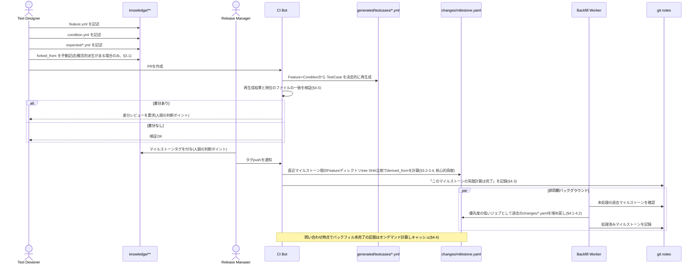
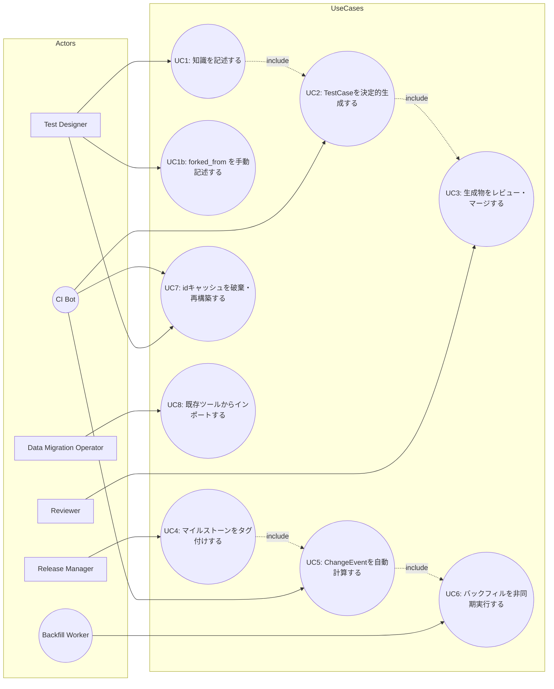

# プロダクト運用イメージ:ファイル作成順序とユースケース

本資料は「テスト知識管理のGit-nativeモデル」論文(`テスト知識管理のGit-nativeモデル_統合版V2.md`)の設計を、実際にプロダクトとして運用した場合の操作イメージに落とし込んだものです。論文本文に明記されている箇所には該当節・行番号を付し、製品化にあたって補った箇所は「(製品化提案、論文本文には明記なし)」と明記します。

## 1. ファイル作成順序(シーケンス図)

**作成順序の要点**

1. `knowledge/**/feature.yml` → `condition.yml` → `expected/*.yml`(Test Designerが手動記述)
2. `generated/testcases/*.yml`(CIが決定的に生成し、既存ファイルとの一致を検証)
3. マイルストーンタグ(Release Managerが人間の判断で付与)
4. `changes/<milestone>.yaml`(CIが `derived_from` を自動計算)
5. `git notes` への進捗記録 → バックフィルによる過去マイルストーンの遅延埋め戻し(非同期・自動)

## 2. ユースケース図

mermaidにはUMLのユースケース図が無いため、アクターをノード、ユースケースを角丸ノードとして表現します(視覚的な代替表現)。

## 3. ユースケース記述

| #    | ユースケース                   | アクター                | トリガー                                | 事前条件                               | 主フロー                                                                                                           | 事後条件                                               | 人間の関与                                                                        |
| ---- | ------------------------------ | ----------------------- | --------------------------------------- | -------------------------------------- | ------------------------------------------------------------------------------------------------------------------ | ------------------------------------------------------ | --------------------------------------------------------------------------------- |
| UC1  | 知識を記述する                 | Test Designer           | 新機能・新条件の追加                    | なし                                   | `feature.yml`/`condition.yml`/`expected/*.yml` を作成しコミット                                                 | `knowledge/` 配下が更新される                          | **手動記述**(§3.1, 108行目)                                                       |
| UC1b | forked_from を手動記述する     | Test Designer           | 別Featureからの概念的派生が発生         | 派生元Featureが存在                    | `forked_from` フィールドに派生元idを記述                                                                           | Git履歴に現れないドメイン知識が明示化される            | **必須の手動記述**(Git履歴からは自動導出不可、153行目)                            |
| UC2  | TestCaseを決定的生成する       | CI Bot                  | PR作成・push                            | `feature.yml`/`condition.yml` が存在 | Feature+Conditionの組を機械的に走査し `generated/testcases/*.yml` を再生成                                          | 生成物が最新の知識と一致する状態になる                 | 自動(人間介入なし)。ただし既存ファイルとの差分検証結果は人間へ提示(§4.5, 316行目) |
| UC3  | 生成物をレビュー・マージする   | Reviewer                | UC2完了・差分検出                       | CIが差分を検出                         | 差分内容を確認し、意図した変更か判断してマージ                                                                     | `generated/testcases/*.yml` が確定しmainへ統合          | **人間の判断ポイント**:意図しない変更の混入を防ぐ最終ゲート                       |
| UC4  | マイルストーンをタグ付けする   | Release Manager         | リリース判断                            | mainブランチが安定                     | `git tag <milestone>` を実行                                                                                       | マイルストーン境界が確定する                           | **人間の判断ポイント**:リリースタイミングの意思決定そのもの(図3)                  |
| UC5  | ChangeEventを自動計算する      | CI Bot                  | タグpush                                | 直前マイルストーンのタグが存在         | 2マイルストーン間でid解決経由の各idのFeatureディレクトリtree SHAを比較し `derived_from` を算出、`changes/<milestone>.yaml` に書き込み | 版履歴(ChangeEvent)が生成される                        | 自動(核心的貢献、§3.2-3.4)。`change_type`は書き込まれず、後述の補足6で人間が事後入力する                                                        |
| UC6  | バックフィルを非同期実行する   | Backfill Worker         | UC5完了、または未処理区間への問い合わせ | `git notes` に未完了区間が存在         | 直近マイルストーンから優先的に過去の系譜を計算し、完了ごとに `git notes` へ記録                                    | 過去マイルストーンの `changes/*.yaml` が段階的に埋まる | 自動。ただし処理優先度の調整は運用者が設定可能(製品化提案、論文本文には明記なし)  |
| UC7  | idキャッシュを破棄・再構築する | Test Designer / CI Bot  | キャッシュ不整合の疑い                  | id解決キャッシュが存在                 | `--no-cache` オプションまたは `rebuild` コマンドを実行                                                             | キャッシュが再構築される                               | **明示的な手動破棄**(フェイルセーフ、199行目)                                     |
| UC8  | 既存ツールからインポートする   | Data Migration Operator | 既存TestRail/Xray/TestLink資産の移行    | エクスポートファイルが用意されている   | インポータを実行し本フォーマット(`knowledge/`構造)に変換                                                           | 既存資産が `knowledge/` 配下に反映される               | **手動トリガー**(移行作業そのものは人間が実行、§4.5)                              |

## 4. 補足:論文スコープ外の項目

- UC2(TestCase自動生成)は論文§4.5でツール構成として設計されているが、本文63行目の通り実装・網羅率評価は将来課題であり、本研究の実証実験(第5章)の対象ではない。
- LLMによる手順書自動生成・文脈供給への応用は付録Aの検討の結果、スコープから完全に除外されている。UC1〜UC8はいずれも決定的な機械的処理または人間の明示的操作であり、LLMベースの非決定的生成は含まない。

## 5. 補足:UC4「実行結果の記録先」の実装(論文本文には明記なし、製品化提案)

UC4の主フロー(`git tag <milestone>` の実行)自体は人間の判断ポイントのまま変わらないが、その後段の「`executions/` へ実行結果を記録する」という機械的作業を補助する2つのコマンドを実装した(`docs/cli-manual.md` 1.13/1.14節)。

- `markharness milestone init <tag>`:既存の `git tag` に対応する `executions/<tag>/milestone.yml` を作成する。タグの存在検証のみ行い、タグ付けの意思決定自体は代行しない。
- `markharness execution record <case_id> --milestone <name> --result <pass|fail|skip> --executor <name>`:CI・QAいずれの起点でも共通のインターフェースで `executions/<milestone>/results.yml` にTestCase実行結果を追記する。

## 6. 補足:UC5「ChangeEventを自動計算する」に付随する3コマンド(製品化提案、論文本文には明記なし)

UC5の主フロー(`markharness changes compute`)自体は変わらないが、論文§3.2・§3.5が「人間が事後に入力する」「監査用の副次機能」と位置づけていた部分を補助する3つのコマンドを実装した(`docs/cli-manual.md` 1.15〜1.17節)。

- `markharness changes annotate <event_id> --type <spec-change|bug-fix|refactor|other>`:`changes compute` が空欄のまま生成した `change_type`(§3.5)を、人間が事後に設定する。`changes/` 配下を `event_id` で横断検索するため、対象のマイルストーン区間ファイルを事前に知る必要はない。
- `markharness changes lineage --commit <merge-commit-sha>`:指定したマージコミットの2親と `git merge-base` によるマージベースを比較し、Feature idごとに線形/真の分岐/1親相当を判定する監査専用コマンド(§3.2)。`changes compute` の主系譜(`changes/*.yaml`)には書き込まない。
- `markharness validate`:`knowledge/`・`axes/` を `schema/*.schema.json`(`markharness init` が既定一式を配置)で構造検証し、axisタグの登録有無・`forked_from` の参照先存在をあわせてチェックする(§3.5の「axes/*.ymlに定義されていない値をfront matterで使えないようスキーマバリデーションで縛る」の実装)。
