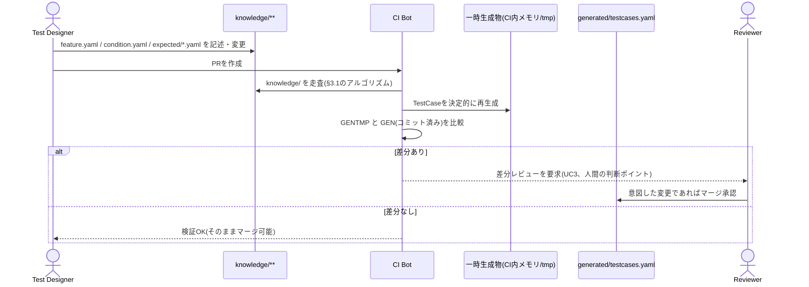

# テストケース自動生成の実現方法：設計ドキュメント

本資料は「テスト知識管理のGit-nativeモデル」論文(`テスト知識管理のGit-nativeモデル_統合版V2.md`、以下「論文」)および「プロダクト運用イメージ」(`docs/product-operation.md`)を踏まえ、UC2「TestCaseを決定的生成する」の**具体的な実現方法**を検討したものです。論文本文に明記されている箇所には該当節番号を付し、製品化にあたって補った箇所は「(製品化提案、論文本文には明記なし)」と明記します。

---

## 1. 位置づけ・目的

論文は`FEATURE`/`CONDITION`→`TESTCASE`の生成関係を「構造的な生成グラフ」(静的、版に依存しない)と呼び、研究の核心的貢献(RQ1、版履歴DAG)とは切り分けています(§3.2(A))。一方で、この生成グラフ自体はツール構成として設計対象に含まれており(§4.5「テストケース生成ツール：`Feature + Condition`から`TestCase`を生成し、再生成結果と現在のファイルの一致をCIで検証」)、`docs/product-operation.md`ではUC2・UC3として運用フロー上に組み込まれています。

```
UC1(知識を記述する) --include--> UC2(TestCaseを決定的生成する) --include--> UC3(生成物をレビュー・マージする)
```

しかし、UC2の記述(`docs/product-operation.md` 105行目)は「Feature+Conditionの組を機械的に走査し`generated/testcases.yaml`を再生成」とあるのみで、**走査方法・命名規則・テキスト組み立て規則・決定性の担保方法**は未定義です。本資料はこの空白を埋めます。

**スコープ外であることの確認**：論文§7は「構造からのテストケース自動生成の**網羅率評価**」を将来課題としていますが、これは生成された`TestCase`集合が実際のテスト観点をどれだけ網羅できているかという**評価**の話であり、本資料が扱う「決定的に生成する**方式**そのものの設計」とは別軸です。本資料は後者のみを対象とし、網羅率評価には立ち入りません。同様に、LLMによる生成拡張(付録A.1)もスコープ外です。

---

## 2. 入力データモデルの確認

現行のプロトタイプ(`samples/repo/knowledge/player/**`)における実際のファイル構成は以下の通りです。

```
knowledge/player/
├── feature.yaml                      # id: player-jump, kind: feature, axis: [gameplay, animation]
└── jump/
    ├── behavior.yaml                 # id: jump-behavior, kind: behavior
    └── ground/
        ├── condition.yaml            # id: jump-ground, kind: condition
        └── expected/
            └── 001.yaml              # id: player-jump-ground-001, kind: expected-result, result: "lands safely"
```

各YAMLの`id`はGitのblob SHAではなく人間可読なslugですが(論文§3.1・§3.5でいう表示用ではなく識別子そのものとして使用)、重要なのは**どのYAMLにも親要素へのID参照フィールドが存在しない**点です。`player-jump-ground-001`がどの`condition`・`feature`に属するかは、ディレクトリの入れ子構造からのみ判別できます。

### 論文§3.5「idはパスに依存しない」原則との関係

論文§3.5は、版履歴計算(id解決キャッシュ、§3.3)におけるidが**パスに依存しない**設計であるべきことを述べています。これはリネーム耐性のための制約であり、「あるコミット時点でidがどのパスにあったか」をキャッシュで引く際にパス文字列そのものをキーにしないという話です。

これに対し、テストケース生成は**版履歴を必要としない静的処理**(§3.2(A))であり、「現在のワーキングツリー上のディレクトリ階層」を入力として一度きり走査します。つまり、

- 版履歴DAG(§3.2(B))の識別子解決：パス非依存(blob SHA + id-index)
- テストケース生成(§3.2(A))の親子関係解決：**現在のツリーのパス階層に依存してよい**

という区別が成り立ち、両者は矛盾しません。したがって、本設計では**ディレクトリ階層ベース**の走査を採用し、各YAMLに`feature_id`/`behavior_id`/`condition_id`等の明示的な親参照フィールドを追加する変更は行いません(現行サンプルのスキーマを変更しない)。

---

## 3. 生成アルゴリズム(ディレクトリ階層ベース)

### 3.1 走査手順(擬似コード)

```
function generate_testcases(knowledge_root):
    testcases = []
    for feature_path in sorted(glob(knowledge_root / "**/feature.*")):
        feature = read(feature_path)
        feature_dir = feature_path.parent

        for condition_path in sorted(glob(feature_dir / "**/condition.*")):
            condition = read(condition_path)
            condition_dir = condition_path.parent

            expected_paths = sorted(glob(condition_dir / "expected/*.*"))
            for seq, expected_path in enumerate(expected_paths, start=1):
                expected = read(expected_path)

                testcase_id = f"{feature.id}-{condition.id}-{seq:03d}"
                testcases.append({
                    "id": testcase_id,
                    "feature_id": feature.id,
                    "condition_id": condition.id,
                    "axis": feature.axis,                       # 継承(3.4節参照)
                    "title": build_title(condition, seq),
                    "expected_result": build_expected_text(condition, expected),
                })

    return sorted(testcases, key=lambda tc: tc["id"])
```

- `sorted(glob(...))`によりファイルシステムの列挙順に依存しない決定的な走査順を保証する。
- `condition`の探索を`feature_dir`配下の再帰glob(`**/condition.*`)にすることで、`behavior.yaml`のような中間階層の有無に依存しない(現行サンプルでは`jump/behavior.yaml`が存在するが、生成には使われず、Featureの下にConditionがぶら下がっていることだけが利用される)。

### 3.2 id命名規則

```
{feature_id}-{condition_id}-{連番3桁}
```

連番は`expected/`配下のファイル名の**ソート済み昇順**をそのまま採用します(ファイル内の`id`フィールドではなくファイル名でソートすることで、`id`未設定でも安定した順序を得られる)。現行サンプルの`player-jump-ground-001`はこの規則に一致します。

### 3.3 title / expected_result のテキスト組み立て

```
title            = f"{condition.summary の要約} (#{seq})"   # 例："Ground jump lands safely"
expected_result  = f"The player {expected.result} after {condition の動作}."
```

現行サンプル(`samples/repo/generated/testcases.yaml`)の`title: "Ground jump lands safely"`、`expected_result: "The player lands safely on the ground after jumping."`は、`condition.summary`(「地面からジャンプし、着地する」)と`expected.result`(「lands safely」)の組み合わせから人手で書かれたものですが、テンプレート化は完全な自然文生成ではなく、**固定テンプレート＋knowledge側の短い名詞句の埋め込み**に留めることを推奨します。理由：

- 完全な自然文生成(LLM等)は本研究のスコープ外(付録A.1)。
- テンプレートを固定することで、決定性(4章)とCI差分検証(5章)が成立する。

このテンプレート文言をどこまで作り込むかはプロダクトごとの運用で調整が必要な箇所であり、本資料では**最小限のテンプレート規則を持つこと**を設計要件として提示するに留めます(製品化提案、論文本文には明記なし)。

### 3.4 axisの継承

`FEATURE`の`axis`フィールド(§3.1、`axes/*.yml`でレジストリ管理)を生成された`TestCase`にコピーする。これにより`generated/traceability-index.json`(§3.5のディレクトリ構造)側で「観点(Axis)ごとのTestCase一覧」を再構築でき、横断的観点をFeature側だけでなくTestCase側からも引けるようにする(製品化提案、論文本文には明記なし。§3.5の`traceability-index.json`は存在のみ言及され中身は未定義)。

---

## 4. 決定性の担保

論文§4.5は「再生成結果と現在のファイルの一致をCIで検証」する前提を置いています。この検証が成立するためには、**同一の`knowledge/`内容から常に同一の`generated/testcases.yaml`が得られる**ことが必要です。本設計では以下によって決定性を担保します。

1. **走査順の固定**：`feature.*`・`condition.*`・`expected/*.*`のいずれも、探索時に文字列ソート(パス昇順)してから処理する(3.1節)。
2. **id生成の固定**：連番はファイル名ソート順から機械的に導出し、乱数・タイムスタンプ・実行環境依存の値を一切使わない。
3. **テキスト生成の固定**：3.3節のテンプレートは`knowledge/`側のフィールド値のみを入力とする純粋関数とし、外部呼び出し(LLM等)を含めない。
4. **出力のシリアライズ順固定**：YAML/JSON出力時のキー順序・配列順序(`sorted(..., key=lambda tc: tc["id"])`)を固定する。

これにより、`generate_testcases()`は同じワーキングツリーに対して冪等であり、「CIで再生成 → 既存の`generated/testcases.yaml`とバイト単位で比較 → 一致すればOK、不一致なら差分をレビュー要求」というUC2/UC3のフローが成立します。

---

## 5. CI検証フロー(UC2/UC3との対応)

`docs/product-operation.md`のシーケンス図のフォーマットに合わせると、以下のようになります。



この図は既存の`docs/product-operation.md`の1章シーケンス図における「CI->>GEN: Feature+Conditionから TestCase を決定的に再生成」のステップ(24〜30行目)を、本資料3〜4章のアルゴリズムで具体化したものです。

---

## 6. エッジケース・限界

| ケース | 扱い |
|---|---|
| 1つのFeatureに複数のConditionがある | Condition数だけ`TestCase`グループが生成される(組み合わせは`Feature × Condition`の直積ではなく、Condition配下の実在するExpectedResultのみを列挙するため、実務上の組み合わせ爆発は起きにくい)。 |
| 1つのConditionに複数のExpectedResultがある | `expected/`配下のファイル数だけ`TestCase`が生成される(3.1節の連番)。 |
| Conditionを持たないFeatureがある | `TestCase`は生成されない(Featureのみでは生成対象にならない。§3.1のER図で`generates`の起点は`FEATURE`と`CONDITION`の両方であるため)。 |
| `forked_from`を持つFeature | 生成アルゴリズムには影響しない。`forked_from`は概念的派生を示す手動記述(§3.1)であり、構造的生成グラフ(§3.2(A))とは独立した情報のため、生成ロジックはこのフィールドを参照しない。 |
| Behavior階層の扱い | 現行サンプルでは`behavior.yaml`が存在するが、生成アルゴリズムはConditionを直接Feature配下から探索するため、Behavior自体は生成に必須ではない(将来的にBehavior単位のグルーピングが必要になった場合は3.1節のglobパターンを`behavior.*`単位に一段追加する拡張で対応可能)。 |

### CTM(Classification Tree Method)との関係の再確認

論文§2.3は、CTMを「分類木からのテストケース生成という点で発想を共有するが、Git管理・バージョン履歴・実行結果追跡を含むライフサイクル管理は範囲外」と位置づけています。本設計もこの立場を踏襲し、**新しいテスト設計技法を提案するものではなく**、Test Designerが既に`knowledge/`に記述した設計(Feature/Condition/ExpectedResult)を機械的・決定的に`TestCase`へ変換する処理であることを明確にします。テスト観点の網羅性・分類軸の設計自体はTest Designerの責務のままです。

---

## 7. 将来課題との切り分け

以下は本資料のスコープ外であり、論文§7・付録A.1に委ねます。

- 生成された`TestCase`集合の**網羅率評価**(論文§7)。
- LLMによる自然文の手順書自動生成・文脈供給(付録A.1、本研究のスコープから完全除外)。
- Behavior階層を使ったより高度なグルーピング・Axisの多段管理などのモデル拡張。

---

## 8. 検証(現行サンプルとの整合確認)

`samples/repo/knowledge/player/**`の実データに対して3.1節のアルゴリズムを手動でトレースすると、以下の通り既存の`samples/repo/generated/testcases.yaml`と一致します。

- `feature.yaml`: `id: player-jump`
- `condition.yaml`(`jump/ground/`配下): `id: jump-ground`
- `expected/001.yaml`(`jump/ground/expected/`配下、1件のみ): `result: lands safely`

→ 生成される`TestCase`:
```yaml
id: player-jump-jump-ground-001   # ※現行サンプルの id は player-jump-ground-001 (ハイフン規則の差異、9章参照)
feature_id: player-jump
condition_id: jump-ground
axis: [gameplay, animation]
title: "Ground jump lands safely (#1)"
expected_result: "The player lands safely on the ground after jumping."
```

## 9. 現行サンプルとの差異(要調整点)

トレースの結果、3.2節の命名規則`{feature_id}-{condition_id}-{連番}`をそのまま適用すると`player-jump-jump-ground-001`となり、現行サンプルの`player-jump-ground-001`とは一致しません。これは現行サンプルの`condition_id`が`jump-ground`という**Feature名を含まない短いslug**であるのに対し、命名規則側は単純結合しているためです。実装時は以下のいずれかで解消する必要があります(製品化提案、論文本文には明記なし)。

- (a) `condition_id`が既に`feature_id`のprefixを部分的に含む場合は重複部分を除去する正規化ルールを追加する。
- (b) `condition.yaml`側のid命名規約を「Feature名を含まない短いslug」に統一し、生成id側は`{feature_id}-{condition_id}-{連番}`をそのまま採用する(現行サンプルの`jump-ground`はこちらの想定に近い可能性がある)。

いずれを採るかはスキーマ規約(`schema/`、論文§3.5)側の決定事項であり、本資料では選択肢の提示に留めます。
