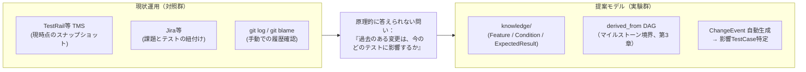
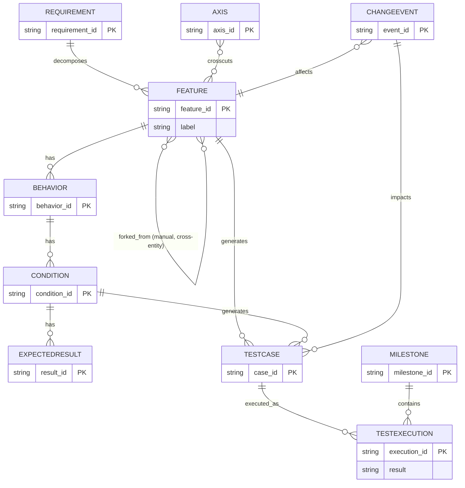
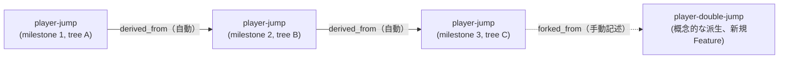
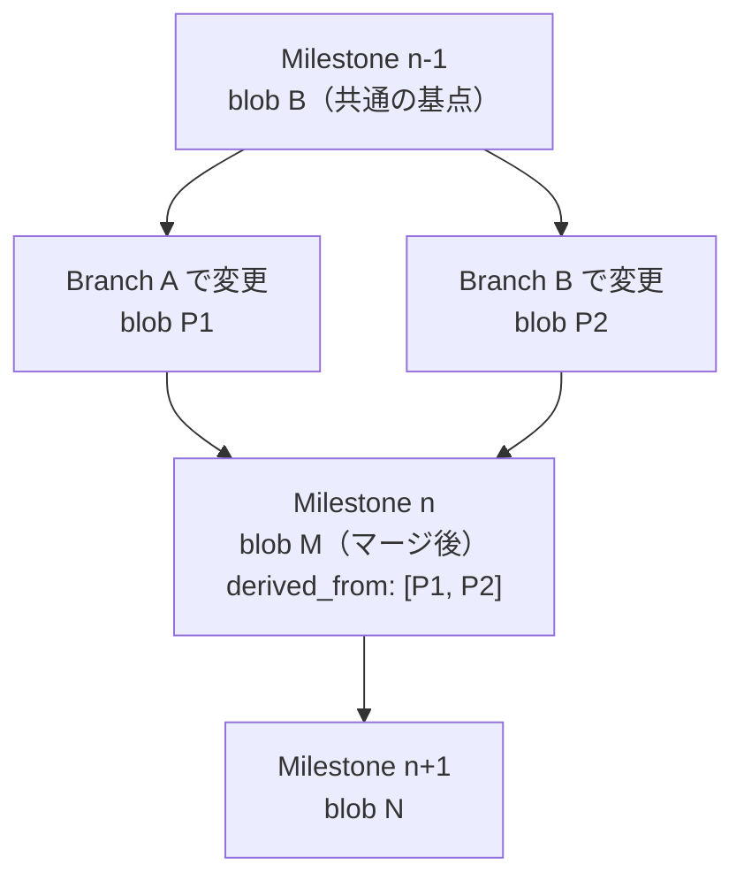
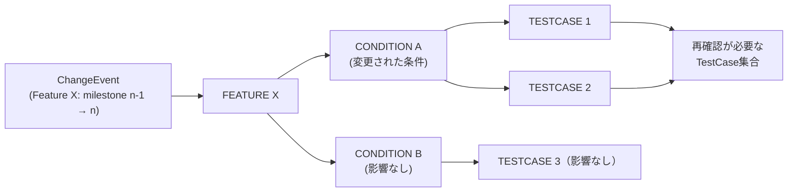
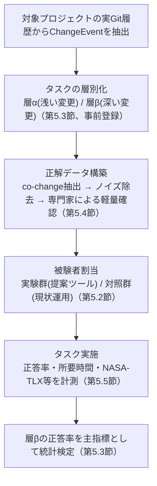

# テスト知識管理のGit-nativeモデル：統合版

### A Version-Aware Knowledge Graph Model for Git-Native Test Knowledge Management

**位置づけ**：本資料は「テストケース管理手法*研究テーマ検討まとめ」(検討経緯・不採用案の記録)と「テスト知識管理のGit-nativeモデル*実践論文ドラフト」(v1〜v10)を1本に統合したもの。検討経緯は付録Aにまとめ、本編(第1〜8章)は現時点で確定している設計・評価計画のみを記載する。

**論文種別**：実証的ソフトウェア工学(Empirical Software Engineering)寄りのツール・実践論文ドラフト
**想定投稿先**：ESEM / ICSME / SANER 等の実践寄りトラック、または国内ではSES / JSSST

---

## 0. 経緯サマリー

1. **初期案(A案)**：機能構造・テストケース・実行結果・マイルストーンを統合する情報モデル。研究テーマとしては要件⇔テスト⇔実装のトレーサビリティ研究(Cleland-Huang, 2011等)と重なり新規性が弱いが、「バージョン軸を第一級概念とする派生関係の追跡」は既存TMSにない差別化余地として残った(付録A・検討まとめ第1章)。
2. **Git階層・グラフ構造案との統合**：テスト知識(Requirement/Feature/Behavior/Condition/ExpectedResult)を木構造+横断的観点(Axis、グラフ構造)で管理し、テストケースをその派生物として扱うモデルに統合(検討まとめ第2〜3章)。
3. **LLM活用への全面ピボット案(不採用)**：「AI専用知識グラフ」への転換を検討したが、(a)クエリ速度・使いやすさの懸念は対象がLLMになっても解消されない、(b)新規性の主張として弱い、(c)評価方法が根本的に変わり単独では査読耐性が下がる、との理由で不採用(付録A.1)。
4. **部分ピボットと段階的な設計修正**：人間向けモデルを土台に、LLM角度は将来課題として切り出した上で、研究テーマを「案1：構造表現」単独に絞り込み(検討まとめ第4章)、以降10回以上の技術的指摘を受けて以下を確定させた。
   - 系譜キーを人間の手動整数からGitのコンテンツアドレス(blob SHA)＋祖先探索(`git merge-base`)に変更(第3.2節)。
   - 開発中のリアルタイム照会と、研究評価対象である永続的な版履歴DAGを、別のグラフ(構造的生成グラフ vs 版履歴DAG)として明確に分離(第3.2節、貢献の範囲を限定)。
   - id解決をコミット対象の単一ファイルからGitの`commit-graph`と同じ設計思想の非コミットキャッシュに変更し、内容アドレス方式のキャッシュキーと破棄条件を明記(第3.3節)。
   - 系譜確定のタイミングをコミット単位からマイルストーン境界単位に変更し、ブランチ戦略(merge/rebase/squash)非依存にした(第3.4節)。
   - 既存の大規模リポジトリへの移行を可能にする、マイルストーン限定・非同期・Git notes・遅延計算によるバックフィルアーキテクチャを本編に組み込んだ(第4章)。
   - 実験の対照群を、自作の疑似TMSや人工的な単一ツール比較ではなく、対象組織が実際に使う複合運用に統合(第5.2節)。
   - タスクを「既存運用でも対応可能な浅い変更」と「既存運用が原理的に対応不能な深い変更」に層別化し、正答率(特に深い変更層)を主指標とした(第5.3節)。
   - 正解データの構築を、記憶に依存する聞き取りから、当時の成果物(co-change等)に基づく機械的な再構成に変更し、その際のノイズ除去基準を明記した(第5.4節)。

以下、本編。

**注(実装状況について)**：本編は当初の設計を記す。CLI実装(`markharness`、本リポジトリ)は中核アイデア(tree SHAベースの系譜キー・TestCase派生管理・ChangeEventのマイルストーン境界自動生成)を検証する段階にあり、設計の一部は実装時に簡略化・変更されている。主な相違点は各該当節に注記し、§3.6に一覧をまとめた。詳細な突き合わせは別紙[設計書との相違点_調査資料.md](./設計書との相違点_調査資料.md)を参照。

---

## 1. Introduction

### 1.1 動機

ソフトウェア開発における仕様変更は頻繁に発生し、その都度「どのテストケースを再確認すべきか」を判断する必要がある。既存のテスト管理ツール(TestRail・Zephyr Scale・Xray・qTest等)は、要件・機能・テストケース間の静的なトレーサビリティ(現時点のスナップショット)やマイルストーン管理機能を備えるが、いずれも現時点のスナップショット中心の設計であり、複数リリースにまたがる派生関係を第一級のクエリ対象として扱う設計にはなっていない(検討まとめ第1.3章)。素朴なGit運用(Markdown/YAMLでのテストケース管理)も実務に存在するが、実行追跡・変更影響の系統的な追跡機能を欠く。

**図1：現状運用から提案モデルへ**



現状運用(TestRail/Jira/git検索の組み合わせ)は、いずれも「過去のある変更が今のどのテストに影響するか」という問いに、版間の派生関係を保持していないため原理的に答えられない(第1.3節・第2.4節)。本研究はこの空白を、Git自身のオブジェクトモデルを土台にした版履歴DAGで埋める(第3章)。

### 1.2 研究課題(RQ)

> RQ1: 明示的な版履歴(derived_from)を持つテスト知識モデルは、対象組織のテスターが実際に使用している現状の運用(TMS・課題管理ツール・git検索等の組み合わせ)と比較して、特に**複数世代にわたる変更影響の識別タスク**において、正答率・所要時間を改善するか。

本研究はRQ1を中心課題とし、単一の研究課題に絞り込む。構造からのテストケース自動生成、Git粒度分割によるレビュー性向上等の関連課題は将来課題とする(第7章)。LLMによる文脈供給・手順書自動生成への応用は、検討の結果、本研究のスコープから完全に除外した(付録A)。

### 1.3 貢献

1. **核心的貢献**：Gitのコンテンツアドレス(blob SHA)・非コミットのid解決キャッシュ・コミットグラフの祖先探索(`git merge-base`)を組み合わせ、ブランチ運用に依存せずマイルストーン境界で版履歴を導出するモデルの設計(第3章)。
2. 横断的観点(Axis)を物理ディレクトリ構造から独立させ、木構造を保持したまま多対多関係を表現する設計パターン(第3.5節)。
3. 既存の大規模リポジトリへの段階的な導入を可能にする、マイルストーン単位の非同期バックフィルアーキテクチャ(第4章)。
4. 対象組織の実際の現状運用を対照群とし、正解データを当時の成果物から再構成した、実データに基づく評価設計(第5章)。

**注**：開発者が作業ブランチ上で即座に行える差分照会(第3.2節の構造的生成グラフを使う実装上の利便機能)は、版履歴DAGを使わないため本研究の核心的貢献・RQ1の評価対象には含めない(検討経緯は付録A参照)。

---

## 2. Related Work

### 2.1 要件・テストのトレーサビリティモデル

Agile Traceability Information Model(Cleland-Huang et al., 2011)をはじめとする既存研究は、要件⇔テスト⇔実装の静的なトレーサビリティモデルを確立している。本研究はこれらのモデルと競合するものではなく、これらが扱わない「バージョン軸に沿った複数世代の派生関係の追跡」を対象とする点で補完的である。

### 2.2 知識グラフによるテスト管理

知識グラフを用いたテストデータ管理(Software Test Data Management Based on Knowledge Graph)、システムズエンジニアリング領域のオントロジーベース知識グラフなど、類似の知識グラフ応用研究が存在する。これらは主にデータ管理・モデル管理を対象としており、Gitのバージョン管理機構と統合した「版履歴の第一級モデル化」は扱っていない。

### 2.3 分類木によるテスト設計技法

Classification Tree Method(CTM)は、分類木からのテストケース生成という点で本研究のFeature+Condition→TestCase生成と発想を共有する。ただし、CTMはテスト設計技法であり、Git管理・バージョン履歴・実行結果追跡を含むライフサイクル管理は範囲外である。本研究はテスト設計技法ではなく、設計後のライフサイクル管理を主眼とする点でCTMと立場が異なる。

### 2.4 既存テスト管理ツール・Git-native運用との比較

TestRail・Zephyr Scale・Xray・qTest等の主要製品はマイルストーン機能・トレーサビリティ機能を備えるが、いずれも現時点のスナップショット中心であり、複数世代にわたる派生関係を辿るクエリ機能は一般的に存在しない(TestRailは2026年時点でオンプレミス版の提供を終了しクラウド専用。Xrayは Jira Data Center 経由で自己ホスト可能)。無料・自己ホスト可能な既存選択肢(Kiwi TCMS、TestLink、Klaros Test Management)も同様の制約を持つ。実務では、これら単体のツールではなく、TMS・課題管理ツール(Jira等)・git検索を組み合わせて運用するのが一般的だが、いずれの組み合わせも過去の世代の変更を体系的には辿れない。本研究はこの構造的な欠落を埋める位置づけにあり、評価設計(第5章)はこの実態を反映する。

---

## 3. Model Design

### 3.1 テスト知識の構造

木構造(Requirement → Feature → Behavior → Condition → Expected Result)を基本とし、以下を追加する。

- `AXIS`：横断的観点(例：Gameplay / Animation / AI / Network)。`FEATURE`と多対多で交差を表現(グラフ構造部分)。
- `TESTCASE`：`FEATURE`と`CONDITION`から生成される派生物(一次管理対象ではない)。
- `TESTEXECUTION` / `MILESTONE`：実行結果とリリース単位の管理。
- `CHANGEEVENT`：`FEATURE`の変更が`TESTCASE`へ伝播する経路(変更影響分析の対象)。
- `FEATURE`の自己参照関係(2種類に分離)：
  - `derived_from`：同一Featureの版履歴。Gitのtree SHAと祖先探索から、マイルストーン境界で導出する(3.2〜3.4節、本モデルの核心)。
  - `forked_from`：異なるFeature間の概念的派生(例：double-jumpがground-jumpの仕様を土台に設計された、という設計上の依存関係)。Git履歴には現れないドメイン知識であり、手動記述が必須。実装では`feature.yml`のfront matterの任意フィールドとして提供済み(第3.6節)。

**実装注記**：CLI実装は`REQUIREMENT`を`requirement.yml`として明示ファイル化し、`knowledge/<requirement>/<feature>/...`という階層でFeatureをその直下に置く(第3.5節のディレクトリ構造も参照)。`feature.yml`は親を`requirement: <requirement_id>`で参照する。

#### ER図(Mermaid)



`FEATURE`は版番号を人間が手動で管理するフィールド(`version`整数)を持たない。系譜計算に使う識別子は、front matterに書く値ではなく、**Gitのオブジェクトストアが既に保持している識別子**であり、`label`は表示専用(系譜計算には使わない)。

**実装注記(blob SHA→tree SHAへの変更)**：当初`feature.yml`単体のblob SHAで変更検知する設計だったが、これだと`feature.yml`自体は不変のままConditionやBehavior、ExpectedResultだけが変更された場合に検知漏れが起きる不具合があった。CLI実装はこれを修正し、Featureディレクトリ配下(`feature.yml`＋その下のbehavior/condition/expected一式)を含む**Gitツリーオブジェクトのtree SHA**を比較する方式に変更している(`id_cache::resolve_feature_versions`、旧`resolve_feature_blobs`)。以降、本節の「blob SHA」は特記ない限りこの「Featureディレクトリのtree SHA」を指す。

**図2：Featureの派生関係（derived_from と forked_from）**



同一Featureの版が進む`derived_from`はマイルストーン境界でCIが自動導出する(第3.2〜3.4節)のに対し、`player-double-jump`のように別のFeatureとして分岐する`forked_from`は、Git履歴に現れないドメイン知識のため手動記述する(第3.1節)。

### 3.2 版履歴の導出：2つのグラフと役割分担

本モデルには目的の異なる2種類のグラフが存在し、これを区別することが実装・評価の両面で重要である。

**(A) 構造的な生成グラフ(静的、版に依存しない)**：`FEATURE`/`CONDITION`→`TESTCASE`という`generates`関係。現在のFeature/Conditionからどのテストケースが生成されるかを表す静的な構造であり、版履歴を必要としない。開発者が作業ブランチ上で「今この変更で、どのTestCaseが再生成されるか」を知りたい場合、必要なのはこの生成グラフと、現在の変更内容(HEADと基準点の単純な差分)だけであり、これは実質的に`git diff`をスコープした処理である。**この機能は実装上の利便機能であり、研究上の核心的貢献・RQ1の評価対象には含めない**(既存運用にはこの機能自体が存在しないため実務上の価値はあるが、版履歴DAGを一切使わないため評価軸としては切り分ける)。

**(B) 版履歴DAG(derived_from、マイルストーン境界で確定)**：同一Featureが世代を経てどう変化してきたかを表す、本研究の核心的なモデル。既存TMS・素朴なGit運用のいずれも持たない機能であり、RQ1が検証する対象はこちらに限定する。

版履歴DAG(B)の導出は以下の通り。

- **tree SHAが担うこと**：Featureディレクトリ内容の衝突しない識別。内容が異なれば必然的に異なる値になるため、ブランチ分岐時の番号衝突(人間が手動で整数を上げる場合に起こりうる)は起きない。ただし、これだけでは「どのtreeがどのtreeから派生したか」という親子関係は一切わからない。
- **祖先探索が担うこと**：マージコミットMの親P1・P2から、マージベース(共通祖先)Bを特定するには`git merge-base P1 P2`によるコミットグラフの探索が必要であり、ハッシュの比較だけで済む処理ではない(Gitのcommit-graphファイル・世代番号による最適化により実務上は効率的だが、明示的なグラフアルゴリズムの実行である)。
- 対象idについて、tree(B)・tree(P1)・tree(P2)・tree(M)を取得し、以下のように場合分けする。
  - tree(P1) == tree(B) かつ tree(P2) != tree(B)：P2側でのみ変更。線形履歴として扱う。
  - tree(P1) != tree(B) かつ tree(P2) != tree(B) かつ tree(P1) != tree(P2)：両ブランチが独立に変更した真の分岐。`derived_from`は[tree(P1), tree(P2)]の2親として記録する。
  - tree(P1) == tree(P2)：1親として扱う。

この機構(祖先探索を伴う詳細な系譜再構築)は、監査用途の副次機能として提供し、研究評価で使う主系譜は次節のマイルストーン境界方式を用いる。

**実装状況**：`markharness changes compute`(マイルストーン境界の主系譜)自体は、上記の`git merge-base`による祖先探索・2親分岐の記録を行わない。指定した2つのマイルストーンタグ(`from_milestone`/`to_milestone`)間で各Featureのtree SHAを直接比較するのみで、これは設計上の意図的な選択である(第3.4節、RQ1の評価対象はマイルストーン境界の線形比較)。一方、本節で述べた`git merge-base`による祖先探索・2親分岐の判定自体は、監査用途の副次機能として`markharness changes lineage --commit <merge-sha>`に実装済みである(`src/lineage.rs`)。指定したマージコミットの2親(P1・P2)と`git merge-base`によるマージベース(B)のtree SHAを比較し、各Featureごとに「線形(linear)」「真の分岐(true_divergence)」「1親相当(single_parent)」を判定して出力する。ただし`changes/*.yaml`への書き込みは行わず、`changes compute`の主系譜とは連携しない(第3.6節)。したがって、ブランチ分岐を経て一方の系譜だけが失われるようなケースを`lineage`コマンドで検出すること自体は可能になったが、その判定結果を永続的な`derived_from`(2親)として`ChangeEvent`側に自動反映する統合は今後の課題のままである(第7章)。

### 3.3 id解決：非コミットキャッシュとキャッシュキー・破棄条件

`id`はパスに依存しない設計(第3.5節)のため、「あるコミット時点でid Xのファイルがどのパスにあったか」を知るには、単純には全木走査が必要になり、大規模リポジトリでは計算量が破綻する。かといって、id→パスの対応をコミット対象の単一マニフェストファイルとして持つと、複数ブランチが同時にテスト知識を追加するたびにこのファイルがマージコンフリクトを起こし、Gitの並行開発の強みを殺してしまう。

**対応方針**：Gitが同種の問題(コミットグラフ上の祖先探索の高速化)を`commit-graph`ファイル(バージョン管理対象外の補助キャッシュ)で解決しているのと同じ設計思想を採る。id解決の結果を**コミット対象から外し**、各開発者のローカル環境・各CIランナーが必要に応じて独自に再構築する非コミットキャッシュとして扱う。

**キャッシュキーの構成**

```
cache_key = hash(
  tree_sha(knowledge/ 配下のGitツリーオブジェクトSHA),
  canonicalization_rule_version(正規化ルールのバージョン),
  id_index_schema_version(id-indexのフォーマット自体のバージョン),
  tool_version(id解決ツールのバージョン)
)
```

`tree_sha`はコミットSHAではなく`knowledge/`サブツリーのGitツリーオブジェクトSHAを使うことで、無関係なディレクトリの変更による無駄な再計算を避ける。作業ツリーの未コミット変更は`git hash-object`で仮想的に計算しキーに含める。

**破棄条件(インバリデーション)**

1. `tree_sha`の変化：`knowledge/`配下の内容変化。
2. `canonicalization_rule_version`の変化：正規化ルール(どのフィールドを意味的な変更とみなすか)自体の改訂。
3. `id_index_schema_version`の変化：id-indexのフォーマット変更。
4. `tool_version`の変化：id解決アルゴリズム自体の変更。
5. 明示的な手動破棄：`--no-cache`オプション・`rebuild`コマンドによるフェイルセーフ。
6. TTLによる安全網：内容アドレス方式のキー計算に見落としがあった場合の保険として、CI側の共有キャッシュストレージに最大保持期間(例：30日)を設定する。

読み込み時は格納されているキーが現在の状態と完全に一致するかを検証し、不一致なら静かに再計算する。これにより異なるCIランナー間でキャッシュを共有しても、古い/破損したキャッシュを誤って信頼するリスクを避ける。

**実装状況**：CLI実装の`.markharness-cache/<ref>.json`は、本節で述べた内容アドレス方式キャッシュキー(`tree_sha(knowledge/)` + `canonicalization_rule_version` + `id_index_schema_version` + `tool_version`の合成)を実装している(`src/id_cache.rs`の`CacheKey`/`compute_cache_key`)。読み込み時に格納されているキーを再計算した現在のキーと比較し、不一致なら静かに再計算・上書きする。`tree_sha`は`git rev-parse <ref>:knowledge`で取得し、`tool_version`はビルド時のcrateバージョン(`CARGO_PKG_VERSION`)を用いる。ただし`canonicalization_rule_version`・`id_index_schema_version`は現状固定値"1"で、これらのバージョンを実際に上げる正規化ルール改訂・フォーマット改訂はまだ発生していない。作業ツリーの未コミット変更を`git hash-object`で仮想的にキーへ含める処理、およびCI共有ストレージ側のTTL安全網は未実装(そもそもCLI単体の責務外)である。また、id自体も「idはパスに依存しない」という設計方針に沿って改修され、現状は**feature.ymlの`id:`フィールドを正準ソースとする**(id_cache.rsがディレクトリ名ではなくfeature.ymlの内容を`git show`で読んでidを決定する)。これにより、Featureディレクトリをリネームしても`id:`フィールドが変わらなければ同一Featureとして追跡できる(最小限のリネーム追跡)。同一idを持つ複数のFeatureディレクトリが存在する場合はエラーとして検出する。ただし、id⇔pathの汎用的な独立インデックス層(パス変更を伴わない任意のid変更の追跡等)までは実装しておらず、目標設計の完全な実現ではない(第3.6節)。

### 3.4 マイルストーン境界での系譜確定

系譜の確定タイミングはコミットごとではなく、マイルストーン確定時(リリースタグ等)にのみ行う。各idについて「前回マイルストーン時点のtree」と「今回マイルストーン時点のtree」をid解決経由で比較し、差分があれば`derived_from`を記録する。merge/rebase/squashいずれのブランチ戦略にも依存しない。

**実装状況**：`markharness changes compute`自体は`from_milestone`/`to_milestone`を明示引数として受け取り、その2点間のtree SHA差分を計算する処理であり、「直前のマイルストーン」を自動判定する機能はコマンド自体には無い。「直前のマイルストーンと自動的にペアリングする」という運用は、第4章のバックフィルワーカー(`markharness backfill run`)側が`executions/<milestone>/`をタグの日時順に並べて隣接ペアに適用することで実現しており、この2つは別のレイヤーである。

**図3：Version DAG（ブランチ分岐・マージを含む版履歴）**



第3.2節の場合分けの通り、両ブランチが独立に同一idを変更していれば`derived_from`は2親(P1・P2)を持つノードとして記録され、片方のみの変更であれば線形履歴として扱われる。マイルストーン境界でのみ確定するため、中間のコミット粒度やマージ戦略には依存しない(第3.4節)。

### 3.5 ChangeEventの自動生成とディレクトリ構造

`ChangeEvent`は、マイルストーン境界で`derived_from`の差分が検出されたFeatureについて自動生成する。変更種別(`change_type`：仕様変更／バグ修正等)のみ、人間がコミットメッセージまたはPRテンプレートで入力する。

**実装状況**：CLI実装の`ChangeEvent`構造体は`change_type: Option<ChangeType>`フィールドを持つ(`event_id` / `feature_id` / `from_milestone` / `to_milestone` / `from_tree_sha` / `to_tree_sha` / `impacted_testcases` / `change_type`)。`ChangeType`は`SpecChange` / `BugFix` / `Refactor` / `Other`の固定enum(snake_caseでシリアライズ)であり、コミットメッセージ・PRテンプレートからの自動抽出ではなく、`markharness changes compute`実行後に人間が`markharness changes annotate <event_id> --type <spec-change|bug-fix|refactor|other>`を実行して`changes/*.yaml`を書き換える方式で入力する(設計意図通り、計算では埋めない)。`annotate`はevent_idを`changes/`配下の全ファイルから横断的に検索するため、呼び出し側がどのマイルストーン区間のファイルかを事前に知る必要はない。

**図4：変更影響の伝播（Change propagation）**



`ChangeEvent`は`FEATURE`の変化を起点に、構造的な生成グラフ(第3.2節(A)：`CONDITION`→`TESTCASE`)を辿ることで、影響を受ける`TESTCASE`集合を特定する。この特定処理自体は静的な生成関係を使うため版履歴を必要としないが、「そもそも`FEATURE`が過去のどの時点からどう変化したか」を検知するには第3.2〜3.4節の版履歴DAGが必要であり、両者は組み合わさって初めて「複数世代にわたる変更影響の特定」(RQ1)を可能にする。

物理ディレクトリ構造は**階層(木)のみを表現し、横断的観点(Axis)はメタデータ＋生成インデックスで表現する**。ファイルシステムは多対多関係を自然に表現できないため、木構造と同じ場所にグラフ構造を無理に押し込まない。

```
repo/
├── knowledge/                  # ソース・オブ・トゥルース(木構造)
│   └── player/                 # REQUIREMENT(requirement.yml、実装で追加された明示階層)
│       ├── requirement.yml
│       └── jump/                # FEATURE(feature.ymlは requirement: player で親を参照)
│           ├── feature.yml
│           └── jump-behavior/
│               ├── behavior.yml
│               ├── ground/
│               │   ├── condition.yml
│               │   └── expected/001-lands-safely.yml
│               ├── air/
│               └── double-jump/
├── axes/                        # 横断的観点の定義(レジストリ)
│   ├── gameplay.yml
│   ├── animation.yml
│   ├── ai.yml
│   └── network.yml
├── generated/                   # 生成物(コミット対象、CIで再生成一致を検証)
│   └── testcases/ground-001.yml # 1 Condition = 1ファイル(実装、UC2/UC3)
├── executions/                  # マイルストーンごとの実行結果
│   └── 2026-08-release/
│       ├── milestone.yml
│       └── results.yml
├── changes/                     # ChangeEventログ(マイルストーン境界で自動生成)
│   └── 2026-08-release.yaml     # 1マイルストーン区間=1ファイル、複数ChangeEventを配列で保持(実装)
└── schema/                      # フォーマット定義(JSON Schema。`markharness init`が既定スキーマ一式を配置、実装済み)

# 注：id解決キャッシュは非コミット化し、.gitignore対象とする(第3.3節)。実装上の配置は
# リポジトリ直下の .markharness-cache/ (旧 generated/id-index.json という案からの変更)。
```

**実装状況**：上記は当初設計図(REQUIREMENTを暗黙化、ChangeEventを日付+スラッグの1イベント1ファイル)からの修正版であり、実際の`markharness init`が作成する構造・`markharness`の各コマンドが読み書きする形式に合わせてある。差分の要点は次の通り。

- `REQUIREMENT`をディレクトリ直下の`requirement.yml`として明示ファイル化し、`FEATURE`はその配下に置く(第3.1節)。
- `changes/`は「1イベント1ファイル」ではなく「1マイルストーン区間1ファイル、複数`ChangeEvent`を配列で保持」する形式(拡張子は`.yaml`)。
- `schema/`は`markharness init`実行時に既定のJSON Schemaファイル一式(`requirement.schema.json` / `feature.schema.json` / `behavior.schema.json` / `condition.schema.json` / `expected_result.schema.json` / `axis.schema.json`)で初期化される(既存ファイルは上書きしないため、プロジェクトごとにスキーマをカスタマイズできる)。`markharness validate`が`knowledge/`・`axes/`配下の全YAMLをこれらのスキーマで構造検証し、加えてJSON Schema単体では表現しにくい相互参照制約(`axis`タグが`axes/*.yml`に登録されているか、`forked_from`が実在するFeature idを指しているか)をRust側のクロスリファレンスチェックとして実装している(第3.6節)。

`feature.yml`のfront matter例(実装に合わせた形)：

```yaml
id: player-jump
requirement: player  # 親REQUIREMENTへの参照(実装で追加)
label: プレイヤージャンプ  # 表示専用。系譜計算には使わない
axis: [gameplay, animation]
forked_from: null # 概念的な派生元がある場合のみ手動記述(例：other-feature)
```

`axis`の命名規則が揺れると横断ビューが破綻するため、`axes/*.yml`に定義されていない値をfront matterで使えないよう、`markharness validate`がスキーマバリデーション＋クロスリファレンスチェックで縛る(実装済み、本節末尾参照)。正規化ルール(どのフィールドをハッシュ計算対象とするか)をスキーマ自体に明文化して固定するかどうかは今後の検証課題とする。

### 3.6 実装状況まとめ

第3章で述べたモデルのうち、CLI実装(`markharness`)で確認できる対応状況を以下にまとめる。詳細な突き合わせは別紙[設計書との相違点_調査資料.md](./設計書との相違点_調査資料.md)を参照(ただし同資料は本節の更新以前の状態を反映したものである点に留意)。

| 分類 | 内容 |
|---|---|
| 実装済み・設計と一致 | 版履歴キーとしてGitオブジェクトのハッシュを使う(ただし単位はblobではなくFeatureディレクトリのtree、3.1節)、TestCaseをknowledge/から分離した派生物として管理、ChangeEventのマイルストーン境界自動計算、id解決キャッシュの非コミット化・内容アドレス方式キー化と自動破棄(3.3節)、idのfeature.yml `id:`フィールドへの統一とディレクトリリネーム耐性(3.3節)、`git notes`によるバックフィル進捗管理(第4章)、`forked_from`フィールド自体の提供、`change_type`フィールドと事後アノテーションコマンド(3.5節)、`schema/`のJSON Schemaバリデーションとaxis/forked_from相互参照チェック(3.5節)、`git merge-base`による祖先探索・2親分岐判定(監査用副次コマンドとして、3.2節) |
| 設計から簡略化 | `markharness changes lineage`(merge-base監査コマンド)の判定結果は`changes/*.yaml`の`derived_from`として永続化されず、`changes compute`の主系譜とは連携しない(3.2節)。id解決キャッシュの`canonicalization_rule_version`/`id_index_schema_version`は現状固定値で、実際の改訂運用は未検証(3.3節)。id⇔pathの汎用的な独立インデックス層(パスを変えないid変更の追跡等)までは実装していない(3.3節) |
| 未実装 | 既存TMS(TestRail/Xray等)からのインポータ(UC8) |
| 設計に無い追加要素 | `REQUIREMENT`の`requirement.yml`としての明示ファイル化と`knowledge/<requirement>/<feature>/...`階層(3.1節) |

これらのうち「設計から簡略化」の項目は、RQ1の評価(第5章)が主に必要とする「マイルストーン境界での線形な版履歴追跡」自体には影響しない。`git merge-base`による分岐検出自体は監査コマンドとして利用可能になったが、その結果が`changes compute`の主系譜に自動反映されるわけではないため、複雑なブランチ運用を行う組織でのケーススタディ(第5.2節)では、`lineage`コマンドを補助的に併用しない限り版履歴の精度に影響しうる点は変わらず、評価対象プロジェクトの選定時に留意する必要がある(第6章のThreats to Validityに追記)。

---

## 4. Implementation：既存リポジトリへの移行アーキテクチャ

既存の大規模リポジトリに本モデルを導入する際、全履歴を遡及的に処理する「バックフィル」のコストが導入障壁になりうる。以下のアーキテクチャで対応する。

### 4.1 バックフィル対象の縮小

版履歴DAGはマイルストーン境界でのみ確定する設計(第3.4節)であるため、バックフィルも**過去のマイルストーンタグが付いたコミットのみ**を対象にすればよい。月次〜四半期リリースで数年分でも数十〜数百件程度であり、「数万ファイル×全履歴」ではなく「数万ファイル×過去のリリース数」という扱いやすい規模に縮小される。

### 4.2 非同期バックグラウンド処理

バックフィルを、開発を止める同期的な一括処理ではなく、優先度の低いバックグラウンドジョブとして実装する。直近のマイルストーンから優先的に処理する。

**実装状況**：CLI実装の`markharness backfill run`は、直近のマイルストーンから処理し中断・再開可能という性質(第4.3節のGit notesにより実現)は満たすが、コマンド自体は「1回呼び出すと未処理ペアを1パス処理して終了する」同期的な処理であり、常駐のバックグラウンドデーモンではない。「開発を止めない」という設計意図は、このコマンドをCIのスケジュール実行等から繰り返し呼び出す運用で実現する想定になっている。

### 4.3 Git notesによる進捗管理

各マイルストーンタグに対応するコミットに対し、「このマイルストーンの系譜計算は完了している」という進捗情報を`git notes`(通常のコミット履歴を書き換えず、別名前空間で任意のメタデータをコミットに付与できるGitの機能)として記録する。バックグラウンドジョブが中断・再開しても重複処理しない。Git notesは通常のブランチマージの対象外であるため、この進捗記録自体がマージコンフリクトを起こすこともない。

### 4.4 遅延(オンデマンド)計算による段階的な価値提供

バックフィルが完了していないマイルストーン区間について問い合わせがあった場合、その場で計算しキャッシュする。これにより、バックフィルが全て完了する前からツールが部分的に価値を提供でき、直近のマイルストーンから使い始め古い履歴は使われた時点で順次埋まる、段階的な導入が可能になる。

### 4.5 ツール構成

- スキーマ定義：JSON Schemaで`knowledge/`配下のYAMLフォーマットを固定。**実装済み**(`schema/*.schema.json`、`markharness init`が既定一式を配置、`markharness validate`が検証。正規化ルール自体のスキーマへの明文化は今後の課題、第3.6節)。
- 実装上の利便機能：現在のHEADと基準点の差分を、構造的な生成グラフに照らして影響TestCaseを表示するCLIコマンド(版履歴DAGは使わない)。
- id解決キャッシュ：非コミット、キャッシュキーと破棄条件は第3.3節。**実装済み**(内容アドレス方式のキャッシュキー・読み込み時の自動破棄、第3.3節)。
- 版履歴計算ツール(核心的貢献)：マイルストーンタグ間でid解決経由の各idのtree SHAを比較し`derived_from`を計算。**実装済み**(`markharness changes compute`)。
- バックフィルワーカー：第4.1〜4.4節のアーキテクチャに基づく非同期バックグラウンド処理。**実装済み**(`markharness backfill run`、ただし4.2節注記の通り単発呼び出し型)。
- 詳細系譜ツール(監査用、副次機能)：`git merge-base`を用いたコミット単位の系譜再構築。**実装済み**(`markharness changes lineage --commit <merge-sha>`。ただし判定結果は`changes/*.yaml`へは永続化されない、第3.2節・第3.6節)。
- テストケース生成ツール：`Feature + Condition`から`TestCase`を生成し、再生成結果と現在のファイルの一致をCIで検証。**実装済み**(`markharness generate` / `markharness verify`)。
- 既存ツールからのインポータ：TestRail / Xray / TestLink のエクスポート形式から本フォーマットへの変換器。**未実装**(第3.6節)。

実装の詳細は本リポジトリ(`markharness`、Rust実装)を参照。CLIの全コマンドは`docs/cli-manual.md`にまとめている。

---

## 5. Empirical Evaluation

### 5.1 目的

RQ1「明示的な版履歴を持つモデルは、対象組織の現状の複合的な運用と比較して、特に複数世代にわたる変更影響識別タスクにおいて正答率・所要時間を改善するか」を検証する。

**図5：評価フロー全体像**



以下、各段階の詳細を述べる。

### 5.2 対照群：現状運用への統合

自作の疑似TMSや、実TestRail/素のGit運用への人工的な分割は、実務者が複数ツールを併用する現実を反映しない。事前調査により、対象組織(協力プロジェクト)のテスターに「変更影響を調べる際に実際に何を使っているか」を確認し、実際に日常的に使っているツールの組み合わせ(例：TestRail＋Jira課題検索＋`git log`/`git blame`)を対照群とする。研究者側が恣意的に「TestRailだけ」「Gitだけ」という条件を設定しない。実験群は本モデルの提案ツールとする。対照群を1本に統合することで、統計的検定力を単一の主比較に集中できる。

### 5.3 タスクの層別化(事前登録)

「使い慣れた実運用」対「導入直後の提案ツール」という比較は、習熟度の交絡がタスク速度に強く影響する。この交絡を無視せず、タスクを2層に分けて評価し、**この層別化は実験開始前に事前登録**する。

- **層α(浅い変更)**：直近1リリース内の変更。対照群の運用でも原理的に対応可能な範囲。速度面で対照群が有利になることをあらかじめ想定される結果として明記する。
- **層β(深い変更)**：複数世代前からの派生・複数リリースをまたぐ変更。対照群の運用は版間の派生関係を体系的に保持していないため、習熟度に関係なく正答に必要な情報自体が欠落している。本研究の核心的主張が直接効くのはこの層である。

**主指標**は層βにおける正答率(適合率・再現率)とする。速度は補助指標とし、習熟度の交絡があることを解釈時に明記する。

### 5.4 正解データの構築方法：co-changeノイズの除去

層βの正解データを、既存運用の当事者だった人間の記憶による聞き取りだけに頼るのは自己矛盾に近い(本当に複雑で既存運用では対応できない変更であれば、人間の記憶も同様に不正確でありうる)。正解データの構築は、当時の成果物に基づく機械的な再構成を優先する。

**第一優先(成果物ベース)**：対象の仕様変更が行われた実際のコミット・PRにおいて、同じコミット/PRで変更されたテストファイル(co-change信号)、CIのテスト実行ログ、Issue管理システム上のテストケースID紐付け記録を機械的に抽出する。

**co-changeノイズの除去基準**：co-change信号は無条件には信頼できず、以下のノイズ除去を行う。

1. **無関係な同時変更(束ねられたコミット)**：コミット/PRの変更行数・変更ファイル数が対象プロジェクトの中央値の3倍を超える等、異常に大きい場合は候補から除外するか個別精査に回す。コミットメッセージ・PR説明文に複数の意図が記載されている場合も精査対象とする。
2. **機械的な変更(意味を持たない同時変更)**：diffが空白・改行のみ、既知の自動生成パターン(スナップショット更新等)に一致する場合、または同一コミットで数十〜数百ファイルが同時変更されている(一括リネーム・一括フォーマットの兆候)場合は除外する。
3. **意味的な無関連**：変更されたテストファイルが、モデル上の構造的な生成関係(第3.2節(A)：`FEATURE`/`CONDITION`→`TESTCASE`)と一致するかを確認し、一致する場合のみ強い候補として採用する。過去のコミット全体で出現頻度が極端に高いテストファイル(スモークテスト等)は特異性が低く重み付けを下げるか除外する。

**二段階の構築プロセス**：(1)上記基準による機械的フィルタリングで候補セットを作成し、(2)独立した複数の専門家(最低2名)による軽量な確認(Yes/No)を行い、評価者間一致度(Cohen's kappa等)を報告する。意見が割れた候補は正解データから除外するか部分点として扱う。

**第二優先(成果物が得られない場合)**：聞き取りに頼らざるを得ない場合も、単独担当者ではなく独立した複数の専門家に個別判断させ、一致度を報告する。層βのタスクは、可能な限り成果物ベースで正解データが再構成できる変更を優先的に選定し、聞き取りベースの割合が高い場合は結果の解釈に留保を付ける。

### 5.5 タスク・指標・サンプルサイズ

被験者に、対象プロジェクトの実際の過去の変更を提示し、影響を受けるTestCase群を特定させる。主指標は層βの正答率(適合率・再現率)。速度・被験者の主観的自信度(NASA-TLX等)は補助指標。サンプルサイズは統計的検定に耐えるよう群あたり15〜30名を目安とし、被験者の経験年数・対象プロジェクトへの熟知度・現状運用ツールへの習熟度を共変量として記録する。

### 5.6 想定される脅威(Threats to Validity)

- **内的妥当性**：課題文の設計のカウンターバランス、両群への事前練習セッション。
- **構成概念妥当性**：「深い変更」の定義を事前に固定。正解データの構築方法(成果物ベース/聞き取りベース)の内訳を明記し、聞き取りベースの割合が高い場合は結果の留保を付ける。co-changeノイズ除去基準(変更ファイル数・出現頻度の閾値)は対象プロジェクトの規模・開発文化に依存し、他プロジェクトへの直接移植には調整が必要。
- **外的妥当性**：単一組織・単一ドメインのケーススタディに留まる場合の一般化可能性の限界。対照群の「現状運用」は組織によって異なるため、他組織での追試では対照群の構成が変わりうる。

---

## 6. Threats to Validity(全体)

- 提案モデルの実装(ツール)が被験者実験の結果に影響する可能性(ツールの使いやすさとモデルそのものの有効性を混同しないよう、UIの簡素化・操作説明の標準化を行う)。
- id解決キャッシュを非コミット化したことで、CI環境が変わるたびに再計算コストが発生する可能性(ビルドキャッシュの永続化戦略に依存)。
- バックフィルアーキテクチャ(第4章)の性能は、実際の大規模リポジトリでの検証(ケーススタディ)がまだない。新規構築するデータセットでは移行コストが顕在化しない可能性があり、実際の導入コストを過小評価するリスクがある。
- `changes compute`(RQ1評価が用いる主系譜)は`git merge-base`による祖先探索・マージコミットの2親分岐検出を行わず、指定した2マイルストーン間のtree SHA比較のみで`derived_from`を導出する(第3.6節)。`git merge-base`による分岐検出自体は監査用の`markharness changes lineage`として実装済みだが、その判定結果は主系譜に自動反映されない(第3.2節)。頻繁なブランチ分岐・複雑なマージ戦略を持つ組織をケーススタディ対象とする場合、この非連携が版履歴の精度(特に真の分岐の見落とし)に影響する可能性があり、評価結果の解釈時に留保が必要。

---

## 7. Future Work

- 実装上の利便機能(構造的生成グラフに基づくリアルタイム照会、第3.2節(A))の開発者体験・生産性への効果の検証。
- バックフィルアーキテクチャ(第4章)を実際の大規模リポジトリに適用した場合の性能実測。
- id解決キャッシュのキー設計(第3.3節)・co-changeノイズ除去基準(第5.4節)を、実装・データ収集を通じて検証・調整すること自体を今後の実証課題とする(`canonicalization_rule_version`/`id_index_schema_version`は現状固定値で、実際の改訂運用を経た検証がまだない)。
- `markharness changes lineage`(監査用のmerge-base祖先探索・2親分岐検出、第3.2節)の判定結果を、`changes compute`が導出する主系譜の`derived_from`に自動反映する統合の実装(現状は独立したコマンドで、`changes/*.yaml`へは書き込まれない)。
- id⇔pathの汎用的な独立インデックス層の実装(パスを変えないid変更の追跡等、第3.3節で現状は「id=feature.ymlのid:フィールド」への統一に留まると整理した項目)。
- 既存TMS(TestRail/Xray等)からのインポータの実装(第3.6節で未実装と整理した項目)。
- LLMによる文脈供給・Markdown手順書の自動生成・更新への応用可能性(検討経緯・不採用理由は付録A参照。本研究の評価対象外)。
- 構造からのテストケース自動生成の網羅率評価、Git粒度分割によるレビュー性向上の検証(検討まとめ第4章の案2・3)。
- 他ドメイン・他組織での追試による一般化可能性の検証。

---

## 8. Conclusion(ドラフト)

_(実験結果を踏まえて執筆する。現時点では未執筆)_

---

## 付録A：検討経緯ログ(論文スコープ外、意思決定の記録)

### A.1 LLM活用へのピボット案(不採用)

「人間向けツール」ではなく「LLMに仕様変更を理解させ、手動テスト手順書を自動生成・更新させるAI専用知識グラフモデル」への全面ピボットを検討したが、以下の理由で不採用とした。

1. クエリ速度・使いやすさへの懸念は、利用者がテスターからLLMに変わっても本質的には残る(対象が移るだけ)。
2. 「LLM×知識グラフ×テスト」は既に研究例が多い領域であり、「AI専用」という打ち出し方だけでは新規性の主張として弱い。差別化ポイントは`derived_from`(版履歴)と`ChangeEvent`の影響伝播であり、これはLLMを前提にせずモデルに含まれている。
3. LLM生成精度評価を本評価に加えると、統計的に信頼できるサンプル数を被験者実験と並行して確保するのが非現実的であり、格下げしてもパイロット的な位置づけでは「なぜ論文に必要か」という弱点を作るだけと判断し、論文本体から完全撤去した。

### A.2 Markdown手順書の保護領域(override)方式とその限界

LLM生成の手順書にテスターが直接手を加えた場合の運用として保護領域方式を検討したが、テキストの上書き事故は防げても、前提条件が大きく変わった際の意味的な陳腐化は防げない。これはテキストマージの限界であり原理的に解決できず、LLM角度がFuture Workとなったため中心設計から外した。

### A.3 独自ハッシュ・独自インデックスの再発明(修正済み)

系譜キーの識別子として、独自にcontent_hashを計算し独立したインデックスファイルに記録する設計を検討したが、これはGitが既に持つコンテンツアドレス方式(blob SHA)の再発明だった。Gitのハッシュ機構を直接使う設計に修正した(第3.2節)。また、id解決の対応をコミット対象の単一ファイルとして持つ設計も、並行開発時のマージコンフリクトを招くため、Gitの`commit-graph`と同じ設計思想の非コミットキャッシュに修正した(第3.3節)。

### A.4 研究プログラムとしてのアクション一覧

1. スコープ確定：案1(構造表現、タスクベースのRQ1)を単独の中心テーマとする。案2・案3は将来課題(第7章)。
2. 関連研究の追加調査：CTM・Model-Based Testing、LLM+知識グラフによるテスト生成・トレーサビリティ研究(将来課題用)の一次文献にあたり差分を明文化する。
3. フォーマット仕様の先行設計：JSON Schemaを固定・バージョニングする。
4. ハッシュ計算・正規化ルールの実装：対象フィールドと正規化方法を先に固定する。
5. スキーマバリデーション実装：`axis`タグ・`forked_from`参照先の整合性をCIで検証する。
6. 既存ツールからのインポータ設計：TestRail / Xray / TestLink のエクスポート形式からの変換器を用意する。
7. ケーススタディ対象の選定：ゲーム・Web・業務システムのうち、実データ(または模擬データ)で評価する対象を決める。
8. 被験者実験の設計：層βの評価のため、統計的検定に耐えるNを確保できる実験計画を立てる。
9. id解決キャッシュ・系譜計算ツールの実装：第3.2〜3.3節の仕様に基づき実装する。
10. バックフィルワーカーの実装：第4章のアーキテクチャに基づき実装する。
11. co-changeノイズ除去スクリプトの実装：第5.4節の除去基準に基づき実装する。

### A.5 タイトル・打ち出し方への示唆

「AI-Native Test as Code」のような抽象的な打ち出し方は査読での期待値と実際の貢献のギャップを生みやすい。差別化ポイント(バージョン追跡・変更影響伝播)を明示したタイトル、例えば本資料冒頭のタイトルの方が、査読での期待値ギャップが小さい。

---

## 参考文献

- Cleland-Huang, J. et al. (2011). Agile Traceability Information Model.
- Software Test Data Management Based on Knowledge Graph. https://www.informatica.si/index.php/informatica/article/download/6416/3168
- Model management to support systems engineering workflows using ontology-based knowledge graphs. https://arxiv.org/html/2512.09596v1
- UOOR: Seamless and Traceable Requirements. https://arxiv.org/pdf/2502.18617
- Trust-Aware Multi-Agent Traceability. https://arxiv.org/pdf/2606.17203
- https://qtrl.ai/blog/testrail-vs-zephyr
- https://qaskills.sh/blog/test-management-tools-comparison-2026
- https://qaskills.sh/blog/best-test-management-tools-beyond-testrail-2026
- https://getautonoma.com/blog/opensource-alternative-testrail
- https://getautonoma.com/blog/testrail-vs-xray
- https://qtrl.ai/blog/testlink-vs-testrail
- https://www.practitest.com/testrail-alternatives/
- https://www.practitest.com/resource-center/blog/beyond-hierarchical-structures/
- https://medium.com/@nikhilmartinez/gitlab-test-case-management-5-tools-compared-e0cb6ae9a416
